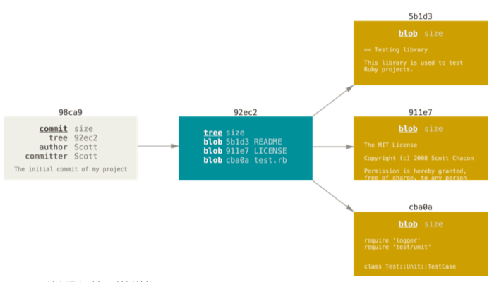
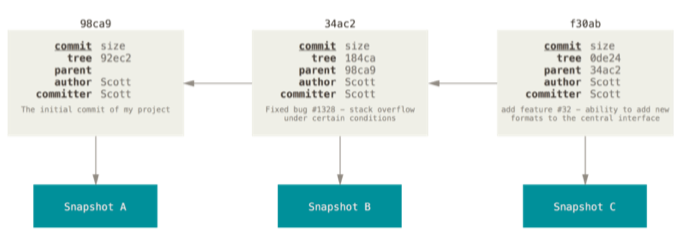

# Git Notes

[TOC]


## Git 简介

### 版本控制系统

- 本地版本控制： RCS
- 集中版本控制：CVCS 
- 分布式版本控制

### Git 基础

- 直接记录快照，而非差异
- 近乎所有操作本地执行
- 保证文件完整性

### Git 状态

- 工作目录 Working Directory
- 暂存区 Staging Area
- Git 仓库 .git Repository

### 基本工作流程

1. 在工作目录中修改文件。

2. 暂存文件，将文件的快照放入暂存区域。

3. 提交更新，找到暂存区域的文件，将快照永久性存储到 Git 仓库目录。


## 第一次使用

### GIT 配置

#### 用户信息

- `git config`: 如果使用了 `--global` 选项，那么该命令只需要运行一次

```bash
$ git config --global user.name "John Doe" 
$ git config --global user.email johndoe@example.com
```

#### 文本编辑器

```bash
$ git config --global core.editor emacs
```

#### 检查配置信息

- `git config --list`
- `git config <key>`

### 获取帮助

```bash
$ git help <verb> 
$ git <verb> --help 
$ man git-<verb>
```


## Git 基础


### 获取 Git 仓库


#### 创建新仓库

- 创建版本库命令 `git init`
- 把文件添加到仓库 `git add <file>`
- 把文件提交到仓库 `git commit -m <message>`
- `commit`可以一次提交很多文件，可以多次`add`不同的文件然后执行一次 `commit`


#### 克隆现有的仓库

```bash
$ git clone https://github.com/libgit2/libgit2
# 自定义名字
$ git clone https://github.com/libgit2/libgit2 mylibgit
```


- Git 支持多种数据传输协议。 上面的例子使用的是 https:// 协议，
- 也可以使用 git:// 协议或者使用 SSH 传输协议，比如 user@server:path/to/repo.git 。


### 记录更新

#### 文件状态

- `Untracked`
- `Unmodified`
- `Modified`
- `Staged`

#### 检查当前文件状态

- `git status`
- `git status -s` 或 `git status --short` 更简单的输出
  - Untracked : `??`
  - 新添加到暂存区的文件： `A`
  - 被修改了并放入了暂存区: 左边的 `M`
  - 被修改但暂未放入暂存区: 右边的 `M`

#### 跟踪新文件

- `git add <file>`

#### 暂存已修改文件

- `git add <file>`


### 忽略文件

#### `.gitignore`

文件 `.gitignore` 的格式规范如下： 

- 所有空行或者以 `＃` 开头的行都会被 Git 忽略。
- 可以使用标准的 glob 模式匹配。
- 匹配模式可以以（`/`）开头防止递归。
- 匹配模式可以以（`/`）结尾指定目录。
- 要忽略指定模式以外的文件或目录，可以在模式前加上惊叹号（`!`）取反。


#### glob 模式匹配

所谓的 glob 模式是指 shell 所使用的简化了的正则表达式。 

- 星号（`*`）匹配零个或多个任意字符；
- `[abc]` 匹配任何一个列在方括号中的字符（这个例子要么匹配一个 a，要么匹配一个 b，要么匹配一个 c）；
- 问号（`?` ）只匹配一个任意字符；
- 如果在方括号中使用短划线分隔两个字符，表示所有在这两个字符范围内的都可以匹配 （比如 `[0-9]` 表示匹配所有 0 到 9 的数字）。 
- 使用两个星号（`*`) 表示匹配任意中间目录，比如`a/**/z` 可以匹 配 `a/z,` `a/b/z` 或 `a/b/c/z`等。


> Tips : https://github.com/github/gitignore


### 查看修改

#### 工作区和暂存区

- `git diff`

#### 暂存区和仓库

- `git diff --cached`
- `git diff --staged`

### 提交更新

- `git commit` : 进入默认编辑器
  - 将 VSCode 设为 git 默认编辑器 ： <https://code.visualstudio.com/updates/vMarch#_setup>
- `git commit -m <message>`


#### 跳过暂存区

- `git commit -a`
- 不需要`add`


### 移除文件

- 工作区删除：`git rm`

- 删除修改过并放在暂存区的文件 ： `git rm -f`

- 想把文件从 Git 仓库中删除，但仍然希望保留在当前工作目录中： `git rm --cached`

- `git rm` 命令后面可以列出文件或者目录的名字，也可以使用 glob 模式。

  


### 移动文件

```bash
$ git mv file_from file_to
```

相当于

```bash
$ mv README.md README 
$ git rm README.md 
$ git add README
```


### 查看提交历史

`git log`

- 默认不用任何参数的话，git log 会按提交时间列出所有的更新，最近的更新排在最上面。


#### 选项

| 选项            | 说明                                                         |
| --------------- | ------------------------------------------------------------ |
| -p              | 按补丁格式显示每个更新之间的差异。                           |
| --stat          | 显示每次更新的文件修改统计信息。                             |
| --shortstat     | 只显示 --stat 中最后的行数修改添加移除统计。                 |
| --name-only     | 仅在提交信息后显示已修改的文件清单。                         |
| --name-status   | 显示新增、修改、删除的文件清单。                             |
| --abbrev-commit | 仅显示 SHA-1 的前几个字符，而非所有的 40 个字符。            |
| --relative-date | 使用较短的相对时间显示（比如，“2 weeks ago”）。              |
| --graph         | 显示 ASCII 图形表示的分支合并历史。                          |
| --pretty        | 使用其他格式显示历史提交信息。可用的选项包括 oneline，short，full，fuller 和 format（后跟指定格式） |

### 格式化输出参数


| 选项 | 说明                                        |
| ---- | ------------------------------------------- |
| %H   | 提交对象（commit）的完整哈希字串            |
| %h   | 提交对象的简短哈希字串                      |
| %T   | 树对象（tree）的完整哈希字串                |
| $t   | 树对象的简短哈希字串                        |
| %P   | 父对象（parent）的完整哈希字串              |
| %p   | 父对象的简短哈希字串                        |
| %an  | 作者（author）的名字                        |
| %ae  | 作者的电子邮件地址                          |
| %ad  | 作者修订日期（可以用 --date= 选项定制格式） |
| %ar  | 作者修订日期，按多久以前的方式显示          |
| %cn  | 提交者（committer）的名字                   |
| %ce  | 提交者的电子邮件地址                        |
| %cd  | 提交日期                                    |
| %cr  | 提交日期，按多久以前的方式显示              |
| %s   | 提交说明                                    |


#### 限制输出

| 选项              | 说明                               |
| ----------------- | ---------------------------------- |
| -(n)              | 仅显示最近的 n 条提交              |
| --since, --after  | 仅显示指定时间之后的提交           |
| --until, --before | 仅显示指定时间之前的提交           |
| --author          | 仅显示指定作者相关的提交           |
| --committer       | 仅显示指定提交者相关的提交。       |
| --grep            | 仅显示含指定关键字的提交           |
| -S                | 仅显示添加或移除了某个关键字的提交 |


### 撤销操作

`git commit --amend`

```bash
$ git commit -m 'initial commit' 
$ git add forgotten_file 
$ git commit --amend
```

只会计入一次提交

#### 取消暂存的文件

- `git reset HEAD <file>`

#### 撤销对文件的修改

- `git checkout -- <file>`

在 Git 中任何 已提交的 东西几乎总是可以恢复的。 甚至那些被删除的分支中的提交或使用 `--amend` 选 项覆盖的提交也可以恢复。 然而，任何你未提交的东西丢失后很可能再也找不到了。


### 远程仓库的使用


#### 查看远程仓库

- 如果想查看你已经配置的远程仓库服务器，可以运行 git remote 命令。 它会列出你指定的每一个远程服务器的简写。
- 也可以指定选项 -v，会显示需要读写远程仓库使用的 Git 保存的简写与其对应的 URL。
- 如果你的远程仓库不止一个，该命令会将它们全部列出。 例如，与几个协作者合作的，拥有多个远程仓库的仓 库看起来像下面这样：

```bash
$ cd grit 
$ git remote -v 
bakkdoor https://github.com/bakkdoor/grit (fetch) 
bakkdoor https://github.com/bakkdoor/grit (push) 
cho45 https://github.com/cho45/grit (fetch) 
cho45 https://github.com/cho45/grit (push) 
efunkt https://github.com/defunkt/grit (fetch) 
defunkt https://github.com/defunkt/grit (push) 
koke git://github.com/koke/grit.git (fetch) 
koke git://github.com/koke/grit.git (push) 
origin git@github.com:mojombo/grit.git (fetch) 
origin git@github.com:mojombo/grit.git (push)
```


#### 添加远程仓库

运行 `git remote add <shortname> <url>` 添加一个新的远程 Git 仓库，同时指定一个你可以轻松引用的简写：

```bash
$ git remote origin 
$ git remote add pb https://github.com/paulboone/ticgit 
$ git remote -v 
origin https://github.com/schacon/ticgit (fetch) 
origin https://github.com/schacon/ticgit (push) 
pb https://github.com/paulboone/ticgit (fetch) 
pb https://github.com/paulboone/ticgit (push)
```


#### 从远程仓库中抓取和拉取

- `git fetch [remote-name]`
  - 这个命令会访问远程仓库，从中拉取所有你还没有的数据。 执行完成后，你将会拥有那个远程仓库中所有分支 的引用，可以随时合并或查看。
- 如果你使用 `clone` 命令克隆了一个仓库，命令会自动将其添加为远程仓库并默认以 “origin” 为简写。 
  - 所以，`git fetch origin` 会抓取克隆（或上一次抓取）后新推送的所有工作。 
  - 必须注意 git fetch 命令会将数据拉取到你的本地仓库 - 它并不会自动合并或修改你当前的工作。 当准备好时你必须手动将其合并入你的工作。
- 如果你有一个分支设置为跟踪一个远程分支，可以使用 git pull 命令来自动的抓取然后合并远程分支到当前分支
  - 默认情况 下，`git clone` 命令会自动设置本地 master 分支跟踪克隆的远程仓库的 master 分支（或不管是什么名字的默 认分支）。
- 运行 `git pull` 通常会从最初克隆的服务器上抓取数据并自动尝试合并到当前所在的分支。


#### 推送到远程仓库

`git push [remote-name] [branchname]`

- 只有当你有所克隆服务器的写入权限，并且之前没有人推送过时，这条命令才能生效。
- 当你和其他人在同一时间克隆，他们先推送到上游然后你再推送到上游，你的推送就会毫无疑问地被拒绝。 
- 你必须先将他们的工作拉取下来并将其合并进你的工作后才能推送。


#### 检查远程仓库

如果想要查看某一个远程仓库的更多信息，可以使用 `git remote show [remote-name]` 命令

```bash
$ git remote show origin * remote origin

Fetch URL: https://github.com/schacon/ticgit 
Push URL: https://github.com/schacon/ticgit 
HEAD branch: master 
Remote branches:
	master 	tracked
	dev-branch tracked 
Local branch configured for 'git pull':
	master merges with remote master 
Local ref configured for 'git push':
	master pushes to master (up to date)
```


#### 远程仓库的移除和重命名

- 重命名： `git remote rename <oldName> <newName>` 
- 移除：`git remote rm <remoteName>`


### 标签

像其他版本控制系统（VCS）一样，Git 可以给历史中的某一个提交打上标签，以示重要。 比较有代表性的是人 们会使用这个功能来标记发布结点（v1.0 等等）。


#### 查看标签

`git tag`

- 以字母顺序列出标签；但是它们出现的顺序并不重要
- 以特定的模式查找标签： `git tag -l 'v1.8.5*'`

#### 标签类型

- 轻量标签（lightweight）： 一个特定提交的引用
- 附注标签（annotated）：存储在 Git 数据库中的一个完整对象，可以被校验；其中包含打标签者的名字、电子邮件地址、日期时间；还有一个标签信息；并且可以使用 GNU Privacy Guard （GPG）签名与验证

#### 创建标签

- 创建附注标签

```bash
$ git tag -a v1.4 -m 'my version 1.4'
```

- -m 选项指定了一条将会存储在标签中的信息。 如果没有为附注标签指定一条信息，Git 会运行编辑器要求你输 入信息。
- 通过使用 `git show` 命令可以看到标签信息与对应的提交信息

- 创建 轻量标签 ： `git tag v1.4-lw`
  - 如果在标签上运行 git show，你不会看到额外的标签信息。 命令只会显示出提交信息：

#### 后期打标签

- `git tag -a <tag> <hash>`

#### 推送标签

- 默认情况下，git push 命令并不会传送标签到远程仓库服务器上。 
- 在创建完标签后你必须显式地推送标签到 共享服务器上。
- `git push origin [tagname]`
- 如果想要一次性推送很多标签，`git push origin --tags`


#### 删除标签

`git tag -d <tagname>`

- 是上述命令并不会从任何远程仓库中移除这个标签

- 必须使用 git push <remote> :refs/tags/<tagname> 来更新远程仓库


#### 检出标签

- 如果想查看某个标签所指向的文件版本，可以使用 `git checkout` 命令，虽然说这会使你的仓库处于“分离头指针（detacthed HEAD）”状态
- 在“分离头指针”状态下，如果你做了某些更改然后提交它们，标签不会发生变化，但你的新提交将不属于任何 分支，并且将无法访问。
- 因此，如果你需要进行更改——比如说你正在修复旧版本的错 误——这通常需要创建一个新分支：

```bash
$ git checkout -b version2 v2.0.0 
Switched to a new branch 'version2'
```


### Git 别名

```bash
$ git config --global alias.co checkout 
$ git config --global alias.br branch 
$ git config --global alias.ci commit 
$ git config --global alias.st status
```

- 这意味着，当要输入 git commit 时，只需要输入 git ci

- `$ git config --global alias.unstage 'reset HEAD --'`
- `$ git config --global alias.last 'log -1 HEAD'`


## Git 分支


### 分支简介


### Git 管理文件的方式

假设现在有一个工作目录，里面包含了三个将要被暂存和提交的文件。 暂存操作会为每一个文件计算校验和（使用 SHA-1 哈希算法），然后会把当前版本的文件快照保存到 Git 仓库中（Git 使用 blob 对象来保存它们），最终将校验和加入到暂存区域等待提交：

当使用 git commit 进行提交操作时，Git 会先计算每一个子目录（本例中只有项目根目录）的校验和，然后在 Git 仓库中这些校验和保存为树对象。 随后，Git 便会创建一个提交对象，它除了包含上面提到的那些信息外， 还包含指向这个树对象（项目根目录）的指针。

现在，Git 仓库中有五个对象：三个 blob 对象（保存着文件快照）、一个树对象（记录着目录结构和 blob 对象 索引）以及一个提交对象（包含着指向前述树对象的指针和所有提交信息）




做些修改后再次提交，那么这次产生的提交对象会包含一个指向上次提交对象（父对象）的指针。



Git 的分支，其实本质上仅仅是**指向提交对象的可变指针**。 Git 的默认分支名字是 master。 在多次提交操作之 后，你其实已经有一个指向最后那个提交对象的 master 分支。 它会在每次的提交操作中自动向前移动。


#### 创建分支

- 在当前所在的提交对象上创建一个指针: `git branch`
- `Head` 指针： 指向当前所在的本地分支
- `git log --decorate` 查看当前各个分支的对象


#### 切换分支

`git checkout <branch>`

- 分支切换会改变你工作目录中的文件
- 可以使用 `git log` 查看分支历史
- `git log --oneline --decorate --graph --all`


#### 分支的新建和合并

- 新建并切换 `git checkout -b <branch>`
- 回到主干分支 `git checkout master`
- 合并`git merge <branch>`
- 删除分支 `git branch -d <branch>`


#### 冲突合并

- 在两个不同的分支中，对同一个文件的同一个部分进行了不同的修改
- Git 做了合并，但是没有自动地创建一个新的合并提交
- 合并冲突后使用 git status 命令来查看那些因包含合并冲突而处于未合并 （unmerged）状态的文件

- 可以使用`git mergetool` 可视化解决冲突
- 冲突解决之后，再使用 `git commit` 完成合并提交


### 分支管理

- git branch 命令不只是可以创建与删除分支。 如果不加任何参数运行它，会得到当前所有分支的一个列表：其中带有 `*` 的为当前分支
- 如果需要查看每一个分支的最后一次提 交，可以运行 `git branch -v` 命令
- `--merged` 与 `--no-merged` 这两个有用的选项可以过滤这个列表中已经合并或尚未合并到当前分支的分支
- 因为它包含了还未合并的工作，尝试使用 `git branch -d` 命令删除它时会失败
- 如果真的想要删除分支并丢掉那些工作，可以使用 `-D` 选项强制删除它


### 远程分支

远程引用是对远程仓库的引用（指针），包括分支、标签等等。 你可以通过 git ls-remote (remote) 来 显式地获得远程引用的完整列表，或者通过 git remote show (remote) 获得远程分支的更多信息。 然而， 一个更常见的做法是利用远程跟踪分支。

假设你的网络里有一个在 git.ourcompany.com 的 Git 服 务器。 如果你从这里克隆，Git 的 clone 命令会为你自动将其命名为 origin，拉取它的所有数据，创建一个指 向它的 master 分支的指针，并且在本地将其命名为 origin/master。