# Git Notes

[TOC]


## Git 简介

### 版本控制系统

- 本地版本控制： RCS
- 集中版本控制：CVCS 
- 分布式版本控制

### Git 基础

- 直接记录快照，而非差异
- 近乎所有操作本地执行
- 保证文件完整性

### Git 状态

- 工作目录 Working Directory
- 暂存区 Staging Area
- Git 仓库 .git Repository

### 基本工作流程

1. 在工作目录中修改文件。

2. 暂存文件，将文件的快照放入暂存区域。

3. 提交更新，找到暂存区域的文件，将快照永久性存储到 Git 仓库目录。


## 第一次使用

### GIT 配置

#### 用户信息

- `git config`: 如果使用了 `--global` 选项，那么该命令只需要运行一次

```bash
$ git config --global user.name "John Doe" 
$ git config --global user.email johndoe@example.com
```

#### 文本编辑器

```bash
$ git config --global core.editor emacs
```

#### 检查配置信息

- `git config --list`
- `git config <key>`

### 获取帮助

```bash
$ git help <verb> 
$ git <verb> --help 
$ man git-<verb>
```


## Git 基础


### 获取 Git 仓库


#### 创建新仓库

- 创建版本库命令 `git init`
- 把文件添加到仓库 `git add <file>`
- 把文件提交到仓库 `git commit -m <message>`
- `commit`可以一次提交很多文件，可以多次`add`不同的文件然后执行一次 `commit`


#### 克隆现有的仓库

```bash
$ git clone https://github.com/libgit2/libgit2
# 自定义名字
$ git clone https://github.com/libgit2/libgit2 mylibgit
```


- Git 支持多种数据传输协议。 上面的例子使用的是 https:// 协议，
- 也可以使用 git:// 协议或者使用 SSH 传输协议，比如 user@server:path/to/repo.git 。


### 记录更新

#### 文件状态

- `Untracked`
- `Unmodified`
- `Modified`
- `Staged`

#### 检查当前文件状态

- `git status`
- `git status -s` 或 `git status --short` 更简单的输出
  - Untracked : `??`
  - 新添加到暂存区的文件： `A`
  - 被修改了并放入了暂存区: 左边的 `M`
  - 被修改但暂未放入暂存区: 右边的 `M`

#### 跟踪新文件

- `git add <file>`

#### 暂存已修改文件

- `git add <file>`


### 忽略文件

#### `.gitignore`

文件 `.gitignore` 的格式规范如下： 

- 所有空行或者以 `＃` 开头的行都会被 Git 忽略。
- 可以使用标准的 glob 模式匹配。
- 匹配模式可以以（`/`）开头防止递归。
- 匹配模式可以以（`/`）结尾指定目录。
- 要忽略指定模式以外的文件或目录，可以在模式前加上惊叹号（`!`）取反。


#### glob 模式匹配

所谓的 glob 模式是指 shell 所使用的简化了的正则表达式。 

- 星号（`*`）匹配零个或多个任意字符；
- `[abc]` 匹配任何一个列在方括号中的字符（这个例子要么匹配一个 a，要么匹配一个 b，要么匹配一个 c）；
- 问号（`?` ）只匹配一个任意字符；
- 如果在方括号中使用短划线分隔两个字符，表示所有在这两个字符范围内的都可以匹配 （比如 `[0-9]` 表示匹配所有 0 到 9 的数字）。 
- 使用两个星号（`*`) 表示匹配任意中间目录，比如`a/**/z` 可以匹 配 `a/z,` `a/b/z` 或 `a/b/c/z`等。


> Tips : https://github.com/github/gitignore


### 查看修改

#### 工作区和暂存区

- `git diff`

#### 暂存区和仓库

- `git diff --cached`
- `git diff --staged`

### 提交更新

- `git commit` : 进入默认编辑器
  - 将 VSCode 设为 git 默认编辑器 ： <https://code.visualstudio.com/updates/vMarch#_setup>
- `git commit -m <message>`


#### 跳过暂存区

- `git commit -a`
- 不需要`add`


### 移除文件

- 工作区删除：`git rm`

- 删除修改过并放在暂存区的文件 ： `git rm -f`

- 想把文件从 Git 仓库中删除，但仍然希望保留在当前工作目录中： `git rm --cached`

- `git rm` 命令后面可以列出文件或者目录的名字，也可以使用 glob 模式。

  


### 移动文件

```bash
$ git mv file_from file_to
```

相当于

```bash
$ mv README.md README 
$ git rm README.md 
$ git add README
```


### 查看提交历史

`git log`

- 默认不用任何参数的话，git log 会按提交时间列出所有的更新，最近的更新排在最上面。


#### 选项

| 选项            | 说明                                                         |
| --------------- | ------------------------------------------------------------ |
| -p              | 按补丁格式显示每个更新之间的差异。                           |
| --stat          | 显示每次更新的文件修改统计信息。                             |
| --shortstat     | 只显示 --stat 中最后的行数修改添加移除统计。                 |
| --name-only     | 仅在提交信息后显示已修改的文件清单。                         |
| --name-status   | 显示新增、修改、删除的文件清单。                             |
| --abbrev-commit | 仅显示 SHA-1 的前几个字符，而非所有的 40 个字符。            |
| --relative-date | 使用较短的相对时间显示（比如，“2 weeks ago”）。              |
| --graph         | 显示 ASCII 图形表示的分支合并历史。                          |
| --pretty        | 使用其他格式显示历史提交信息。可用的选项包括 oneline，short，full，fuller 和 format（后跟指定格式） |

### 格式化输出参数


| 选项 | 说明                                        |
| ---- | ------------------------------------------- |
| %H   | 提交对象（commit）的完整哈希字串            |
| %h   | 提交对象的简短哈希字串                      |
| %T   | 树对象（tree）的完整哈希字串                |
| $t   | 树对象的简短哈希字串                        |
| %P   | 父对象（parent）的完整哈希字串              |
| %p   | 父对象的简短哈希字串                        |
| %an  | 作者（author）的名字                        |
| %ae  | 作者的电子邮件地址                          |
| %ad  | 作者修订日期（可以用 --date= 选项定制格式） |
| %ar  | 作者修订日期，按多久以前的方式显示          |
| %cn  | 提交者（committer）的名字                   |
| %ce  | 提交者的电子邮件地址                        |
| %cd  | 提交日期                                    |
| %cr  | 提交日期，按多久以前的方式显示              |
| %s   | 提交说明                                    |


#### 限制输出

| 选项              | 说明                               |
| ----------------- | ---------------------------------- |
| -(n)              | 仅显示最近的 n 条提交              |
| --since, --after  | 仅显示指定时间之后的提交           |
| --until, --before | 仅显示指定时间之前的提交           |
| --author          | 仅显示指定作者相关的提交           |
| --committer       | 仅显示指定提交者相关的提交。       |
| --grep            | 仅显示含指定关键字的提交           |
| -S                | 仅显示添加或移除了某个关键字的提交 |


### 撤销操作

`git commit --amend`

```bash
$ git commit -m 'initial commit' 
$ git add forgotten_file 
$ git commit --amend
```

只会计入一次提交

#### 取消暂存的文件

- `git reset HEAD <file>`

#### 撤销对文件的修改

- `git checkout -- <file>`

在 Git 中任何 已提交的 东西几乎总是可以恢复的。 甚至那些被删除的分支中的提交或使用 `--amend` 选 项覆盖的提交也可以恢复。 然而，任何你未提交的东西丢失后很可能再也找不到了。


### 远程仓库的使用


#### 查看远程仓库

- 如果想查看你已经配置的远程仓库服务器，可以运行 git remote 命令。 它会列出你指定的每一个远程服务器的简写。
- 也可以指定选项 -v，会显示需要读写远程仓库使用的 Git 保存的简写与其对应的 URL。
- 如果你的远程仓库不止一个，该命令会将它们全部列出。 例如，与几个协作者合作的，拥有多个远程仓库的仓 库看起来像下面这样：

```bash
$ cd grit 
$ git remote -v 
bakkdoor https://github.com/bakkdoor/grit (fetch) 
bakkdoor https://github.com/bakkdoor/grit (push) 
cho45 https://github.com/cho45/grit (fetch) 
cho45 https://github.com/cho45/grit (push) 
efunkt https://github.com/defunkt/grit (fetch) 
defunkt https://github.com/defunkt/grit (push) 
koke git://github.com/koke/grit.git (fetch) 
koke git://github.com/koke/grit.git (push) 
origin git@github.com:mojombo/grit.git (fetch) 
origin git@github.com:mojombo/grit.git (push)
```


#### 添加远程仓库

运行 `git remote add <shortname> <url>` 添加一个新的远程 Git 仓库，同时指定一个你可以轻松引用的简写：

```bash
$ git remote origin 
$ git remote add pb https://github.com/paulboone/ticgit 
$ git remote -v 
origin https://github.com/schacon/ticgit (fetch) 
origin https://github.com/schacon/ticgit (push) 
pb https://github.com/paulboone/ticgit (fetch) 
pb https://github.com/paulboone/ticgit (push)
```


#### 从远程仓库中抓取和拉取

- `git fetch [remote-name]`
  - 这个命令会访问远程仓库，从中拉取所有你还没有的数据。 执行完成后，你将会拥有那个远程仓库中所有分支 的引用，可以随时合并或查看。
- 如果你使用 `clone` 命令克隆了一个仓库，命令会自动将其添加为远程仓库并默认以 “origin” 为简写。 
  - 所以，`git fetch origin` 会抓取克隆（或上一次抓取）后新推送的所有工作。 
  - 必须注意 git fetch 命令会将数据拉取到你的本地仓库 - 它并不会自动合并或修改你当前的工作。 当准备好时你必须手动将其合并入你的工作。
- 如果你有一个分支设置为跟踪一个远程分支，可以使用 git pull 命令来自动的抓取然后合并远程分支到当前分支
  - 默认情况 下，`git clone` 命令会自动设置本地 master 分支跟踪克隆的远程仓库的 master 分支（或不管是什么名字的默 认分支）。
- 运行 `git pull` 通常会从最初克隆的服务器上抓取数据并自动尝试合并到当前所在的分支。


#### 推送到远程仓库

`git push [remote-name] [branchname]`

- 只有当你有所克隆服务器的写入权限，并且之前没有人推送过时，这条命令才能生效。
- 当你和其他人在同一时间克隆，他们先推送到上游然后你再推送到上游，你的推送就会毫无疑问地被拒绝。 
- 你必须先将他们的工作拉取下来并将其合并进你的工作后才能推送。


#### 检查远程仓库

如果想要查看某一个远程仓库的更多信息，可以使用 `git remote show [remote-name]` 命令

```bash
$ git remote show origin * remote origin

Fetch URL: https://github.com/schacon/ticgit 
Push URL: https://github.com/schacon/ticgit 
HEAD branch: master 
Remote branches:
	master 	tracked
	dev-branch tracked 
Local branch configured for 'git pull':
	master merges with remote master 
Local ref configured for 'git push':
	master pushes to master (up to date)
```


#### 远程仓库的移除和重命名

- 重命名： `git remote rename <oldName> <newName>` 
- 移除：`git remote rm <remoteName>`


### 标签

像其他版本控制系统（VCS）一样，Git 可以给历史中的某一个提交打上标签，以示重要。 比较有代表性的是人 们会使用这个功能来标记发布结点（v1.0 等等）。


#### 查看标签

`git tag`

- 以字母顺序列出标签；但是它们出现的顺序并不重要
- 以特定的模式查找标签： `git tag -l 'v1.8.5*'`

#### 标签类型

- 轻量标签（lightweight）： 一个特定提交的引用
- 附注标签（annotated）：存储在 Git 数据库中的一个完整对象，可以被校验；其中包含打标签者的名字、电子邮件地址、日期时间；还有一个标签信息；并且可以使用 GNU Privacy Guard （GPG）签名与验证

#### 创建标签

- 创建附注标签

```bash
$ git tag -a v1.4 -m 'my version 1.4'
```

- -m 选项指定了一条将会存储在标签中的信息。 如果没有为附注标签指定一条信息，Git 会运行编辑器要求你输 入信息。
- 通过使用 `git show` 命令可以看到标签信息与对应的提交信息

- 创建 轻量标签 ： `git tag v1.4-lw`
  - 如果在标签上运行 git show，你不会看到额外的标签信息。 命令只会显示出提交信息：

#### 后期打标签

- `git tag -a <tag> <hash>`

#### 推送标签

- 默认情况下，git push 命令并不会传送标签到远程仓库服务器上。 
- 在创建完标签后你必须显式地推送标签到 共享服务器上。
- `git push origin [tagname]`
- 如果想要一次性推送很多标签，`git push origin --tags`


#### 删除标签

`git tag -d <tagname>`

- 是上述命令并不会从任何远程仓库中移除这个标签

- 必须使用 git push <remote> :refs/tags/<tagname> 来更新远程仓库


#### 检出标签

- 如果想查看某个标签所指向的文件版本，可以使用 `git checkout` 命令，虽然说这会使你的仓库处于“分离头指针（detacthed HEAD）”状态
- 在“分离头指针”状态下，如果你做了某些更改然后提交它们，标签不会发生变化，但你的新提交将不属于任何 分支，并且将无法访问。
- 因此，如果你需要进行更改——比如说你正在修复旧版本的错 误——这通常需要创建一个新分支：

```bash
$ git checkout -b version2 v2.0.0 
Switched to a new branch 'version2'
```


### Git 别名

```bash
$ git config --global alias.co checkout 
$ git config --global alias.br branch 
$ git config --global alias.ci commit 
$ git config --global alias.st status
```

- 这意味着，当要输入 git commit 时，只需要输入 git ci

- `$ git config --global alias.unstage 'reset HEAD --'`
- `$ git config --global alias.last 'log -1 HEAD'`


## Git 分支


### 分支简介


### Git 管理文件的方式

假设现在有一个工作目录，里面包含了三个将要被暂存和提交的文件。 暂存操作会为每一个文件计算校验和（使用 SHA-1 哈希算法），然后会把当前版本的文件快照保存到 Git 仓库中（Git 使用 blob 对象来保存它们），最终将校验和加入到暂存区域等待提交：

当使用 git commit 进行提交操作时，Git 会先计算每一个子目录（本例中只有项目根目录）的校验和，然后在 Git 仓库中这些校验和保存为树对象。 随后，Git 便会创建一个提交对象，它除了包含上面提到的那些信息外， 还包含指向这个树对象（项目根目录）的指针。

现在，Git 仓库中有五个对象：三个 blob 对象（保存着文件快照）、一个树对象（记录着目录结构和 blob 对象 索引）以及一个提交对象（包含着指向前述树对象的指针和所有提交信息）

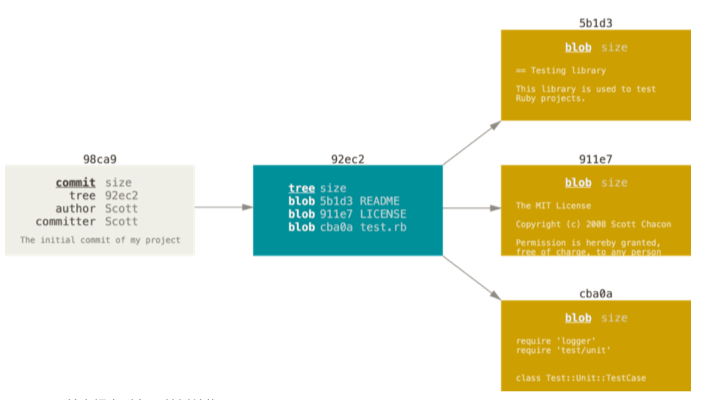


做些修改后再次提交，那么这次产生的提交对象会包含一个指向上次提交对象（父对象）的指针。

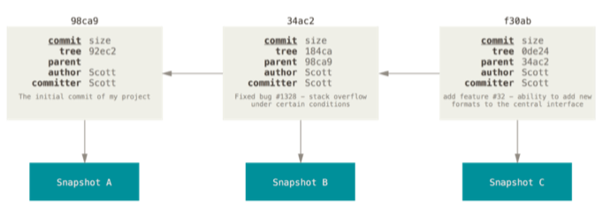

Git 的分支，其实本质上仅仅是**指向提交对象的可变指针**。 Git 的默认分支名字是 master。 在多次提交操作之 后，你其实已经有一个指向最后那个提交对象的 master 分支。 它会在每次的提交操作中自动向前移动。


#### 创建分支

- 在当前所在的提交对象上创建一个指针: `git branch`
- `Head` 指针： 指向当前所在的本地分支
- `git log --decorate` 查看当前各个分支的对象


#### 切换分支

`git checkout <branch>`

- 分支切换会改变你工作目录中的文件
- 可以使用 `git log` 查看分支历史
- `git log --oneline --decorate --graph --all`


#### 分支的新建和合并

- 新建并切换 `git checkout -b <branch>`
- 回到主干分支 `git checkout master`
- 合并`git merge <branch>`
- 删除分支 `git branch -d <branch>`


#### 冲突合并

- 在两个不同的分支中，对同一个文件的同一个部分进行了不同的修改
- Git 做了合并，但是没有自动地创建一个新的合并提交
- 合并冲突后使用 git status 命令来查看那些因包含合并冲突而处于未合并 （unmerged）状态的文件

- 可以使用`git mergetool` 可视化解决冲突
- 冲突解决之后，再使用 `git commit` 完成合并提交


### 分支管理

- git branch 命令不只是可以创建与删除分支。 如果不加任何参数运行它，会得到当前所有分支的一个列表：其中带有 `*` 的为当前分支
- 如果需要查看每一个分支的最后一次提 交，可以运行 `git branch -v` 命令
- `--merged` 与 `--no-merged` 这两个有用的选项可以过滤这个列表中已经合并或尚未合并到当前分支的分支
- 因为它包含了还未合并的工作，尝试使用 `git branch -d` 命令删除它时会失败
- 如果真的想要删除分支并丢掉那些工作，可以使用 `-D` 选项强制删除它


### 远程分支

远程引用是对远程仓库的引用（指针），包括分支、标签等等。 你可以通过 git ls-remote (remote) 来 显式地获得远程引用的完整列表，或者通过 git remote show (remote) 获得远程分支的更多信息。 然而， 一个更常见的做法是利用远程跟踪分支。

假设你的网络里有一个在 git.ourcompany.com 的 Git 服 务器。 如果你从这里克隆，Git 的 clone 命令会为你自动将其命名为 origin，拉取它的所有数据，创建一个指 向它的 master 分支的指针，并且在本地将其命名为 origin/master。

它们以 (remote)/(branch) 形式命名，如果你在本地的 master 分支做了一些工作，然而在同一时间，其他人推送提交到 git.ourcompany.com 并 更新了它的 master 分支，那么你的提交历史将向不同的方向前进。

#### Git Fetch

如果要同步你的工作，运行 `git fetch origin` 命令。 这个命令查找 “origin” 是哪一个服务器（在本例 中，它是 git.ourcompany.com），从中抓取本地没有的数据，并且更新本地数据库，移动 origin/master 指针指向新的、更新后的位置。

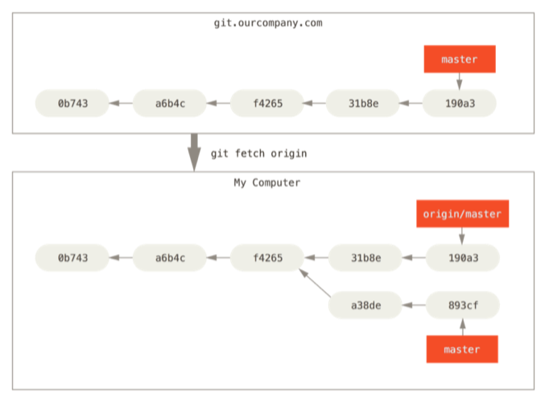


#### 多个分支

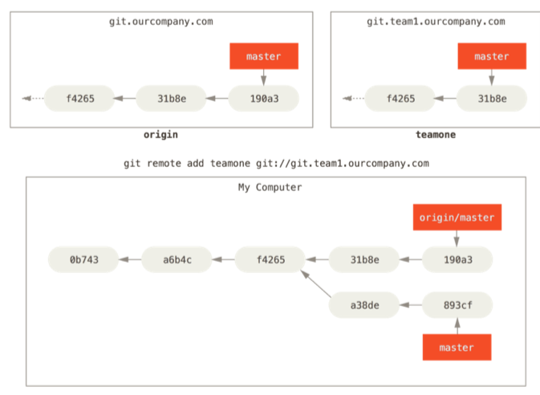

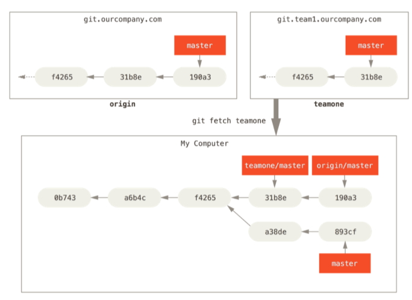


#### git push

当你想要公开分享一个分支时，需要将其推送到有写入权限的远程仓库上。 本地的分支并不会自动与远程仓库 同步 - 你必须显式地推送想要分享的分支。 这样，你就可以把不愿意分享的内容放到私人分支上，而将需要和别人协作的内容推送到公开分支。

如果希望和别人一起在名为 serverfix 的分支上工作，你可以像推送第一个分支那样推送它。 运行 git push (remote) (branch), 你也可以运行 git push origin serverfix:serverfix，它会做同样的事 - 相当于 它说，“推送本地的 serverfix 分支，将其作为远程仓库的 serverfix 分支” 可以通过这种格式来推送本地分支 到一个命名不相同的远程分支。 如果并不想让远程仓库上的分支叫做 serverfix，可以运行 git push origin serverfix:awesomebranch 来将本地的 serverfix 分支推送到远程仓库上的 awesomebranch 分支。

下一次其他协作者从服务器上抓取数据时，他们会在本地生成一个远程分支 origin/serverfix，指向服务器 的 serverfix 分支的引用。

要特别注意的一点是当抓取到新的远程跟踪分支时，本地不会自动生成一份可编辑的副本（拷贝）。这种情况下，不会有一个新的 serverfix 分支 - 只有一个不可以修改的 origin/serverfix 指针。

可以运行 git merge origin/serverfix 将这些工作合并到当前所在的分支。 如果想要在自己的 serverfix 分支上工作，可以将其建立在远程跟踪分支之上：

```bash
$ git checkout -b serverfix origin/serverfix 
Branch serverfix set up to track remote branch serverfix from origin. 
Switched to a new branch 'serverfix'
```


#### 跟踪分支

从一个远程跟踪分支检出一个本地分支会自动创建一个叫做 “跟踪分支”（有时候也叫做 “上游分支”）。 跟踪分支是与远程分支有直接关系的本地分支。 如果在一个跟踪分支上输入 git pull，Git 能自动地识别去哪个服务器上抓取、合并到哪个分支。

当克隆一个仓库时，它通常会自动地创建一个跟踪 origin/master 的 master 分支。 然而，如果你愿意的话 可以设置其他的跟踪分支 - 其他远程仓库上的跟踪分支，或者不跟踪 master 分支。 最简单的就是之前看到的例 子，运行 `git checkout -b [branch] [remotename]/[branch]`。 这是一个十分常用的操作所以 Git 提 供了 `--track` 快捷方式：

```bash
$ git checkout --track origin/serverfix 
Branch serverfix set up to track remote branch serverfix from origin. 
Switched to a new branch 'serverfix'
```

如果想要将本地分支与远程分支设置为不同名字，你可以轻松地增加一个不同名字的本地分支的上一个命令：

```bash
$ git checkout -b sf origin/serverfix 
Branch sf set up to track remote branch serverfix from origin. 
Switched to a new branch 'sf'
```

现在，本地分支 sf 会自动从 origin/serverfix 拉取。

设置已有的本地分支跟踪一个刚刚拉取下来的远程分支，或者想要修改正在跟踪的上游分支，你可以在任意时间 使用 -u 或 --set-upstream-to 选项运行 git branch 来显式地设置。

```bash
$ git branch -u origin/serverfix 
Branch serverfix set up to track remote branch serverfix from origin.
```

如果想要查看设置的所有跟踪分支，可以使用 git branch 的 -vv 选项。 这会将所有的本地分支列出来并且包 含更多的信息，如每一个分支正在跟踪哪个远程分支与本地分支是否是领先、落后。

需要重点注意的一点是这些数字的值来自于你从每个服务器上最后一次抓取的数据。 这个命令并没有连接服务 器，它只会告诉你关于本地缓存的服务器数据。 如果想要统计最新的领先与落后数字，需要在运行此命令前抓取所有的远程仓库。 可以像这样做：`$ git fetch --all; git branch -vv`


#### Pull

当 git fetch 命令从服务器上抓取本地没有的数据时，它并不会修改工作目录中的内容。 它只会获取数据然 后让你自己合并。 然而，有一个命令叫作 git pull 在大多数情况下它的含义是一个 git fetch 紧接着一个 git merge 命令。 如果有一个像之前章节中演示的设置好的跟踪分支，不管它是显式地设置还是通过 clone 或 checkout 命令为你创建的，git pull 都会查找当前分支所跟踪的服务器与分支，从服务器上抓取数据然 后尝试合并入那个远程分支。


#### 删除远程分支

假设你已经通过远程分支做完所有的工作了 - 也就是说你和你的协作者已经完成了一个特性并且将其合并到了 远程仓库的 master 分支（或任何其他稳定代码分支）。 可以运行带有 --delete 选项的 git push 命令来删 除一个远程分支。 如果想要从服务器上删除 serverfix 分支，运行下面的命令：

```bash
$ git push origin --delete serverfix 
To https://github.com/schacon/simplegit 
- [deleted] serverfix
```

基本上这个命令做的只是从服务器上移除这个指针。 Git 服务器通常会保留数据一段时间直到垃圾回收运行，所 以如果不小心删除掉了，通常是很容易恢复的。


### Rebase

在 Git 中整合来自不同分支的修改主要有两种方法：`merge` 以及 `rebase`。

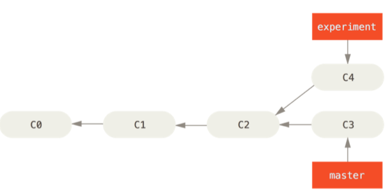

可以提取在 C4 中引入的补丁和修改，然后在 C3 的基础上应用一次。 在 Git 中，这种 操作就叫做 变基。 你可以使用 rebase 命令将提交到某一分支上的所有修改都移至另一分支上。

```bash
$ git checkout experiment 
$ git rebase master 
First, rewinding head to replay your work on top of it... 
Applying: added staged command
```

它的原理是首先找到这两个分支（即当前分支 experiment、变基操作的目标基底分支 master）的最近共同祖 先 C2，然后对比当前分支相对于该祖先的历次提交，提取相应的修改并存为临时文件，然后将当前分支指向目 标基底 C3, 最后以此将之前另存为临时文件的修改依序应用。

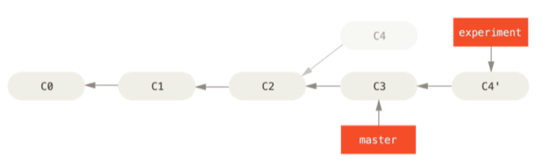

现在回到 master 分支，进行一次快进合并。

```bash
$ git checkout master 
$ git merge experiment
```

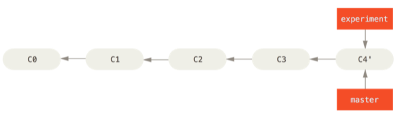

此时，C4' 指向的快照就和上面使用 merge 命令的例子中 C5 指向的快照一模一样了。 这两种整合方法的最终 结果没有任何区别，但是变基使得提交历史更加整洁。


#### 一个例子

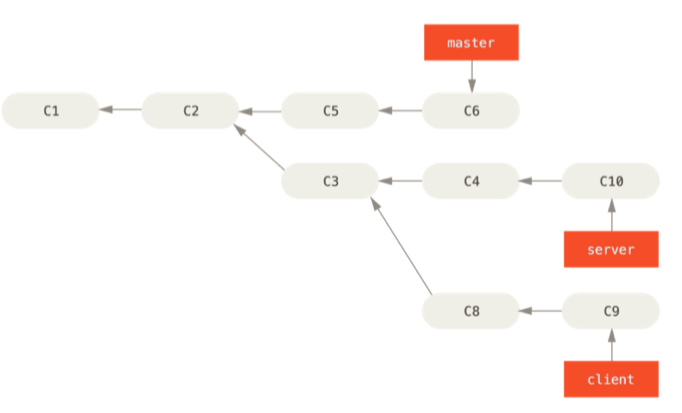

假设你希望将 client 中的修改合并到主分支并发布，但暂时并不想合并 server 中的修改，因为它们还需要经 过更全面的测试。 这时，你就可以使用 git rebase 命令的 --onto 选项，选中在 client 分支里但不在 server 分支里的修改（即 C8 和 C9），将它们在 master 分支上重放：

```bash
$ git rebase --onto master server client
```

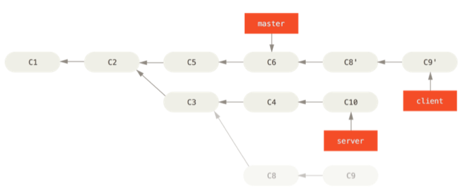

现在可以快进合并 master 分支了。

```bash
$ git checkout master 
$ git merge client
```

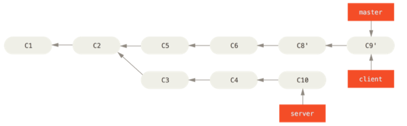

接下来你决定将 server 分支中的修改也整合进来。 使用 `git rebase [basebranch] [topicbranch]` 命 令可以直接将特性分支（即本例中的 server）变基到目标分支（即 master）上。这样做能省去你先切换到 server 分支，再对其执行变基命令的多个步骤。

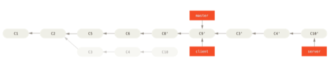

```bash
$ git rebase master server
$ git checkout master 
$ git merge server
```

#### 变基的风险

**不要对在你的仓库外有副本的分支执行变基。**

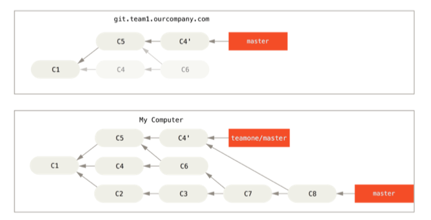

- 只要你把变基命令当作是在推送前清理提交使之整洁的工具，并且只在从未推送至共用仓库的提交上执行变基命 令，就不会有事。

- `git rebase teamone/master,` Git 将会：

  • 检查哪些提交是我们的分支上独有的（C2，C3，C4，C6，C7）

  • 检查其中哪些提交不是合并操作的结果（C2，C3，C4）

  • 检查哪些提交在对方覆盖更新时并没有被纳入目标分支（只有 C2 和 C3，因为 C4 其实就是 C4'）

  • 把查到的这些提交应用在 teamone/master 上面

- 在本例中另一种简单的方法是使用 `git pull --rebase` 命令而不是直接 git pull。 又或者你可以自己手动 完成这个过程，先 `git fetch`，再 `git rebase teamone/master`。


#### rebase v.s. merge

在回答这个问题之前，让 我们退后一步，想讨论一下提交历史到底意味着什么。

有一种观点认为，仓库的提交历史即是 **记录实际发生过什么**。 它是针对历史的文档，本身就有价值，不能乱 改。 从这个角度看来，改变提交历史是一种亵渎，你使用_谎言_掩盖了实际发生过的事情。 如果由合并产生的 提交历史是一团糟怎么办？ 既然事实就是如此，那么这些痕迹就应该被保留下来，让后人能够查阅。

另一种观点则正好相反，他们认为提交历史是 **项目过程中发生的事**。 没人会出版一本书的第一版草稿，软件维 护手册也是需要反复修订才能方便使用。 持这一观点的人会使用 rebase 及 filter-branch 等工具来编写故事，怎 么方便后来的读者就怎么写。


## 服务器上的 Git


### 协议

#### 本地协议

```bash
$ git clone /opt/git/project.git
$ git clone file:///opt/git/project.git
```

如果在 URL 开头明确的指定 file://，那么 Git 的行为会略有不同。 如果仅是指定路径，Git 会尝试使用硬链 接（hard link）或直接复制所需要的文件。 如果指定 file://，Git 会触发平时用于网路传输资料的进程，那 通常是传输效率较低的方法。 指定 file:// 的主要目的是取得一个没有外部参考（extraneous references） 或对象（object）的干净版本库副本– 通常是在从其他版本控制系统导入后或一些类似情况

要增加一个本地版本库到现有的 Git 项目，可以执行如下的命令：

```bash
$ git remote add local_proj /opt/git/project.git
```

然后，就可以像在网络上一样从远端版本库推送和拉取更新了。


#### 优点

简单

#### 缺点

共享文件系统比较难配置，并且比起基本的网络连接访问，这不方便从多个位置访问。


### http 协议

#### 智能 http 协议

“智能” HTTP 协议的运行方式和 SSH 及 Git 协议类似，只是运行在标准的 HTTP/S 端口上并且可以使用各种 HTTP 验证机制，这意味着使用起来会比 SSH 协议简单的多，比如可以使用 HTTP 协议的用户名／密码的基础 授权，免去设置 SSH 公钥。

#### 优点

不同的访问方式只需要一个 URL 以及服务器只在需要授权时提示输入授权信息，这两个简便性让终端用户使用 Git 变得非常简单。 相比 SSH 协议，可以使用用户名／密码授权是一个很大的优势，这样用户就不必须在使用 Git 之前先在本地生成 SSH 密钥对再把公钥上传到服务器。 对非资深的使用者，或者系统上缺少 SSH 相关程序 的使用者，HTTP 协议的可用性是主要的优势。 与 SSH 协议类似，HTTP 协议也非常快和高效。

你也可以在 HTTPS 协议上提供只读版本库的服务，如此你在传输数据的时候就可以加密数据；或者，你甚至可 以让客户端使用指定的 SSL 证书。

另一个好处是 HTTP/S 协议被广泛使用，一般的企业防火墙都会允许这些端口的数据通过。

#### 缺点

在一些服务器上，架设 HTTP/S 协议的服务端会比 SSH 协议的棘手一些。 除了这一点，用其他协议提供 Git 服 务与 “智能” HTTP 协议相比就几乎没有优势了。

#### Dumb http 协议

哑 HTTP 协 议里 web 服务器仅把裸版本库当作普通文件来对待，提供文件服务。 哑 HTTP 协议的优美之处在于设置起来简单。

### SSH 协议

架设 Git 服务器时常用 SSH 协议作为传输协议。 因为大多数环境下已经支持通过 SSH 访问 —— 即时没有也比 较很容易架设。 SSH 协议也是一个验证授权的网络协议；并且，因为其普遍性，架设和使用都很容易。

通过 SSH 协议克隆版本库，你可以指定一个 ssh:// 的 URL：

```bash
$ git clone ssh://user@server/project.git
```

或者使用一个简短的 scp 式的写法：

```bash
$ git clone user@server:project.git
```

你也可以不指定用户，Git 会使用当前登录的用户名。

#### 优势

用 SSH 协议的优势有很多。 首先，SSH 架设相对简单 —— SSH 守护进程很常见，多数管理员都有使用经验，并 且多数操作系统都包含了它及相关的管理工具。 其次，通过 SSH 访问是安全的 —— 所有传输数据都要经过授权 和加密。 最后，与 HTTP/S 协议、Git 协议及本地协议一样，SSH 协议很高效，在传输前也会尽量压缩数据。

#### 缺点

SSH 协议的缺点在于你不能通过他实现匿名访问。 即便只要读取数据，使用者也要有通过 SSH 访问你的主机的 权限，这使得 SSH 协议不利于开源的项目。 如果你只在公司网络使用，SSH 协议可能是你唯一要用到的协议。 如果你要同时提供匿名只读访问和 SSH 协议，那么你除了为自己推送架设 SSH 服务以外，还得架设一个可以让 其他人访问的服务。


### Git 协议

这是包含在 Git 里的一个特殊的守护进程；它监听在一个特定的端口（9418），类似于 SSH 服务，但是访问无需任何授权。 要让版本库支持 Git 协议，需要先创建一个 git-daemon-export-ok 文 件 —— 它是 Git 协议守护进程为这个版本库提供服务的必要条件 —— 但是除此之外没有任何安全措施。

#### 优点

目前，Git 协议是 Git 使用的网络传输协议里最快的。

#### 缺点

Git 协议缺点是缺乏授权机制。


## 分布式 Git 

### 分布式工作流

#### 集中式工作流

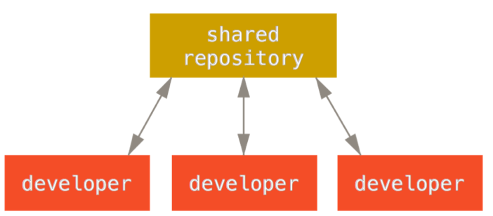

#### 集成管理者工作流

1. 项目维护者推送到主仓库。
2. 贡献者克隆此仓库，做出修改。
3. 贡献者将数据推送到自己的公开仓库。
4. 贡献者给维护者发送邮件，请求拉取自己的更新。
5. 维护者在自己本地的仓库中，将贡献者的仓库加为远程仓库并合并修改。
6. 维护者将合并后的修改推送到主仓库

这是 GitHub 和 GitLab 等集线器式（hub-based）工具最常用的工作流程。


#### 司令官与副官工作流


1. 普通开发者在自己的特性分支上工作，并根据 master 分支进行变基。 这里是司令官的`master`分支。

2. 副官将普通开发者的特性分支合并到自己的 master 分支中。

3. 司令官将所有副官的 master 分支并入自己的 master 分支中。

4. 司令官将集成后的 master 分支推送到参考仓库中，以便所有其他开发者以此为基础进行变基。

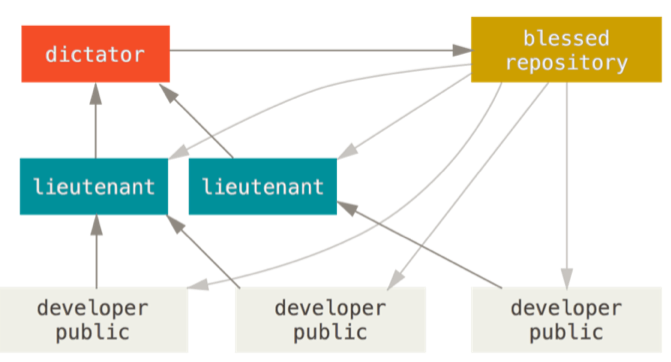

这种工作流程并不常用，只有当项目极为庞杂，或者需要多级别管理时，才会体现出优势。 利用这种方式，项 目总负责人（即司令官）可以把大量分散的集成工作委托给不同的小组负责人分别处理，然后在不同时刻将大块 的代码子集统筹起来，用于之后的整合。


### Contributing to a project

影响因素

- 活跃贡献者的数量
- 项目使用的工作流程
- 提交权限

#### 提交准则

- 在提交前，运行 `git diff --check`
- 尝试让每一个提交成为一个逻辑上的独立变更集
  - 如果其中一些改动修改了同一个文件，尝试使用 git add --patch 来部分暂存文件
- 提交信息
  - 一般情况 下，信息应当以少于 50 个字符（25个汉字）的单行开始且简要地描述变更，接着是一个空白行，再接着是一个更详细的解释

> ```text
> Capitalized, short (50 chars or less) summary
> 
> More detailed explanatory text, if necessary.  Wrap it to about 72
> characters or so.  In some contexts, the first line is treated as the
> subject of an email and the rest of the text as the body.  The blank
> line separating the summary from the body is critical (unless you omit
> the body entirely); tools like rebase can get confused if you run the
> two together.
> 
> Write your commit message in the imperative: "Fix bug" and not "Fixed bug"
> or "Fixes bug."  This convention matches up with commit messages generated
> by commands like git merge and git revert.
> 
> Further paragraphs come after blank lines.
> 
> - Bullet points are okay, too
> 
> - Typically a hyphen or asterisk is used for the bullet, followed by a
>   single space, with blank lines in between, but conventions vary here
> 
> - Use a hanging indent
> ```


#### 私有小型团队

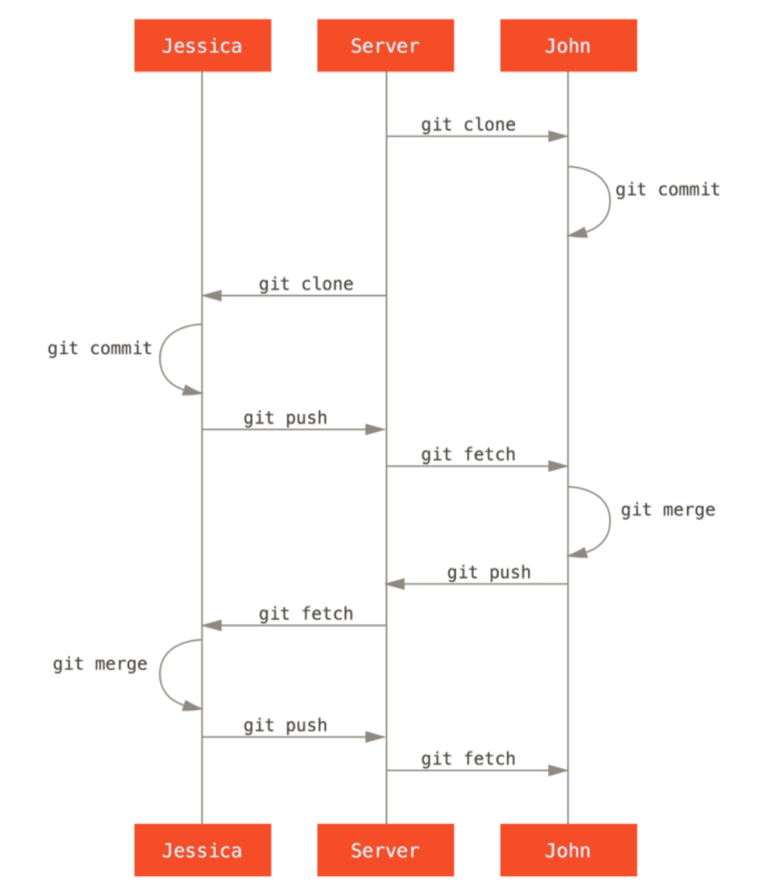


#### 私有管理团队

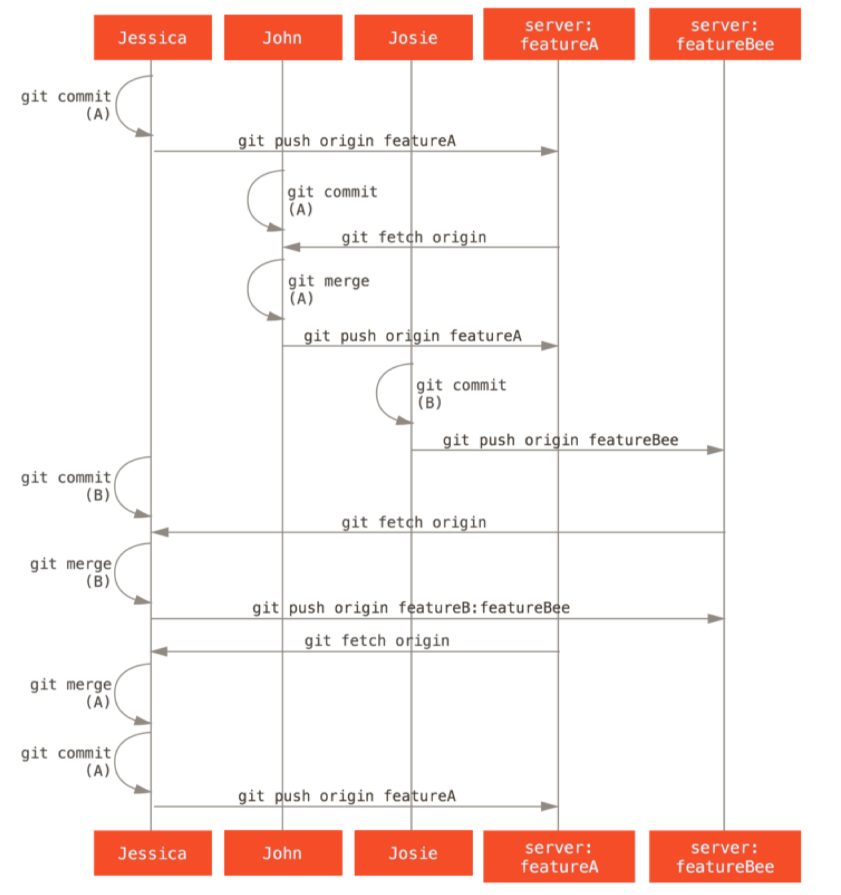


####  派生的公开项目

首先，你可能想要克隆主仓库，为计划贡献的补丁或补丁序列创建一个特性分支，然后在那儿做工作。

```bash
$ git clone <url>
$ cd project
$ git checkout -b featureA
  ... work ...
$ git commit
  ... work ...
$ git commit
```

当你的分支工作完成后准备将其贡献回维护者，去原始项目中然后点击 “Fork” 按钮，创建一份自己的可写的 项目派生仓库。 然后需要添加这个新仓库 URL 为第二个远程仓库，在本例中称作 myfork：然后需要推送工作到上面。

```bash
$ git remote add myfork <url>
$ git push -u myfork featureA
```

当工作已经被推送到你的派生后，你需要通知维护者。 这通常被称作一个拉取请求（pull request）


在一个你不是维护者的项目上，通常有一个总是跟踪 origin/master 的 master 分支会很方便，在特性分支 上做工作是因为如果它们被拒绝时你可以轻松地丢弃。 如果同一时间主仓库移动了然后你的提交不再能干净地 应用，那么使工作主题独立于特性分支也会使你变基（rebase）工作时更容易。例如，你想要提供第二个特性 工作到项目，不要继续在刚刚推送的特性分支上工作 - 从主仓库的 master 分支重新开始：

```bash
$ git checkout -b featureB origin/master
  ... work ...
$ git commit
$ git push myfork featureB
$ git request-pull origin/master myfork
  ... email generated request pull to maintainer ...
$ git fetch origin
```


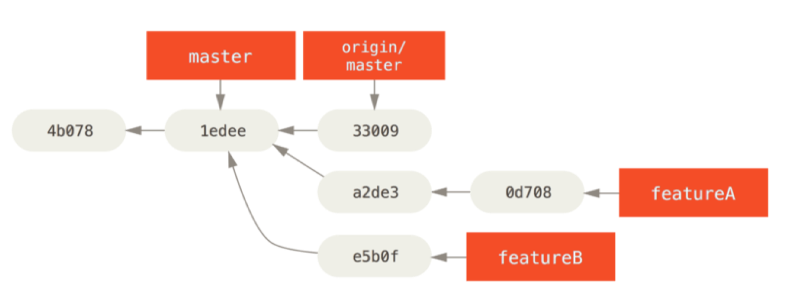


假设项目维护者已经拉取了一串其他补丁，然后尝试拉取你的第一个分支，但是没有干净地合并。 在这种情况 下，可以尝试变基那个分支到 origin/master 的顶部，为维护者解决冲突，然后重新提交你的改动：

```bash
$ git checkout featureA
$ git rebase origin/master
$ git push -f myfork featureA
```


因为你将分支变基了，所以必须为推送命令指定 -f 选项，这样才能将服务器上有一个不是它的后代的提交的 featureA 分支替换掉。


维护者看到了你的第二个分支上的工作并且很喜欢其中的概念，但是想要你修改 一下实现的细节。 你也可以利用这次机会将工作基于项目现在的 master 分支。 你从现在的 origin/master 分支开始一个新分支，在那儿压缩 featureB 的改动，解决任何冲突，改变实现，然后推送它为一个新分支。

```bash
$ git checkout -b featureBv2 origin/master
$ git merge --squash featureB
  ... change implementation ...
$ git commit
$ git push myfork featureBv2
```


`--squash` 选项接受被合并的分支上的所有工作，并将其压缩至一个变更集，使仓库变成一个真正的合并发生的 状态，而不会真的生成一个合并提交。 这意味着你的未来的提交将会只有一个父提交，并允许你引入另一个分 支的所有改动，然后在记录一个新提交前做更多的改动。 同样 `--no-commit` 选项在默认合并过程中可以用来 延迟生成合并提交。


#### 通过邮件的公开项目

使用 `git format-patch` 来生成可以邮寄到列表的 mbox 格式的文件 它将每一个提交转换为一封电子邮件，提交信息的第一行作为主题，剩余信息与提交引入的补丁作为正文。 它 有一个好处是是使用 format-patch 生成的一封电子邮件应用的提交正确地保留了所有的提交信息。

为了将其邮寄到邮件列表，你既可以将文件粘贴进电子邮件客户端，也可以通过命令行程序发送它。 粘贴文本 经常会发生格式化问题，特别是那些不会合适地保留换行符与其他空白的 “更聪明的” 客户端。 幸运的是，Git 提供了一个工具帮助你通过 IMAP 发送正确格式化的补丁，

首先，需要在 ~/.gitconfig 文件中设置 imap 区块。 可以通过一系列的 git config 命令来分别设置每一 个值，或者手动添加它们，不管怎样最后配置文件应该看起来像这样：

```bash
[imap]
 folder = "[Gmail]/Drafts" 
 host = imaps://imap.gmail.com 
 user = user@gmail.com 
 pass = p4ssw0rd 
 port = 993 
 sslverify = false
```

如果 IMAP 服务器不使用 SSL，最后两行可能没有必要，host 的值会是 imap:// 而不是 imaps://。 当那些设 置完成后，可以使用 git imap-send 将补丁序列放在特定 IMAP 服务器的 Drafts 文件夹中：

在这个时候，你应该能够到 Drafts 文件夹中，修改收件人字段为想要发送补丁的邮件列表，可能需要抄送给维 护者或负责那个部分的人，然后发送。


### 维护项目 (TODO)


## GitHub (TODO)


