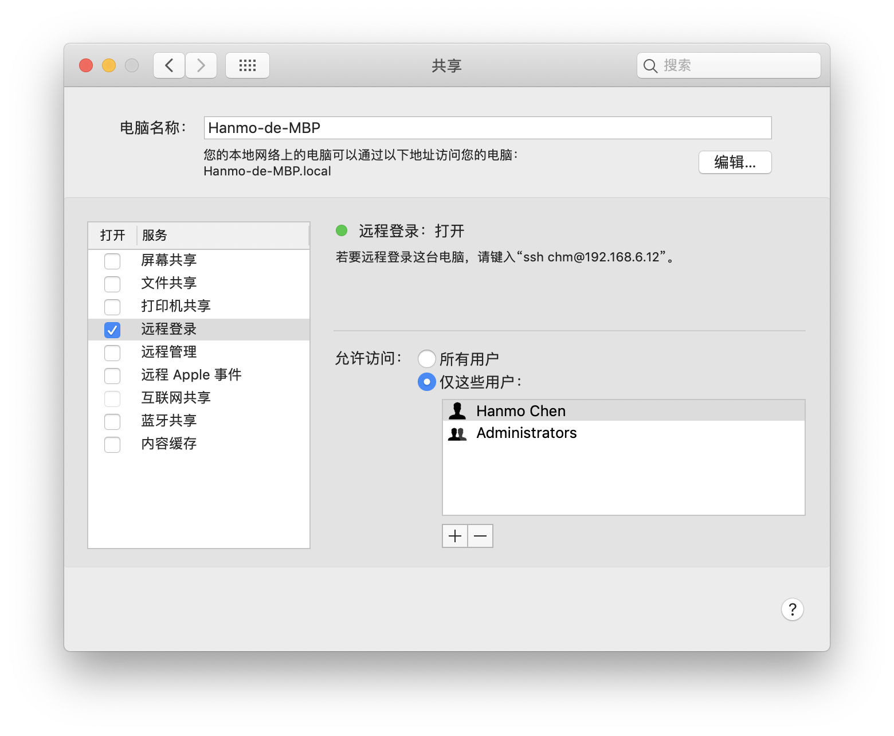

# Hadoop Notes

[TOC]

## 配置 Hadoop


### 环境

- `Homebrew`
- `Java`
- `ssh` 
- 打开远程登录：`系统偏好设置`->`共享`->`打开远程登录服务`



### 安装 Hadoop

- `brew install hadoop` 

- 默认路径 `\usr\local\Cellar\hadoop\$(Version)`  比如 `\usr\local\Cellar\hadoop\3.1.2`


#### 说明：更换 `Homebrew ` 镜像源

- 为加速下载，可更换为国内镜像源如清华或中科大等
- 更换为清华镜像源

```bash
git -C "$(brew --repo)" remote set-url origin https://mirrors.tuna.tsinghua.edu.cn/git/homebrew/brew.git

git -C "$(brew --repo homebrew/core)" remote set-url origin https://mirrors.tuna.tsinghua.edu.cn/git/homebrew/homebrew-core.git

git -C "$(brew --repo homebrew/cask)" remote set-url origin https://mirrors.tuna.tsinghua.edu.cn/git/homebrew/homebrew-cask.git

brew update
```


### 配置 Hadoop


#### 配置 `hadoop-env.sh`

- 查看 `JAVE_HOME` 

```bash
/usr/libexec/java_home -V
```

- 进入 `usr/local/Cellar/hadoop/3.1.2/libexec/etc/hadoop/hadoop-env.sh`

将

```bash
export HADOOP_OPTS="$HADOOP_OPTS -Djava.net.preferIPv4Stack=true"
```

改为

```bash
export HADOOP_OPTS="$HADOOP_OPTS -Djava.net.preferIPv4Stack=true -Djava.security.krb5.realm= -Djava.security.krb5.kdc="
export JAVA_HOME=/Library/Java/JavaVirtualMachines/jdk1.8.0_101.jdk/Contents/Home
```


#### 配置 `core-site.xml`

- 配置 hdfs 的地址和端口号

- 打开`usr/local/Cellar/hadoop/3.1.2/libexec/etc/hadoop/core-site.xml`

把原来的

```xml
<!-- Put site-specific property overrides in this file. -->

<configuration></configuration>
```

改成

```xml
<!-- Put site-specific property overrides in this file. -->

<configuration>
  <property>
     <name>hadoop.tmp.dir</name>
<value>/usr/local/Cellar/hadoop/hdfs/tmp</value>
    <description>A base for other temporary directories.</description>
  </property>
  <property>
     <name>fs.default.name</name>
     <value>hdfs://localhost:8020</value>
  </property>
</configuration>

```


#### 配置 `hdfs-site.xml`

- 路径`/usr/local/Cellar/hadoop/3.1.2/libexec/etc/hadoop/hdfs-site.xml`

在最后加上

```xml
<configuration>
   <property>
     <name>dfs.replication</name>
     <value>1</value>
    </property>
</configuration>
```


####  配置 `yarn-site.xml`

- `/usr/local/Cellar/hadoop/3.1.2/libexec/etc/hadoop/yarn-site.xml`
- 在最后加上

```xml
<configuration>

<!-- Site specific YARN configuration properties -->
<property> 
<name>yarn.nodemanager.aux-services</name> 
<value>mapreduce_shuffle</value> 
</property> 

<property> 
<name>yarn.nodemanager.env-whitelist</name>
 <value>JAVA_HOME,HADOOP_COMMON_HOME,HADOOP_HDFS_HOME,HADOOP_CONF_DIR,CLASSPATH_PREPEND_DISTCACHE,HADOOP_YARN_HOME,HADOOP_MAPRED_HOME</value> 
</property> 

</configuration>

```


#### 配置 `mapred-site.xml`

- `/usr/local/Cellar/hadoop/3.1.2/libexec/etc/hadoop/mapred-site.xml`
- 在最后加上

```xml
<configuration>

<property>
      <!--指定mapreduce运行在yarn上-->
      <name>mapreduce.framework.name</name>
      <value>yarn</value>
</property>

</configuration>
```


#### 格式化 HDFS

```shell
hdfs namenode -format
```


### 启动和关闭服务

```shell
#切换到 Hadoop 目录

cd /usr/local/Cellar/hadoop/3.1.2

# 启动 HDFS 服务

start-dfs.sh

# 关闭 HDFS

stop-dfs.sh

# 启动和关闭 Yarm

start-yarn.sh
stop-yarn.sh

# 启动/关闭所有服务
start-all
stop-all
```


### 说明

若控制行输出

```
WARN util.NativeCodeLoader: Unable to load native-hadoop library for your platform... using builtin-java classes where applicable
```

为正常现象

官网的说明 <https://hadoop.apache.org/docs/current/hadoop-project-dist/hadoop-common/NativeLibraries.html>

> The native hadoop library is supported on *nix platforms only. The library does not to work with Cygwin or the Mac OS X platform.


### 各个端口

- Resource Manager `localhost:9870`
- Job Tracker: `localhost:8088`
- Specific Node Information: `localhost:8042`


## 在 Mac 上编译 hadoop 源码


### 下载 hadoop 源码

- 版本 `3.1.2`
- 在 Apache 官网下载 `tar.gz` 文件后解压
- 解压后的文件中有一个 `building.txt`


### 创建容器

- 环境：

  - Docker
  - Virtual Box

- 根据 `building.txt`

- ```bash
  $ docker-machine create --driver virtualbox \
                              --virtualbox-memory "4096" hadoopdev
  $ eval $(docker-machine env hadoopdev)
  $ ./start-build-env.sh
  ```

- 留足够空间 `20GB` 左右
- 等很久最后 `build` 成功会出现 `hadoop` 的 ASCII 图像


### 在容器里构建

```shell
mvn package -Pdist,native -DskipTests -Dtar
```

- 貌似要求 jdk 为 1.7.0 版本 


## Spark 的安装


### Scala 和 Spark

- 全部可以用 `homebrew` 解决
- `brew install scala` 和 `brew install apache-spark`
- 安装完成后可以 `scala -version` 检查是否安装成功
- `brew install spark` 是另一个重名的 `spark`


### 安装 `pyspark`

- `pip install pyspark`


