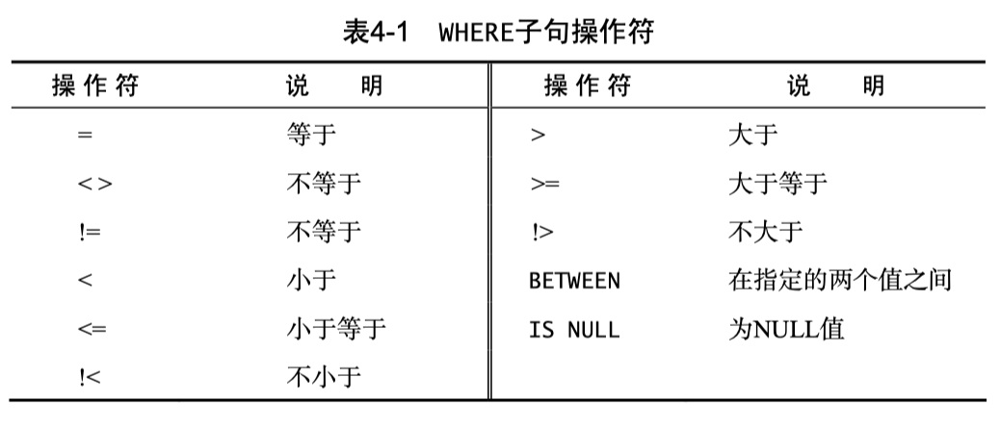
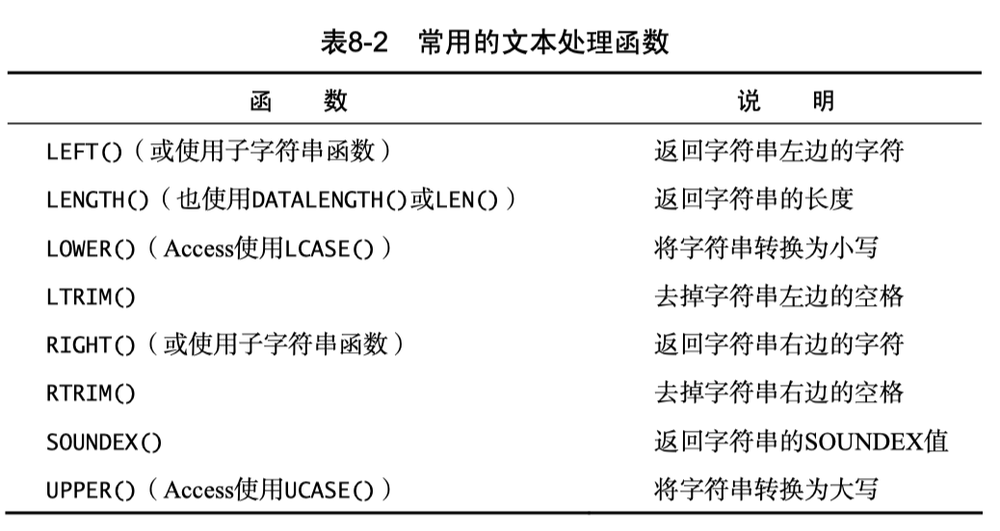
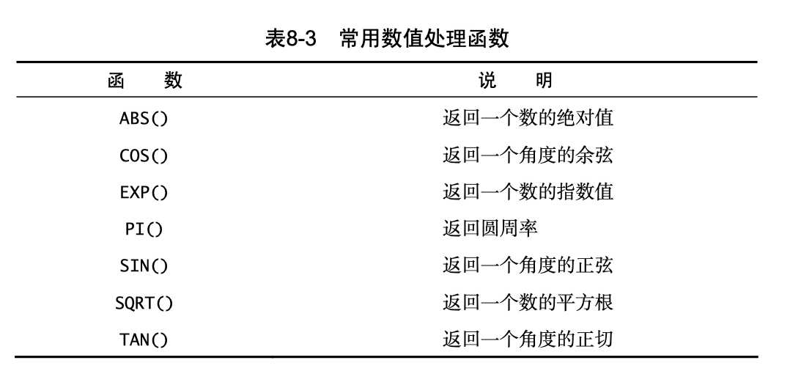
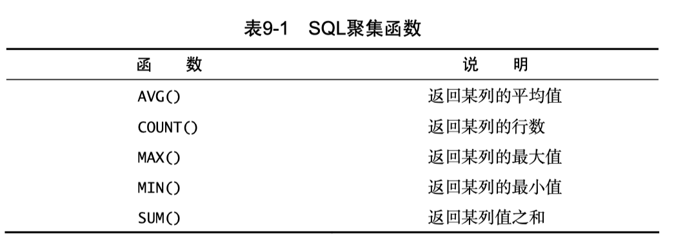
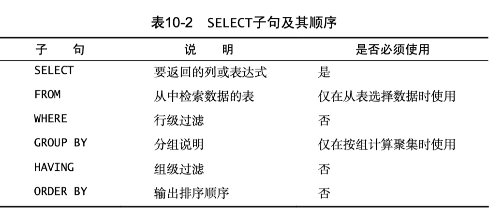

# SQL Notes

[TOC]

## 数据库基础


### 基本术语

- Databases: 保存有组织的数据的容器
- Table : 某种特定类型数据的结构化清单。
- Column : 表中的一个字段。所有表都是由一个或多个列组成的。
- Datatype
- Row：表中的一个记录
- Prime key : 主键


### SQL


- Structured Query Language 


## Select 语句

### 关键字

- 关键字（keyword）： 作为 SQL 组成部分的保留字。

### 检索单个列

```sql
SELECT prod_name 
FROM Products;
```

>多条 SQL 语句必须以分号（；）分隔。
>
>SQL 语句不区分大小写，因此 SELECT 与 select 是相同的。
>
>许多 SQL 开发人员喜欢对 SQL 关键字使用大写，而对列名和表名使用小写，这样做使代码更易于阅读和调试。
>
>在处理 SQL 语句时，其中所有空格都被忽略。SQL 语句可以写成长长的一行，也可以分写在多行。
>
>多数 SQL 开发人员认为，将 SQL 语句分成多行更容易阅读和调试。

### 检索多个列

- 要想从一个表中检索多个列，仍然使用相同的 SELECT 语句

```SQL
SELECT prod_id, prod_name, prod_price 
FROM Products;
```

> 在选择多个列时，一定要在列名之间加上逗号，但最后一个列名后不加。

### 检索所有列

- 如果给定一个通配符（*），则返回表中所有列。

```sql
SELECT *
FROM Products;
```

> 由于不明确指定列名（因为*检索每一列），所以能检索出名字未知的列。

### 检索不同值

- 使用 **DISTINCT** 关键字

```sql
SELECT DISTINCT vend_id 
FROM Products;
```

> **不能部分使用 DISTINCT**: DISTINCT 关键字作用于所有的列，不仅仅是跟在其后的那一列。

### 限制结果

- 在 SQL Server 和 Access 中使用 SELECT 时，可以使用 **TOP** 关键字来限制 最多返回多少行

```sqlite
SELECT TOP 5 prod_name FROM Products;
```

- 如果你使用 MySQL、MariaDB、PostgreSQL 或者 SQLite，需要使用 **LIMIT** 子句

```sqlite
SELECT prod_name 
FROM Products 
LIMIT 5;
```

```sqlite
SELECT prod_name 
FROM Products 
LIMIT 5 
OFFSET 5;
```

- 如果你使用 Oracle，需要基于 ROWNUM（行计数器）来计算行

```sql
SELECT prod_name 
FROM Products 
WHERE ROWNUM <=5;
```


> 第一个被检索的行是第 0 行，而不是第 1 行。


### 注释

- 行内注释
  - 注释使用-- （两个连字符）嵌在行内
  - 在一行的开始处使用#，这一整行都将作为注释
- 注释从/\*开始，到\*/结束，/\*和\*/之间的任何内容都是注释


##Order by 语句


### 排序数据

- 如果不排序，数据一般将以它在底层表中出现的顺序显示
- 为了明确地排序用 SELECT 语句检索出的数据，可使用 **ORDER BY** 子句。 **ORDER BY** 子句取一个或多个列的名字，据此对输出进行排序

```sql
SELECT prod_name 
FROM Products 
ORDER BY prod_name;
```

> - 在指定一条 ORDER BY 子句时，应该保证它是 SELECT 语句中最后一条子句
>
> - 通常，ORDER BY 子句中使用的列将是为显示而选择的列。但是，实际上并不一定要这样，用非检索的列排序数据是完全合法的。


### 按多个列排序


要按多个列排序，简单指定列名，列名之间用逗号分开即可

```sql
SELECT prod_id, prod_price, prod_name
FROM Products
ORDER BY prod_price, prod_name;
```

- 在按多个列排序时，排序的顺序完全按规定进行
- 仅在多个行具有相同的 prod_price 值时，才对产品按 prod_name 进行排序。如果 prod_price 列中所有的值都是 唯一的，则不会按 prod_name 排序。

按相对列位置排序

```sql
SELECT prod_id, prod_price, prod_name 
FROM Products 
ORDER BY 2, 3;
```

- SELECT 清单中指定的是选择列的相对位置而不是列名。

- ORDER BY 2 表示按 SELECT 清单中的第二个列 prod_name 进行排序。
- ORDER BY 2，3 表示先按 prod_price，再按 prod_name 进行排序。


### 降序排列

- 数据排序不限于升序排序（从 A 到 Z）这只是默认的排序顺序。还可以 使用 ORDER BY 子句进行降序（从 Z 到 A）排序。
- 为了进行降序排序， 必须指定 **DESC** 关键字。

```sql
SELECT prod_id, prod_price, prod_name 
FROM Products 
ORDER BY prod_price DESC;
```

```sql
SELECT prod_id, prod_price, prod_name 
FROM Products 
ORDER BY prod_price DESC, prod_name;
```


### Where 语句

### 过滤数据

- 只检索所需数据需要指 定搜索条件（search criteria），搜索条件也称为过滤条件（filter condition）

- 在 SELECT 语句中，数据根据 WHERE 子句中指定的搜索条件进行过滤。 WHERE 子句在表名（FROM 子句）之后给出

```sql
SELECT prod_name, prod_price 
FROM Products 
WHERE prod_price = 3.49;
```

> 在同时使用 ORDER BY 和 WHERE 子句时，应该让 ORDER BY 位于WHERE 之后

### Where 支持的操作符



- 并非所有 DBMS 都支持这些操作符。
- 何时使用引号：
  - 单引号用来限定字符串。如果将值与字符串类型的列进行比较，就需要限定引号
  - 用来与数值列进行比较的值不用引号
- Between 操作符

```sql
SELECT prod_name, prod_price 
FROM Products WHERE prod_price 
BETWEEN 5 AND 10
```

### 空值检查

- SELECT 语句有一个 特殊的 WHERE 子句，可用来检查具有 NULL 值的列。这个 WHERE 子句就是 IS NULL 子句

```sql
SELECT prod_name
FROM Products 
WHERE prod_price IS NULL;
```

> 通过过滤选择不包含指定值的所有行时，你可能希望返回含 NULL 值的行。但是这做不到。因为未知（unknown）有特殊的含义，数据库不知道它们是否匹配，所以在进行匹配过滤或非匹配过滤时，不会返回这些结果。
>


## 高级数据过滤


### 组合 Where 语句

- **AND** 操作符
- **OR** 操作符
- **NOT** 操作符
- 运算顺序：OR>AND
- 可使用圆括号对操作符进行明确分组


### IN 操作符

- IN 操作符用来指定条件范围，范围中的每个条件都可以进行匹配。
- IN 取 一组由逗号分隔、括在圆括号中的合法值。
- IN 的最大优点是可以包含其他 SELECT 语句， 能够更动态地建立 WHERE 子句


## 通配符


### Like 操作符

- **通配符（wildcard）**：用来匹配值的一部分的特殊字符
- **搜索模式（search pattern**）：由字面值、通配符或两者组合构成的搜索条件。
- 通配符本身实际上是 SQL 的 WHERE 子句中有特殊含义的字符
- 为在搜索子句中使用通配符，必须使用 LIKE 操作符。


### 通配符

- %：任何字符出现任意次数
  - 包括 0次
  - 不会匹配 NULL
- 包括 Access 在内的许多 DBMS 都用空格来填补字段的内容
- _ ：单个字符
- []: 方括号（[]）通配符用来指定一个字符集,它必须匹配指定位置的单个字符
  - 只有微软的 Access 和 SQL Server 支持集合
  - 此通配符可以用前缀字符 （脱字号）来否定


### 通配符的使用

- 不要过度使用通配符
- 在确实需要使用通配符时， 也尽量不要把它们用在搜索模式的开始处
- 仔细注意通配符的位置


## 创建计算字段


### 计算字段


存储在数据库表中的数据一般不是应用程序所需要的格式:

- 需要显示公司名，同时还需要显示公司的地址
- 城市、州和邮政编码存储在不同的列中
- 列数据是大小写混合的，但报表程序需要把所有数据按大写表示出来。
- 物品订单表存储物品的价格和数量，不存储每个物品的总价格
- 需要根据表数据进行诸如总数、平均数的计算


- **字段（field）**:基本上与列（column）的意思相同，经常互换使用，不过数据库列一

般称为列，而术语字段通常与计算字段一起使用。


### 拼接

- **拼接（concatenate）**将值联结到一起（将一个值附加到另一个值）构成单个值。
- 在 SQL 中的 SELECT 语句中，可使用一 个特殊的操作符来拼接两个列。
  - 根据你所使用的 DBMS，此操作符可用 加号（+）或两个竖杠（||）表示。
  - 或者 Concat

```sql
SELECT vend_name + ' (' + vend_country + ')' 
FROM Vendors 
ORDER BY vend_name;
```

- 取消空格：
  - `RTRIM()`去掉字符串右边的空格
  - `LTRIM()` 去掉字符串左边的空格
  - `TRIM()`去掉两边的空格
- 使用别名

```sql
SELECT RTRIM(vend_name) + ' (' + RTRIM(vend_country) + ')' 
AS vend_title 
FROM Vendors 
ORDER BY vend_name;
```


### 运算

```sql
SELECT prod_id, quantity, item_price, 
					quantity*item_price AS expanded_price 
FROM OrderItems 
WHERE order_num = 20008;
```


> SELECT 语句为测试、检验函数和计算提供了很好的方法。虽然 SELECT
>
> 通常用于从表中检索数据，但是省略了 FROM 子句后就是简单地访问和
>
> 处理表达式，例如 `SELECT 3 * 2`;将返回 6，`SELECT Trim(' abc ')`;
>
> 将返回 abc，`SELECT Now()`;使用 Now()函数返回当前日期和时间。


## 函数


### 带来的问题

- SQL 语句不一样，SQL 函数不是可移植的

  

### 使用函数

- 处理文本字符串
- 在数值数据上进行算术操作
- 处理日期和时间值并
- 返回DBMS 正使用的特殊信息


#### 文本处理函数




- **SOUNDEX** 是一个将任何文本串转换为描述其语音表示的字母数字模式的算法。
- SOUNDEX 考虑了 类似的发音字符和音节， 使得能对字符串进行发音比较而不是字母比 较。
- 虽然 SOUNDEX 不是 SQL 概念，但多数 DBMS 都提供对 SOUNDEX 的支持。


#### 日期和时间

- 日期和时间值以特殊的格式存储，以便能快速和有效地排序或过滤，并且节省物理存储空间。
- 不同 DBMS 的日期-时间处理函数可能不同。关于具体 DBMS 支持的日 期  时间处理函数，请参阅相应的文档。


#### 数值处理函数




## 汇总数据


### 聚集函数

> **聚集函数（aggregate function）**
>
> 对某些行运行的函数，计算并返回一个值。




#### `AVG()`

- 通过对表中行数计数并计算其列值之和，求得该列的平均值
- `AVG()`函数忽略列值为 NULL 的行。

#### `COUNT()`

- 使用 `COUNT(*)` 对表中行的数目进行计数，不管表列中包含的是空值 （ NULL ）还是非空值。
- 使用 `COUNT(column)` 对特定列中具有值的行进行计数，忽略 NULL 值

#### `MAX()/MIN()`

- `MAX()`返回指定列中的最大值
- 在用于文本数据时，`MAX()`返回按该列排序后的最后一行
-  `MAX()`函数忽略列值为 NULL 的行。

#### `SUM()`

- `SUM()`用来返回指定列值的和


### 聚集不同值

- 以上 5 个聚集函数都可以如下使用
  - 对所有行执行计算，指定`ALL`或不指定（默认为 `ALL`）
  - 只包含不同的值，指定 `DISTINCT` 参数


## 分组数据

使用分组可以将数据分为多个逻辑组，对每个组进行聚集计算

### 创建分组

- 分组是使用 SELECT 语句的 `GROUP BY` 子句建立的

```sql
SELECT vend_id, COUNT(*) AS num_prods 
FROM Products 
GROUP BY vend_id;
```

- `GROUP BY` 子句指示 DBMS 分组数据，然后对每个组而不是整个结果集进行聚集。
- `GROUP BY` 子句可以包含任意数目的列，因而可以对分组进行嵌套，更细致地进行数据分组。
- 如果在 `GROUP BY` 子句中嵌套了分组，数据将在最后指定的分组上进行汇总。
- `GROUP BY` 子句中列出的每一列都必须是检索列或有效的表达式（但不能是聚集函数）。如果在 SELECT 中使用表达式，则必须在 GROUP BY子句中指定相同的表达式。不能使用别名。
- 大多数 SQL 实现不允许 `GROUP BY` 列带有长度可变的数据类型
- GROUP BY 子句必须出现在 WHERE 子句之后， ORDER BY 子句之前

### 过滤分组

- HAVING 非常类似于 WHERE
- 唯一的差别是，WHERE 过滤行，而 HAVING 过滤分组。

```sql
SELECT cust_id, COUNT(*) AS orders 
FROM Orders 
GROUP BY cust_id 
HAVING COUNT(*) >= 2;
```

- 同时使用 `WHERE` 和`HAVING`

```SQL
SELECT vend_id, COUNT(*) AS num_prods 
FROM Products 
WHERE prod_price >= 4 
GROUP BY vend_id 
HAVING COUNT(*) >= 2;
```


### SELECT 子句




## 子查询

- **查询（query**）：任何 SQL 语句都是查询。但此术语一般指 SELECT 语句。
- **子查询（subquery）**：嵌套在其他查询中的查询


### 示例

```sql
SELECT order_num 
FROM OrderItems 
WHERE prod_id = 'RGAN01';
```

输出 20007，20008

```sql
SELECT cust_id 
FROM Orders 
WHERE order_num IN (20007,20008);
```


两个查询结合

```sql
SELECT cust_id 
FROM Orders 
WHERE order_num IN (SELECT order_num
										FROM OrderItems 
										WHERE prod_id = 'RGAN01');
```


> 包含子查询的 SELECT 语句难以阅读和调试，它们在较为复杂时更是如此。如上所示，把子查询分解为多行并进行适当的缩进，能极大地简化子查询的使用。

- 作为子查询的 SELECT 语句只能查询单个列。


### 作为计算字段使用子查询

- 可以使用 SELECT COUNT(*)对表中的行进行计数，并 且通过提供一条 WHERE 子句来过滤某个特定的顾客 ID，仅对该顾客的订单进行计数。

```sql
SELECT COUNT(*) AS orders 
FROM Orders 
WHERE cust_id = '1000000001';
```

- 要对每个顾客执行 COUNT(*)，应该将它作为一个子查询

```sql
SELECT cust_name, 
			 cust_state, 
			 (SELECT COUNT(*) 
			 	FROM Orders 
			 	WHERE Orders.cust_id = Customers.cust_id) AS orders 
FROM Customers 
ORDER BY cust_name;
```


## 联结表

### 联结

- 关系表的设计就是要把信息分解成多个表，一类数据一个表
- 表通过某些共同的值互相关联（所以才叫关系数据库）。
- 关系数据可以有效地存储，方便地处理。因此，关系数据库的可伸缩性远比非关系数据库要好。
- **可伸缩（scale**）：能够适应不断增加的工作量而不失败。


### 创建联结

```sql
SELECT vend_name, prod_name, prod_price 
FROM Vendors, Products 
WHERE Vendors.vend_id = Products.vend_id;
```

- 联结条件：`WHERE`语句
- 由没有联结条件的表关系返回的结果为笛卡儿积。


#### 内联结

- 内联结（inner join）：等值联结（equijoin），基于两个表之间的相等测试

```sql
SELECT vend_name, prod_name, prod_price 
FROM Vendors INNER JOIN Products 
ON Vendors.vend_id = Products.vend_id;
```


### 联结多个表

```sql
SELECT cust_name, cust_contact 
FROM Customers 
WHERE cust_id IN (SELECT cust_id 
									FROM Orders 
									WHERE order_num IN (SELECT order_num 
																			FROM OrderItems 
																			WHERE prod_id = 'RGAN01'));
```


等效于

```sql
SELECT cust_name, cust_contact 
FROM Customers, Orders, OrderItems 
WHERE Customers.cust_id = Orders.cust_id
	AND OrderItems.order_num = Orders.order_num 
	AND prod_id = 'RGAN01';
```


## 高级联结


### 表的别名

- 原因：
  - 缩短 SQL 语句
  - 允许在一条 SELECT语句中多次使用相同的表

```sql
SELECT cust_name, cust_contact 
FROM Customers AS C, Orders AS O, OrderItems AS OI 
WHERE C.cust_id = O.cust_id
	AND OI.order_num = O.order_num 
	AND prod_id = 'RGAN01';
```


### 其他类型的联结


#### 自联结

假如要给与 Jim Jones 同一公司的所有顾客发送一封信件。这个查询要求首先找出 Jim Jones 工作的公司，然后找出在该公司工作的顾客。

```sql
SELECT cust_id, cust_name, cust_contact 
FROM Customers 
WHERE cust_name = (SELECT cust_name
                   FROM Customers 
                   WHERE cust_contact = 'Jim Jones');
```

等效于

```SQL
SELECT c1.cust_id, c1.cust_name, c1.cust_contact 
FROM Customers AS c1, Customers AS c2 
WHERE c1.cust_name = c2.cust_name 
	AND c2.cust_contact = 'Jim Jones';
```


#### 自然联结

- 标准的联结（前一课中介绍的内联结）返回所有数据，相同的列甚至多次出现。
- 自然联结排除多次出现，使每一列只返回一次。


```sql
SELECT C.*, O.order_num, O.order_date, OI.prod_id, OI.quantity, OI.item_price FROM Customers AS C, Orders AS O, OrderItems AS OI 
WHERE C.cust_id = O.cust_id 
	AND OI.order_num = O.order_num
  AND prod_id = 'RGAN01';
```


### 外联结

- 对每个顾客下的订单进行计数，包括那些至今尚未下订单的顾客；
- 列出所有产品以及订购数量，包括没有人订购的产品；


```sql
SELECT Customers.cust_id, Orders.order_num 
FROM Customers LEFT OUTER JOIN Orders 
ON Customers.cust_id = Orders.cust_id;
```


- 在使用 OUTER JOIN 语法时，必须使用 RIGHT 或 LEFT 关键字指定包括其所有行的表 （RIGHT 指出的是 OUTER JOIN 右边的表，而 LEFT 指出的是 OUTER JOIN 左边的表）。上面的例子使用 LEFT OUTER JOIN 从 FROM 子句左边的表 （Customers 表）中选择所有行。
- 还存在另一种外联结，就是全外联结（full outer join），它检索两个表中 的所有行并关联那些可以关联的行。


### 带聚集函数的联结


- 要检索所有顾客及每个顾客所下的订单数，下面的代 码使用 `COUNT()`函数完成此工作

```
SELECT Customers.cust_id, 
				COUNT(Orders.order_num) AS num_ord 
FROM Customers INNER JOIN Orders 
ON Customers.cust_id = Orders.cust_id 
GROUP BY Customers.cust_id;
```


## 组合查询

多数 SQL 查询只包含从一个或多个表中返回数据的单条 SELECT 语句。 但是，SQL 也允许执行多个查询（多条 SELECT 语句），并将结果作为一 个查询结果集返回。

主要有两种情况需要使用组合查询

- 在一个查询中从不同的表返回结构数据
- 对一个表执行多个查询，按一个查询返回数据


### 创建组合查询

```SQL
SELECT cust_name, cust_contact, cust_email 
FROM Customers 
WHERE cust_state IN ('IL','IN','MI') 
UNION 
SELECT cust_name, cust_contact, cust_email 
FROM Customers 
WHERE cust_name = 'Fun4All';
```


- `UNION` 必须由两条或两条以上的 SELECT 语句组成，语句之间用关键字 UNION 分隔
- `UNION` 中的每个查询必须包含相同的列、表达式或聚集函数（不过，各个列不需要以相同的次序列出）
- 列数据类型必须兼容：类型不必完全相同，但必须是 DBMS 可以隐含 转换的类型（例如，不同的数值类型或不同的日期类型）。
- `UNION` 从查询结果集中自动去除了重复的行
- 如果想返回所有的匹配行，可使用 UNION ALL 而不是 UNION
- SELECT 语句的输出用 ORDER BY 子句排序。在用 UNION 组合查询时，只能使用**一条 ORDER BY 子句**，它必须位于最后一条 SELECT 语句之后。不允许使用多条 ORDER BY 子句


## 插入数据


`INSERT` 用来将行插入（或添加）到数据库表

- 插入完整的行
- 插入行的一部分
- 插入某些查询的结果


### 插入完整的行

```sql
INSERT INTO Customers 
VALUES('1000000006',
       'Toy Land', 
       '123 Any Street',
       'New York', 
       'NY', 
       '11111', 
       'USA', 
       NULL, 
       NULL);
```

上面的 SQL 语句**高度依赖于表中列的定义次序**，还依赖于其容易获得的次序信息。

编写 INSERT 语句更安全（但是更繁琐）的方法如下

```sql
INSERT INTO Customers(cust_id,
                      cust_name, 
                      cust_address, 
                      cust_city, 
                      cust_state, 
                      cust_zip, 
                      cust_country, 
                      cust_contact, 
                      cust_email)

VALUES('1000000006',
       'Toy Land', 
       '123 Any Street', 
       'New York', 
       'NY', 
       '11111', 
       'USA', 
       NULL, 
       NULL);
```


### 插入部分行

```sql
INSERT INTO Customers(cust_id,
                      cust_name, 
                      cust_address, 
                      cust_city, 
                      cust_state, 
                      cust_zip, 
                      cust_country)

VALUES('1000000006',
       'Toy Land', 
       '123 Any Street', 
       'New York', 
       'NY', 
       '11111', 
       'USA');
```

如果表的定义允许，则可以在 INSERT 操作中省略某些列。省略的列必须满足以下某个条件。

- 该列定义为允许 NULL 值（无值或空值）。
- 在表定义中给出默认值。


### 插入检索的数据

假如想把另一表中的顾客列合并到 Customers 表中

```sql
INSERT INTO Customers(cust_id,
                      cust_contact, 
                      cust_email, 
                      cust_name, 
                      cust_address, 
                      cust_city, 
                      cust_state, 
                      cust_zip, 
                      cust_country)

SELECT cust_id, 
			 cust_contact, 
			 cust_email, 
			 cust_name, 
			 cust_address, 
			 cust_city, 
			 cust_state, 
			 cust_zip, 
			 cust_country 
FROM CustNew;
```


### 从一个表复制到另一个表

与 INSERT SELECT 将数据添加到一个已经存在的表不同，SELECT INTO 将数据复制到一个新表。

> **INSERT SELECT 与 SELECT INTO**
>
> 它们之间的一个重要差别是前者导出数据，而后者导入数据。

```sql
SELECT * 
INTO CustCopy 
FROM Customers;
```


## 更新和删除数据


### 更新数据

更新（修改）表中的数据，可以使用 UPDATE 语句。有两种使用 UPDATE 的方式：

- 更新表中的特定行
- 更新表中的所有行

基本的 UPDATE 语句 由三部分组成，分别是：

- 要更新的表；
- 列名和它们的新值；
- 确定要更新哪些行的过滤条件。

```sql
UPDATE Customers 
SET cust_email = 'kim@thetoystore.com' 
WHERE cust_id = '1000000005';
```

更新多个列

```sql
UPDATE Customers 
SET cust_contact = 'Sam Roberts', 
		cust_email = 'sam@toyland.com' 
WHERE cust_id = '1000000006';
```

> UPDATE 语句中可以使用子查询，使得能用 SELECT 语句检索出的数据更新列数据。
>

- 要删除某个列的值，可设置它为 NULL（假如表定义允许 NULL 值）。


### 删除数据

从一个表中删除（去掉）数据，使用 DELETE 语句。有两种使用 DELETE 的方式：

- 从表中删除特定的行
- 从表中删除所有行

```sql
DELETE 
FROM Customers 
WHERE cust_id = '1000000006';
```

- `DELETE` 语句从表中删除行，甚至是删除表中所有行。但是，`DELETE`不删除表本身。
- 如果想从表中删除所有行，不要使用 DELETE。可使用 `TRUNCATE TABLE`语句，它完成相同的工作，而速度更快（因为不记录数据的变动）。


## 创建和操作表


SQL 不仅用于表数据操作，还用来执行数据库和表的所有操作，包括表本身的创建和处理。一般有两种创建表的方法：

- 多数 DBMS 都具有交互式创建和管理数据库表的工具
- 表也可以直接用 SQL 语句操作

### 创建表

利用 CREATE TABLE 创建表，必须给出下列信息：

- 新表的名字，在关键字 CREATE TABLE 之后给出；
- 表列的名字和定义，用逗号分隔；
- 有的 DBMS 还要求指定表的位置。


```sql
CREATE TABLE Products 
( 
	prod_id CHAR(10) NOT NULL,
  vend_id CHAR(10) NOT NULL,
  prod_name CHAR(254) NOT NULL,
  prod_price DECIMAL(8,2) NOT NULL,
  prod_desc VARCHAR(1000) NULL,
);
```

- NULL 为默认设置，如果不指定 NOT NULL，就认为指定的是 NULL。

- 指定默认值：默认值在 CREATE TABLE 语句的列定义中用关键字 DEFAULT 指定

```sql
CREATE TABLE Products 
( 
	prod_id CHAR(10) NOT NULL,
  vend_id CHAR(10) NOT NULL,
  prod_name CHAR(254) NOT NULL,
  prod_price DECIMAL(8,2) NOT NULL DEFAULT 1
  prod_desc VARCHAR(1000) NULL,
);
```


### 更新表

需要注意：

- 理想情况下，不要在表中包含数据时对其进行更新。应该在表的设 计过程中充分考虑未来可能的需求， 避免今后对表的结构做大 改动。
- 所有的 DBMS 都允许给现有的表增加列，不过对所增加列的数据类型 （以及 NULL 和 DEFAULT 的使用）有所限制。
- 许多 DBMS 不允许删除或更改表中的列。
- 多数 DBMS 允许重新命名表中的列。
- 许多 DBMS 限制对已经填有数据的列进行更改，对未填有数据的列几乎没有限制。


使用 ALTER TABLE 更改表结构，必须给出下面的信息：

- 在 ALTER TABLE 之后给出要更改的表名（该表必须存在，否则将 出错）；
- 列出要做哪些更改。

```sql
ALTER TABLE Vendors 
ADD vend_phone CHAR(20);
```


### 删除表

```sql
DROP TABLE CustCopy;
```

