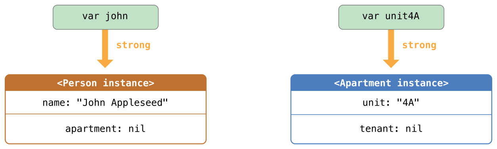
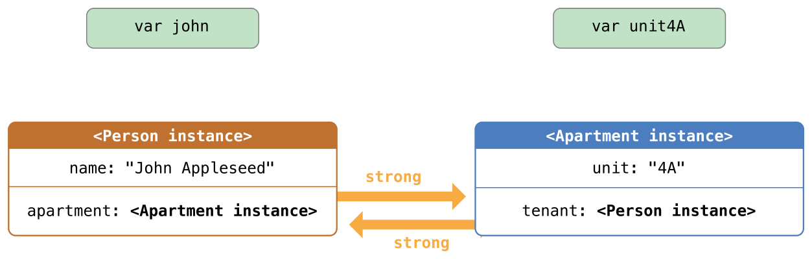
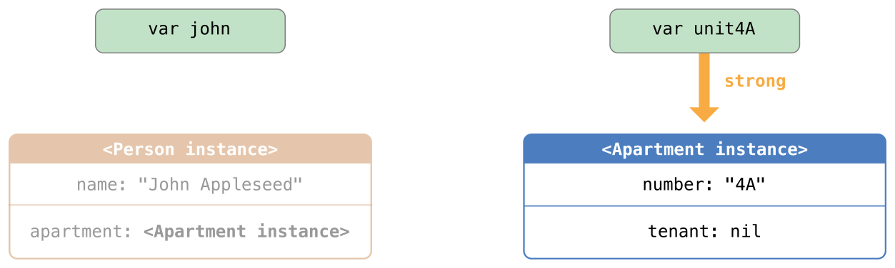
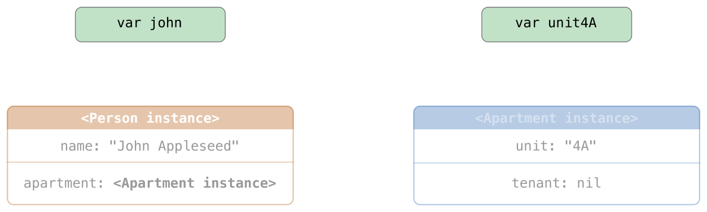
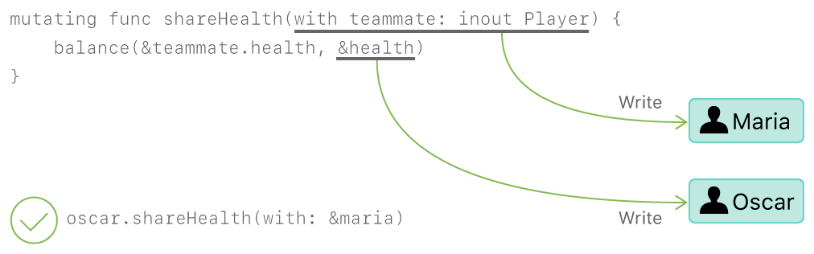

# Swift Notes

[TOC]


## Guide Tour

### Simple Values

- 变量声明 `var` 
- 常量声明 `let`
- 类型推断：
  - 声明类型：`let explicitDouble: Double`

- 没有隐式转换
- 显式转换
  - 简单方式把值转换成字符串：`\(apple)`
  - `String(apple)`

- 使用一对三个单引号（`"""`）来包含多行字符串内容，字符串中的内容（包括引号、空格、换行符等）都会保留下来。

```swift
let quotation = """
I said "I have \(apples) apples."
And then I said "I have \(apples + oranges) pieces of fruit."
"""
```

- 使用方括号 `[]` 来创建数组和字典，并使用下标或者键（key）来访问元素。最后一个元素后面允许有个逗号。

```swift
var shoppingList = ["catfish", "water", "tulips", "blue paint"]
shoppingList[1] = "bottle of water"

var occupations = [
    "Malcolm": "Captain",
    "Kaylee": "Mechanic",
]
occupations["Jayne"] = "Public Relations"
```

- Arrays automatically grow as you add elements.

```swift
shoppingList.append("blue paint")
print(shoppingList)
```


### Control Flow

- 使用 `if` 和 `switch` 来进行条件操作，使用 `for-in`、`while` 和 `repeat-while` 来进行循环。包裹条件和循环变量的括号可以省略，但是语句体的大括号是必须的。

  

  ```swift
  let individualScores = [75, 43, 103, 87, 12]
  var teamScore = 0
  for score in individualScores {
      if score > 50 {
          teamScore += 3
      } else {
          teamScore += 1
      }
  }
  print(teamScore)
  ```


- 在 `if` 语句中，条件必须是一个布尔表达式——这意味着像 `if score { ... }` 这样的代码将报错，而不会隐形地与 0 做对比。

- 可以一起使用 `if` 和 `let` 一起来处理值缺失的情况。这些值可由可选值来代表。一个可选的值是一个具体的值或者是 `nil` 以表示值缺失。在类型后面加一个问号（`?`）来标记这个变量的值是可选的。

- ```swift
  var optionalString: String? = "Hello"
  print(optionalString == nil)
  
  
  var optionalName: String? = "John Appleseed"
  var greeting = "Hello!"
  if let name = optionalName {
      greeting = "Hello, \(name)"
  }
  ```

- 如果变量的可选值是 `nil`，条件会判断为 `false`，大括号中的代码会被跳过。如果不是 `nil`，会将值解包并赋给 `let` 后面的常量，这样代码块中就可以使用这个值了。 另一种处理可选值的方法是通过使用 `??` 操作符来提供一个默认值。如果可选值缺失的话，可以使用默认值来代替。
- `switch` 支持任意类型的数据以及各种比较操作——不仅仅是整数以及测试相等。

```swift
let vegetable = "red pepper"
switch vegetable {
case "celery":
    print("Add some raisins and make ants on a log.")
case "cucumber", "watercress":
    print("That would make a good tea sandwich.")
case let x where x.hasSuffix("pepper"):
    print("Is it a spicy \(x)?")
default:
    print("Everything tastes good in soup.")
}
```

- 注意 `let` 在上述例子的等式中是如何使用的，它将匹配等式的值赋给常量 `x`。
- 运行 `switch` 中匹配到的 `case` 语句之后，程序会退出 `switch` 语句，并不会继续向下运行，所以不需要在每个子句结尾写 `break`。
- 使用 `for-in` 来遍历字典，需要一对变量来表示每个键值对。字典是一个无序的集合，所以他们的键和值以任意顺序迭代结束。

```swift
let interestingNumbers = [
    "Prime": [2, 3, 5, 7, 11, 13],
    "Fibonacci": [1, 1, 2, 3, 5, 8],
    "Square": [1, 4, 9, 16, 25],
]
var largest = 0
for (kind, numbers) in interestingNumbers {
    for number in numbers {
        if number > largest {
            largest = number
        }
    }
}
print(largest)
```

- 使用 `while` 来重复运行一段代码直到条件改变。循环条件也可以在结尾，保证能至少循环一次

```swift
var n = 2
while n < 100 {
    n *= 2
}
print(n)

var m = 2
repeat {
    m *= 2
} while m < 100
print(m)
```

- 可以在循环中使用 `..<` 来表示下标范围。

  ```swift
  var total = 0
  for i in 0..<4 {
      total += i
  }
  print(total)
  ```

- 使用 `..<` 创建的范围不包含上界，包含的话需要使用 `...`。


### Functions And Closures

- 使用 `func` 来声明一个函数，使用名字和参数来调用函数。使用 `->` 来指定函数返回值的类型。

  ```swift
  func greet(person: String, day: String) -> String {
      return "Hello \(person), today is \(day)."
  }
  greet(person:"Bob", day: "Tuesday")
  ```

- 默认情况下，函数使用它们的参数名称作为它们参数的标签，在参数名称前可以自定义参数标签，或者使用 `_` 表示不使用参数标签。

  ```swift
  func greet(_ person: String, on day: String) -> String {
      return "Hello \(person), today is \(day)."
  }
  greet("John", on: "Wednesday")
  ```

- 使用元组（tuple）来生成复合值，比如让一个函数返回多个值。该元组的元素可以用名称或数字（从 0 开始）来获取。

  ```swift
  func calculateStatistics(scores: [Int]) -> (min: Int, max: Int, sum: Int) {
      var min = scores[0]
      var max = scores[0]
      var sum = 0
  
  
      for score in scores {
          if score > max {
              max = score
          } else if score < min {
              min = score
          }
          sum += score
      }
  
  
      return (min, max, sum)
  }
  let statistics = calculateStatistics(scores:[5, 3, 100, 3, 9])
  print(statistics.sum)
  print(statistics.2)
  ```

- 函数可以嵌套。被嵌套的函数可以访问外侧函数的变量，你可以使用嵌套函数来重构一个太长或者太复杂的函数。

  ```swift
  func returnFifteen() -> Int {
      var y = 10
      func add() {
          y += 5
      }
      add()
      return y
  }
  returnFifteen()
  ```

- 函数是第一等类型(first-class type)，这意味着函数可以作为另一个函数的返回值。

  ```swift
  func makeIncrementer() -> ((Int) -> Int) {
      func addOne(number: Int) -> Int {
          return 1 + number
      }
      return addOne
  }
  var increment = makeIncrementer()
  increment(7)
  ```

- 函数也可以当做参数传入另一个函数。

  ```swift
  func hasAnyMatches(list: [Int], condition: (Int) -> Bool) -> Bool {
      for item in list {
          if condition(item) {
              return true
          }
      }
      return false
  }
  func lessThanTen(number: Int) -> Bool {
      return number < 10
  }
  var numbers = [20, 19, 7, 12]
  hasAnyMatches(list: numbers, condition: lessThanTen)
  ```

- 函数实际上是一种特殊的闭包:它是一段能之后被调取的代码。闭包中的代码能访问闭包作用域中的变量和函数，即使闭包是在一个不同的作用域被执行的 - 你已经在嵌套函数的例子中看过了。你可以使用 `{}` 来创建一个匿名闭包。使用 `in` 将参数和返回值类型的声明与闭包函数体进行分离。

  ```swift
  numbers.map({
      (number: Int) -> Int in
      let result = 3 * number
      return result
  })
  ```

- 有很多种创建更简洁的闭包的方法。如果一个闭包的类型已知，比如作为一个代理的回调，你可以忽略参数，返回值，甚至两个都忽略。单个语句闭包会把它语句的值当做结果返回。

  ```swift
  let mappedNumbers = numbers.map({ number in 3 * number })
  print(mappedNumbers)
  ```

- 你可以通过参数位置而不是参数名字来引用参数——这个方法在非常短的闭包中非常有用。当一个闭包作为最后一个参数传给一个函数的时候，它可以直接跟在括号后面。当一个闭包是传给函数的唯一参数，你可以完全忽略括号。

  ```swift
  let sortedNumbers = numbers.sorted { $0 > $1 }
  print(sortedNumbers)
  ```

### Objects and Classes

- 使用 `class` 和类名来创建一个类。类中属性的声明和常量、变量声明一样，唯一的区别就是它们的上下文是类。同样，方法和函数声明也一样。

  ```swift
  class Shape {
      var numberOfSides = 0
      func simpleDescription() -> String {
          return "A shape with \(numberOfSides) sides."
      }
  }
  ```

- 要创建一个类的实例，在类名后面加上括号。使用`.`来访问实例的属性和方法。

  ```
  var shape = Shape()
  shape.numberOfSides = 7
  var shapeDescription = shape.simpleDescription()
  ```

- 这个版本的 `Shape` 类缺少了一些重要的东西：一个构造函数来初始化类实例。使用 `init` 来创建一个构造器。

  ```swift
  class NamedShape {
      var numberOfSides: Int = 0
      var name: String
  
  
      init(name: String) {
          self.name = name
      }
  
  
      func simpleDescription() -> String {
          return "A shape with \(numberOfSides) sides."
      }
  }
  ```

- 注意 `self` 被用来区别实例变量 `name` 和构造器的参数 `name`。当你创建实例的时候，像传入函数参数一样给类传入构造器的参数。每个属性都需要赋值——无论是通过声明（就像 `numberOfSides`）还是通过构造器（就像 `name`）。

- 如果你需要在对象释放之前进行一些清理工作，使用 `deinit` 创建一个析构函数。

- 子类的定义方法是在它们的类名后面加上父类的名字，用冒号分割。创建类的时候并不需要一个标准的根类，所以你可以根据需要添加或者忽略父类。

- 子类如果要重写父类的方法的话，需要用 `override` 标记——如果没有添加 `override` 就重写父类方法的话编译器会报错。编译器同样会检测 `override` 标记的方法是否确实在父类中。

  ```swift
  class Square: NamedShape {
      var sideLength: Double
  
  
      init(sideLength: Double, name: String) {
          self.sideLength = sideLength
          super.init(name: name)
          numberOfSides = 4
      }
  
  
      func area() ->  Double {
          return sideLength * sideLength
      }
  
  
      override func simpleDescription() -> String {
          return "A square with sides of length \(sideLength)."
      }
  }
  let test = Square(sideLength: 5.2, name: "my test square")
  test.area()
  test.simpleDescription()
  ```

- 除了储存简单的属性之外，属性可以有 getter 和 setter 。

  ```swift
  class EquilateralTriangle: NamedShape {
      var sideLength: Double = 0.0
  
  
      init(sideLength: Double, name: String) {
          self.sideLength = sideLength
          super.init(name: name)
          numberOfSides = 3
      }
  
  
      var perimeter: Double {
          get {
              return 3.0 * sideLength
          }
          set {
              sideLength = newValue / 3.0
          }
      }
  
      override func simpleDescription() -> String {
          return "An equilateral triangle with sides of length \(sideLength)."
      }
  }
  var triangle = EquilateralTriangle(sideLength: 3.1, name: "a triangle")
  print(triangle.perimeter)
  triangle.perimeter = 9.9
  print(triangle.sideLength)
  ```

- 在 `perimeter` 的 setter 中，新值的名字是 `newValue`。你可以在 `set` 之后显式的设置一个名字。

- 注意 `EquilateralTriangle` 类的构造器执行了三步：

1. 设置子类声明的属性值
2. 调用父类的构造器
3. 改变父类定义的属性值。其他的工作比如调用方法、getters 和 setters 也可以在这个阶段完成。

如果你不需要计算属性，但是仍然需要在设置一个新值之前或者之后运行代码，使用 `willSet` 和 `didSet`。写入的代码会在属性值发生改变时调用，但不包含构造器中发生值改变的情况。比如，下面的类确保三角形的边长总是和正方形的边长相同。

```swift
class TriangleAndSquare {
    var triangle: EquilateralTriangle {
        willSet {
            square.sideLength = newValue.sideLength
        }
    }
    var square: Square {
        willSet {
            triangle.sideLength = newValue.sideLength
        }
    }
    init(size: Double, name: String) {
        square = Square(sideLength: size, name: name)
        triangle = EquilateralTriangle(sideLength: size, name: name)
    }
}
var triangleAndSquare = TriangleAndSquare(size: 10, name: "another test shape")
print(triangleAndSquare.square.sideLength)
print(triangleAndSquare.triangle.sideLength)
triangleAndSquare.square = Square(sideLength: 50, name: "larger square")
print(triangleAndSquare.triangle.sideLength)
```

- 处理变量的可选值时，你可以在操作（比如方法、属性和子脚本）之前加 `?`。如果 `?` 之前的值是 `nil`，`?` 后面的东西都会被忽略，并且整个表达式返回 `nil`。否则，`?` 之后的东西都会被运行。在这两种情况下，整个表达式的值也是一个可选值。

```swift
let optionalSquare: Square? = Square(sideLength: 2.5, name: "optional square")
let sideLength = optionalSquare?.sideLength
```

### Enumerations and Structures

- 使用 `enum` 来创建一个枚举。就像类和其他所有命名类型一样，枚举可以包含方法。

```swift
enum Rank: Int {
    case ace = 1
    case two, three, four, five, six, seven, eight, nine, ten
    case jack, queen, king
    func simpleDescription() -> String {
        switch self {
        case .ace:
            return "ace"
        case .jack:
            return "jack"
        case .queen:
            return "queen"
        case .king:
            return "king"
        default:
            return String(self.rawValue)
        }
    }
}
let ace = Rank.ace
let aceRawValue = ace.rawValue
```

- 默认情况下，Swift 按照从 0 开始每次加 1 的方式为原始值进行赋值，不过你可以通过显式赋值进行改变。在上面的例子中，`Ace` 被显式赋值为 1，并且剩下的原始值会按照顺序赋值。
- 你也可以使用字符串或者浮点数作为枚举的原始值。使用 `rawValue` 属性来访问一个枚举成员的原始值。

使用 `init?(rawValue:)` 初始化构造器来创建一个带有原始值的枚举成员。如果存在与原始值相应的枚举成员就返回该枚举成员，否则就返回 `nil`。

```swift
if let convertedRank = Rank(rawValue: 3) {
    let threeDescription = convertedRank.simpleDescription()
}
```

- 枚举的关联值是实际值，并不是原始值的另一种表达方法。实际上，如果没有比较有意义的原始值，你就不需要提供原始值。

```swift
enum Suit {
    case spades, hearts, diamonds, clubs
    func simpleDescription() -> String {
        switch self {
        case .spades:
            return "spades"
        case .hearts:
            return "hearts"
        case .diamonds:
            return "diamonds"
        case .clubs:
            return "clubs"
        }
    }
}
let hearts = Suit.hearts
let heartsDescription = hearts.simpleDescription()
```

- 注意在上面的例子中用了两种方式引用 `hearts` 枚举成员：给 `hearts` 常量赋值时，枚举成员 `Suit.hearts` 需要用全名来引用，因为常量没有显式指定类型。在 `switch` 里，枚举成员使用缩写 `.hearts` 来引用，因为 `self` 的值已经是一个 `suit` 类型，在已知变量类型的情况下可以使用缩写。

- 如果枚举成员的实例有原始值，那么这些值是在声明的时候就已经决定了，这意味着不同枚举实例的枚举成员总会有一个相同的原始值。当然我们也可以为枚举成员设定关联值，关联值是在创建实例时决定的。这意味着不同的枚举成员的关联值都可以不同。你可以把关联值想象成枚举成员的寄存属性。例如，考虑从服务器获取日出和日落的时间的情况。服务器会返回正常结果或者错误信息。

```swift
enum ServerResponse {
    case result(String, String)
    case failure(String)
}

let success = ServerResponse.result("6:00 am", "8:09 pm")
let failure = ServerResponse.failure("Out of cheese.")

switch success {
case let .result(sunrise, sunset):
    print("Sunrise is at \(sunrise) and sunset is at \(sunset)")
case let .failure(message):
    print("Failure...  \(message)")
}
```

- 注意日升和日落时间是如何从 `ServerResponse` 中提取到并与 `switch` 的 `case` 相匹配的。

- 使用 `struct` 来创建一个结构体。结构体和类有很多相同的地方，包括方法和构造器。**它们之间最大的一个区别就是结构体是传值，类是传引用。**

```
struct Card {
    var rank: Rank
    var suit: Suit
    func simpleDescription() -> String {
        return "The \(rank.simpleDescription()) of \(suit.simpleDescription())"
    }
}
let threeOfSpades = Card(rank: .three, suit: .spades)
let threeOfSpadesDescription = threeOfSpades.simpleDescription()
```

### Protocols and Extensions

- 使用 `protocol` 来声明一个协议。

```swift
protocol ExampleProtocol {
    var simpleDescription: String { get }
    mutating func adjust()
}
```

- 类、枚举和结构体都可以遵循协议。

```swift
class SimpleClass: ExampleProtocol {
    var simpleDescription: String = "A very simple class."
    var anotherProperty: Int = 69105
    func adjust() {
        simpleDescription += "  Now 100% adjusted."
    }
}
var a = SimpleClass()
a.adjust()
let aDescription = a.simpleDescription


struct SimpleStructure: ExampleProtocol {
    var simpleDescription: String = "A simple structure"
    mutating func adjust() {
        simpleDescription += " (adjusted)"
    }
}
var b = SimpleStructure()
b.adjust()
let bDescription = b.simpleDescription
```

- 注意声明 `SimpleStructure` 时候 `mutating` 关键字用来标记一个会修改结构体的方法。`SimpleClass` 的声明不需要标记任何方法，因为类中的方法通常可以修改类属性（类的性质）。

- 使用 `extension` 来为现有的类型添加功能，比如新的方法和计算属性。你可以使用扩展让某个在别处声明的类型来遵守某个协议，这同样适用于从外部库或者框架引入的类型。


```
extension Int: ExampleProtocol {
    var simpleDescription: String {
        return "The number \(self)"
    }
    mutating func adjust() {
        self += 42
    }
}
print(7.simpleDescription)
```

- 你可以像使用其他命名类型一样使用协议名——例如，创建一个有不同类型但是都实现一个协议的对象集合。当你处理类型是协议的值时，协议外定义的方法不可用。

```
let protocolValue: ExampleProtocol = a
print(protocolValue.simpleDescription)
// print(protocolValue.anotherProperty)  // 去掉注释可以看到错误
```

- 即使 `protocolValue` 变量运行时的类型是 `simpleClass` ，编译器还是会把它的类型当做 `ExampleProtocol`。这表示你不能调用在协议之外的方法或者属性。

### ERROR Handling

- 使用采用 `Error` 协议的类型来表示错误。

```
enum PrinterError: Error {
    case outOfPaper
    case noToner
    case onFire
}
```

- 使用 `throw` 来抛出一个错误和使用 `throws` 来表示一个可以抛出错误的函数。如果在函数中抛出一个错误，这个函数会立刻返回并且调用该函数的代码会进行错误处理。

```
func send(job: Int, toPrinter printerName: String) throws -> String {
    if printerName == "Never Has Toner" {
        throw PrinterError.noToner
    }
    return "Job sent"
}
```

- 有多种方式可以用来进行错误处理。一种方式是使用 `do-catch` 。在 `do` 代码块中，使用 `try` 来标记可以抛出错误的代码。在 `catch` 代码块中，除非你另外命名，否则错误会自动命名为 `error` 。

```
do {
    let printerResponse = try send(job: 1040, toPrinter: "Bi Sheng")
    print(printerResponse)
} catch {
    print(error)
}
```

- 可以使用多个 `catch` 块来处理特定的错误。参照 switch 中的 `case` 风格来写 `catch`。

```
do {
    let printerResponse = try send(job: 1440, toPrinter: "Gutenberg")
    print(printerResponse)
} catch PrinterError.onFire {
    print("I'll just put this over here, with the rest of the fire.")
} catch let printerError as PrinterError {
    print("Printer error: \(printerError).")
} catch {
    print(error)
}
```

- 另一种处理错误的方式使用 `try?` 将结果转换为可选的。如果函数抛出错误，该错误会被抛弃并且结果为 `nil`。否则，结果会是一个包含函数返回值的可选值。


```
let printerSuccess = try? send(job: 1884, toPrinter: "Mergenthaler")
let printerFailure = try? send(job: 1885, toPrinter: "Never Has Toner")
```

使用 `defer` 代码块来表示在函数返回前，函数中最后执行的代码。无论函数是否会抛出错误，这段代码都将执行。使用 `defer`，可以把函数调用之初就要执行的代码和函数调用结束时的扫尾代码写在一起，虽然这两者的执行时机截然不同。

```swift
var fridgeIsOpen = false
let fridgeContent = ["milk", "eggs", "leftovers"]

func fridgeContains(_ food: String) -> Bool {
    fridgeIsOpen = true
    defer {
        fridgeIsOpen = false
    }

    let result = fridgeContent.contains(food)
    return result
}
fridgeContains("banana")
print(fridgeIsOpen)
```

### Generics

在尖括号里写一个名字来创建一个泛型函数或者类型。

```swift
func makeArray<Item>(repeating item: Item, numberOfTimes: Int) -> [Item] {
    var result = [Item]()
    for _ in 0..<numberOfTimes {
        result.append(item)
    }
    return result
}
makeArray(repeating: "knock", numberOfTimes: 4)
```

你也可以创建泛型函数、方法、类、枚举和结构体。

```swift
// 重新实现 Swift 标准库中的可选类型
enum OptionalValue<Wrapped> {
    case none
    case some(Wrapped)
}
var possibleInteger: OptionalValue<Int> = .none
possibleInteger = .some(100)
```

在类型名后面使用 `where` 来指定对类型的一系列需求，比如，限定类型实现某一个协议，限定两个类型是相同的，或者限定某个类必须有一个特定的父类。

```swift
func anyCommonElements<T: Sequence, U: Sequence>(_ lhs: T, _ rhs: U) -> Bool
    where T.Iterator.Element: Equatable, T.Iterator.Element == U.Iterator.Element {
        for lhsItem in lhs {
            for rhsItem in rhs {
                if lhsItem == rhsItem {
                    return true
                }
            }
        }
        return false
}
anyCommonElements([1, 2, 3], [3])
```

`<T: Equatable>` 和 `<T> ... where T: Equatable>` 的写法是等价的。


## Basics

- 基础数据类型： `Int` ,`Double` ,`Float`, `String`,`Bool`
- 集合类型：`Array`,`Set`,`Dictionary`
- Tuple 元组
- 可选(Optional)类型


### 常量和变量


- 常量和变量必须在使用前声明，用 `let` 来声明常量，用 `var` 来声明变量

- 声明常量或者变量的时候可以加上*类型注解（type annotation）*

- 常量和变量名可以包含任何字符，包括 Unicode 字符：

  ```swift
  let π = 3.14159
  let 你好 = "你好世界"
  let 🐶🐮 = "dogcow"
  ```

- 常量与变量名不能包含数学符号，箭头，保留的（或者非法的）Unicode 码位，连线与制表符。也不能以数字开头，但是可以在常量与变量名的其他地方包含数字。


#### 打印输出

- 可以用 `print(_:separator:terminator:)` 函数来输出当前常量或变量的值
- 默认情况下，该函数通过添加换行符来结束当前行。如果不想换行，可以传递一个空字符串给 `terminator` 参数--例如，`print(someValue, terminator:"")`
- Swift 用*字符串插值（string interpolation）*的方式把常量名或者变量名当做占位符加入到长字符串中，Swift 会用当前常量或变量的值替换这些占位符。

```swift
print("The current value of friendlyWelcome is \(friendlyWelcome)")
```


#### 注释

- 单行:`//`
- 多行:`/*   */`

#### 分号

- 与其他大部分编程语言不同，Swift 并不强制要求你在每条语句的结尾处使用分号（`;`）
- 有一种情况下必须要用分号，即你打算在同一行内写多条独立的语句：


### 整数

- Swift 提供了8、16、32和64位的有符号和无符号整数类型。
- 可以访问不同整数类型的 `min` 和 `max` 属性来获取对应类型的最小值和最大值
  - `let minValue = UInt8.min`
- 一般不需要专门指定整数的长度。Swift 提供了一个特殊的整数类型 `Int`，长度与当前平台的原生字长相同：
  - 在32位平台上，`Int` 和 `Int32` 长度相同。
  - 在64位平台上，`Int` 和 `Int64` 长度相同。
- Swift 也提供了一个特殊的无符号类型 `UInt`，长度与当前平台的原生字长相同


### 浮点数

浮点类型比整数类型表示的范围更大，可以存储比 `Int` 类型更大或者更小的数字。Swift 提供了两种有符号浮点数类型：

- `Double` 表示64位浮点数。当你需要存储很大或者很高精度的浮点数时请使用此类型。
- `Float` 表示32位浮点数。精度要求不高的话可以使用此类型。


#### 类型安全与类型推断

- 在声明时没有显式指定类型，Swift 使用类型推断

  


### 数值型字面量

整数字面量可以被写作：

- 一个*十进制*数，没有前缀
- 一个*二进制*数，前缀是 `0b`
- 一个*八进制*数，前缀是 `0o`
- 一个*十六进制*数，前缀是 `0x`

浮点字面量可以是十进制（没有前缀）或者是十六进制（前缀是 `0x` ）。小数点两边必须有至少一个十进制数字（或者是十六进制的数字）。十进制浮点数也可以有一个可选的指数（exponent)，通过大写或者小写的 `e` 来指定；十六进制浮点数必须有一个指数，通过大写或者小写的 `p` 来指定。

整数和浮点数都可以添加额外的零并且包含下划线，并不会影响字面量


#### 类型别名

```swift
typealias AudioSample = UInt16
```


### 布尔值

- 如果你在需要使用 `Bool` 类型的地方使用了非布尔值，Swift 的类型安全机制会报错。


### 元组

```swift
let http404Error = (404, "Not Found")
// http404Error 的类型是 (Int, String)，值是 (404, "Not Found")
let (statusCode, statusMessage) = http404Error
print("The status code is \(statusCode)")
// 输出“The status code is 404”
print("The status message is \(statusMessage)")
// 输出“The status message is Not Found”
```

如果你只需要一部分元组值，分解的时候可以把要忽略的部分用下划线（`_`）标记：

```swift
let (justTheStatusCode, _) = http404Error
print("The status code is \(justTheStatusCode)")
```

还可以通过下标来访问元组中的单个元素，下标从零开始

```Swift
print("The status code is \(http404Error.0)")
// 输出“The status code is 404”
print("The status message is \(http404Error.1)")
// 输出“The status message is Not Found”
```

可以在定义元组的时候给单个元素命名：

```swift
let http200Status = (statusCode: 200, description: "OK")
```

给元组中的元素命名后，你可以通过名字来获取这些元素的值：

```swift
print("The status code is \(http200Status.statusCode)")
// 输出“The status code is 200”
print("The status message is \(http200Status.description)")
// 输出“The status message is OK”
```


### 可选类型

使用*可选类型（optionals）*来处理值可能缺失的情况。可选类型表示两种可能： 或者有值， 你可以解析可选类型访问这个值， 或者根本没有值。

Swift 的 `Int` 类型有一种构造器，作用是将一个 `String` 值转换成一个 `Int` 值。然而，并不是所有的字符串都可以转换成一个整数。字符串 `"123"` 可以被转换成数字 `123` ，但是字符串 `"hello, world"` 不行。

使用这种构造器来尝试将一个 `String` 转换成 `Int`：

```
let possibleNumber = "123"
let convertedNumber = Int(possibleNumber)
// convertedNumber 被推测为类型 "Int?"， 或者类型 "optional Int"
```

因为该构造器可能会失败，所以它返回一个*可选类型*（optional）`Int`，而不是一个 `Int`。一个可选的 `Int` 被写作 `Int?` 而不是 `Int`。问号暗示包含的值是可选类型，也就是说可能包含 `Int` 值也可能*不包含值*。

#### nil

你可以给可选变量赋值为 `nil` 来表示它没有值：

```swift
var serverResponseCode: Int? = 404
// serverResponseCode 包含一个可选的 Int 值 404
serverResponseCode = nil
// serverResponseCode 现在不包含值
```

> `nil` 不能用于非可选的常量和变量。如果你的代码中有常量或者变量需要处理值缺失的情况，请把它们声明成对应的可选类型。

如果你声明一个可选常量或者变量但是没有赋值，它们会自动被设置为 `nil`：

```swift
var surveyAnswer: String?
// surveyAnswer 被自动设置为 nil
```

你可以使用 `if` 语句和 `nil` 比较来判断一个可选值是否包含值。你可以使用“相等”(`==`)或“不等”(`!=`)来执行比较。

如果可选类型有值，它将不等于 `nil`：

```swift
if convertedNumber != nil {
    print("convertedNumber contains some integer value.")
}
// 输出“convertedNumber contains some integer value.”
```

当你确定可选类型确实包含值之后，你可以在可选的名字后面加一个感叹号（`!`）来获取值。这被称为可选值的*强制解析（forced unwrapping）*：

```swift
if convertedNumber != nil {
    print("convertedNumber has an integer value of \(convertedNumber!).")
}
// 输出“convertedNumber has an integer value of 123.”
```

> 使用 `!` 来获取一个不存在的可选值会导致运行时错误。使用 `!` 来强制解析值之前，一定要确定可选包含一个非 `nil` 的值。

#### 可选绑定

使用*可选绑定（optional binding）*来判断可选类型是否包含值，如果包含就把值赋给一个临时常量或者变量。可选绑定可以用在 `if` 和 `while` 语句中，这条语句不仅可以用来判断可选类型中是否有值，同时可以将可选类型中的值赋给一个常量或者变量。

```swift
if let actualNumber = Int(possibleNumber) {
    print("\'\(possibleNumber)\' has an integer value of \(actualNumber)")
} else {
    print("\'\(possibleNumber)\' could not be converted to an integer")
}
// 输出“'123' has an integer value of 123”
```

可以在可选绑定中使用常量和变量。如果你想在 `if` 语句的第一个分支中操作 `actualNumber` 的值，你可以改成 `if var actualNumber`，这样可选类型包含的值就会被赋给一个变量而非常量。

可以包含多个可选绑定或多个布尔条件在一个 `if` 语句中，只要使用逗号分开就行。只要有任意一个可选绑定的值为 `nil`，或者任意一个布尔条件为 `false`，则整个 `if` 条件判断为 `false`，

> 在 `if` 条件语句中使用常量和变量来创建一个可选绑定，仅在 `if` 语句的句中（`body`）中才能获取到值。相反，在 `guard` 语句中使用常量和变量来创建一个可选绑定，仅在 `guard` 语句外且在语句后才能获取到值.

#### 隐式解析可选类型

有时候在程序架构中，第一次被赋值之后，可以确定一个可选类型*总会*有值。在这种情况下，每次都要判断和解析可选值是非常低效的，因为可以确定它总会有值。

这种类型的可选状态被定义为隐式解析可选类型（implicitly unwrapped optionals）。把想要用作可选的类型的后面的问号（`String?`）改成感叹号（`String!`）来声明一个隐式解析可选类型。

当可选类型被第一次赋值之后就可以确定之后一直有值的时候，隐式解析可选类型非常有用。隐式解析可选类型主要被用在 Swift 中类的构造过程中。一个隐式解析可选类型其实就是一个普通的可选类型，但是可以被当做非可选类型来使用，并不需要每次都使用解析来获取可选值。

```swift
let possibleString: String? = "An optional string."
let forcedString: String = possibleString! // 需要感叹号来获取值


let assumedString: String! = "An implicitly unwrapped optional string."
let implicitString: String = assumedString  // 不需要感叹号
```

- 可以把隐式解析可选类型当做一个可以自动解析的可选类型。你要做的只是声明的时候把感叹号放到类型的结尾，而不是每次取值的可选名字的结尾。

- 仍然可以把隐式解析可选类型当做普通可选类型来判断它是否包含值：

```swift
if assumedString != nil {
    print(assumedString!)
}
// 输出“An implicitly unwrapped optional string.”
```

- 你也可以在可选绑定中使用隐式解析可选类型来检查并解析它的值：

```swift
if let definiteString = assumedString {
    print(definiteString)
}
// 输出“An implicitly unwrapped optional string.”
```

> 如果一个变量之后可能变成 `nil` 的话请不要使用隐式解析可选类型。如果你需要在变量的生命周期中判断是否是 `nil` 的话，请使用普通可选类型。


### 错误处理


当一个函数遇到错误条件，它能报错。调用函数的地方能抛出错误消息并合理处理。

```swift
func canThrowAnError() throws {
    // 这个函数有可能抛出错误
}
```

一个函数可以通过在声明中添加 `throws` 关键词来抛出错误消息。当你的函数能抛出错误消息时，你应该在表达式中前置 `try` 关键词。

```swift
do {
    try canThrowAnError()
    // 没有错误消息抛出
} catch {
    // 有一个错误消息抛出
}
```


### Assertions and Preconditions

> 断言和先决条件的不同点是，他们什么时候进行状态检测：断言仅在调试环境运行，而先决条件则在调试环境和生产环境中运行。在生产环境中，断言的条件将不会进行评估。

#### 断言

调用Swift 标准库的 `assert(_:_:file:line:)` 函数来写一个断言。向这个函数传入一个结果为 `true` 或者 `false` 的表达式以及一条信息，当表达式的结果为 `false` 的时候这条信息会被显示：

```swift
let age = -3
assert(age >= 0, "A person's age cannot be less than zero")
```

只有 `age >= 0` 为 `true` 时，即 `age` 的值非负的时候，代码才会继续执行。如果 `age` 的值是负数，就像代码中那样，`age >= 0` 为 `false`，断言被触发，终止应用。

如果代码已经检查了条件，你可以使用 `assertionFailure(_:file:line:)` 函数来表明断言失败


#### Precondition

你可以使用全局 `precondition(_:_:file:line:)` 函数来写一个先决条件。向这个函数传入一个结果为 `true` 或者 `false` 的表达式以及一条信息，当表达式的结果为 `false` 的时候这条信息会被显示

可以调用 `preconditionFailure(_:file:line:)` 方法来表明出现了一个错误


## 基本运算符


### 赋值运算符

- *赋值运算符*（`a = b`），表示用 `b` 的值来初始化或更新 `a` 的值：
- 如果赋值的右边是一个多元组，它的元素可以马上被分解成多个常量或变量：`let (x, y) = (1, 2)`
- 与 C 语言和 Objective-C 不同，Swift 的赋值操作并不返回任何值
  - 通过将 `if x = y` 标记为无效语句，Swift 能帮你避免把 （`==`）错写成（`=`）这类错误的出现


### 算术运算符

- 与 C 语言和 Objective-C 不同的是，Swift 默认情况下不允许在数值运算中出现溢出情况。
- 但可以使用 Swift 的溢出运算符来实现溢出运算（如 `a &+ b`)
- 加法运算符也可用于 `String` 的拼接


#### 求余运算

```swift
-9 % 4   // 等于 -1
```


#### 组合赋值运算符

`+=`


### 比较运算符

- 等于（`a == b`）
- 不等于（`a != b`）
- 大于（`a > b`）
- 小于（`a < b`）
- 大于等于（`a >= b`）
- 小于等于（`a <= b`）

> Swift 也提供恒等（`===`）和不恒等（`!==`）这两个比较符来判断两个对象是否引用同一个对象实例。

- 如果两个元组的元素相同，且长度相同的话，元组就可以被比较。比较元组大小会按照从左到右、逐值比较的方式，直到发现有两个值不等时停止。


### 三元运算符

`question ? answer1 : answer2`

### Nil Coalescing Operator

*空合运算符*（`a ?? b`）将对可选类型 `a` 进行空判断，如果 `a` 包含一个值就进行解包，否则就返回一个默认值 `b`。表达式 `a` 必须是 Optional 类型。默认值 `b` 的类型必须要和 `a` 存储值的类型保持一致。


### 区间运算符

- 闭区间：*闭区间运算符*（`a...b`）定义一个包含从 `a` 到 `b`（包括 `a` 和 `b`）的所有值的区间。`a` 的值不能超过 `b`。
- *半开区间运算符*（`a..<b`）定义一个从 `a` 到 `b` 但不包括 `b` 的区间
- 单侧区间


```swift
let names = ["Anna", "Alex", "Brian", "Jack"]
let count = names.count
for i in 0..<count {
    print("第 \(i + 1) 个人叫 \(names[i])")
}

for name in names[2...] {
    print(name)
}
// Brian
// Jack

for name in names[...2] {
    print(name)
}
// Anna
// Alex
// Brian

for name in names[..<2] {
    print(name)
}
// Anna
// Alex
```


### 逻辑运算符

- 逻辑非（`!a`）
- 逻辑与（`a && b`）
- 逻辑或（`a || b`）


## 字符串和字符


### 字符串

Swift 的字符串通过 `String` 类型来表示。而 `String` 内容的访问方式有多种，例如以 `Character` 值的集合。

```swift
let singleLineString = "These are the same."
let multilineString = """
These are the same.
"""
```


如果你的代码中，多行字符串字面量包含换行符的话，则多行字符串字面量中也会包含换行符。如果你想换行，以便加强代码的可读性，但是你又不想在你的多行字符串字面量中出现换行符的话，你可以用在行尾写一个反斜杠（`\`）作为续行符。

```swifT
let softWrappedQuotation = """
The White Rabbit put on his spectacles.  "Where shall I begin, \
please your Majesty?" he asked.

"Begin at the beginning," the King said gravely, "and go on \
till you come to the end; then stop."
"""
```

一个多行字符串字面量能够缩进来匹配周围的代码。关闭引号（`"""`）之前的空白字符串告诉 Swift 编译器其他各行多少空白字符串需要忽略。然而，如果你在某行的前面写的空白字符串超出了关闭引号（`"""`）之前的空白字符串，则超出部分将被包含在多行字符串字面量中。


#### 特殊字符

特殊字符：

- 转义字符 `\0`(空字符)、`\\`(反斜线)、`\t`(水平制表符)、`\n`(换行符)、`\r`(回车符)、`\"`(双引号)、`\'`(单引号)。
- Unicode 标量，写成 `\u{n}`(u 为小写)，其中 `n` 为任意一到八位十六进制数且可用的 Unicode 位码。


#### 扩展分隔符

- 将字符串文字放在扩展分隔符中，这样字符串中的特殊字符将会被直接包含而非转义后的效果
- 如果需要字符串文字中字符的特殊效果，请匹配转义字符（`\`）后面添加与起始位置个数相匹配的 # 符。


#### 空字符串

```swift
var emptyString = ""               // 空字符串字面量
var anotherEmptyString = String()  // 初始化方法
```

> 在 Objective-C 和 Cocoa 中，需要通过选择两个不同的类（`NSString` 和 `NSMutableString`）来指定字符串是否可以被修改。

#### 值类型

在 Swift 中 `String` 类型是*值类型*。如果你创建了一个新的字符串，那么当其进行常量、变量赋值操作，或在函数/方法中传递时，会进行值拷贝。在前述任一情况下，都会对已有字符串值创建新副本，并对该新副本而非原始字符串进行传递或赋值操作。


### 使用字符

- 可使用`for-in` 循环来遍历字符串
- 字符串可以通过传递一个值类型为 `Character` 的数组作为自变量来初始化：

#### 连接字符

- 字符串可以通过加法运算符（`+`）相加在一起（或称“连接”）创建一个新的字符串
- 可以用 `append()` 方法将一个字符附加到一个字符串变量的尾部

#### 字符串插值

```swift
let multiplier = 3
let message = "\(multiplier) times 2.5 is \(Double(multiplier) * 2.5)"
```

#### Unicode 字符

- Swift 的 `String` 类型是基于 *Unicode 标量* 建立的。Unicode 标量是对应字符或者修饰符的唯一的 21 位数字，例如 `U+0061` 表示小写的拉丁字母（`LATIN SMALL LETTER A`）（"`a`"）
- 每一个 Swift 的 `Character` 类型代表一个*可扩展的字形群*。而一个可扩展的字形群构成了人类可读的单个字符，它由一个或多个（当组合时） Unicode 标量的序列组成
- 举个例子，字母 `é` 可以用单一的 Unicode 标量 `é`(`LATIN SMALL LETTER E WITH ACUTE`, 或者 `U+00E9`)来表示。然而一个标准的字母 `e`(`LATIN SMALL LETTER E` 或者 `U+0065`) 加上一个急促重音（`COMBINING ACTUE ACCENT`）的标量（`U+0301`），这样一对标量就表示了同样的字母 `é`。 这个急促重音的标量形象的将 `e` 转换成了 `é`。
- 可扩展的字形集是一个将许多复杂的脚本字符表示为单个字符值的灵活方式。例如，来自朝鲜语字母表的韩语音节能表示为组合或分解的有序排列。在 Swift 都会表示为同一个单一的 `Character` 值：

#### 字符串长度

如果想要获得一个字符串中 `Character` 值的数量，可以使用 `count` 属性：


#### 访问和修改

- 每一个 `String` 值都有一个关联的索引（*index*）类型，`String.Index`，它对应着字符串中的每一个 `Character` 的位置。

- 不同的字符可能会占用不同数量的内存空间，所以要知道 `Character` 的确定位置，就必须从 `String` 开头遍历每一个 Unicode 标量直到结尾。因此，Swift 的字符串不能用整数（integer）做索引。

- 使用 `startIndex` 属性可以获取一个 `String` 的第一个 `Character` 的索引。使用 `endIndex` 属性可以获取最后一个 `Character` 的后一个位置的索引。因此，`endIndex` 属性不能作为一个字符串的有效下标。如果 `String` 是空串，`startIndex` 和 `endIndex` 是相等的。

  通过调用 `String` 的 `index(before:)` 或 `index(after:)` 方法，可以立即得到前面或后面的一个索引。你还可以通过调用 `index(_:offsetBy:)` 方法来获取对应偏移量的索引，这种方式可以避免多次调用 `index(before:)` 或 `index(after:)` 方法。

```swift
let greeting = "Guten Tag!"
greeting[greeting.startIndex]
// G
greeting[greeting.index(before: greeting.endIndex)]
// !
greeting[greeting.index(after: greeting.startIndex)]
// u
let index = greeting.index(greeting.startIndex, offsetBy: 7)
greeting[index]
// a
```

> 你可以使用 `startIndex` 和 `endIndex` 属性或者 `index(before:)` 、`index(after:)` 和 `index(_:offsetBy:)` 方法在任意一个确认的并遵循 `Collection` 协议的类型里面，如上文所示是使用在 `String` 中，你也可以使用在 `Array`、`Dictionary` 和 `Set` 中。

#### 插入和删除

调用 `insert(_:at:)` 方法可以在一个字符串的指定索引插入一个字符，调用 `insert(contentsOf:at:)` 方法可以在一个字符串的指定索引插入一个段字符串。

```swift
var welcome = "hello"
welcome.insert("!", at: welcome.endIndex)
// welcome 变量现在等于 "hello!"


welcome.insert(contentsOf:" there", at: welcome.index(before: welcome.endIndex))
// welcome 变量现在等于 "hello there!"
```

调用 `remove(at:)` 方法可以在一个字符串的指定索引删除一个字符，调用 `removeSubrange(_:)` 方法可以在一个字符串的指定索引删除一个子字符串。

```swift
welcome.remove(at: welcome.index(before: welcome.endIndex))
// welcome 现在等于 "hello there"


let range = welcome.index(welcome.endIndex, offsetBy: -6)..<welcome.endIndex
welcome.removeSubrange(range)
// welcome 现在等于 "hello"
```

> 可以使用 `insert(_:at:)`、`insert(contentsOf:at:)`、`remove(at:)` 和 `removeSubrange(_:)` 方法在任意一个确认的并遵循 `RangeReplaceableCollection` 协议的类型里面，如上文所示是使用在 `String` 中，你也可以使用在 `Array`、`Dictionary` 和 `Set` 中。


#### 子字符串

当你从字符串中获取一个子字符串,可以得到一个 `SubString` 的实例，而非另外一个 `String`。Swift 里的 `SubString` 绝大部分函数都跟 `String` 一样，意味着你可以使用同样的方式去操作 `SubString` 和 `String`。然而，跟 `String` 不同的是，你只有在短时间内需要操作字符串时，才会使用 `SubString`。当你需要长时间保存结果时，就把 `SubString` 转化为 `String` 的实例：

```swift
let greeting = "Hello, world!"
let index = greeting.firstIndex(of: ",") ?? greeting.endIndex
let beginning = greeting[..<index]
// beginning 的值为 "Hello"

// 把结果转化为 String 以便长期存储。
let newString = String(beginning)
```

 `String` 和 `SubString` 的区别在于性能优化上，`SubString` 可以重用原 `String` 的内存空间，或者另一个 `SubString` 的内存空间（`String` 也有同样的优化，但如果两个 `String` 共享内存的话，它们就会相等）。这一优化意味着你在修改 `String` 和 `SubString` 之前都不需要消耗性能去复制内存。就像前面说的那样，`SubString` 不适合长期存储 —— 因为它重用了原 `String` 的内存空间，原 `String` 的内存空间必须保留直到它的 `SubString` 不再被使用为止。

`greeting` 是一个 `String`，意味着它在内存里有一片空间保存字符集。而由于 `beginning` 是 `greeting` 的 `SubString`，它重用了 `greeting` 的内存空间。相反，`newString` 是一个 `String` —— 它是使用 `SubString` 创建的，拥有一片自己的内存空间。下面的图展示了他们之间的关系：


### 比较字符串

Swift 提供了三种方式来比较文本值：字符串字符相等、前缀相等和后缀相等。

#### 字符串/字符相等

字符串/字符可以用等于操作符（`==`）和不等于操作符（`!=`）：

```swift
let quotation = "We're a lot alike, you and I."
let sameQuotation = "We're a lot alike, you and I."
if quotation == sameQuotation {
    print("These two strings are considered equal")
}
```

如果两个字符串（或者两个字符）的可扩展的字形群集是标准相等，那就认为它们是相等的。只要可扩展的字形群集有同样的语言意义和外观则认为它们标准相等，即使它们是由不同的 Unicode 标量构成。

例如，`LATIN SMALL LETTER E WITH ACUTE`(`U+00E9`)就是标准相等于 `LATIN SMALL LETTER E`(`U+0065`)后面加上 `COMBINING ACUTE ACCENT`(`U+0301`)。这两个字符群集都是表示字符 `é` 的有效方式，所以它们被认为是标准相等的：

```swift
// "Voulez-vous un café?" 使用 LATIN SMALL LETTER E WITH ACUTE
let eAcuteQuestion = "Voulez-vous un caf\u{E9}?"

// "Voulez-vous un café?" 使用 LATIN SMALL LETTER E and COMBINING ACUTE ACCENT
let combinedEAcuteQuestion = "Voulez-vous un caf\u{65}\u{301}?"
if eAcuteQuestion == combinedEAcuteQuestion {
    print("These two strings are considered equal")
}
```

相反，英语中的 `LATIN CAPITAL LETTER A`(`U+0041`，或者 `A`)不等于俄语中的 `CYRILLIC CAPITAL LETTER A`(`U+0410`，或者 `A`)。两个字符看着是一样的，但却有不同的语言意义：

```swift
let latinCapitalLetterA: Character = "\u{41}"
let cyrillicCapitalLetterA: Character = "\u{0410}"
if latinCapitalLetterA != cyrillicCapitalLetterA {
    print("These two characters are not equivalent")
}
```


#### 前缀/后缀相等

通过调用字符串的 `hasPrefix(_:)`/`hasSuffix(_:)` 方法来检查字符串是否拥有特定前缀/后缀，两个方法均接收一个 `String` 类型的参数，并返回一个布尔值。

下面的例子以一个字符串数组表示莎士比亚话剧《罗密欧与朱丽叶》中前两场的场景位置：


```swift
let romeoAndJuliet = [
    "Act 1 Scene 1: Verona, A public place",
    "Act 1 Scene 2: Capulet's mansion",
    "Act 1 Scene 3: A room in Capulet's mansion",
    "Act 1 Scene 4: A street outside Capulet's mansion",
    "Act 1 Scene 5: The Great Hall in Capulet's mansion",
    "Act 2 Scene 1: Outside Capulet's mansion",
    "Act 2 Scene 2: Capulet's orchard",
    "Act 2 Scene 3: Outside Friar Lawrence's cell",
    "Act 2 Scene 4: A street in Verona",
    "Act 2 Scene 5: Capulet's mansion",
    "Act 2 Scene 6: Friar Lawrence's cell"
]
```

你可以调用 `hasPrefix(_:)` 方法来计算话剧中第一幕的场景数：

```swift
var act1SceneCount = 0
for scene in romeoAndJuliet {
    if scene.hasPrefix("Act 1 ") {
        act1SceneCount += 1
    }
}
print("There are \(act1SceneCount) scenes in Act 1")
```

相似地，你可以用 `hasSuffix(_:)` 方法来计算发生在不同地方的场景数：

```swift
var mansionCount = 0
var cellCount = 0
for scene in romeoAndJuliet {
    if scene.hasSuffix("Capulet's mansion") {
        mansionCount += 1
    } else if scene.hasSuffix("Friar Lawrence's cell") {
        cellCount += 1
    }
}
print("\(mansionCount) mansion scenes; \(cellCount) cell scenes")
// 打印输出“6 mansion scenes; 2 cell scenes”
```

> 注意
>
> `hasPrefix(_:)` 和 `hasSuffix(_:)` 方法都是在每个字符串中逐字符比较其可扩展的字符群集是否标准相等


### 字符串的 Unicode 表示形式

当一个 Unicode 字符串被写进文本文件或者其他储存时，字符串中的 Unicode 标量会用 Unicode 定义的几种 `编码格式`（encoding forms）编码。每一个字符串中的小块编码都被称 `代码单元`（code units）。这些包括 UTF-8 编码格式（编码字符串为 8 位的代码单元）， UTF-16 编码格式（编码字符串位 16 位的代码单元），以及 UTF-32 编码格式（编码字符串32位的代码单元）。

Swift 提供了几种不同的方式来访问字符串的 Unicode 表示形式。你可以利用 `for-in` 来对字符串进行遍历，从而以 Unicode 可扩展的字符群集的方式访问每一个 `Character` 值。另外，能够以其他三种 Unicode 兼容的方式访问字符串的值：

- UTF-8 代码单元集合（利用字符串的 `utf8` 属性进行访问）
- UTF-16 代码单元集合（利用字符串的 `utf16` 属性进行访问）
- 21 位的 Unicode 标量值集合，也就是字符串的 UTF-32 编码格式（利用字符串的 `unicodeScalars` 属性进行访问）

## 集合类型

Swift 语言提供 `Arrays`、`Sets` 和 `Dictionaries` 三种基本的*集合类型*用来存储集合数据。数组（Arrays）是有序数据的集。集合（Sets）是无序无重复数据的集。字典（Dictionaries）是无序的键值对的集。

Swift 语言中的 `Arrays`、`Sets` 和 `Dictionaries` 中存储的数据值类型必须明确。

> Swift 的 `Arrays`、`Sets` 和 `Dictionaries` 类型被实现为*泛型集合*


### 数组（Arrays）

*数组*使用有序列表存储同一类型的多个值。相同的值可以多次出现在一个数组的不同位置中。

> Swift 的 `Array` 类型被桥接到 `Foundation` 中的 `NSArray` 类。更多关于在 `Foundation` 和 `Cocoa` 中使用 `Array` 的信息，参见 [*Using Swift with Cocoa and Obejective-C(Swift 4.1)*](https://developer.apple.com/library/content/documentation/Swift/Conceptual/BuildingCocoaApps/index.html#//apple_ref/doc/uid/TP40014216) 中 [使用 Cocoa 数据类型](https://developer.apple.com/library/content/documentation/Swift/Conceptual/BuildingCocoaApps/WorkingWithCocoaDataTypes.html#//apple_ref/doc/uid/TP40014216-CH6) 部分。

写 Swift 数组应该遵循像 `Array<Element>` 这样的形式，也可以使用像 `[Element]` 这样的简单语法。

#### 创建一个空数组

我们可以使用构造语法来创建一个由特定数据类型构成的空数组：

```swift
var someInts = [Int]()
print("someInts is of type [Int] with \(someInts.count) items.")
// 打印“someInts is of type [Int] with 0 items.”
```

#### 创建一个带有默认值的数组

Swift 中的 `Array` 类型还提供一个可以创建特定大小并且所有数据都被默认的构造方法。我们可以把准备加入新数组的数据项数量（`count`）和适当类型的初始值（`repeating`）传入数组构造函数：

```swift
var threeDoubles = Array(repeating: 0.0, count: 3)
```

#### 通过两个数组相加创建一个数组

我们可以使用加法操作符（`+`）来组合两种已存在的相同类型数组。新数组的数据类型会被从两个数组的数据类型中推断出来：

```swift
var anotherThreeDoubles = Array(repeating: 2.5, count: 3)
var sixDoubles = threeDoubles + anotherThreeDoubles
```

#### 用数组字面量构造数组

```swift
var shoppingList: [String] = ["Eggs", "Milk"]
// shoppingList 已经被构造并且拥有两个初始项。
```

`shoppingList` 变量被声明为“字符串值类型的数组“，记作 `[String]`。 因为这个数组被规定只有 `String` 一种数据结构，所以只有 `String` 类型可以在其中被存取。 在这里，`shoppingList` 数组由两个 `String` 值（`"Eggs"` 和 `"Milk"`）构造，并且由数组字面量定义。

由于 Swift 的类型推断机制，我们不必把数组的类型定义清楚。`shoppingList` 的构造也可以这样写：

```swift
var shoppingList = ["Eggs", "Milk"]
```

#### 访问和修改数组

- 可以使用数组的只读属性 `count` 来获取数组中的数据项数量：

- 使用布尔属性 `isEmpty` 作为一个缩写形式去检查 `count` 属性是否为 `0`：

- 也可以使用 `append(_:)` 方法在数组后面添加新的数据项：

- 除此之外，使用加法赋值运算符（`+=`）也可以直接在数组后面添加一个或多个拥有相同类型的数据项：

- 可以直接使用下标语法来获取数组中的数据项，把我们需要的数据项的索引值放在直接放在数组名称的方括号中：

>  Swift 中的数组索引总是从零开始。

- 也可以用下标来改变某个已有索引值对应的数据值：

- 还可以利用下标来一次改变一系列数据值，下面的例子把 `"Chocolate Spread"`、`"Cheese"` 和 `"Butter"` 替换为 `"Bananas"` 和 `"Apples"`：

```
shoppingList[4...6] = ["Bananas", "Apples"]
```

> 不可以用下标访问的形式去在数组尾部添加新项。

- 调用数组的 `insert(_:at:)` 方法来在某个具体索引值之前添加数据项：
- 类似的使用 `remove(at:)` 方法来移除数组中的某一项。

- 如果我们只想把数组中的最后一项移除，可以使用 `removeLast()` 方法而不是 `remove(at:)` 方法来避免我们需要获取数组的 `count` 属性。

#### 数组的遍历

我们可以使用 `for-in` 循环来遍历所有数组中的数据项：

```swift
for item in shoppingList {
    print(item)
}
```

如果我们同时需要每个数据项的值和索引值，可以使用 `enumerated()` 方法来进行数组遍历。`enumerated()` 返回一个由每一个数据项索引值和数据值组成的元组。

```swift
for (index, value) in shoppingList.enumerated() {
    print("Item \(String(index + 1)): \(value)")
}
```

### 集合（Sets）

*集合（Set）*用来存储相同类型并且没有确定顺序的值。当集合元素顺序不重要时或者希望确保每个元素只出现一次时可以使用集合而不是数组。

> Swift 的 `Set` 类型被桥接到 `Foundation` 中的 `NSSet` 类。
>
> 关于使用 `Foundation` 和 `Cocoa` 中 `Set` 的知识，参见 [*Using Swift with Cocoa and Obejective-C(Swift 4.1)*](https://developer.apple.com/library/prerelease/ios/documentation/Swift/Conceptual/BuildingCocoaApps/index.html#//apple_ref/doc/uid/TP40014216) 中[使用 Cocoa 数据类型](https://developer.apple.com/library/content/documentation/Swift/Conceptual/BuildingCocoaApps/WorkingWithCocoaDataTypes.html#//apple_ref/doc/uid/TP40014216-CH6)部分。

#### 集合类型的哈希值

一个类型为了存储在集合中，该类型必须是*可哈希化*的。一个哈希值是 `Int` 类型的，相等的对象哈希值必须相同。

Swift 的所有基本类型（比如 `String`、`Int`、`Double` 和 `Bool`）默认都是可哈希化的，可以作为集合的值的类型或者字典的键的类型。没有关联值的枚举成员值默认也是可哈希化的。

> 可以使用你自定义的类型作为集合的值的类型或者是字典的键的类型，需要遵循 Swift 标准库中的 `Hashable` 协议。遵循 `Hashable` 协议的类型需要提供一个类型为 `Int` 的可读属性 `hashValue`。由类型的 `hashValue` 属性返回的值不需要在同一程序的不同执行周期或者不同程序之间保持相同。
>
> 因为 `Hashable` 协议遵循 `Equatable` 协议，所以遵循该协议的类型也必须提供一个“是否相等”运算符（`==`）的实现。这个 `Equatable` 协议要求任何遵循 `==` 实现的实例间都是一种相等的关系。也就是说，对于 `a,b,c` 三个值来说，`==` 的实现必须满足下面三种情况：
>
> - `a == a`(自反性)
> - `a == b` 意味着 `b == a`(对称性)
> - `a == b && b == c` 意味着 `a == c`(传递性)


#### 创建和构造集合

- Swift 中的 `Set` 类型被写为 `Set<Element>`，这里的 `Element` 表示 `Set` 中允许存储的类型

```swift
var letters = Set<Character>()
```

> 注意
>
> 通过构造器，这里的 `letters` 变量的类型被推断为 `Set<Character>`。

- 用数组字面量创建集合

```swift
var favoriteGenres: Set<String> = ["Rock", "Classical", "Hip hop"]
```

- 类型推断

```swift
var favoriteGenres: Set = ["Rock", "Classical", "Hip hop"]
```

由于数组字面量中的所有元素类型相同，Swift 可以推断出 `Set<String>` 作为 `favoriteGenres` 变量的正确类型。

#### 访问和修改集合

- 找出 `Set` 中元素的数量，可以使用其只读属性 `count`：

- 使用布尔属性 `isEmpty` 作为一个缩写形式去检查 `count` 属性是否为 `0`：

- 你可以通过调用 `Set` 的 `insert(_:)` 方法来添加一个新元素：

- 你可以通过调用 `Set` 的 `remove(_:)` 方法去删除一个元素，如果该值是该 `Set` 的一个元素则删除该元素并且返回被删除的元素值，否则如果该 `Set` 不包含该值，则返回 `nil`。
- 另外，`Set` 中的所有元素可以通过它的 `removeAll()` 方法删除。

- 使用 `contains(_:)` 方法去检查 `Set` 中是否包含一个特定的值：

#### 遍历一个集合

你可以在一个 `for-in` 循环中遍历一个 `Set` 中的所有值。

```swift
for genre in favoriteGenres {
    print("\(genre)")
}
```

Swift 的 `Set` 类型没有确定的顺序，为了按照特定顺序来遍历一个 `Set` 中的值可以使用 `sorted()` 方法，它将返回一个有序数组，这个数组的元素排列顺序由操作符'<'对元素进行比较的结果来确定。

```swift
for genre in favoriteGenres.sorted() {
    print("\(genre)")
}
```

#### 集合操作

你可以高效地完成 `Set` 的一些基本操作，比如把两个集合组合到一起，判断两个集合共有元素，或者判断两个集合是否全包含，部分包含或者不相交。

- 使用 `intersection(_:)` 方法根据两个集合中都包含的值创建的一个新的集合。
- 使用 `symmetricDifference(_:)` 方法根据在一个集合中但不在两个集合中的值创建一个新的集合。
- 使用 `union(_:)` 方法根据两个集合的值创建一个新的集合。
- 使用 `subtracting(_:)` 方法根据不在该集合中的值创建一个新的集合。

```swift
let oddDigits: Set = [1, 3, 5, 7, 9]
let evenDigits: Set = [0, 2, 4, 6, 8]
let singleDigitPrimeNumbers: Set = [2, 3, 5, 7]
oddDigits.union(evenDigits).sorted()
// [0, 1, 2, 3, 4, 5, 6, 7, 8, 9]
oddDigits.intersection(evenDigits).sorted()
// []
oddDigits.subtracting(singleDigitPrimeNumbers).sorted()
// [1, 9]
oddDigits.symmetricDifference(singleDigitPrimeNumbers).sorted()
// [1, 2, 9]
```

- 使用“是否相等”运算符（`==`）来判断两个集合是否包含全部相同的值。
- 使用 `isSubset(of:)` 方法来判断一个集合中的值是否也被包含在另外一个集合中。
- 使用 `isSuperset(of:)` 方法来判断一个集合中包含另一个集合中所有的值。
- 使用 `isStrictSubset(of:)` 或者 `isStrictSuperset(of:)` 方法来判断一个集合是否是另外一个集合的子集合或者父集合并且两个集合并不相等。
- 使用 `isDisjoint(with:)` 方法来判断两个集合是否不含有相同的值（是否没有交集）。

```swift
let houseAnimals: Set = ["🐶", "🐱"]
let farmAnimals: Set = ["🐮", "🐔", "🐑", "🐶", "🐱"]
let cityAnimals: Set = ["🐦", "🐭"]
houseAnimals.isSubset(of: farmAnimals)
// true
farmAnimals.isSuperset(of: houseAnimals)
// true
farmAnimals.isDisjoint(with: cityAnimals)
// true
```

### 字典

*字典*是一种存储多个相同类型的值的容器。每个值（value）都关联唯一的键（key），键作为字典中的这个值数据的标识符。和数组中的数据项不同，字典中的数据项并没有具体顺序。我们在需要通过标识符（键）访问数据的时候使用字典。

> Swift 的 `Dictionary` 类型被桥接到 `Foundation` 的 `NSDictionary` 类。
>
> 更多关于在 `Foundation` 和 `Cocoa` 中使用 `Dictionary` 类型的信息，参见 [*Using Swift with Cocoa and Obejective-C(Swift 4.1)*](https://developer.apple.com/library/prerelease/ios/documentation/Swift/Conceptual/BuildingCocoaApps/index.html#//apple_ref/doc/uid/TP40014216) 中 [使用 Cocoa 数据类型](https://developer.apple.com/library/content/documentation/Swift/Conceptual/BuildingCocoaApps/WorkingWithCocoaDataTypes.html#//apple_ref/doc/uid/TP40014216-CH6) 部分。

#### 字典类型简化语法

Swift 的字典使用 `Dictionary<Key, Value>` 定义，其中 `Key` 是字典中键的数据类型，`Value` 是字典中对应于这些键所存储值的数据类型。

> 字典的 `Key` 类型必须遵循 `Hashable` 协议，就像 `Set` 的值类型。

也可以用 `[Key: Value]` 这样简化的形式去创建一个字典类型。

#### 创建字典

```swift
var namesOfIntegers = [Int: String]()
```

如果上下文已经提供了类型信息，我们可以使用空字典字面量来创建一个空字典，记作 `[:]`

- 可以使用*字典字面量*来构造字典，这和我们刚才介绍过的数组字面量拥有相似语法。
  - 一个键值对是一个 `key` 和一个 `value` 的结合体。
  - 在字典字面量中，每一个键值对的键和值都由冒号分割。
  - 这些键值对构成一个列表，其中这些键值对由方括号包含、由逗号分割：

```swift
var airports: [String: String] = ["YYZ": "Toronto Pearson", "DUB": "Dublin"]
```

 `airports` 字典也可以用这种简短方式定义：

```swift
var airports = ["YYZ": "Toronto Pearson", "DUB": "Dublin"]
```

#### 访问和修改字典

- 可以通过字典的只读属性 `count` 来获取某个字典的数据项数量：
- 使用布尔属性 `isEmpty` 作为一个缩写形式去检查 `count` 属性是否为 `0`：

- 可以在字典中使用下标语法来添加新的数据项。可以使用一个恰当类型的键作为下标索引，并且分配恰当类型的新值：
- 也可以使用下标语法来改变特定键对应的值：
- 作为另一种下标方法，字典的 `updateValue(_:forKey:)` 方法可以设置或者更新特定键对应的值。就像上面所示的下标示例，`updateValue(_:forKey:)` 方法在这个键不存在对应值的时候会设置新值或者在存在时更新已存在的值。和上面的下标方法不同的，`updateValue(_:forKey:)` 这个方法返回更新值之前的原值。这样使得我们可以检查更新是否成功。

`updateValue(_:forKey:)` 方法会返回对应值的类型的可选值。举例来说：对于存储 `String` 值的字典，这个函数会返回一个 `String?` 类型的值，如果有值存在于更新前，则这个可选值包含了旧值，否则它将会是 `nil`。

```swift
if let oldValue = airports.updateValue("Dublin Airport", forKey: "DUB") {
    print("The old value for DUB was \(oldValue).")
}
// 输出“The old value for DUB was Dublin.”
```

- 我们也可以使用下标语法来在字典中检索特定键对应的值。因为有可能请求的键没有对应的值存在，字典的下标访问会返回对应值的类型的可选值。如果这个字典包含请求键所对应的值，下标会返回一个包含这个存在值的可选值，否则将返回 `nil`：

```swift
if let airportName = airports["DUB"] {
    print("The name of the airport is \(airportName).")
} else {
    print("That airport is not in the airports dictionary.")
}
// 打印“The name of the airport is Dublin Airport.”
```

- 还可以使用下标语法来通过给某个键的对应值赋值为 `nil` 来从字典里移除一个键值对：

- 此外，`removeValue(forKey:)` 方法也可以用来在字典中移除键值对。这个方法在键值对存在的情况下会移除该键值对并且返回被移除的值或者在没有值的情况下返回 `nil`：

#### 字典遍历

我们可以使用 `for-in` 循环来遍历某个字典中的键值对。每一个字典中的数据项都以 `(key, value)` 元组形式返回：

```swift
for (airportCode, airportName) in airports {
    print("\(airportCode): \(airportName)")
}
```

通过访问 `keys` 或者 `values` 属性，我们也可以遍历字典的键或者值：

```swift
for airportCode in airports.keys {
    print("Airport code: \(airportCode)")
}
for airportName in airports.values {
    print("Airport name: \(airportName)")
}
```

如果我们只是需要使用某个字典的键集合或者值集合来作为某个接受 `Array` 实例的 API 的参数，可以直接使用 `keys` 或者 `values` 属性构造一个新数组：

```swift
let airportCodes = [String](airports.keys)
// airportCodes 是 ["YYZ", "LHR"]

let airportNames = [String](airports.values)
// airportNames 是 ["Toronto Pearson", "London Heathrow"]
```

Swift 的字典类型是无序集合类型。为了以特定的顺序遍历字典的键或值，可以对字典的 `keys` 或 `values` 属性使用 `sorted()` 方法。


## 控制流

Swift 提供了多种流程控制结构，包括可以多次执行任务的 `while` 循环，基于特定条件选择执行不同代码分支的 `if`、`guard` 和 `switch` 语句，还有控制流程跳转到其他代码位置的 `break` 和 `continue` 语句。

Swift 还提供了 `for-in` 循环，用来更简单地遍历数组（Array），字典（Dictionary），区间（Range），字符串（String）和其他序列类型。

Swift 的 `switch` 语句比许多类 C 语言要更加强大。case 还可以匹配很多不同的模式，包括范围匹配，元组（tuple）和特定类型匹配。`switch` 语句的 case 中匹配的值可以声明为临时常量或变量，在 case 作用域内使用，也可以配合 `where` 来描述更复杂的匹配条件。


### `for-in` 循环

- 在循环中，`index` 是一个每次循环遍历开始时被自动赋值的常量。这种情况下，`index` 在使用前不需要声明，只需要将它包含在循环的声明中，就可以对其进行隐式声明，而无需使用 `let` 关键字声明。
- 如果不需要区间序列内每一项的值，你可以使用下划线（`_`）替代变量名来忽略这个值
- `stride(from:to:by:)` 半开区间
- `stride(from:through:by:) `闭区间


### `while` 循环

Swift 提供两种 `while` 循环形式：

- `while` 循环，每次在循环开始时计算条件是否符合；
- `repeat-while` 循环，每次在循环结束时计算条件是否符合。


### 条件语句

#### `if` 语句

#### `switch` 语句

与 C 和 Objective-C 中的 `switch` 语句不同，在 Swift 中，当匹配的 case 分支中的代码执行完毕后，程序会终止 `switch` 语句，而不会继续执行下一个 case 分支。这也就是说，不需要在 case 分支中显式地使用 `break` 语句。这使得 `switch` 语句更安全、更易用，也避免了漏写 `break` 语句导致多个语言被执行的错误。

> 如果想要显式贯穿 case 分支，请使用 `fallthrough` 语句

每一个 case 分支都*必须*包含至少一条语句

#### 复合匹配

为了让单个 case 同时匹配 `a` 和 `A`，可以将这个两个值组合成一个复合匹配，并且用逗号分开：

```swift
let anotherCharacter: Character = "a"
switch anotherCharacter {
case "a", "A":
    print("The letter A")
default:
    print("Not the letter A")
}
```

### 区间匹配

case 分支的模式也可以是一个值的区间。下面的例子展示了如何使用区间匹配来输出任意数字对应的自然语言格式：

```swift
let approximateCount = 62
let countedThings = "moons orbiting Saturn"
let naturalCount: String
switch approximateCount {
case 0:
    naturalCount = "no"
case 1..<5:
    naturalCount = "a few"
case 5..<12:
    naturalCount = "several"
case 12..<100:
    naturalCount = "dozens of"
case 100..<1000:
    naturalCount = "hundreds of"
default:
    naturalCount = "many"
}
print("There are \(naturalCount) \(countedThings).")
```

####  元组

我们可以使用元组在同一个 `switch` 语句中测试多个值。元组中的元素可以是值，也可以是区间。另外，使用下划线（`_`）来匹配所有可能的值。

下面的例子展示了如何使用一个 `(Int, Int)` 类型的元组来分类下图中的点 (x, y)：

```swift
let somePoint = (1, 1)
switch somePoint {
case (0, 0):
    print("\(somePoint) is at the origin")
case (_, 0):
    print("\(somePoint) is on the x-axis")
case (0, _):
    print("\(somePoint) is on the y-axis")
case (-2...2, -2...2):
    print("\(somePoint) is inside the box")
default:
    print("\(somePoint) is outside of the box")
}
```

不像 C 语言，Swift 允许多个 case 匹配同一个值。实际上，在这个例子中，点 (0, 0)可以匹配所有*四个 case*。但是，如果存在多个匹配，那么只会执行第一个被匹配到的 case 分支。

#### 值绑定（Value Bindings）

case 分支允许将匹配的值声明为临时常量或变量，并且在 case 分支体内使用 —— 这种行为被称为*值绑定*（value binding），因为匹配的值在 case 分支体内，与临时的常量或变量绑定。

下面的例子将下图中的点 (x, y)，使用 `(Int, Int)` 类型的元组表示，然后分类表示：

```swift
let anotherPoint = (2, 0)
switch anotherPoint {
case (let x, 0):
    print("on the x-axis with an x value of \(x)")
case (0, let y):
    print("on the y-axis with a y value of \(y)")
case let (x, y):
    print("somewhere else at (\(x), \(y))")
}
```

#### Where

case 分支的模式可以使用 `where` 语句来判断额外的条件。

下面的例子把下图中的点 (x, y)进行了分类：

```swift
let yetAnotherPoint = (1, -1)
switch yetAnotherPoint {
case let (x, y) where x == y:
    print("(\(x), \(y)) is on the line x == y")
case let (x, y) where x == -y:
    print("(\(x), \(y)) is on the line x == -y")
case let (x, y):
    print("(\(x), \(y)) is just some arbitrary point")
}
```

#### 复合型 Cases

当多个条件可以使用同一种方法来处理时，可以将这几种可能放在同一个 `case` 后面，并且用逗号隔开。当 case 后面的任意一种模式匹配的时候，这条分支就会被匹配。并且，如果匹配列表过长，还可以分行书写：

```swift
let someCharacter: Character = "e"
switch someCharacter {
case "a", "e", "i", "o", "u":
    print("\(someCharacter) is a vowel")
case "b", "c", "d", "f", "g", "h", "j", "k", "l", "m",
     "n", "p", "q", "r", "s", "t", "v", "w", "x", "y", "z":
    print("\(someCharacter) is a consonant")
default:
    print("\(someCharacter) is not a vowel or a consonant")
}
```

复合匹配同样可以包含值绑定。复合匹配里所有的匹配模式，都必须包含相同的值绑定。并且每一个绑定都必须获取到相同类型的值。这保证了，无论复合匹配中的哪个模式发生了匹配，分支体内的代码，都能获取到绑定的值，并且绑定的值都有一样的类型。

### 控制转移语句

控制转移语句改变你代码的执行顺序，通过它可以实现代码的跳转。Swift 有五种控制转移语句：

- `continue`
- `break`
- `fallthrough`
- `return`
- `throw`

#### Continue

`continue` 语句告诉一个循环体立刻停止本次循环，重新开始下次循环。

#### Break

`break` 语句会立刻结束整个控制流的执行。`break` 可以在 `switch` 或循环语句中使用，用来提前结束 `switch` 或循环语句。

- 当在一个循环体中使用 `break` 时，会立刻中断该循环体的执行，然后跳转到表示循环体结束的大括号（`}`）后的第一行代码。
- 当在一个 `switch` 代码块中使用 `break` 时，会立即中断该 `switch` 代码块的执行，并且跳转到表示 `switch` 代码块结束的大括号（`}`）后的第一行代码。

#### fallthrough

如果确实需要 C 风格的贯穿的特性，你可以在每个需要该特性的 case 分支中使用 `fallthrough` 关键字

### 带标签的语句

在 Swift 中，你可以在循环体和条件语句中嵌套循环体和条件语句来创造复杂的控制流结构。并且，循环体和条件语句都可以使用 `break` 语句来提前结束整个代码块。因此，显式地指明 `break` 语句想要终止的是哪个循环体或者条件语句，会很有用。类似地，如果你有许多嵌套的循环体，显式指明 `continue` 语句想要影响哪一个循环体也会非常有用。

为了实现这个目的，你可以使用标签（*statement label*）来标记一个循环体或者条件语句，对于一个条件语句，你可以使用 `break` 加标签的方式，来结束这个被标记的语句。对于一个循环语句，你可以使用 `break` 或者 `continue` 加标签，来结束或者继续这条被标记语句的执行。

声明一个带标签的语句是通过在该语句的关键词的同一行前面放置一个标签，作为这个语句的前导关键字（introducor keyword），并且该标签后面跟随一个冒号。下面是一个针对 `while` 循环体的标签语法，同样的规则适用于所有的循环体和条件语句。


```swift
 label name: while condition {
     statements
 }
```


### 提前退出

像 `if` 语句一样，`guard` 的执行取决于一个表达式的布尔值。我们可以使用 `guard` 语句来要求条件必须为真时，以执行 `guard` 语句后的代码。不同于 `if` 语句，一个 `guard` 语句总是有一个 `else` 从句，如果条件不为真则执行 `else` 从句中的代码。

如果 `guard` 语句的条件被满足，则继续执行 `guard` 语句大括号后的代码。将变量或者常量的可选绑定作为 `guard` 语句的条件，都可以保护 `guard` 语句后面的代码。

如果条件不被满足，在 `else` 分支上的代码就会被执行。这个分支必须转移控制以退出 `guard` 语句出现的代码段。它可以用控制转移语句如 `return`、`break`、`continue` 或者 `throw` 做这件事，或者调用一个不返回的方法或函数，例如 `fatalError()`。

```swift
func greet(person: [String: String]) {
    guard let name = person["name"] else {
        return
    }

    print("Hello \(name)!")

    guard let location = person["location"] else {
        print("I hope the weather is nice near you.")
        return
    }

    print("I hope the weather is nice in \(location).")
}

greet(person: ["name": "John"])
// 输出“Hello John!”
// 输出“I hope the weather is nice near you.”
greet(person: ["name": "Jane", "location": "Cupertino"])
// 输出“Hello Jane!”
// 输出“I hope the weather is nice in Cupertino.”
```


### 检查 API 可用性

```swift
if #available(iOS 10, macOS 10.12, *) {
    // Use iOS 10 APIs on iOS, and use macOS 10.12 APIs on macOS
} else {
    // Fall back to earlier iOS and macOS APIs
}
```


## 函数

Swift 统一的函数语法非常的灵活，可以用来表示任何函数，包括从最简单的没有参数名字的 C 风格函数，到复杂的带局部和外部参数名的 Objective-C 风格函数。参数可以提供默认值，以简化函数调用。参数也可以既当做传入参数，也当做传出参数，也就是说，一旦函数执行结束，传入的参数值将被修改。

在 Swift 中，每个函数都有一个由函数的参数值类型和返回值类型组成的类型。你可以把函数类型当做任何其他普通变量类型一样处理，这样就可以更简单地把函数当做别的函数的参数，也可以从其他函数中返回函数。函数的定义可以写在其他函数定义中，这样可以在嵌套函数范围内实现功能封装。


### 定义和调用

```swift
func greetAgain(person: String) -> String {
    return "Hello again, " + person + "!"
}
print(greetAgain(person: "Anna"))
// 打印“Hello again, Anna!”
```


### 参数与返回值

#### 无参数函数

```swift
func sayHelloWorld() -> String {
    return "hello, world"
}
print(sayHelloWorld())
// 打印“hello, world”
```

#### 多参数函数

- 函数可以有多种输入参数，这些参数被包含在函数的括号之中，以逗号分隔。

  

  ```swift
  func greet(person: String, alreadyGreeted: Bool) -> String {
      if alreadyGreeted {
          return greetAgain(person: person)
      } else {
          return greet(person: person)
      }
  }
  print(greet(person: "Tim", alreadyGreeted: true))
  // 打印“Hello again, Tim!”
  ```

#### 无返回值函数

```swift
func greet(person: String) {
    print("Hello, \(person)!")
}
greet(person: "Dave")
// 打印“Hello, Dave!”
```

> 严格地说，即使没有明确定义返回值，该 `greet(Person：)` 函数仍然返回一个值。没有明确定义返回类型的函数的返回一个 `Void` 类型特殊值，该值为一个空元组，写成 ()。

#### 多重返回值函数

```swift
func minMax(array: [Int]) -> (min: Int, max: Int) {
    var currentMin = array[0]
    var currentMax = array[0]
    for value in array[1..<array.count] {
        if value < currentMin {
            currentMin = value
        } else if value > currentMax {
            currentMax = value
        }
    }
    return (currentMin, currentMax)
}
```

- 用元组（tuple）类型让多个值作为一个复合值从函数中返回
- `minMax(array:)` 函数返回一个包含两个 `Int` 值的元组，这些值被标记为 `min` 和 `max` ，以便查询函数的返回值时可以通过名字访问它们。
- 需要注意的是，元组的成员不需要在元组从函数中返回时命名，因为它们的名字已经在函数返回类型中指定了。
- 因为元组的成员值已被命名，因此可以通过 `.` 语法来检索找到的最小值与最大值

```swift
let bounds = minMax(array: [8, -6, 2, 109, 3, 71])
print("min is \(bounds.min) and max is \(bounds.max)")
// 打印“min is -6 and max is 109”
```


#### 可选元组返回类型

如果函数返回的元组类型有可能整个元组都“没有值”，你可以使用*可选的* 元组返回类型反映整个元组可以是 `nil` 的事实。你可以通过在元组类型的右括号后放置一个问号来定义一个可选元组，例如 `(Int, Int)?` 或 `(String, Int, Bool)?`

> 可选元组类型如 `(Int, Int)?` 与元组包含可选类型如 `(Int?, Int?)` 是不同的。可选的元组类型，整个元组是可选的，而不只是元组中的每个元素值。

前面的 `minMax(array:)` 函数返回了一个包含两个 `Int` 值的元组。但是函数不会对传入的数组执行任何安全检查，如果 `array` 参数是一个空数组，如上定义的 `minMax(array:)` 在试图访问 `array[0]` 时会触发一个运行时错误。

为了安全地处理这个“空数组”问题，将 `minMax(array:)` 函数改写为使用可选元组返回类型，并且当数组为空时返回 `nil`：

```swift
func minMax(array: [Int]) -> (min: Int, max: Int)? {
    if array.isEmpty { return nil }
    var currentMin = array[0]
    var currentMax = array[0]
    for value in array[1..<array.count] {
        if value < currentMin {
            currentMin = value
        } else if value > currentMax {
            currentMax = value
        }
    }
    return (currentMin, currentMax)
}
```

你可以使用可选绑定来检查 `minMax(array:)` 函数返回的是一个存在的元组值还是 `nil`：

```swift
if let bounds = minMax(array: [8, -6, 2, 109, 3, 71]) {
    print("min is \(bounds.min) and max is \(bounds.max)")
}
// 打印“min is -6 and max is 109”
```

#### 隐式返回的函数

如果一个函数的整个函数体是一个单行表达式，这个函数可以隐式地返回这个表达式。举个例子，以下的函数有着同样的作用：

```swift
func greeting(for person: String) -> String {
    "Hello, " + person + "!"
}
print(greeting(for: "Dave"))
// 打印 "Hello, Dave!"

func anotherGreeting(for person: String) -> String {
    return "Hello, " + person + "!"
}
print(anotherGreeting(for: "Dave"))
// 打印 "Hello, Dave!"
```

`greeting(for:)` 函数的完整定义是打招呼内容的返回，这就意味着它能使用隐式返回这样更简短的形式。`anothergreeting(for:)` 函数返回同样的内容，却因为 `return` 关键字显得函数更长。任何一个可以被写成一行 `return` 语句的函数都可以忽略 `return


### 参数标签和名称

每个函数参数都有一个*参数标签（argument label）*以及一个*参数名称（parameter name）*。。参数标签在调用函数的时候使用；调用的时候需要将函数的参数标签写在对应的参数前面。参数名称在函数的实现中使用。默认情况下，函数参数使用参数名称来作为它们的参数标签。

```swift
func someFunction(firstParameterName: Int, secondParameterName: Int) {
    // 在函数体内，firstParameterName 和 secondParameterName 代表参数中的第一个和第二个参数值
}
someFunction(firstParameterName: 1, secondParameterName: 2)
```

所有的参数都必须有一个独一无二的名字。虽然多个参数拥有同样的参数标签是可能的，但是一个唯一的函数标签能够使你的代码更具可读性。

#### 指定参数标签

可以在参数名称前指定它的参数标签，中间以空格分隔：

```swift
func someFunction(argumentLabel parameterName: Int) {
    // 在函数体内，parameterName 代表参数值
}
```

这个版本的 `greet(person:)` 函数，接收一个人的名字和他的家乡，并且返回一句问候：

```swift
func greet(person: String, from hometown: String) -> String {
    return "Hello \(person)!  Glad you could visit from \(hometown)."
}
print(greet(person: "Bill", from: "Cupertino"))
// 打印“Hello Bill!  Glad you could visit from Cupertino.”
```

参数标签的使用能够让一个函数在调用时更有表达力，更类似自然语言，并且仍保持了函数内部的可读性以及清晰的意图。

#### 忽略参数标签

如果你不希望为某个参数添加一个标签，可以使用一个下划线（`_`）来代替一个明确的参数标签。

```swift
func someFunction(_ firstParameterName: Int, secondParameterName: Int) {
     // 在函数体内，firstParameterName 和 secondParameterName 代表参数中的第一个和第二个参数值
}
someFunction(1, secondParameterName: 2)
```

如果一个参数有一个标签，那么在调用的时候必须使用标签来标记这个参数。

#### 默认参数值

你可以在函数体中通过给参数赋值来为任意一个参数定义*默认值（Deafult Value）*。当默认值被定义后，调用这个函数时可以忽略这个参数。

```swift
func someFunction(parameterWithoutDefault: Int, parameterWithDefault: Int = 12) {
    // 如果你在调用时候不传第二个参数，parameterWithDefault 会值为 12 传入到函数体中。
}
someFunction(parameterWithoutDefault: 3, parameterWithDefault: 6) // parameterWithDefault = 6
someFunction(parameterWithoutDefault: 4) // parameterWithDefault = 12
```

将不带有默认值的参数放在函数参数列表的最前。一般来说，没有默认值的参数更加的重要，将不带默认值的参数放在最前保证在函数调用时，非默认参数的顺序是一致的，同时也使得相同的函数在不同情况下调用时显得更为清晰。

#### 可变参数

一个*可变参数（variadic parameter）*可以接受零个或多个值。函数调用时，你可以用可变参数来指定函数参数可以被传入不确定数量的输入值。通过在变量类型名后面加入（`...`）的方式来定义可变参数。

可变参数的传入值在函数体中变为此类型的一个数组。例如，一个叫做 `numbers` 的 `Double...` 型可变参数，在函数体内可以当做一个叫 `numbers` 的 `[Double]` 型的数组常量。

下面的这个函数用来计算一组任意长度数字的 *算术平均数（arithmetic mean)*：

```swift
func arithmeticMean(_ numbers: Double...) -> Double {
    var total: Double = 0
    for number in numbers {
        total += number
    }
    return total / Double(numbers.count)
}
arithmeticMean(1, 2, 3, 4, 5)
// 返回 3.0, 是这 5 个数的平均数。
arithmeticMean(3, 8.25, 18.75)
// 返回 10.0, 是这 3 个数的平均数。
```

> 一个函数最多只能拥有一个可变参数。

#### 输入输出参数

函数参数默认是常量。试图在函数体中更改参数值将会导致编译错误。这意味着你不能错误地更改参数值。如果你想要一个函数可以修改参数的值，并且想要在这些修改在函数调用结束后仍然存在，那么就应该把这个参数定义为*输入输出参数（In-Out Parameters）*。

定义一个输入输出参数时，在参数定义前加 `inout` 关键字。一个 `输入输出参数`有传入函数的值，这个值被函数修改，然后被传出函数，替换原来的值。

你只能传递变量给输入输出参数。你不能传入常量或者字面量，因为这些量是不能被修改的。当传入的参数作为输入输出参数时，需要在参数名前加 `&` 符，表示这个值可以被函数修改。

> 输入输出参数不能有默认值，而且可变参数不能用 `inout` 标记。

```swift
func swapTwoInts(_ a: inout Int, _ b: inout Int) {
    let temporaryA = a
    a = b
    b = temporaryA
}
```

```swift
var someInt = 3
var anotherInt = 107
swapTwoInts(&someInt, &anotherInt)
print("someInt is now \(someInt), and anotherInt is now \(anotherInt)")
// 打印“someInt is now 107, and anotherInt is now 3”
```


### 函数类型

- 每个函数都有种特定的*函数类型*，函数的类型由函数的参数类型和返回类型组成。
  - 例如： `(Int, Int) -> Int`
  - `() -> Void`

#### 使用函数类型

在 Swift 中，使用函数类型就像使用其他类型一样。例如，你可以定义一个类型为函数的常量或变量，并将适当的函数赋值给它：

```swift
var mathFunction: (Int, Int) -> Int = addTwoInts
```

现在，可以用 `mathFunction` 来调用被赋值的函数了：

```swift
print("Result: \(mathFunction(2, 3))")
// Prints "Result: 5"
```

有相同匹配类型的不同函数可以被赋值给同一个变量，就像非函数类型的变量一样：

```swift
mathFunction = multiplyTwoInts
print("Result: \(mathFunction(2, 3))")
// Prints "Result: 6"
```

就像其他类型一样，当赋值一个函数给常量或变量时，你可以让 Swift 来推断其函数类型：

```swift
let anotherMathFunction = addTwoInts
// anotherMathFunction 被推断为 (Int, Int) -> Int 类型
```

#### 函数类型作为参数类型

你可以用 `(Int, Int) -> Int` 这样的函数类型作为另一个函数的参数类型。这样你可以将函数的一部分实现留给函数的调用者来提供。

下面是另一个例子，正如上面的函数一样，同样是输出某种数学运算结果：

```swift
func printMathResult(_ mathFunction: (Int, Int) -> Int, _ a: Int, _ b: Int) {
    print("Result: \(mathFunction(a, b))")
}
printMathResult(addTwoInts, 3, 5)
// 打印“Result: 8”
```

这个例子定义了 `printMathResult(_:_:_:)` 函数，它有三个参数：第一个参数叫 `mathFunction`，类型是 `(Int, Int) -> Int`，你可以传入任何这种类型的函数；第二个和第三个参数叫 `a` 和 `b`，它们的类型都是 `Int`，这两个值作为已给出的函数的输入值。

当 `printMathResult(_:_:_:)` 被调用时，它被传入 `addTwoInts` 函数和整数 `3` 和 `5`。它用传入 `3` 和 `5` 调用 `addTwoInts`，并输出结果：`8`。

`printMathResult(_:_:_:)` 函数的作用就是输出另一个适当类型的数学函数的调用结果。它不关心传入函数是如何实现的，只关心传入的函数是不是一个正确的类型。这使得 `printMathResult(_:_:_:)` 能以一种类型安全（type-safe）的方式将一部分功能转给调用者实现。

#### 函数类型作为返回类型

你可以用函数类型作为另一个函数的返回类型。你需要做的是在返回箭头（->）后写一个完整的函数类型。

下面的这个例子中定义了两个简单函数，分别是 `stepForward(_:)` 和 `stepBackward(_:)`。`stepForward(_:)` 函数返回一个比输入值大 `1` 的值。`stepBackward(_:)` 函数返回一个比输入值小 `1` 的值。这两个函数的类型都是 `(Int) -> Int`：

```swift
func stepForward(_ input: Int) -> Int {
    return input + 1
}
func stepBackward(_ input: Int) -> Int {
    return input - 1
}
```

如下名为 `chooseStepFunction(backward:)` 的函数，它的返回类型是 `(Int) -> Int` 类型的函数。`chooseStepFunction(backward:)` 根据布尔值 `backwards` 来返回 `stepForward(_:)` 函数或 `stepBackward(_:)` 函数：

```swift
func chooseStepFunction(backward: Bool) -> (Int) -> Int {
    return backward ? stepBackward : stepForward
}
```

你现在可以用 `chooseStepFunction(backward:)` 来获得两个函数其中的一个：

```swift
var currentValue = 3
let moveNearerToZero = chooseStepFunction(backward: currentValue > 0)
// moveNearerToZero 现在指向 stepBackward() 函数。
```

### 嵌套函数

```swift
到目前为止本章中你所见到的所有函数都叫全局函数（global functions），它们定义在全局域中。你也可以把函数定义在别的函数体中，称作 嵌套函数（nested functions）。
默认情况下，嵌套函数是对外界不可见的，但是可以被它们的外围函数（enclosing function）调用。一个外围函数也可以返回它的某一个嵌套函数，使得这个函数可以在其他域中被使用。
你可以用返回嵌套函数的方式重写 chooseStepFunction(backward:) 函数：
func chooseStepFunction(backward: Bool) -> (Int) -> Int {
    func stepForward(input: Int) -> Int { return input + 1 }
    func stepBackward(input: Int) -> Int { return input - 1 }
    return backward ? stepBackward : stepForward
}
var currentValue = -4
let moveNearerToZero = chooseStepFunction(backward: currentValue > 0)
// moveNearerToZero now refers to the nested stepForward() function
while currentValue != 0 {
    print("\(currentValue)... ")
    currentValue = moveNearerToZero(currentValue)
}
print("zero!")
// -4...
// -3...
// -2...
// -1...
// zero!
```


## 闭包

*闭包*是自包含的函数代码块，可以在代码中被传递和使用。Swift 中的闭包与 C 和 Objective-C 中的代码块（blocks）以及其他一些编程语言中的匿名函数（Lambdas）比较相似。

闭包可以捕获和存储其所在上下文中任意常量和变量的引用。被称为*包裹*常量和变量。 Swift 会为你管理在捕获过程中涉及到的所有内存操作。

在 [函数]() 章节中介绍的全局和嵌套函数实际上也是特殊的闭包，闭包采用如下三种形式之一：

- 全局函数是一个有名字但不会捕获任何值的闭包
- 嵌套函数是一个有名字并可以捕获其封闭函数域内值的闭包
- 闭包表达式是一个利用轻量级语法所写的可以捕获其上下文中变量或常量值的匿名闭包

Swift 的闭包表达式拥有简洁的风格，并鼓励在常见场景中进行语法优化，主要优化如下：

- 利用上下文推断参数和返回值类型
- 隐式返回单表达式闭包，即单表达式闭包可以省略 `return` 关键字
- 参数名称缩写
- 尾随闭包语法

### 闭包表达式

[嵌套函数]() 作为复杂函数的一部分时，它自包含代码块式的定义和命名形式在使用上带来了方便。当然，编写未完整声明和没有函数名的类函数结构代码是很有用的，尤其是在编码中涉及到函数作为参数的那些方法时。

*闭包表达式*是一种构建内联闭包的方式，它的语法简洁。在保证不丢失它语法清晰明了的同时，闭包表达式提供了几种优化的语法简写形式。下面通过对 `sorted(by:)` 这一个案例的多次迭代改进来展示这个过程，每次迭代都使用了更加简明的方式描述了相同功能。。

#### 排序方法

Swift 标准库提供了名为 `sorted(by:)` 的方法，它会基于你提供的排序闭包表达式的判断结果对数组中的值（类型确定）进行排序。一旦它完成排序过程，`sorted(by:)` 方法会返回一个与旧数组类型大小相同类型的新数组，该数组的元素有着正确的排序顺序。原数组不会被 `sorted(by:)` 方法修改。

```
let names = ["Chris", "Alex", "Ewa", "Barry", "Daniella"]
```

`sorted(by:)` 方法接受一个闭包，该闭包函数需要传入与数组元素类型相同的两个值，并返回一个布尔类型值来表明当排序结束后传入的第一个参数排在第二个参数前面还是后面。如果第一个参数值出现在第二个参数值*前面*，排序闭包函数需要返回 `true`，反之返回 `false`。

该例子对一个 `String` 类型的数组进行排序，因此排序闭包函数类型需为 `(String, String) -> Bool`。

提供排序闭包函数的一种方式是撰写一个符合其类型要求的普通函数，并将其作为 `sorted(by:)` 方法的参数传入：

```swift
func backward(_ s1: String, _ s2: String) -> Bool {
    return s1 > s2
}
var reversedNames = names.sorted(by: backward)
// reversedNames 为 ["Ewa", "Daniella", "Chris", "Barry", "Alex"]
```

#### 闭包表达式语法

闭包表达式语法有如下的一般形式：

```swift
{ (parameters) -> return type in
    statements
}
```

*闭包表达式参数* 可以是 in-out 参数，但不能设定默认值。如果你命名了可变参数，也可以使用此可变参数。元组也可以作为参数和返回值。

```swift
reversedNames = names.sorted(by: { (s1: String, s2: String) -> Bool in
    return s1 > s2
})
```

需要注意的是内联闭包参数和返回值类型声明与 `backward(_:_:)` 函数类型声明相同。在这两种方式中，都写成了 `(s1: String, s2: String) -> Bool`。然而在内联闭包表达式中，函数和返回值类型都写在*大括号内*，而不是大括号外。

闭包的函数体部分由关键字 `in` 引入。该关键字表示闭包的参数和返回值类型定义已经完成，闭包函数体即将开始。由于这个闭包的函数体部分如此短，以至于可以将其改写成一行代码：

```swift
reversedNames = names.sorted(by: { (s1: String, s2: String) -> Bool in return s1 > s2 } )
```

该例中 `sorted(by:)` 方法的整体调用保持不变，一对圆括号仍然包裹住了方法的整个参数。然而，参数现在变成了内联闭包。

#### 根据上下文推断类型

因为排序闭包函数是作为 `sorted(by:)` 方法的参数传入的，Swift 可以推断其参数和返回值的类型。`sorted(by:)` 方法被一个字符串数组调用，因此其参数必须是 `(String, String) -> Bool` 类型的函数。这意味着 `(String, String)` 和 `Bool` 类型并不需要作为闭包表达式定义的一部分。因为所有的类型都可以被正确推断，返回箭头（`->`）和围绕在参数周围的括号也可以被省略：

```swift
reversedNames = names.sorted(by: { s1, s2 in return s1 > s2 } )
```

实际上，通过内联闭包表达式构造的闭包作为参数传递给函数或方法时，总是能够推断出闭包的参数和返回值类型。这意味着闭包作为函数或者方法的参数时，你几乎不需要利用完整格式构造内联闭包。

尽管如此，你仍然可以明确写出有着完整格式的闭包。如果完整格式的闭包能够提高代码的可读性，则我们更鼓励采用完整格式的闭包。而在 `sorted(by:)` 方法这个例子里，显然闭包的目的就是排序。由于这个闭包是为了处理字符串数组的排序，因此读者能够推测出这个闭包是用于字符串处理的。

#### 单表达式闭包的隐式返回

单行表达式闭包可以通过省略 `return` 关键字来隐式返回单行表达式的结果，如上版本的例子可以改写为：

```swift
reversedNames = names.sorted(by: { s1, s2 in s1 > s2 } )
```

在这个例子中，`sorted(by:)` 方法的参数类型明确了闭包必须返回一个 `Bool` 类型值。因为闭包函数体只包含了一个单一表达式（`s1 > s2`），该表达式返回 `Bool` 类型值，因此这里没有歧义，`return` 关键字可以省略。

#### 参数名称缩写

Swift 自动为内联闭包提供了参数名称缩写功能，你可以直接通过 `$0`，`$1`，`$2` 来顺序调用闭包的参数，以此类推。

如果你在闭包表达式中使用参数名称缩写，你可以在闭包定义中省略参数列表，并且对应参数名称缩写的类型会通过函数类型进行推断。`in` 关键字也同样可以被省略，因为此时闭包表达式完全由闭包函数体构成：

```swift
reversedNames = names.sorted(by: { $0 > $1 } )
```

在这个例子中，`$0` 和 `$1` 表示闭包中第一个和第二个 `String` 类型的参数。

#### 运算符方法

实际上还有一种更*简短的*方式来编写上面例子中的闭包表达式。Swift 的 `String` 类型定义了关于大于号（`>`）的字符串实现，其作为一个函数接受两个 `String` 类型的参数并返回 `Bool` 类型的值。而这正好与 `sorted(by:)` 方法的参数需要的函数类型相符合。因此，你可以简单地传递一个大于号，Swift 可以自动推断找到系统自带的那个字符串函数的实现：

```swift
reversedNames = names.sorted(by: >)
```

### 尾随闭包

如果你需要将一个很长的闭包表达式作为最后一个参数传递给函数，将这个闭包替换成为尾随闭包的形式很有用。尾随闭包是一个书写在函数圆括号之后的闭包表达式，函数支持将其作为最后一个参数调用。在使用尾随闭包时，你不用写出它的参数标签：

```swift
func someFunctionThatTakesAClosure(closure: () -> Void) {
    // 函数体部分
}


// 以下是不使用尾随闭包进行函数调用
someFunctionThatTakesAClosure(closure: {
    // 闭包主体部分
})


// 以下是使用尾随闭包进行函数调用
someFunctionThatTakesAClosure() {
    // 闭包主体部分
}
```

字符串排序闭包可以作为尾随包的形式改写在 `sorted(by:)` 方法圆括号的外面：

```swift
reversedNames = names.sorted() { $0 > $1 }
```

如果闭包表达式是函数或方法的唯一参数，则当你使用尾随闭包时，你甚至可以把 `()` 省略掉：

```swift
reversedNames = names.sorted { $0 > $1 }
```

当闭包非常长以至于不能在一行中进行书写时，尾随闭包变得非常有用。举例来说，Swift 的 `Array` 类型有一个 `map(_:)` 方法，这个方法获取一个闭包表达式作为其唯一参数。该闭包函数会为数组中的每一个元素调用一次，并返回该元素所映射的值。具体的映射方式和返回值类型由闭包来指定。当提供给数组的闭包应用于每个数组元素后，`map(_:)` 方法将返回一个新的数组，数组中包含了与原数组中的元素一一对应的映射后的值。

下例介绍了如何在 `map(_:)` 方法中使用尾随闭包将 `Int` 类型数组 `[16, 58, 510]` 转换为包含对应 `String` 类型的值的数组 `["OneSix", "FiveEight", "FiveOneZero"]`：

```swift
let digitNames = [
    0: "Zero", 1: "One", 2: "Two",   3: "Three", 4: "Four",
    5: "Five", 6: "Six", 7: "Seven", 8: "Eight", 9: "Nine"
]
let numbers = [16, 58, 510]
```

如上代码创建了一个整型数位和它们英文版本名字相映射的字典。同时还定义了一个准备转换为字符串数组的整型数组。你现在可以通过传递一个尾随闭包给 `numbers` 数组的 `map(_:)` 方法来创建对应的字符串版本数组：

```swift
let strings = numbers.map {
    (number) -> String in
    var number = number
    var output = ""
    repeat {
        output = digitNames[number % 10]! + output
        number /= 10
    } while number > 0
    return output
}
// strings 常量被推断为字符串类型数组，即 [String]
// 其值为 ["OneSix", "FiveEight", "FiveOneZero"]
```

`map(_:)` 为数组中每一个元素调用了一次闭包表达式。你不需要指定闭包的输入参数 `number` 的类型，因为可以通过要映射的数组类型进行推断。

在该例中，局部变量 `number` 的值由闭包中的 `number` 参数获得，因此可以在闭包函数体内对其进行修改，(闭包或者函数的参数总是常量)，闭包表达式指定了返回类型为 `String`，以表明存储映射值的新数组类型为 `String`。

闭包表达式在每次被调用的时候创建了一个叫做 `output` 的字符串并返回。其使用求余运算符（`number % 10`）计算最后一位数字并利用 `digitNames` 字典获取所映射的字符串。这个闭包能够用于创建任意正整数的字符串表示。

> 字典 `digitNames` 下标后跟着一个叹号（`!`），因为字典下标返回一个可选值（optional value），表明该键不存在时会查找失败。在上例中，由于可以确定 `number % 10` 总是 `digitNames` 字典的有效下标，因此叹号可以用于强制解包（force-unwrap）存储在下标的可选类型的返回值中的 `String` 类型的值。

在上面的例子中，通过尾随闭包语法，优雅地在函数后封装了闭包的具体功能，而不再需要将整个闭包包裹在 `map(_:)` 方法的括号内。

### 值捕获

闭包可以在其被定义的上下文中*捕获*常量或变量。即使定义这些常量和变量的原作用域已经不存在，闭包仍然可以在闭包函数体内引用和修改这些值。

Swift 中，可以捕获值的闭包的最简单形式是嵌套函数，也就是定义在其他函数的函数体内的函数。嵌套函数可以捕获其外部函数所有的参数以及定义的常量和变量。

举个例子，这有一个叫做 `makeIncrementer` 的函数，其包含了一个叫做 `incrementer` 的嵌套函数。嵌套函数 `incrementer()` 从上下文中捕获了两个值，`runningTotal` 和 `amount`。捕获这些值之后，`makeIncrementer` 将 `incrementer` 作为闭包返回。每次调用 `incrementer` 时，其会以 `amount` 作为增量增加 `runningTotal` 的值。

```swift
func makeIncrementer(forIncrement amount: Int) -> () -> Int {
    var runningTotal = 0
    func incrementer() -> Int {
        runningTotal += amount
        return runningTotal
    }
    return incrementer
}
```

`makeIncrementer` 返回类型为 `() -> Int`。这意味着其返回的是一个*函数*，而非一个简单类型的值。该函数在每次调用时不接受参数，只返回一个 `Int` 类型的值。

`makeIncrementer(forIncrement:)` 函数定义了一个初始值为 `0` 的整型变量 `runningTotal`，用来存储当前总计数值。该值为 `incrementer` 的返回值。

`makeIncrementer(forIncrement:)` 有一个 `Int` 类型的参数，其外部参数名为 `forIncrement`，内部参数名为 `amount`，该参数表示每次 `incrementer` 被调用时 `runningTotal` 将要增加的量。`makeIncrementer` 函数还定义了一个嵌套函数 `incrementer`，用来执行实际的增加操作。该函数简单地使 `runningTotal` 增加 `amount`，并将其返回。

如果我们单独考虑嵌套函数 `incrementer()`，会发现它有些不同寻常：

```swift
func incrementer() -> Int {
    runningTotal += amount
    return runningTotal
}
```

`incrementer()` 函数并没有任何参数，但是在函数体内访问了 `runningTotal` 和 `amount` 变量。这是因为它从外围函数捕获了 `runningTotal` 和 `amount` 变量的*引用*。捕获引用保证了 `runningTotal` 和 `amount` 变量在调用完 `makeIncrementer` 后不会消失，并且保证了在下一次执行 `incrementer` 函数时，`runningTotal` 依旧存在。

> 为了优化，如果一个值不会被闭包改变，或者在闭包创建后不会改变，Swift 可能会改为捕获并保存一份对值的拷贝。
>
> Swift 也会负责被捕获变量的所有内存管理工作，包括释放不再需要的变量。

如果你创建了另一个 `incrementer`，它会有属于自己的引用，指向一个全新、独立的 `runningTotal` 变量：

```swift
let incrementBySeven = makeIncrementer(forIncrement: 7)
incrementBySeven()
// 返回的值为7
```

再次调用原来的 `incrementByTen` 会继续增加它自己的 `runningTotal` 变量，该变量和 `incrementBySeven` 中捕获的变量没有任何联系：

```swift
incrementByTen()
// 返回的值为40
```

### 闭包是引用类型

`incrementBySeven` 和 `incrementByTen` 都是常量，但是这些常量指向的闭包仍然可以增加其捕获的变量的值。这是因为函数和闭包都是*引用类型*。

无论你将函数或闭包赋值给一个常量还是变量，你实际上都是将常量或变量的值设置为对应函数或闭包的*引用*。上面的例子中，指向闭包的引用 `incrementByTen` 是一个常量，而并非闭包内容本身。

这也意味着如果你将闭包赋值给了两个不同的常量或变量，两个值都会指向同一个闭包：

```swift
let alsoIncrementByTen = incrementByTen
alsoIncrementByTen()
// 返回的值为50
```

### 逃逸闭包

当一个闭包作为参数传到一个函数中，但是这个闭包在函数返回之后才被执行，我们称该闭包从函数中*逃逸*。当你定义接受闭包作为参数的函数时，你可以在参数名之前标注 `@escaping`，用来指明这个闭包是允许“逃逸”出这个函数的。

一种能使闭包“逃逸”出函数的方法是，将这个闭包保存在一个函数外部定义的变量中。举个例子，很多启动异步操作的函数接受一个闭包参数作为 completion handler。这类函数会在异步操作开始之后立刻返回，但是闭包直到异步操作结束后才会被调用。在这种情况下，闭包需要“逃逸”出函数，因为闭包需要在函数返回之后被调用。例如：

```swift
var completionHandlers: [() -> Void] = []
func someFunctionWithEscapingClosure(completionHandler: @escaping () -> Void) {
    completionHandlers.append(completionHandler)
}
```

`someFunctionWithEscapingClosure(_:)` 函数接受一个闭包作为参数，该闭包被添加到一个函数外定义的数组中。如果你不将这个参数标记为 `@escaping`，就会得到一个编译错误。

将一个闭包标记为 `@escaping` 意味着你必须在闭包中显式地引用 `self`。比如说，在下面的代码中，传递到 `someFunctionWithEscapingClosure(_:)` 中的闭包是一个逃逸闭包，这意味着它需要显式地引用 `self`。相对的，传递到 `someFunctionWithNonescapingClosure(_:)` 中的闭包是一个非逃逸闭包，这意味着它可以隐式引用 `self`。

```swift
func someFunctionWithNonescapingClosure(closure: () -> Void) {
    closure()
}

class SomeClass {
    var x = 10
    func doSomething() {
        someFunctionWithEscapingClosure { self.x = 100 }
        someFunctionWithNonescapingClosure { x = 200 }
    }
}

let instance = SomeClass()
instance.doSomething()
print(instance.x)
// 打印出“200”


completionHandlers.first?()
print(instance.x)
// 打印出“100”
```


### 自动闭包

*自动闭包*是一种自动创建的闭包，用于包装传递给函数作为参数的表达式。这种闭包不接受任何参数，当它被调用的时候，会返回被包装在其中的表达式的值。这种便利语法让你能够省略闭包的花括号，用一个普通的表达式来代替显式的闭包。

我们经常会*调用*采用自动闭包的函数，但是很少去*实现*这样的函数。举个例子来说，`assert(condition:message:file:line:)` 函数接受自动闭包作为它的 `condition` 参数和 `message` 参数；它的 `condition` 参数仅会在 debug 模式下被求值，它的 `message` 参数仅当 `condition` 参数为 `false` 时被计算求值。

自动闭包让你能够延迟求值，因为直到你调用这个闭包，代码段才会被执行。延迟求值对于那些有副作用（Side Effect）和高计算成本的代码来说是很有益处的，因为它使得你能控制代码的执行时机。下面的代码展示了闭包如何延时求值。

```
var customersInLine = ["Chris", "Alex", "Ewa", "Barry", "Daniella"]
print(customersInLine.count)
// 打印出“5”

let customerProvider = { customersInLine.remove(at: 0) }
print(customersInLine.count)
// 打印出“5”

print("Now serving \(customerProvider())!")
// Prints "Now serving Chris!"
print(customersInLine.count)
// 打印出“4”
```

尽管在闭包的代码中，`customersInLine` 的第一个元素被移除了，不过在闭包被调用之前，这个元素是不会被移除的。如果这个闭包永远不被调用，那么在闭包里面的表达式将永远不会执行，那意味着列表中的元素永远不会被移除。请注意，`customerProvider` 的类型不是 `String`，而是 `() -> String`，一个没有参数且返回值为 `String` 的函数。

将闭包作为参数传递给函数时，你能获得同样的延时求值行为。

```
// customersInLine is ["Alex", "Ewa", "Barry", "Daniella"]
func serve(customer customerProvider: () -> String) {
    print("Now serving \(customerProvider())!")
}
serve(customer: { customersInLine.remove(at: 0) } )
// 打印出“Now serving Alex!”
```

上面的 `serve(customer:)` 函数接受一个返回顾客名字的显式的闭包。下面这个版本的 `serve(customer:)` 完成了相同的操作，不过它并没有接受一个显式的闭包，而是通过将参数标记为 `@autoclosure` 来接收一个自动闭包。现在你可以将该函数当作接受 `String` 类型参数（而非闭包）的函数来调用。`customerProvider` 参数将自动转化为一个闭包，因为该参数被标记了 `@autoclosure` 特性。

```
// customersInLine is ["Ewa", "Barry", "Daniella"]
func serve(customer customerProvider: @autoclosure () -> String) {
    print("Now serving \(customerProvider())!")
}
serve(customer: customersInLine.remove(at: 0))
// 打印“Now serving Ewa!”
```

> 过度使用 `autoclosures` 会让你的代码变得难以理解。上下文和函数名应该能够清晰地表明求值是被延迟执行的。

如果你想让一个自动闭包可以“逃逸”，则应该同时使用 `@autoclosure` 和 `@escaping` 属性。

```
// customersInLine i= ["Barry", "Daniella"]
var customerProviders: [() -> String] = []
func collectCustomerProviders(_ customerProvider: @autoclosure @escaping () -> String) {
    customerProviders.append(customerProvider)
}
collectCustomerProviders(customersInLine.remove(at: 0))
collectCustomerProviders(customersInLine.remove(at: 0))

print("Collected \(customerProviders.count) closures.")
// 打印“Collected 2 closures.”
for customerProvider in customerProviders {
    print("Now serving \(customerProvider())!")
}
// 打印“Now serving Barry!”
// 打印“Now serving Daniella!”
```

在上面的代码中，`collectCustomerProviders(_:)` 函数并没有调用传入的 `customerProvider` 闭包，而是将闭包追加到了 `customerProviders` 数组中。这个数组定义在函数作用域范围外，这意味着数组内的闭包能够在函数返回之后被调用。因此，`customerProvider` 参数必须允许“逃逸”出函数作用域。

## 枚举

*枚举*为一组相关的值定义了一个共同的类型，使你可以在你的代码中以类型安全的方式来使用这些值。

如果你熟悉 C 语言，你会知道在 C 语言中，枚举会为一组整型值分配相关联的名称。Swift 中的枚举更加灵活，不必给每一个枚举成员提供一个值。如果给枚举成员提供一个值（称为原始值），则该值的类型可以是字符串、字符，或是一个整型值或浮点数。

此外，枚举成员可以指定*任意*类型的关联值存储到枚举成员中，就像其他语言中的联合体（unions）和变体（variants）。你可以在一个枚举中定义一组相关的枚举成员，每一个枚举成员都可以有适当类型的关联值。

在 Swift 中，枚举类型是一等（first-class）类型。它们采用了很多在传统上只被类（class）所支持的特性，例如计算属性（computed properties），用于提供枚举值的附加信息，实例方法（instance methods），用于提供和枚举值相关联的功能。枚举也可以定义构造函数（initializers）来提供一个初始值；可以在原始实现的基础上扩展它们的功能；还可以遵循协议（protocols）来提供标准的功能。

### 枚举语法

使用 `enum` 关键词来创建枚举并且把它们的整个定义放在一对大括号内：

```swift
enum SomeEnumeration {
    // 枚举定义放在这里
}
```

下面是用枚举表示指南针四个方向的例子：

```swift
enum CompassPoint {
    case north
    case south
    case east
    case west
}
```

枚举中定义的值（如 `north`，`south`，`east` 和 `west`）是这个枚举的*成员值*（或*成员*）。你可以使用 `case` 关键字来定义一个新的枚举成员值。

> **与 C 和 Objective-C 不同，Swift 的枚举成员在被创建时不会被赋予一个默认的整型值**。在上面的 `CompassPoint` 例子中，`north`，`south`，`east` 和 `west` 不会被隐式地赋值为 `0`，`1`，`2` 和 `3`。相反，这些枚举成员本身就是完备的值，这些值的类型是已经明确定义好的 `CompassPoint` 类型。

多个成员值可以出现在同一行上，用逗号隔开：

```swift
enum Planet {
    case mercury, venus, earth, mars, jupiter, saturn, uranus, neptune
}
```

每个枚举定义了一个全新的类型。像 Swift 中其他类型一样，它们的名字（例如 `CompassPoint` 和 `Planet`）以一个大写字母开头。给枚举类型起一个单数名字而不是复数名字，以便于：

```swift
var directionToHead = CompassPoint.west
```

`directionToHead` 的类型可以在它被 `CompassPoint` 的某个值初始化时推断出来。一旦 `directionToHead` 被声明为 `CompassPoint` 类型，你可以使用更简短的点语法将其设置为另一个 `CompassPoint` 的值：

```swift
directionToHead = .east
```

当 `directionToHead` 的类型已知时，再次为其赋值可以省略枚举类型名。在使用具有显式类型的枚举值时，这种写法让代码具有更好的可读性。

### 使用 Switch 语句匹配枚举值

你可以使用 `switch` 语句匹配单个枚举值：

```swift
directionToHead = .south
switch directionToHead {
case .north:
    print("Lots of planets have a north")
case .south:
    print("Watch out for penguins")
case .east:
    print("Where the sun rises")
case .west:
    print("Where the skies are blue")
}
// 打印“Watch out for penguins”
```

在判断一个枚举类型的值时，`switch` 语句必须穷举所有情况。如果忽略了 `.west` 这种情况，上面那段代码将无法通过编译，因为它没有考虑到 `CompassPoint` 的全部成员。强制穷举确保了枚举成员不会被意外遗漏。当不需要匹配每个枚举成员的时候，你可以提供一个 `default` 分支来涵盖所有未明确处理的枚举成员。

### 枚举成员的遍历

在一些情况下，你会需要得到一个包含枚举所有成员的集合。可以通过如下代码实现：

令枚举遵循 `CaseIterable` 协议。Swift 会生成一个 `allCases` 属性，用于表示一个包含枚举所有成员的集合。下面是一个例子：

```swift
enum Beverage: CaseIterable {
    case coffee, tea, juice
}
let numberOfChoices = Beverage.allCases.count
print("\(numberOfChoices) beverages available")
// 打印“3 beverages available”
```

在前面的例子中，通过 `Beverage.allCases` 可以访问到包含 `Beverage` 枚举所有成员的集合。`allCases` 的使用方法和其它一般集合一样——集合中的元素是枚举类型的实例，所以在上面的情况中，这些元素是 `Beverage` 值。在前面的例子中，统计了总共有多少个枚举成员。而在下面的例子中，则使用 `for` 循环来遍历所有枚举成员。

```swift
for beverage in Beverage.allCases {
    print(beverage)
}
// coffee
// tea
// juice
```


### 关联值

枚举语法那一小节的例子演示了如何定义和分类枚举的成员。你可以为 `Planet.earth` 设置一个常量或者变量，并在赋值之后查看这个值。然而，有时候把其他类型的值和成员值一起存储起来会很有用。这额外的信息称为*关联值*，并且你每次在代码中使用该枚举成员时，还可以修改这个关联值。

你可以定义 Swift 枚举来存储任意类型的关联值，如果需要的话，每个枚举成员的关联值类型可以各不相同。枚举的这种特性跟其他语言中的可识别联合（discriminated unions），标签联合（tagged unions），或者变体（variants）相似。

在 Swift 中，使用如下方式定义表示两种商品条形码的枚举：

```swift
enum Barcode {
    case upc(Int, Int, Int, Int)
    case qrCode(String)
}
```

以上代码可以这么理解：

“定义一个名为 `Barcode` 的枚举类型，它的一个成员值是具有 `(Int，Int，Int，Int)` 类型关联值的 `upc`，另一个成员值是具有 `String` 类型关联值的 `qrCode`。”

这个定义不提供任何 `Int` 或 `String` 类型的关联值，它只是定义了，当 `Barcode` 常量和变量等于 `Barcode.upc` 或 `Barcode.qrCode` 时，可以存储的关联值的类型。

然后你可以使用任意一种条形码类型创建新的条形码，例如：

```swift
var productBarcode = Barcode.upc(8, 85909, 51226, 3)
```

上面的例子创建了一个名为 `productBarcode` 的变量，并将 `Barcode.upc` 赋值给它，关联的元组值为 `(8, 85909, 51226, 3)`。

同一个商品可以被分配一个不同类型的条形码，例如：

```swift
productBarcode = .qrCode("ABCDEFGHIJKLMNOP")
```

这时，原始的 `Barcode.upc` 和其整数关联值被新的 `Barcode.qrCode` 和其字符串关联值所替代。`Barcode` 类型的常量和变量可以存储一个 `.upc` 或者一个 `.qrCode`（连同它们的关联值），但是在同一时间只能存储这两个值中的一个。

你可以使用一个 switch 语句来检查不同的条形码类型，和之前使用 Switch 语句来匹配枚举值的例子一样。然而，这一次，关联值可以被提取出来作为 switch 语句的一部分。你可以在 `switch` 的 case 分支代码中提取每个关联值作为一个常量（用 `let` 前缀）或者作为一个变量（用 `var` 前缀）来使用：

```swift
switch productBarcode {
case .upc(let numberSystem, let manufacturer, let product, let check):
    print("UPC: \(numberSystem), \(manufacturer), \(product), \(check).")
case .qrCode(let productCode):
    print("QR code: \(productCode).")
}
// 打印“QR code: ABCDEFGHIJKLMNOP.”
```

如果一个枚举成员的所有关联值都被提取为常量，或者都被提取为变量，为了简洁，你可以只在成员名称前标注一个 `let` 或者 `var`：

```swift
switch productBarcode {
case let .upc(numberSystem, manufacturer, product, check):
    print("UPC: \(numberSystem), \(manufacturer), \(product), \(check).")
case let .qrCode(productCode):
    print("QR code: \(productCode).")
}
// 打印“QR code: ABCDEFGHIJKLMNOP.”
```

### 原始值

作为关联值的替代选择，枚举成员可以被默认值（称为*原始值*）预填充，这些原始值的类型必须相同。

```swift
enum ASCIIControlCharacter: Character {
    case tab = "\t"
    case lineFeed = "\n"
    case carriageReturn = "\r"
}
```

枚举类型 `ASCIIControlCharacter` 的原始值类型被定义为 `Character`，并设置了一些比较常见的 ASCII 控制字符。原始值可以是字符串、字符，或者任意整型值或浮点型值。每个原始值在枚举声明中必须是唯一的。

> 原始值和关联值是不同的。原始值是在定义枚举时被预先填充的值，像上述三个 ASCII 码。对于一个特定的枚举成员，它的原始值始终不变。关联值是创建一个基于枚举成员的常量或变量时才设置的值，枚举成员的关联值可以变化。

#### 原始值的隐式赋值

在使用原始值为整数或者字符串类型的枚举时，不需要显式地为每一个枚举成员设置原始值，Swift 将会自动为你赋值。例如，当使用整数作为原始值时，隐式赋值的值依次递增 `1`。如果第一个枚举成员没有设置原始值，其原始值将为 `0`。

下面的枚举是对之前 `Planet` 这个枚举的一个细化，利用整型的原始值来表示每个行星在太阳系中的顺序：

```swift
enum Planet: Int {
    case mercury = 1, venus, earth, mars, jupiter, saturn, uranus, neptune
}
```

当使用字符串作为枚举类型的原始值时，每个枚举成员的隐式原始值为该枚举成员的名称。

下面的例子是 `CompassPoint` 枚举的细化，使用字符串类型的原始值来表示各个方向的名称：

```swift
enum CompassPoint: String {
    case north, south, east, west
}
```

使用枚举成员的 `rawValue` 属性可以访问该枚举成员的原始值：

```swift
let earthsOrder = Planet.earth.rawValue
// earthsOrder 值为 3


let sunsetDirection = CompassPoint.west.rawValue
// sunsetDirection 值为 "west"
```

#### 使用原始值初始化枚举实例

如果在定义枚举类型的时候使用了原始值，那么将会自动获得一个初始化方法，这个方法接收一个叫做 `rawValue` 的参数，参数类型即为原始值类型，返回值则是枚举成员或 `nil`。你可以使用这个初始化方法来创建一个新的枚举实例。

这个例子利用原始值 `7` 创建了枚举成员 `Uranus`：

```swift
let possiblePlanet = Planet(rawValue: 7)
// possiblePlanet 类型为 Planet? 值为 Planet.uranus
```

然而，并非所有 `Int` 值都可以找到一个匹配的行星。因此，原始值构造器总是返回一个*可选*的枚举成员。在上面的例子中，`possiblePlanet` 是 `Planet?` 类型，或者说“可选的 `Planet`”。

> 原始值构造器是一个可失败构造器，因为并不是每一个原始值都有与之对应的枚举成员。更多信息请参见 [可失败构造器](https://github.com/SwiftGGTeam/the-swift-programming-language-in-chinese/tree/1a6d56d228eb1826e2b20e27dd2dcf9c7f26964f/source/chapter3/05_Declarations.html#failable_initializers)

如果你试图寻找一个位置为 `11` 的行星，通过原始值构造器返回的可选 `Planet` 值将是 `nil`：

```swift
let positionToFind = 11
if let somePlanet = Planet(rawValue: positionToFind) {
    switch somePlanet {
    case .earth:
        print("Mostly harmless")
    default:
        print("Not a safe place for humans")
    }
} else {
    print("There isn't a planet at position \(positionToFind)")
}
// 打印“There isn't a planet at position 11”
```

这个例子使用了可选绑定（optional binding），试图通过原始值 `11` 来访问一个行星。`if let somePlanet = Planet(rawValue: 11)` 语句创建了一个可选 `Planet`，如果可选 `Planet` 的值存在，就会赋值给 `somePlanet`。在这个例子中，无法检索到位置为 `11` 的行星，所以 `else` 分支被执行。

### 递归枚举

*递归枚举*是一种枚举类型，它有一个或多个枚举成员使用该枚举类型的实例作为关联值。使用递归枚举时，编译器会插入一个间接层。你可以在枚举成员前加上 `indirect` 来表示该成员可递归。

例如，下面的例子中，枚举类型存储了简单的算术表达式：

```swift
enum ArithmeticExpression {
    case number(Int)
    indirect case addition(ArithmeticExpression, ArithmeticExpression)
    indirect case multiplication(ArithmeticExpression, ArithmeticExpression)
}
```

你也可以在枚举类型开头加上 `indirect` 关键字来表明它的所有成员都是可递归的：

```swift
indirect enum ArithmeticExpression {
    case number(Int)
    case addition(ArithmeticExpression, ArithmeticExpression)
    case multiplication(ArithmeticExpression, ArithmeticExpression)
}
```

上面定义的枚举类型可以存储三种算术表达式：纯数字、两个表达式相加、两个表达式相乘。枚举成员 `addition` 和 `multiplication` 的关联值也是算术表达式——这些关联值使得嵌套表达式成为可能。例如，表达式 `(5 + 4) * 2`，乘号右边是一个数字，左边则是另一个表达式。因为数据是嵌套的，因而用来存储数据的枚举类型也需要支持这种嵌套——这意味着枚举类型需要支持递归。下面的代码展示了使用 `ArithmeticExpression` 这个递归枚举创建表达式 `(5 + 4) * 2`

```swift
let five = ArithmeticExpression.number(5)
let four = ArithmeticExpression.number(4)
let sum = ArithmeticExpression.addition(five, four)
let product = ArithmeticExpression.multiplication(sum, ArithmeticExpression.number(2))
```

要操作具有递归性质的数据结构，使用递归函数是一种直截了当的方式。例如，下面是一个对算术表达式求值的函数：

```swift
func evaluate(_ expression: ArithmeticExpression) -> Int {
    switch expression {
    case let .number(value):
        return value
    case let .addition(left, right):
        return evaluate(left) + evaluate(right)
    case let .multiplication(left, right):
        return evaluate(left) * evaluate(right)
    }
}
print(evaluate(product))
// 打印“18”
```

该函数如果遇到纯数字，就直接返回该数字的值。如果遇到的是加法或乘法运算，则分别计算左边表达式和右边表达式的值，然后相加或相乘。

## 类和结构体

*结构体*和*类*作为一种通用而又灵活的结构，成为了人们构建代码的基础。你可以使用定义常量、变量和函数的语法，为你的结构体和类定义属性、添加方法。

与其他编程语言所不同的是，Swift 并不要求你为自定义的结构体和类的接口与实现代码分别创建文件。你只需在单一的文件中定义一个结构体或者类，系统将会自动生成面向其它代码的外部接口。

> 通常一个*类*的实例被称为*对象*。然而相比其他语言，Swift 中结构体和类的功能更加相近，本章中所讨论的大部分功能都可以用在结构体或者类上。因此，这里会使用*实例*这个更通用的术语。

Swift 中结构体和类有很多共同点。两者都可以：

- 定义属性用于存储值
- 定义方法用于提供功能
- 定义下标操作用于通过下标语法访问它们的值
- 定义构造器用于设置初始值
- 通过扩展以增加默认实现之外的功能
- 遵循协议以提供某种标准功能

与结构体相比，类还有如下的附加功能：

- 继承允许一个类继承另一个类的特征
- 类型转换允许在运行时检查和解释一个类实例的类型
- 析构器允许一个类实例释放任何其所被分配的资源
- 引用计数允许对一个类的多次引用

类支持的附加功能是以增加复杂性为代价的。作为一般准则，优先使用结构体，因为它们更容易理解，仅在适当或必要时才使用类。实际上，这意味着你的大多数自定义数据类型都会是结构体和枚举。

### 类型定义

结构体和类有着相似的定义方式。你通过 `struct` 关键字引入结构体，通过 `class` 关键字引入类，并将它们的具体定义放在一对大括号中：

```swift
struct SomeStructure {
    // 在这里定义结构体
}
class SomeClass {
    // 在这里定义类
}
```

> 每当你定义一个新的结构体或者类时，你都是定义了一个新的 Swift 类型。请使用 `UpperCamelCase` 这种方式来命名类型（如这里的 `SomeClass` 和 `SomeStructure`），以便符合标准 Swift 类型的大写命名风格（如 `String`，`Int` 和 `Bool`）。请使用 `lowerCamelCase` 这种方式来命名属性和方法（如 `frameRate` 和 `incrementCount`），以便和类型名区分。

以下是定义结构体和定义类的示例：

```swift
struct Resolution {
    var width = 0
    var height = 0
}
class VideoMode {
    var resolution = Resolution()
    var interlaced = false
    var frameRate = 0.0
    var name: String?
}
```

### 构造实例

`Resolution` 结构体和 `VideoMode` 类的定义仅描述了什么是 `Resolution` 和 `VideoMode`。它们并没有描述一个特定的分辨率（resolution）或者视频模式（video mode）。为此，你需要创建结构体或者类的一个实例。

创建结构体和类实例的语法非常相似：

```swift
let someResolution = Resolution()
let someVideoMode = VideoMode()
```

结构体和类都使用构造器语法来创建新的实例。构造器语法的最简单形式是在结构体或者类的类型名称后跟随一对空括号，如 `Resolution()` 或 `VideoMode()`。通过这种方式所创建的类或者结构体实例，其属性均会被初始化为默认值。

#### 结构体类型的成员逐一构造器

所有结构体都有一个自动生成的*成员逐一构造器*，用于初始化新结构体实例中成员的属性。新实例中各个属性的初始值可以通过属性的名称传递到成员逐一构造器之中：

```swift
let vga = Resolution(width: 640, height: 480)
```

与结构体不同，类实例没有默认的成员逐一构造器。

### 属性访问

你可以通过使用*点语法*访问实例的属性。其语法规则是，实例名后面紧跟属性名，两者以点号（`.`）分隔，不带空格：

```swift
print("The width of someResolution is \(someResolution.width)")
// 打印 "The width of someResolution is 0"
```

在上面的例子中，`someResolution.width` 引用 `someResolution` 的 `width` 属性，返回 `width` 的初始值 `0`。你也可以访问子属性，如 `VideoMode` 中 `resolution` 属性的 `width` 属性：

```swift
print("The width of someVideoMode is \(someVideoMode.resolution.width)")
// 打印 "The width of someVideoMode is 0"
```

你也可以使用点语法为可变属性赋值：

```swift
someVideoMode.resolution.width = 1280
print("The width of someVideoMode is now \(someVideoMode.resolution.width)")
// 打印 "The width of someVideoMode is now 1280"
```

### 结构体和枚举是值类型

*值类型*是这样一种类型，当它被赋值给一个变量、常量或者被传递给一个函数的时候，其值会被*拷贝*。

在之前的章节中，你已经大量使用了值类型。实际上，Swift 中所有的基本类型：整数（integer）、浮点数（floating-point number）、布尔值（boolean）、字符串（string)、数组（array）和字典（dictionary），都是值类型，其底层也是使用结构体实现的。

Swift 中所有的结构体和枚举类型都是值类型。这意味着它们的实例，以及实例中所包含的任何值类型的属性，在代码中传递的时候都会被复制。

> 标准库定义的集合，例如数组，字典和字符串，都对复制进行了优化以降低性能成本。新集合不会立即复制，而是跟原集合共享同一份内存，共享同样的元素。在集合的某个副本要被修改前，才会复制它的元素。而你在代码中看起来就像是立即发生了复制。

### 类是引用类型

与值类型不同，*引用类型*在被赋予到一个变量、常量或者被传递到一个函数时，其值不会被拷贝。因此，使用的是已存在实例的引用，而不是其拷贝。

#### 恒等运算符

因为类是引用类型，所以多个常量和变量可能在幕后同时引用同一个类实例。（对于结构体和枚举来说，这并不成立。因为它们作为值类型，在被赋予到常量、变量或者传递到函数时，其值总是会被拷贝。）

判定两个常量或者变量是否引用同一个类实例有时很有用。为了达到这个目的，Swift 提供了两个恒等运算符：

- 相同（`===`）
- 不相同（`!==`）


## 属性

*属性*将值与特定的类、结构体或枚举关联。存储属性会将常量和变量存储为实例的一部分，而计算属性则是直接计算（而不是存储）值。计算属性可以用于类、结构体和枚举，而存储属性只能用于类和结构体。

存储属性和计算属性通常与特定类型的实例关联。但是，属性也可以直接与类型本身关联，这种属性称为类型属性。

另外，还可以定义属性观察器来监控属性值的变化，以此来触发自定义的操作。属性观察器可以添加到类本身定义的存储属性上，也可以添加到从父类继承的属性上。

### 存储属性

简单来说，一个存储属性就是存储在特定类或结构体实例里的一个常量或变量。存储属性可以是*变量存储属性*（用关键字 `var` 定义），也可以是*常量存储属性*（用关键字 `let` 定义）。

可以在定义存储属性的时候指定默认值，也可以在构造过程中设置或修改存储属性的值，甚至修改常量存储属性的值。

#### 常量结构体的存储属性

如果创建了一个结构体实例并将其赋值给一个常量，则无法修改该实例的任何属性，即使被声明为可变属性也不行。

> 这种行为是由于结构体属于*值类型*。当值类型的实例被声明为常量的时候，它的所有属性也就成了常量。属于*引用类型*的类则不一样。把一个引用类型的实例赋给一个常量后，依然可以修改该实例的可变属性。

#### 延时加载存储属性

*延时加载存储属性*是指当第一次被调用的时候才会计算其初始值的属性。在属性声明前使用 `lazy` 来标示一个延时加载存储属性。

> 必须将延时加载属性声明成变量（使用 `var` 关键字），因为属性的初始值可能在实例构造完成之后才会得到。而常量属性在构造过程完成之前必须要有初始值，因此无法声明成延时加载。

当属性的值依赖于一些外部因素且这些外部因素只有在构造过程结束之后才会知道的时候，延时加载属性就会很有用。或者当获得属性的值因为需要复杂或者大量的计算，而需要采用需要的时候再计算的方式，延时加载属性也会很有用。

下面的例子使用了延时加载存储属性来避免复杂类中不必要的初始化工作。例子中定义了 `DataImporter` 和 `DataManager` 两个类，下面是部分代码：

```swift
class DataImporter {
    /*
    DataImporter 是一个负责将外部文件中的数据导入的类。
    这个类的初始化会消耗不少时间。
    */
    var fileName = "data.txt"
    // 这里会提供数据导入功能
}


class DataManager {
    lazy var importer = DataImporter()
    var data = [String]()
    // 这里会提供数据管理功能
}


let manager = DataManager()
manager.data.append("Some data")
manager.data.append("Some more data")
// DataImporter 实例的 importer 属性还没有被创建
```

`DataManager` 类包含一个名为 `data` 的存储属性，初始值是一个空的字符串数组。这里没有给出全部代码，只需知道 `DataManager` 类的目的是管理和提供对这个字符串数组的访问即可。

`DataManager` 的一个功能是从文件中导入数据。这个功能由 `DataImporter` 类提供，`DataImporter` 完成初始化需要消耗不少时间：因为它的实例在初始化时可能需要打开文件并读取文件中的内容到内存中。`DataManager` 管理数据时也可能不从文件中导入数据。所以当 `DataManager` 的实例被创建时，没必要创建一个 `DataImporter` 的实例，更明智的做法是第一次用到 `DataImporter` 的时候才去创建它。

由于使用了 `lazy`，`DataImporter` 的实例 `importer` 属性只有在第一次被访问的时候才被创建。比如访问它的属性 `fileName` 时：

```swift
print(manager.importer.fileName)
// DataImporter 实例的 importer 属性现在被创建了
// 输出“data.txt”
```

> 如果一个被标记为 `lazy` 的属性在没有初始化时就同时被多个线程访问，则无法保证该属性只会被初始化一次。

### 计算属性

除存储属性外，类、结构体和枚举可以定义*计算属性*。计算属性不直接存储值，而是提供一个 getter 和一个可选的 setter，来间接获取和设置其他属性或变量的值。

```swift
struct Point {
    var x = 0.0, y = 0.0
}
struct Size {
    var width = 0.0, height = 0.0
}
struct Rect {
    var origin = Point()
    var size = Size()
    var center: Point {
        get {
            let centerX = origin.x + (size.width / 2)
            let centerY = origin.y + (size.height / 2)
            return Point(x: centerX, y: centerY)
        }
        set(newCenter) {
            origin.x = newCenter.x - (size.width / 2)
            origin.y = newCenter.y - (size.height / 2)
        }
    }
}
var square = Rect(origin: Point(x: 0.0, y: 0.0),
    size: Size(width: 10.0, height: 10.0))
let initialSquareCenter = square.center
square.center = Point(x: 15.0, y: 15.0)
print("square.origin is now at (\(square.origin.x), \(square.origin.y))")
// 打印“square.origin is now at (10.0, 10.0)”
```

#### 简化 Setter 声明

如果计算属性的 setter 没有定义表示新值的参数名，则可以使用默认名称 `newValue`。下面是使用了简化 setter 声明的 `Rect` 结构体代码：

```swift
struct AlternativeRect {
    var origin = Point()
    var size = Size()
    var center: Point {
        get {
            let centerX = origin.x + (size.width / 2)
            let centerY = origin.y + (size.height / 2)
            return Point(x: centerX, y: centerY)
        }
        set {
            origin.x = newValue.x - (size.width / 2)
            origin.y = newValue.y - (size.height / 2)
        }
    }
}
```

#### 只读计算属性

只有 getter 没有 setter 的计算属性叫*只读计算属性*。只读计算属性总是返回一个值，可以通过点运算符访问，但不能设置新的值。

> 必须使用 `var` 关键字定义计算属性，包括只读计算属性，因为它们的值不是固定的。`let` 关键字只用来声明常量属性，表示初始化后再也无法修改的值。

只读计算属性的声明可以去掉 `get` 关键字和花括号：

```swift
struct Cuboid {
    var width = 0.0, height = 0.0, depth = 0.0
    var volume: Double {
        return width * height * depth
    }
}
let fourByFiveByTwo = Cuboid(width: 4.0, height: 5.0, depth: 2.0)
print("the volume of fourByFiveByTwo is \(fourByFiveByTwo.volume)")
// 打印“the volume of fourByFiveByTwo is 40.0”
```


### 属性观察器

属性观察器监控和响应属性值的变化，每次属性被设置值的时候都会调用属性观察器，即使新值和当前值相同的时候也不例外。

你可以为除了延时加载存储属性之外的其他存储属性添加属性观察器，你也可以在子类中通过重写属性的方式为继承的属性（包括存储属性和计算属性）添加属性观察器。你不必为非重写的计算属性添加属性观察器，因为你可以直接通过它的 setter 监控和响应值的变化。属性重写请参考 [重写]()。

可以为属性添加其中一个或两个观察器：

- `willSet` 在新的值被设置之前调用
- `didSet` 在新的值被设置之后调用

`willSet` 观察器会将新的属性值作为常量参数传入，在 `willSet` 的实现代码中可以为这个参数指定一个名称，如果不指定则参数仍然可用，这时使用默认名称 `newValue` 表示。

同样，`didSet` 观察器会将旧的属性值作为参数传入，可以为该参数指定一个名称或者使用默认参数名 `oldValue`。如果在 `didSet` 方法中再次对该属性赋值，那么新值会覆盖旧的值。

> 在父类初始化方法调用之后，在子类构造器中给父类的属性赋值时，会调用父类属性的 `willSet` 和 `didSet` 观察器。而在父类初始化方法调用之前，给子类的属性赋值时不会调用子类属性的观察器。

```swift
class StepCounter {
    var totalSteps: Int = 0 {
        willSet(newTotalSteps) {
            print("将 totalSteps 的值设置为 \(newTotalSteps)")
        }
        didSet {
            if totalSteps > oldValue  {
                print("增加了 \(totalSteps - oldValue) 步")
            }
        }
    }
}
let stepCounter = StepCounter()
stepCounter.totalSteps = 200
// 将 totalSteps 的值设置为 200
// 增加了 200 步
stepCounter.totalSteps = 360
// 将 totalSteps 的值设置为 360
// 增加了 160 步
stepCounter.totalSteps = 896
// 将 totalSteps 的值设置为 896
// 增加了 536 步
```


### 全局变量和局部变量

计算属性和观察属性所描述的功能也可以用于*全局变量*和*局部变量*。全局变量是在函数、方法、闭包或任何类型之外定义的变量。局部变量是在函数、方法或闭包内部定义的变量。

前面章节提到的全局或局部变量都属于*存储型变量*，跟存储属性类似，它为特定类型的值提供存储空间，并允许读取和写入。

另外，在全局或局部范围都可以定义*计算型变量*和为存储型变量定义观察器。计算型变量跟计算属性一样，返回一个计算结果而不是存储值，声明格式也完全一样。

> 全局的常量或变量都是延迟计算的，跟 [延时加载存储属性]() 相似，不同的地方在于，全局的常量或变量不需要标记 `lazy` 修饰符。
>
> 局部范围的常量和变量从不延迟计算。


### 类型属性

实例属性属于一个特定类型的实例，每创建一个实例，实例都拥有属于自己的一套属性值，实例之间的属性相互独立。

你也可以为类型本身定义属性，无论创建了多少个该类型的实例，这些属性都只有唯一一份。这种属性就是*类型属性*。类型属性用于定义某个类型所有实例共享的数据，比如*所有*实例都能用的一个常量（就像 C 语言中的静态常量），或者所有实例都能访问的一个变量（就像 C 语言中的静态变量）。存储型类型属性可以是变量或常量，计算型类型属性跟实例的计算型属性一样只能定义成变量属性。

> 跟实例的存储型属性不同，必须给存储型类型属性指定默认值，因为类型本身没有构造器，也就无法在初始化过程中使用构造器给类型属性赋值。
>
> 存储型类型属性是延迟初始化的，它们只有在第一次被访问的时候才会被初始化。即使它们被多个线程同时访问，系统也保证只会对其进行一次初始化，并且不需要对其使用 `lazy` 修饰符。

在 C 或 Objective-C 中，与某个类型关联的静态常量和静态变量，是作为 *global*（全局）静态变量定义的。但是在 Swift 中，类型属性是作为类型定义的一部分写在类型最外层的花括号内，因此它的作用范围也就在类型支持的范围内。

使用关键字 `static` 来定义类型属性。在为类定义计算型类型属性时，可以改用关键字 `class` 来支持子类对父类的实现进行重写。下面的例子演示了存储型和计算型类型属性的语法：

```swift
struct SomeStructure {
    static var storedTypeProperty = "Some value."
    static var computedTypeProperty: Int {
        return 1
    }
}
enum SomeEnumeration {
    static var storedTypeProperty = "Some value."
    static var computedTypeProperty: Int {
        return 6
    }
}
class SomeClass {
    static var storedTypeProperty = "Some value."
    static var computedTypeProperty: Int {
        return 27
    }
    class var overrideableComputedTypeProperty: Int {
        return 107
    }
}
```

> 例子中的计算型类型属性是只读的，但也可以定义可读可写的计算型类型属性，跟计算型实例属性的语法相同。

#### 获取和设置类型属性的值

跟实例属性一样，类型属性也是通过点运算符来访问。但是，类型属性是通过*类型*本身来访问，而不是通过实例。比如：

```swift
print(SomeStructure.storedTypeProperty)
// 打印“Some value.”
SomeStructure.storedTypeProperty = "Another value."
print(SomeStructure.storedTypeProperty)
// 打印“Another value.”
print(SomeEnumeration.computedTypeProperty)
// 打印“6”
print(SomeClass.computedTypeProperty)
// 打印“27”
```


## 方法

*方法*是与某些特定类型相关联的函数。类、结构体、枚举都可以定义实例方法；实例方法为给定类型的实例封装了具体的任务与功能。类、结构体、枚举也可以定义类型方法；类型方法与类型本身相关联。类型方法与 Objective-C 中的类方法（class methods）相似。

结构体和枚举能够定义方法是 Swift 与 C/Objective-C 的主要区别之一。在 Objective-C 中，类是唯一能定义方法的类型。但在 Swift 中，你不仅能选择是否要定义一个类/结构体/枚举，还能灵活地在你创建的类型（类/结构体/枚举）上定义方法。

### 实例方法 

*实例方法*是属于某个特定类、结构体或者枚举类型实例的方法。实例方法提供访问和修改实例属性的方法或提供与实例目的相关的功能，并以此来支撑实例的功能。实例方法的语法与函数完全一致。

实例方法要写在它所属的类型的前后大括号之间。实例方法能够隐式访问它所属类型的所有的其他实例方法和属性。实例方法只能被它所属的类的某个特定实例调用。实例方法不能脱离于现存的实例而被调用。

下面的例子，定义一个很简单的 `Counter` 类，`Counter` 能被用来对一个动作发生的次数进行计数：

```swift
class Counter {
    var count = 0
    func increment() {
        count += 1
    }
    func increment(by amount: Int) {
        count += amount
    }
    func reset() {
        count = 0
    }
}
```

`Counter` 类定义了三个实例方法：

- `increment` 让计数器按一递增；
- `increment(by: Int)` 让计数器按一个指定的整数值递增；
- `reset` 将计数器重置为0。

`Counter` 这个类还声明了一个可变属性 `count`，用它来保持对当前计数器值的追踪。

和调用属性一样，用点语法（dot syntax）调用实例方法：

```swift
let counter = Counter()
// 初始计数值是0
counter.increment()
// 计数值现在是1
counter.increment(by: 5)
// 计数值现在是6
counter.reset()
// 计数值现在是0
```

#### self 属性

类型的每一个实例都有一个隐含属性叫做 `self`，`self` 完全等同于该实例本身。你可以在一个实例的实例方法中使用这个隐含的 `self` 属性来引用当前实例。

使用这条规则的主要场景是实例方法的某个参数名称与实例的某个属性名称相同的时候。在这种情况下，参数名称享有优先权，并且在引用属性时必须使用一种更严格的方式。这时你可以使用 `self` 属性来区分参数名称和属性名称。

#### 在实例方法中修改值类型

结构体和枚举是*值类型*。默认情况下，值类型的属性不能在它的实例方法中被修改。

但是，如果你确实需要在某个特定的方法中修改结构体或者枚举的属性，你可以为这个方法选择 `可变（mutating）`行为，然后就可以从其方法内部改变它的属性；并且这个方法做的任何改变都会在方法执行结束时写回到原始结构中。方法还可以给它隐含的 `self` 属性赋予一个全新的实例，这个新实例在方法结束时会替换现存实例。

要使用 `可变`方法，将关键字 `mutating` 放到方法的 `func` 关键字之前就可以了：

```swift
struct Point {
    var x = 0.0, y = 0.0
    mutating func moveBy(x deltaX: Double, y deltaY: Double) {
        x += deltaX
        y += deltaY
    }
}
var somePoint = Point(x: 1.0, y: 1.0)
somePoint.moveBy(x: 2.0, y: 3.0)
print("The point is now at (\(somePoint.x), \(somePoint.y))")
// 打印“The point is now at (3.0, 4.0)”
```

#### 在可变方法中给 self 赋值

可变方法能够赋给隐含属性 `self` 一个全新的实例。上面 `Point` 的例子可以用下面的方式改写：

```swift
struct Point {
    var x = 0.0, y = 0.0
    mutating func moveBy(x deltaX: Double, y deltaY: Double) {
        self = Point(x: x + deltaX, y: y + deltaY)
    }
}
```

- 枚举的可变方法可以把 `self` 设置为同一枚举类型中不同的成员：

### 类型方法

实例方法是被某个类型的实例调用的方法。你也可以定义在类型本身上调用的方法，这种方法就叫做*类型方法*。在方法的 `func` 关键字之前加上关键字 `static`，来指定类型方法。类还可以用关键字 `class` 来指定，从而允许子类重写父类该方法的实现。

> 在 Objective-C 中，你只能为 Objective-C 的类类型（classes）定义类型方法（type-level methods）。在 Swift 中，你可以为所有的类、结构体和枚举定义类型方法。每一个类型方法都被它所支持的类型显式包含。

类型方法和实例方法一样用点语法调用。但是，你是在类型上调用这个方法，而不是在实例上调用。下面是如何在 `SomeClass` 类上调用类型方法的例子：

```swift
class SomeClass {
    class func someTypeMethod() {
        // 在这里实现类型方法
    }
}
SomeClass.someTypeMethod()
```

在类型方法的方法体（body）中，`self` 属性指向这个类型本身，而不是类型的某个实例。这意味着你可以用 `self` 来消除类型属性和类型方法参数之间的歧义（类似于我们在前面处理实例属性和实例方法参数时做的那样）。

一般来说，在类型方法的方法体中，任何未限定的方法和属性名称，可以被本类中其他的类型方法和类型属性引用。一个类型方法可以直接通过类型方法的名称调用本类中的其它类型方法，而无需在方法名称前面加上类型名称。类似地，在结构体和枚举中，也能够直接通过类型属性的名称访问本类中的类型属性，而不需要前面加上类型名称。

## 下标

*下标*可以定义在类、结构体和枚举中，是访问集合、列表或序列中元素的快捷方式。可以使用下标的索引，设置和获取值，而不需要再调用对应的存取方法。举例来说，用下标访问一个 `Array` 实例中的元素可以写作 `someArray[index]`，访问 `Dictionary` 实例中的元素可以写作 `someDictionary[key]`。

一个类型可以定义多个下标，通过不同索引类型进行重载。下标不限于一维，你可以定义具有多个入参的下标满足自定义类型的需求。

### 下标语法

下标允许你通过在实例名称后面的方括号中传入一个或者多个索引值来对实例进行存取。语法类似于实例方法语法和计算型属性语法的混合。与定义实例方法类似，定义下标使用 `subscript` 关键字，指定一个或多个输入参数和返回类型；与实例方法不同的是，下标可以设定为读写或只读。这种行为由 getter 和 setter 实现，有点类似计算型属性：

```swift
subscript(index: Int) -> Int {
    get {
      // 返回一个适当的 Int 类型的值
    }
    set(newValue) {
      // 执行适当的赋值操作
    }
}
```

`newValue` 的类型和下标的返回类型相同。如同计算型属性，可以不指定 setter 的参数（`newValue`）。如果不指定参数，setter 会提供一个名为 `newValue` 的默认参数。

如同只读计算型属性，可以省略只读下标的 `get` 关键字：

```swift
subscript(index: Int) -> Int {
    // 返回一个适当的 Int 类型的值
}
```

下面代码演示了只读下标的实现，这里定义了一个 `TimesTable` 结构体，用来表示传入整数的乘法表：

```swift
struct TimesTable {
    let multiplier: Int
    subscript(index: Int) -> Int {
        return multiplier * index
    }
}
let threeTimesTable = TimesTable(multiplier: 3)
print("six times three is \(threeTimesTable[6])")
// 打印“six times three is 18”
```

在上例中，创建了一个 `TimesTable` 实例，用来表示整数 `3` 的乘法表。数值 `3` 被传递给结构体的构造函数，作为实例成员 `multiplier` 的值。

> `TimesTable` 例子基于一个固定的数学公式，对 `threeTimesTable[someIndex]` 进行赋值操作并不合适，因此下标定义为只读的。

### 下标选项

下标可以接受任意数量的入参，并且这些入参可以是任意类型。下标的返回值也可以是任意类型。下标可以使用可变参数，并且可以提供默认参数数值，但是不能使用输入输出参数。

一个类或结构体可以根据自身需要提供多个下标实现，使用下标时将通过入参的数量和类型进行区分，自动匹配合适的下标，这就是*下标的重载*。

虽然接受单一入参的下标是最常见的，但也可以根据情况定义接受多个入参的下标。例如下例定义了一个 `Matrix` 结构体，用于表示一个 `Double` 类型的二维矩阵。`Matrix` 结构体的下标接受两个整型参数：

```swift
struct Matrix {
    let rows: Int, columns: Int
    var grid: [Double]
    init(rows: Int, columns: Int) {
        self.rows = rows
        self.columns = columns
        grid = Array(repeating: 0.0, count: rows * columns)
    }
    func indexIsValid(row: Int, column: Int) -> Bool {
        return row >= 0 && row < rows && column >= 0 && column < columns
    }
    subscript(row: Int, column: Int) -> Double {
        get {
            assert(indexIsValid(row: row, column: column), "Index out of range")
            return grid[(row * columns) + column]
        }
        set {
            assert(indexIsValid(row: row, column: column), "Index out of range")
            grid[(row * columns) + column] = newValue
        }
    }
}
```

> `Matrix` 提供了一个接受两个入参的构造方法，入参分别是 `rows` 和 `columns`，创建了一个足够容纳 `rows * columns` 个 `Double` 类型的值的数组。通过传入数组长度和初始值 `0.0` 到数组的构造器，将矩阵中每个位置的值初始化为 `0.0`

#### 类型下标

正如上节所述，实例下标是在特定类型的一个实例上调用的下标。你也可以定义一种在这个类型本身上调用的下标。这种下标的类型被称作类型下标。你可以通过在 `subscript` 关键字之前写下 `static` 关键字的方式来表示一个类型下标。类可以使用 `class` 关键字来允许子类重写父类中对那个下标的实现。下面的例子展示了如何定义和调用一个类型下标：

```swift
enum Planet: Int {
    case mercury = 1, venus, earth, mars, jupiter, saturn, uranus, neptune
    static subscript(n: Int) -> Planet {
        return Planet(rawValue: n)!
    }
}
let mars = Planet[4]
print(mars)
```


## 继承

一个类可以*继承*另一个类的方法，属性和其它特性。当一个类继承其它类时，继承类叫*子类*，被继承类叫*超类（或父类）*。在 Swift 中，继承是区分「类」与其它类型的一个基本特征。

在 Swift 中，类可以调用和访问超类的方法、属性和下标，并且可以重写这些方法，属性和下标来优化或修改它们的行为。Swift 会检查你的重写定义在超类中是否有匹配的定义，以此确保你的重写行为是正确的。

可以为类中继承来的属性添加属性观察器，这样一来，当属性值改变时，类就会被通知到。可以为任何属性添加属性观察器，无论它原本被定义为存储型属性还是计算型属性。

### 基类

不继承于其它类的类，称之为*基类*。

> Swift 中的类并不是从一个通用的基类继承而来的。如果你不为自己定义的类指定一个超类的话，这个类就会自动成为基类。

下面的例子定义了一个叫 `Vehicle` 的基类。这个基类声明了一个名为 `currentSpeed`，默认值是 `0.0` 的存储型属性（属性类型推断为 `Double`）。`currentSpeed` 属性的值被一个 `String` 类型的只读计算型属性 `description` 使用，用来创建对于车辆的描述。

`Vehicle` 基类还定义了一个名为 `makeNoise` 的方法。这个方法实际上不为 `Vehicle` 实例做任何事，但之后将会被 `Vehicle` 的子类定制：

```swift
class Vehicle {
    var currentSpeed = 0.0
    var description: String {
        return "traveling at \(currentSpeed) miles per hour"
    }
    func makeNoise() {
        // 什么也不做——因为车辆不一定会有噪音
    }
}
```

### 子类生成

*子类生成*指的是在一个已有类的基础上创建一个新的类。子类继承超类的特性，并且可以进一步完善。你还可以为子类添加新的特性。

为了指明某个类的超类，将超类名写在子类名的后面，用冒号分隔：

```swift
class SomeClass: SomeSuperclass {
    // 这里是子类的定义
}
```

下一个例子，定义了一个叫 `Bicycle` 的子类，继承自父类 `Vehicle`：

```swift
class Bicycle: Vehicle {
    var hasBasket = false
}
```

新的 `Bicycle` 类自动继承 `Vehicle` 类的所有特性，比如 `currentSpeed` 和 `description` 属性，还有 `makeNoise()` 方法。除了所继承的特性，`Bicycle` 类还定义了一个默认值为 `false` 的存储型属性 `hasBasket`（属性推断为 `Bool`）。默认情况下，你创建的所有新的 `Bicycle` 实例不会有一个篮子（即 `hasBasket` 属性默认为 `false`）。创建该实例之后，你可以为 `Bicycle` 实例设置 `hasBasket` 属性为 `ture`：

```swift
let bicycle = Bicycle()
bicycle.hasBasket = true
```

你还可以修改 `Bicycle` 实例所继承的 `currentSpeed` 属性，和查询实例所继承的 `description` 属性：

```swift
bicycle.currentSpeed = 15.0
print("Bicycle: \(bicycle.description)")
// 打印“Bicycle: traveling at 15.0 miles per hour”
```

子类还可以继续被其它类继承，下面的示例为 `Bicycle` 创建了一个名为 `Tandem`（双人自行车）的子类：

```swift
class Tandem: Bicycle {
    var currentNumberOfPassengers = 0
}
```

`Tandem` 从 `Bicycle` 继承了所有的属性与方法，这又使它同时继承了 `Vehicle` 的所有属性与方法。`Tandem` 也增加了一个新的叫做 `currentNumberOfPassengers` 的存储型属性，默认值为 `0`。

如果你创建了一个 `Tandem` 的实例，你可以使用它所有的新属性和继承的属性，还能查询从 `Vehicle` 继承来的只读属性 `description`：

```swift
let tandem = Tandem()
tandem.hasBasket = true
tandem.currentNumberOfPassengers = 2
tandem.currentSpeed = 22.0
print("Tandem: \(tandem.description)")
// 打印：“Tandem: traveling at 22.0 miles per hour”
```


### 重写

子类可以为继承来的实例方法，类方法，实例属性，类属性，或下标提供自己定制的实现。我们把这种行为叫*重写*。

如果要重写某个特性，你需要在重写定义的前面加上 `override` 关键字。这么做，就表明了你是想提供一个重写版本，而非错误地提供了一个相同的定义。意外的重写行为可能会导致不可预知的错误，任何缺少 `override` 关键字的重写都会在编译时被认定为错误。

`override` 关键字会提醒 Swift 编译器去检查该类的超类（或其中一个父类）是否有匹配重写版本的声明。这个检查可以确保你的重写定义是正确的。

#### 访问超类的方法，属性及下标

当你在子类中重写超类的方法，属性或下标时，有时在你的重写版本中使用已经存在的超类实现会大有裨益。比如，你可以完善已有实现的行为，或在一个继承来的变量中存储一个修改过的值。

在合适的地方，你可以通过使用 `super` 前缀来访问超类版本的方法，属性或下标：

- 在方法 `someMethod()` 的重写实现中，可以通过 `super.someMethod()` 来调用超类版本的 `someMethod()` 方法。
- 在属性 `someProperty` 的 getter 或 setter 的重写实现中，可以通过 `super.someProperty` 来访问超类版本的 `someProperty` 属性。
- 在下标的重写实现中，可以通过 `super[someIndex]` 来访问超类版本中的相同下标。

#### 重写方法

在子类中，你可以重写继承来的实例方法或类方法，提供一个定制或替代的方法实现。

下面的例子定义了 `Vehicle` 的一个新的子类，叫 `Train`，它重写了从 `Vehicle` 类继承来的 `makeNoise()` 方法：

```swift
class Train: Vehicle {
    override func makeNoise() {
        print("Choo Choo")
    }
}
```

如果你创建一个 `Train` 的新实例，并调用了它的 `makeNoise()` 方法，你就会发现 `Train` 版本的方法被调用：

```swift
let train = Train()
train.makeNoise()
// 打印“Choo Choo”
```

### 重写属性

你可以重写继承来的实例属性或类型属性，提供自己定制的 getter 和 setter，或添加属性观察器，使重写的属性可以观察到底层的属性值什么时候发生改变。

#### 重写属性的 Getters 和 Setters

你可以提供定制的 getter（或 setter）来重写任何一个继承来的属性，无论这个属性是存储型还是计算型属性。子类并不知道继承来的属性是存储型的还是计算型的，它只知道继承来的属性会有一个名字和类型。你在重写一个属性时，必须将它的名字和类型都写出来。这样才能使编译器去检查你重写的属性是与超类中同名同类型的属性相匹配的。

你可以将一个继承来的只读属性重写为一个读写属性，只需要在重写版本的属性里提供 getter 和 setter 即可。但是，你不可以将一个继承来的读写属性重写为一个只读属性。

> 如果你在重写属性中提供了 setter，那么你也一定要提供 getter。如果你不想在重写版本中的 getter 里修改继承来的属性值，你可以直接通过 `super.someProperty` 来返回继承来的值，其中 `someProperty` 是你要重写的属性的名字。

以下的例子定义了一个新类，叫 `Car`，它是 `Vehicle` 的子类。这个类引入了一个新的存储型属性叫做 `gear`，默认值为整数 `1`。`Car` 类重写了继承自 `Vehicle` 的 `description` 属性，提供包含当前档位的自定义描述：


```
class Car: Vehicle {
    var gear = 1
    override var description: String {
        return super.description + " in gear \(gear)"
    }
}
```

重写的 `description` 属性首先要调用 `super.description` 返回 `Vehicle` 类的 `description` 属性。之后，`Car` 类版本的 `description` 在末尾增加了一些额外的文本来提供关于当前档位的信息。

如果你创建了 `Car` 的实例并且设置了它的 `gear` 和 `currentSpeed` 属性，你可以看到它的 `description` 返回了 `Car` 中的自定义描述：

```
let car = Car()
car.currentSpeed = 25.0
car.gear = 3
print("Car: \(car.description)")
// 打印“Car: traveling at 25.0 miles per hour in gear 3”
```

#### **重写属性观察器**

你可以通过重写属性为一个继承来的属性添加属性观察器。这样一来，无论被继承属性原本是如何实现的，当其属性值发生改变时，你就会被通知到。

> 你不可以为继承来的常量存储型属性或继承来的只读计算型属性添加属性观察器。这些属性的值是不可以被设置的，所以，为它们提供 `willSet` 或 `didSet` 实现也是不恰当。 此外还要注意，你不可以同时提供重写的 setter 和重写的属性观察器。如果你想观察属性值的变化，并且你已经为那个属性提供了定制的 setter，那么你在 setter 中就可以观察到任何值变化了。

下面的例子定义了一个新类叫 `AutomaticCar`，它是 `Car` 的子类。`AutomaticCar` 表示自动档汽车，它可以根据当前的速度自动选择合适的档位:

```swift
class AutomaticCar: Car {
    override var currentSpeed: Double {
        didSet {
            gear = Int(currentSpeed / 10.0) + 1
        }
    }
}
```

当你设置 `AutomaticCar` 的 `currentSpeed` 属性，属性的 `didSet` 观察器就会自动地设置 `gear` 属性，为新的速度选择一个合适的档位。具体来说就是，属性观察器将新的速度值除以 `10`，然后向下取得最接近的整数值，最后加 `1` 来得到档位 `gear` 的值。例如，速度为 `35.0` 时，档位为 `4`：

```swift
let automatic = AutomaticCar()
automatic.currentSpeed = 35.0
print("AutomaticCar: \(automatic.description)")
// 打印“AutomaticCar: traveling at 35.0 miles per hour in gear 4”
```

### 防止重写

你可以通过把方法，属性或下标标记为 *final* 来防止它们被重写，只需要在声明关键字前加上 `final` 修饰符即可（例如：`final var`、`final func`、`final class func` 以及 `final subscript`）。

任何试图对带有 `final` 标记的方法、属性或下标进行重写的代码，都会在编译时会报错。在类扩展中的方法，属性或下标也可以在扩展的定义里标记为 `final`。

可以通过在关键字 `class` 前添加 `final` 修饰符（`final class`）来将整个类标记为 final 。这样的类是不可被继承的，试图继承这样的类会导致编译报错。

## 构造过程

*构造过程*是使用类、结构体或枚举类型的实例之前的准备过程。在新实例使用前有个过程是必须的，它包括设置实例中每个存储属性的初始值和执行其他必须的设置或构造过程。

通过定义*构造器*来实现构造过程，它就像用来创建特定类型新实例的特殊方法。与 Objective-C 中的构造器不同，Swift 的构造器没有返回值。它们的主要任务是保证某种类型的新实例在第一次使用前完成正确的初始化。

### 存储属性的初始赋值

类和结构体在创建实例时，必须为所有存储型属性设置合适的初始值。存储型属性的值不能处于一个未知的状态。你可以在构造器中为存储型属性设置初始值，也可以在定义属性时分配默认值。以下小节将详细介绍这两种方法。

> 当你为存储型属性分配默认值或者在构造器中为设置初始值时，它们的值是被直接设置的，不会触发任何属性观察者。

#### 构造器

构造器在创建某个特定类型的新实例时被调用。它的最简形式类似于一个不带任何形参的实例方法，以关键字 `init` 命名：

```
init() {
    // 在此处执行构造过程
}
```

下面例子中定义了一个用来保存华氏温度的结构体 `Fahrenheit`，它拥有一个 `Double` 类型的存储型属性 `temperature`：

```swift
struct Fahrenheit {
    var temperature: Double
    init() {
        temperature = 32.0
    }
}
var f = Fahrenheit()
print("The default temperature is \(f.temperature)° Fahrenheit")
// 打印“The default temperature is 32.0° Fahrenheit”
```

### 默认属性值

如前所述，你可以在构造器中为存储型属性设置初始值。同样，你也可以在属性声明时为其设置默认值。

> 如果一个属性总是使用相同的初始值，那么为其设置一个默认值比每次都在构造器中赋值要好。两种方法的最终结果是一样的，只不过使用默认值让属性的初始化和声明结合得更紧密。它能让你的构造器更简洁、更清晰，且能通过默认值自动推导出属性的类型；同时，它也能让你充分利用默认构造器、构造器继承等特性，后续章节将讲到。

你可以通过在属性声明时为 `temperature` 提供默认值来使用更简单的方式定义结构体 `Fahrenheit` ：

```
struct Fahrenheit {
    var temperature = 32.0
}
```


### 自定义构造过程

#### 形参的构造过程

自定义构造过程时，可以在定义中提供*构造形参*，指定其值的类型和名字。构造形参的功能和语法跟函数和方法的形参相同。

下面例子中定义了一个用来保存摄氏温度的结构体 `Celsius`。它定义了两个不同的构造器：`init(fromFahrenheit:)` 和 `init(fromKelvin:)`，二者分别通过接受不同温标下的温度值来创建新的实例：

```swift
struct Celsius {
    var temperatureInCelsius: Double
    init(fromFahrenheit fahrenheit: Double) {
        temperatureInCelsius = (fahrenheit - 32.0) / 1.8
    }
    init(fromKelvin kelvin: Double) {
        temperatureInCelsius = kelvin - 273.15
    }
}

let boilingPointOfWater = Celsius(fromFahrenheit: 212.0)
// boilingPointOfWater.temperatureInCelsius 是 100.0
let freezingPointOfWater = Celsius(fromKelvin: 273.15)
// freezingPointOfWater.temperatureInCelsius 是 0.0
```

#### 形参命名和实参标签

跟函数和方法形参相同，构造形参可以同时使用在构造器里使用的形参命名和一个外部调用构造器时使用的实参标签。

然而，构造器并不像函数和方法那样在括号前有一个可辨别的方法名。因此在调用构造器时，主要通过构造器中形参命名和类型来确定应该被调用的构造器。正因如此，如果你在定义构造器时没有提供实参标签，Swift 会为构造器的*每个*形参自动生成一个实参标签。

```
struct Color {
    let red, green, blue: Double
    init(red: Double, green: Double, blue: Double) {
        self.red   = red
        self.green = green
        self.blue  = blue
    }
    init(white: Double) {
        red   = white
        green = white
        blue  = white
    }
}
```

两种构造器都能通过为每一个构造器形参提供命名值来创建一个新的 `Color` 实例：

```
let magenta = Color(red: 1.0, green: 0.0, blue: 1.0)
let halfGray = Color(white: 0.5)
```

注意，如果不通过实参标签传值，这个构造器是没法调用的。如果构造器定义了某个实参标签，就必须使用它，忽略它将导致编译期错误：


#### 不带实参标签的构造器形参

如果你不希望构造器的某个形参使用实参标签，可以使用下划线（`_`）来代替显式的实参标签来重写默认行为。

```swift
struct Celsius {
    var temperatureInCelsius: Double
    init(fromFahrenheit fahrenheit: Double) {
        temperatureInCelsius = (fahrenheit - 32.0) / 1.8
    }
    init(fromKelvin kelvin: Double) {
        temperatureInCelsius = kelvin - 273.15
    }
    init(_ celsius: Double){
        temperatureInCelsius = celsius
    }
}

let bodyTemperature = Celsius(37.0)
// bodyTemperature.temperatureInCelsius 为 37.0
```


#### 可选属性类型

如果你自定义的类型有一个逻辑上允许值为空的存储型属性——无论是因为它无法在初始化时赋值，还是因为它在之后某个时机可以赋值为空——都需要将它声明为 `可选类型`。可选类型的属性将自动初始化为 `nil`，表示这个属性是特意在构造过程设置为空。

```
class SurveyQuestion {
    var text: String
    var response: String?
    init(text: String) {
        self.text = text
    }
    func ask() {
        print(text)
    }
}

let cheeseQuestion = SurveyQuestion(text: "Do you like cheese?")
cheeseQuestion.ask()
// 打印“Do you like cheese?”
cheeseQuestion.response = "Yes, I do like cheese."
```

调查问题的答案在询问前是无法确定的，因此我们将属性 `response` 声明为 `String?` 类型，或者说是 “可选类型 `String`“。当 `SurveyQuestion` 的实例初始化时，它将自动赋值为 `nil`，表明“暂时还没有字符“。

#### 构造过程中常量属性的赋值

你可以在构造过程中的任意时间点给常量属性赋值，只要在构造过程结束时它设置成确定的值。一旦常量属性被赋值，它将永远不可更改。

> 对于类的实例来说，它的常量属性只能在定义它的类的构造过程中修改；不能在子类中修改。

你可以修改上面的 `SurveyQuestion` 示例，用常量属性替代变量属性 `text`，表示问题内容 `text` 在 `SurveyQuestion` 的实例被创建之后不会再被修改。尽管 `text` 属性现在是常量，我们仍然可以在类的构造器中设置它的值：

```
class SurveyQuestion {
    let text: String
    var response: String?
    init(text: String) {
        self.text = text
    }
    func ask() {
        print(text)
    }
}
let beetsQuestion = SurveyQuestion(text: "How about beets?")
beetsQuestion.ask()
// 打印“How about beets?”
beetsQuestion.response = "I also like beets. (But not with cheese.)"
```


### 默认构造器

如果结构体或类为所有属性提供了默认值，又没有提供任何自定义的构造器，那么 Swift 会给这些结构体或类提供一个*默认构造器*。这个默认构造器将简单地创建一个所有属性值都设置为它们默认值的实例。

#### 结构体的逐一成员构造器

结构体如果没有定义任何自定义构造器，它们将自动获得一个*逐一成员构造器（memberwise initializer）*。不像默认构造器，即使存储型属性没有默认值，结构体也能会获得逐一成员构造器。

逐一成员构造器是用来初始化结构体新实例里成员属性的快捷方法。新实例的属性初始值可以通过名字传入逐一成员构造器中。

当你调用一个逐一成员构造器（memberwise initializer）时，可以省略任何一个有默认值的属性。对于被省略的属性，构造器会使用默认值。

#### 值类型的构造器代理

构造器可以通过调用其它构造器来完成实例的部分构造过程。这一过程称为*构造器代理*，它能避免多个构造器间的代码重复。

构造器代理的实现规则和形式在值类型和类类型中有所不同。值类型（结构体和枚举类型）不支持继承，所以构造器代理的过程相对简单，因为它们只能代理给自己的其它构造器。类则不同，它可以继承自其它类。这意味着类有责任保证其所有继承的存储型属性在构造时也能正确的初始化。

对于值类型，你可以使用 `self.init` 在自定义的构造器中引用相同类型中的其它构造器。并且你只能在构造器内部调用 `self.init`。

请注意，如果你为某个值类型定义了一个自定义的构造器，你将无法访问到默认构造器（如果是结构体，还将无法访问逐一成员构造器）。这种限制避免了在一个更复杂的构造器中做了额外的重要设置，但有人不小心使用自动生成的构造器而导致错误的情况。

### 类的继承和构造过程

类里面的所有存储型属性——包括所有继承自父类的属性——都*必须*在构造过程中设置初始值。

Swift 为类类型提供了两种构造器来确保实例中所有存储型属性都能获得初始值，它们被称为指定构造器和便利构造器。

#### 指定构造器和便利构造器

*指定构造器*是类中最主要的构造器。一个指定构造器将初始化类中提供的所有属性，并调用合适的父类构造器让构造过程沿着父类链继续往上进行。类倾向于拥有极少的指定构造器，普遍的是一个类只拥有一个指定构造器。指定构造器像一个个“漏斗”放在构造过程发生的地方，让构造过程沿着父类链继续往上进行。

每一个类都必须至少拥有一个指定构造器。在某些情况下，许多类通过继承了父类中的指定构造器而满足了这个条件。

*便利构造器*是类中比较次要的、辅助型的构造器。你可以定义便利构造器来调用同一个类中的指定构造器，并为部分形参提供默认值。你也可以定义便利构造器来创建一个特殊用途或特定输入值的实例。

你应当只在必要的时候为类提供便利构造器，比方说某种情况下通过使用便利构造器来快捷调用某个指定构造器，能够节省更多开发时间并让类的构造过程更清晰明了。

#### 指定构造器和便利构造器的语法

类的指定构造器的写法跟值类型简单构造器一样：

```swift
init(parameters) {
    statements
}
```

便利构造器也采用相同样式的写法，但需要在 `init` 关键字之前放置 `convenience` 关键字，并使用空格将它们俩分开：

```swift
convenience init(parameters) {
    statements
}
```

#### 类类型的构造器代理

为了简化指定构造器和便利构造器之间的调用关系，Swift 构造器之间的代理调用遵循以下三条规则：

- 规则 1：指定构造器必须调用其直接父类的的指定构造器。
- 规则 2：便利构造器必须调用*同*类中定义的其它构造器。
- 规则 3：便利构造器最后必须调用指定构造器。

一个更方便记忆的方法是：

- 指定构造器必须总是*向上*代理
- 便利构造器必须总是*横向*代理


### 两段式构造过程

Swift 中类的构造过程包含两个阶段。第一个阶段，类中的每个存储型属性赋一个初始值。当每个存储型属性的初始值被赋值后，第二阶段开始，它给每个类一次机会，在新实例准备使用之前进一步自定义它们的存储型属性。

两段式构造过程的使用让构造过程更安全，同时在整个类层级结构中给予了每个类完全的灵活性。两段式构造过程可以防止属性值在初始化之前被访问，也可以防止属性被另外一个构造器意外地赋予不同的值。

> Swift 的两段式构造过程跟 Objective-C 中的构造过程类似。最主要的区别在于阶段 1，Objective-C 给每一个属性赋值 `0` 或空值（比如说 `0` 或 `nil`）。Swift 的构造流程则更加灵活，它允许你设置定制的初始值，并自如应对某些属性不能以 `0` 或 `nil` 作为合法默认值的情况。

Swift 编译器将执行 4 种有效的安全检查，以确保两段式构造过程不出错地完成：

- **安全检查 1**：指定构造器必须保证它所在类的所有属性都必须先初始化完成，之后才能将其它构造任务向上代理给父类中的构造器。如上所述，一个对象的内存只有在其所有存储型属性确定之后才能完全初始化。为了满足这一规则，指定构造器必须保证它所在类的属性在它往上代理之前先完成初始化。
- **安全检查2**：指定构造器必须在为继承的属性设置新值之前向上代理调用父类构造器。如果没这么做，指定构造器赋予的新值将被父类中的构造器所覆盖。
- **安全检查 3**：便利构造器必须为任意属性（包括所有同类中定义的）赋新值之前代理调用其它构造器。如果没这么做，便利构造器赋予的新值将被该类的指定构造器所覆盖。
- **安全检查 4**：构造器在第一阶段构造完成之前，不能调用任何实例方法，不能读取任何实例属性的值，不能引用 `self` 作为一个值。

类的实例在第一阶段结束以前并不是完全有效的。只有第一阶段完成后，类的实例才是有效的，才能访问属性和调用方法。

以下是基于上述安全检查的两段式构造过程展示：

#### 阶段 1

- 类的某个指定构造器或便利构造器被调用。
- 完成类的新实例内存的分配，但此时内存还没有被初始化。
- 指定构造器确保其所在类引入的所有存储型属性都已赋初值。存储型属性所属的内存完成初始化。
- 指定构造器切换到父类的构造器，对其存储属性完成相同的任务。
- 这个过程沿着类的继承链一直往上执行，直到到达继承链的最顶部。
- 当到达了继承链最顶部，而且继承链的最后一个类已确保所有的存储型属性都已经赋值，这个实例的内存被认为已经完全初始化。此时阶段 1 完成。

#### 阶段 2

- 从继承链顶部往下，继承链中每个类的指定构造器都有机会进一步自定义实例。构造器此时可以访问 `self`、修改它的属性并调用实例方法等等。
- 最终，继承链中任意的便利构造器有机会自定义实例和使用 `self`。

下图展示了在假定的子类和父类之间的构造阶段 1：


在这个例子中，构造过程从对子类中一个便利构造器的调用开始。这个便利构造器此时还不能修改任何属性，它会代理到该类中的指定构造器。如安全检查 1 所示，指定构造器将确保所有子类的属性都有值。然后它将调用父类的指定构造器，并沿着继承链一直往上完成父类的构造过程。父类中的指定构造器确保所有父类的属性都有值。由于没有更多的父类需要初始化，也就无需继续向上代理。一旦父类中所有属性都有了初始值，实例的内存被认为是完全初始化，阶段 1 完成。

以下展示了相同构造过程的阶段 2：


父类中的指定构造器现在有机会进一步自定义实例（尽管这不是必须的）。一旦父类中的指定构造器完成调用，子类中的指定构造器可以执行更多的自定义操作（这也不是必须的）。最终，一旦子类的指定构造器完成调用，最开始被调用的便利构造器可以执行更多的自定义操作。

### 构造器的继承和重写

跟 Objective-C 中的子类不同，Swift 中的子类默认情况下不会继承父类的构造器。Swift 的这种机制可以防止一个父类的简单构造器被一个更精细的子类继承，而在用来创建子类时的新实例时没有完全或错误被初始化。

> 父类的构造器仅会在安全和适当的某些情况下被继承。

假如你希望自定义的子类中能提供一个或多个跟父类相同的构造器，你可以在子类中提供这些构造器的自定义实现。当你在编写一个和父类中指定构造器相匹配的子类构造器时，你实际上是在重写父类的这个指定构造器。因此，你必须在定义子类构造器时带上 `override` 修饰符。即使你重写的是系统自动提供的默认构造器，也需要带上 `override` 修饰符。

> 当你重写一个父类的指定构造器时，你总是需要写 `override` 修饰符，即使是为了实现子类的便利构造器。

相反，如果你编写了一个和父类便利构造器相匹配的子类构造器，由于子类不能直接调用父类的便利构造器因此，严格意义上来讲，你的子类并未对一个父类构造器提供重写。最后的结果就是，你在子类中“重写”一个父类便利构造器时，不需要加 `override` 修饰符。

在下面的例子中定义了一个叫 `Vehicle` 的基类。基类中声明了一个存储型属性 `numberOfWheels`，它是默认值为 `Int` 类型的 `0`。`numberOfWheels` 属性用在一个描述车辆特征 `String` 类型为 `descrpiption` 的计算型属性中：

```swift
class Vehicle {
    var numberOfWheels = 0
    var description: String {
        return "\(numberOfWheels) wheel(s)"
    }
}
```

`Vehicle` 类只为存储型属性提供默认值，也没有提供自定义构造器。因此，它会自动获得一个默认构造器，具体内容请参考 [默认构造器]()。默认构造器（如果有的话）总是类中的指定构造器，可以用于创建 `numberOfWheels` 为 `0` 的 `Vehicle` 实例：

```swift
let vehicle = Vehicle()
print("Vehicle: \(vehicle.description)")
// Vehicle: 0 wheel(s)
```

下面例子中定义了一个 `Vehicle` 的子类 `Bicycle`：

```swift
class Bicycle: Vehicle {
    override init() {
        super.init()
        numberOfWheels = 2
    }
}
```

子类 `Bicycle` 定义了一个自定义指定构造器 `init()`。这个指定构造器和父类的指定构造器相匹配，所以 `Bicycle` 中这个版本的构造器需要带上 `override` 修饰符。

`Bicycle` 的构造器 `init()` 以调用 `super.init()` 方法开始，这个方法的作用是调用 `Bicycle` 的父类 `Vehicle` 的默认构造器。这样可以确保 `Bicycle` 在修改属性之前，它所继承的属性 `numberOfWheels` 能被 `Vehicle` 类初始化。在调用 `super.init()` 之后，属性 `numberOfWheels` 的原值被新值 `2` 替换。

如果你创建一个 `Bicycle` 实例，你可以调用继承的 `description` 计算型属性去查看属性 `numberOfWheels` 是否有改变：

```swift
let bicycle = Bicycle()
print("Bicycle: \(bicycle.description)")
// 打印“Bicycle: 2 wheel(s)”
```

如果子类的构造器没有在阶段 2 过程中做自定义操作，并且父类有一个无参数的自定义构造器。你可以在所有父类的存储属性赋值之后省略 `super.init()` 的调用。

这个例子定义了另一个 `Vehicle` 的子类 `Hoverboard` ，只设置它的 `color` 属性。这个构造器依赖隐式调用父类的构造器来完成，而不是显示调用 `super.init()`。

```swift
class Hoverboard: Vehicle {
    var color: String
    init(color: String) {
        self.color = color
        // super.init() 在这里被隐式调用
    }
    override var description: String {
        return "\(super.description) in a beautiful \(color)"
    }
}
```

`Hoverboard` 的实例用 `Vehicle` 构造器里默认的轮子数量。

```swift
let hoverboard = Hoverboard(color: "silver")
print("Hoverboard: \(hoverboard.description)")
// Hoverboard: 0 wheel(s) in a beautiful silver
```

> 子类可以在构造过程修改继承来的变量属性，但是不能修改继承来的常量属性。

### 构造器的自动继承

如上所述，子类在默认情况下不会继承父类的构造器。但是如果满足特定条件，父类构造器是可以被自动继承的。事实上，这意味着对于许多常见场景你不必重写父类的构造器，并且可以在安全的情况下以最小的代价继承父类的构造器。

假设你为子类中引入的所有新属性都提供了默认值，以下 2 个规则将适用：

#### 规则 1

​    如果子类没有定义任何指定构造器，它将自动继承父类所有的指定构造器。

#### 规则 2

​    如果子类提供了所有父类指定构造器的实现——无论是通过规则 1 继承过来的，还是提供了自定义实现——它将自动继承父类所有的便利构造器。

即使你在子类中添加了更多的便利构造器，这两条规则仍然适用。

> 子类可以将父类的指定构造器实现为便利构造器来满足规则 2。

### 指定构造器和便利构造器实践

接下来的例子将在实践中展示指定构造器、便利构造器以及构造器的自动继承。这个例子定义了包含三个类 `Food`、`RecipeIngredient` 以及 `ShoppingListItem` 的层级结构，并将演示它们的构造器是如何相互作用的。

类层次中的基类是 `Food`，它是一个简单的用来封装食物名字的类。`Food` 类引入了一个叫做 `name` 的 `String` 类型的属性，并且提供了两个构造器来创建 `Food` 实例：

```swift
class Food {
    var name: String
    init(name: String) {
        self.name = name
    }
    convenience init() {
        self.init(name: "[Unnamed]")
    }
}
```

下图中展示了 `Food` 的构造器链：


类类型没有默认的逐一成员构造器，所以 `Food` 类提供了一个接受单一参数 `name` 的指定构造器。这个构造器可以使用一个特定的名字来创建新的 `Food` 实例：

```swift
let namedMeat = Food(name: "Bacon")
// namedMeat 的名字是 "Bacon"
```

`Food` 类中的构造器 `init(name: String)` 被定义为一个指定构造器，因为它能确保 `Food` 实例的所有存储型属性都被初始化。`Food` 类没有父类，所以 `init(name: String)` 构造器不需要调用 `super.init()` 来完成构造过程。

`Food` 类同样提供了一个没有参数的便利构造器 `init()`。这个 `init()` 构造器为新食物提供了一个默认的占位名字，通过横向代理到指定构造器 `init(name: String)` 并给参数 `name` 赋值为 `[Unnamed]` 来实现：

```swift
let mysteryMeat = Food()
// mysteryMeat 的名字是 [Unnamed]
```

层级中的第二个类是 `Food` 的子类 `RecipeIngredient`。`RecipeIngredient` 类用来表示食谱中的一项原料。它引入了 `Int` 类型的属性 `quantity`（以及从 `Food` 继承过来的 `name` 属性），并且定义了两个构造器来创建 `RecipeIngredient` 实例：

```swift
class RecipeIngredient: Food {
    var quantity: Int
    init(name: String, quantity: Int) {
        self.quantity = quantity
        super.init(name: name)
    }
    override convenience init(name: String) {
        self.init(name: name, quantity: 1)
    }
}
```

下图中展示了 `RecipeIngredient` 类的构造器链：


`RecipeIngredient` 类拥有一个指定构造器 `init(name: String, quantity: Int)`，它可以用来填充 `RecipeIngredient` 实例的所有属性值。这个构造器一开始先将传入的 `quantity` 实参赋值给 `quantity` 属性，这个属性也是唯一在 `RecipeIngredient` 中新引入的属性。随后，构造器向上代理到父类 `Food` 的 `init(name: String)`。这个过程满足 [两段式构造过程]() 中的安全检查 1。

`RecipeIngredient` 也定义了一个便利构造器 `init(name: String)`，它只通过 `name` 来创建 `RecipeIngredient` 的实例。这个便利构造器假设任意 `RecipeIngredient` 实例的 `quantity` 为 `1`，所以不需要显式的质量即可创建出实例。这个便利构造器的定义可以更加方便和快捷地创建实例，并且避免了创建多个 `quantity` 为 `1` 的 `RecipeIngredient` 实例时的代码重复。这个便利构造器只是简单地横向代理到类中的指定构造器，并为 `quantity` 参数传递 `1`。

`RecipeIngredient` 的便利构造器 `init(name: String)` 使用了跟 `Food` 中指定构造器 `init(name: String)` 相同的形参。由于这个便利构造器重写了父类的指定构造器 `init(name: String)`，因此必须在前面使用 `override` 修饰符。

尽管 `RecipeIngredient` 将父类的指定构造器重写为了便利构造器，但是它依然提供了父类的所有指定构造器的实现。因此，`RecipeIngredient` 会自动继承父类的所有便利构造器。

在这个例子中，`RecipeIngredient` 的父类是 `Food`，它有一个便利构造器 `init()`。这个便利构造器会被 `RecipeIngredient` 继承。这个继承版本的 `init()` 在功能上跟 `Food` 提供的版本是一样的，只是它会代理到 `RecipeIngredient` 版本的 `init(name: String)` 而不是 `Food` 提供的版本。

所有的这三种构造器都可以用来创建新的 `RecipeIngredient` 实例：

```
let oneMysteryItem = RecipeIngredient()
let oneBacon = RecipeIngredient(name: "Bacon")
let sixEggs = RecipeIngredient(name: "Eggs", quantity: 6)
```

类层级中第三个也是最后一个类是 `RecipeIngredient` 的子类，叫做 `ShoppingListItem`。这个类构建了购物单中出现的某一种食谱原料。

购物单中的每一项总是从未购买状态开始的。为了呈现这一事实，`ShoppingListItem` 引入了一个 Boolean（布尔类型） 的属性 `purchased`，它的默认值是 `false`。`ShoppingListItem` 还添加了一个计算型属性 `description`，它提供了关于 `ShoppingListItem` 实例的一些文字描述：

```
class ShoppingListItem: RecipeIngredient {
    var purchased = false
    var description: String {
        var output = "\(quantity) x \(name)"
        output += purchased ? " ✔" : " ✘"
        return output
    }
}
```

> `ShoppingListItem` 没有定义构造器来为 `purchased` 提供初始值，因为添加到购物单的物品的初始状态总是未购买。

因为它为自己引入的所有属性都提供了默认值，并且自己没有定义任何构造器，`ShoppingListItem` 将自动继承所有父类中的指定构造器和便利构造器。

下图展示了这三个类的构造器链：


你可以使用三个继承来的构造器来创建 `ShoppingListItem` 的新实例：

```
var breakfastList = [
    ShoppingListItem(),
    ShoppingListItem(name: "Bacon"),
    ShoppingListItem(name: "Eggs", quantity: 6),
]
breakfastList[0].name = "Orange juice"
breakfastList[0].purchased = true
for item in breakfastList {
    print(item.description)
}
// 1 x orange juice ✔
// 1 x bacon ✘
// 6 x eggs ✘
```

如上所述，例子中通过字面量方式创建了一个数组 `breakfastList`，它包含了三个 `ShoppingListItem` 实例，因此数组的类型也能被自动推导为 `[ShoppingListItem]`。在数组创建完之后，数组中第一个 `ShoppingListItem` 实例的名字从 `[Unnamed]` 更改为 `Orange juice`，并标记状态为已购买。打印数组中每个元素的描述显示了它们都已按照预期被赋值。


### 可失败构造器

有时，定义一个构造器可失败的类，结构体或者枚举是很有用的。这里所指的“失败” 指的是，如给构造器传入无效的形参，或缺少某种所需的外部资源，又或是不满足某种必要的条件等。

为了妥善处理这种构造过程中可能会失败的情况。你可以在一个类，结构体或是枚举类型的定义中，添加一个或多个可失败构造器。其语法为在 `init` 关键字后面添加问号（`init?`）。

> 可失败构造器的参数名和参数类型，不能与其它非可失败构造器的参数名，及其参数类型相同。

可失败构造器会创建一个类型为自身类型的可选类型的对象。你通过 `return nil` 语句来表明可失败构造器在何种情况下应该 “失败”。

> 严格来说，构造器都不支持返回值。因为构造器本身的作用，只是为了确保对象能被正确构造。因此你只是用 `return nil` 表明可失败构造器构造失败，而不要用关键字 `return` 来表明构造成功。

下例中，定义了一个名为 `Animal` 的结构体，其中有一个名为 `species` 的 `String` 类型的常量属性。同时该结构体还定义了一个接受一个名为 `species` 的 `String` 类型形参的可失败构造器。这个可失败构造器检查传入的`species` 值是否为一个空字符串。如果为空字符串，则构造失败。否则，`species` 属性被赋值，构造成功。

```swift
struct Animal {
    let species: String
    init?(species: String) {
        if species.isEmpty {
            return nil
        }
        self.species = species
    }
}
```

你可以通过该可失败构造器来尝试构建一个 `Animal` 的实例，并检查构造过程是否成功：

```swift
let someCreature = Animal(species: "Giraffe")
// someCreature 的类型是 Animal? 而不是 Animal


if let giraffe = someCreature {
    print("An animal was initialized with a species of \(giraffe.species)")
}
// 打印“An animal was initialized with a species of Giraffe”
```

如果你给该可失败构造器传入一个空字符串到形参 `species`，则会导致构造失败：

```swift
let anonymousCreature = Animal(species: "")
// anonymousCreature 的类型是 Animal?, 而不是 Animal


if anonymousCreature == nil {
    print("The anonymous creature could not be initialized")
}
// 打印“The anonymous creature could not be initialized”
```

#### 枚举类型的可失败构造器

你可以通过一个带一个或多个形参的可失败构造器来获取枚举类型中特定的枚举成员。如果提供的形参无法匹配任何枚举成员，则构造失败。

下例中，定义了一个名为 `TemperatureUnit` 的枚举类型。其中包含了三个可能的枚举状态（`Kelvin`、`Celsius` 和 `Fahrenheit`），以及一个根据表示温度单位的 `Character` 值找出合适的枚举成员的可失败构造器：

```swift
enum TemperatureUnit {
    case Kelvin, Celsius, Fahrenheit
    init?(symbol: Character) {
        switch symbol {
        case "K":
            self = .Kelvin
        case "C":
            self = .Celsius
        case "F":
            self = .Fahrenheit
        default:
            return nil
        }
    }
}
```

你可以利用该可失败构造器在三个枚举成员中选择合适的枚举成员，当形参不能和任何枚举成员相匹配时，则构造失败：

```swift
let fahrenheitUnit = TemperatureUnit(symbol: "F")
if fahrenheitUnit != nil {
    print("This is a defined temperature unit, so initialization succeeded.")
}
// 打印“This is a defined temperature unit, so initialization succeeded.”


let unknownUnit = TemperatureUnit(symbol: "X")
if unknownUnit == nil {
    print("This is not a defined temperature unit, so initialization failed.")
}
// 打印“This is not a defined temperature unit, so initialization failed.”
```

#### 带原始值的枚举类型的可失败构造器

带原始值的枚举类型会自带一个可失败构造器 `init?(rawValue:)`，该可失败构造器有一个合适的原始值类型的 `rawValue` 形参，选择找到的相匹配的枚举成员，找不到则构造失败。

因此上面的 `TemperatureUnit` 的例子可以用原始值类型的 `Character` 和进阶的 `init?(rawValue:)` 构造器重写为：

```swift
enum TemperatureUnit: Character {
    case Kelvin = "K", Celsius = "C", Fahrenheit = "F"
}


let fahrenheitUnit = TemperatureUnit(rawValue: "F")
if fahrenheitUnit != nil {
    print("This is a defined temperature unit, so initialization succeeded.")
}
// 打印“This is a defined temperature unit, so initialization succeeded.”


let unknownUnit = TemperatureUnit(rawValue: "X")
if unknownUnit == nil {
    print("This is not a defined temperature unit, so initialization failed.")
}
// 打印“This is not a defined temperature unit, so initialization failed.”
```

#### 构造失败的传递

类、结构体、枚举的可失败构造器可以横向代理到它们自己其他的可失败构造器。类似的，子类的可失败构造器也能向上代理到父类的可失败构造器。

无论是向上代理还是横向代理，如果你代理到的其他可失败构造器触发构造失败，整个构造过程将立即终止，接下来的任何构造代码不会再被执行。

> 可失败构造器也可以代理到其它的不可失败构造器。通过这种方式，你可以增加一个可能的失败状态到现有的构造过程中。

下面这个例子，定义了一个名为 `CartItem` 的 `Product` 类的子类。这个类建立了一个在线购物车中的物品的模型，它有一个名为 `quantity` 的常量存储型属性，并确保该属性的值至少为 `1`：

```swift
class Product {
    let name: String
    init?(name: String) {
        if name.isEmpty { return nil }
        self.name = name
    }
}

class CartItem: Product {
    let quantity: Int
    init?(name: String, quantity: Int) {
        if quantity < 1 { return nil }
        self.quantity = quantity
        super.init(name: name)
    }
}
```

`CartItem` 可失败构造器首先验证接收的 `quantity` 值是否大于等于 1 。倘若 `quantity` 值无效，则立即终止整个构造过程，返回失败结果，且不再执行余下代码。同样地，`Product` 的可失败构造器首先检查 `name` 值，假如 `name` 值为空字符串，则构造器立即执行失败。

如果你通过传入一个非空字符串 `name` 以及一个值大于等于 1 的 `quantity` 来创建一个 `CartItem` 实例，那么构造方法能够成功被执行：

```swift
if let twoSocks = CartItem(name: "sock", quantity: 2) {
    print("Item: \(twoSocks.name), quantity: \(twoSocks.quantity)")
}
// 打印“Item: sock, quantity: 2”
```

倘若你以一个值为 0 的 `quantity` 来创建一个 `CartItem` 实例，那么将导致 `CartItem` 构造器失败：

```swift
if let zeroShirts = CartItem(name: "shirt", quantity: 0) {
    print("Item: \(zeroShirts.name), quantity: \(zeroShirts.quantity)")
} else {
    print("Unable to initialize zero shirts")
}
// 打印“Unable to initialize zero shirts”
```

同样地，如果你尝试传入一个值为空字符串的 `name` 来创建一个 `CartItem` 实例，那么将导致父类 `Product` 的构造过程失败：

```swift
if let oneUnnamed = CartItem(name: "", quantity: 1) {
    print("Item: \(oneUnnamed.name), quantity: \(oneUnnamed.quantity)")
} else {
    print("Unable to initialize one unnamed product")
}
// 打印“Unable to initialize one unnamed product”
```

#### 重写一个可失败构造器

如同其它的构造器，你可以在子类中重写父类的可失败构造器。或者你也可以用子类的非可失败构造器重写一个父类的可失败构造器。这使你可以定义一个不会构造失败的子类，即使父类的构造器允许构造失败。

注意，当你用子类的非可失败构造器重写父类的可失败构造器时，向上代理到父类的可失败构造器的唯一方式是对父类的可失败构造器的返回值进行强制解包。

> 你可以用非可失败构造器重写可失败构造器，但反过来却不行。

下例定义了一个名为 `Document` 的类。这个类模拟一个文档并可以用 `name` 属性来构造，属性的值必须为一个非空字符串或 `nil`，但不能是一个空字符串：

```
class Document {
    var name: String?
    // 该构造器创建了一个 name 属性的值为 nil 的 document 实例
    init() {}
    // 该构造器创建了一个 name 属性的值为非空字符串的 document 实例
    init?(name: String) {
        if name.isEmpty { return nil }
        self.name = name
    }
}
```

下面这个例子，定义了一个 `Document` 类的子类 `AutomaticallyNamedDocument`。这个子类重写了所有父类引入的指定构造器。这些重写确保了无论是使用 `init()` 构造器，还是使用 `init(name:)` 构造器，在没有名字或者形参传入空字符串时，生成的实例中的 `name` 属性总有初始值 `"[Untitled]"`：

```swift
class AutomaticallyNamedDocument: Document {
    override init() {
        super.init()
        self.name = "[Untitled]"
    }
    override init(name: String) {
        super.init()
        if name.isEmpty {
            self.name = "[Untitled]"
        } else {
            self.name = name
        }
    }
}
```

`AutomaticallyNamedDocument` 用一个不可失败构造器 `init(name:)` 重写了父类的可失败构造器 `init?(name:)`。因为子类用另一种方式处理了空字符串的情况，所以不再需要一个可失败构造器，因此子类用一个不可失败构造器代替了父类的可失败构造器。

你可以在子类的不可失败构造器中使用强制解包来调用父类的可失败构造器。比如，下面的 `UntitledDocument` 子类的 `name` 属性的值总是 `"[Untitled]"`，它在构造过程中使用了父类的可失败构造器 `init?(name:)`：

```swift
class UntitledDocument: Document {
    override init() {
        super.init(name: "[Untitled]")!
    }
}
```

在这个例子中，如果在调用父类的可失败构造器 `init?(name:)` 时传入的是空字符串，那么强制解包操作会引发运行时错误。不过，因为这里是通过字符串常量来调用它，构造器不会失败，所以并不会发生运行时错误。

#### init! 可失败构造器

通常来说我们通过在 `init` 关键字后添加问号的方式（`init?`）来定义一个可失败构造器，但你也可以通过在 `init` 后面添加感叹号的方式来定义一个可失败构造器（`init!`），该可失败构造器将会构建一个对应类型的隐式解包可选类型的对象。

你可以在 `init?` 中代理到 `init!`，反之亦然。你也可以用 `init?` 重写 `init!`，反之亦然。你还可以用 `init` 代理到 `init!`，不过，一旦 `init!` 构造失败，则会触发一个断言。

### 必要构造器

在类的构造器前添加 `required` 修饰符表明所有该类的子类都必须实现该构造器：

```swift
class SomeClass {
    required init() {
        // 构造器的实现代码
    }
}
```

在子类重写父类的必要构造器时，必须在子类的构造器前也添加 `required` 修饰符，表明该构造器要求也应用于继承链后面的子类。在重写父类中必要的指定构造器时，不需要添加 `override` 修饰符：

```swift
class SomeSubclass: SomeClass {
    required init() {
        // 构造器的实现代码
    }
}
```

> 如果子类继承的构造器能满足必要构造器的要求，则无须在子类中显式提供必要构造器的实现。

### 通过闭包或函数设置属性的默认值

如果某个存储型属性的默认值需要一些自定义或设置，你可以使用闭包或全局函数为其提供定制的默认值。每当某个属性所在类型的新实例被构造时，对应的闭包或函数会被调用，而它们的返回值会当做默认值赋值给这个属性。

这种类型的闭包或函数通常会创建一个跟属性类型相同的临时变量，然后修改它的值以满足预期的初始状态，最后返回这个临时变量，作为属性的默认值。

下面模板介绍了如何用闭包为属性提供默认值：

```swift
class SomeClass {
    let someProperty: SomeType = {
        // 在这个闭包中给 someProperty 创建一个默认值
        // someValue 必须和 SomeType 类型相同
        return someValue
    }()
}
```

注意闭包结尾的花括号后面接了一对空的小括号。这用来告诉 Swift 立即执行此闭包。如果你忽略了这对括号，相当于将闭包本身作为值赋值给了属性，而不是将闭包的返回值赋值给属性。

> 如果你使用闭包来初始化属性，请记住在闭包执行时，实例的其它部分都还没有初始化。这意味着你不能在闭包里访问其它属性，即使这些属性有默认值。同样，你也不能使用隐式的 `self` 属性，或者调用任何实例方法。

下面例子中定义了一个结构体 `Chessboard`，它构建了西洋跳棋游戏的棋盘，西洋跳棋游戏在一副黑白格交替的 8 x 8 的棋盘中进行的：

为了呈现这副游戏棋盘，`Chessboard` 结构体定义了一个属性 `boardColors`，它是一个包含 `64` 个 `Bool` 值的数组。在数组中，值为 `true` 的元素表示一个黑格，值为 `false` 的元素表示一个白格。数组中第一个元素代表棋盘上左上角的格子，最后一个元素代表棋盘上右下角的格子。

`boardColors` 数组是通过一个闭包来初始化并设置颜色值的：

```swift
struct Chessboard {
    let boardColors: [Bool] = {
        var temporaryBoard = [Bool]()
        var isBlack = false
        for i in 1...8 {
            for j in 1...8 {
                temporaryBoard.append(isBlack)
                isBlack = !isBlack
            }
            isBlack = !isBlack
        }
        return temporaryBoard
    }()
    func squareIsBlackAt(row: Int, column: Int) -> Bool {
        return boardColors[(row * 8) + column]
    }
}
```

每当一个新的 `Chessboard` 实例被创建时，赋值闭包则会被执行，`boardColors` 的默认值会被计算出来并返回。上面例子中描述的闭包将计算出棋盘中每个格子对应的颜色，并将这些值保存到一个临时数组 `temporaryBoard` 中，最后在构建完成时将此数组作为闭包返回值返回。这个返回的数组会保存到 `boardColors` 中，并可以通过工具函数 `squareIsBlackAtRow` 来查询：

```swift
let board = Chessboard()
print(board.squareIsBlackAt(row: 0, column: 1))
// 打印“true”
print(board.squareIsBlackAt(row: 7, column: 7))
// 打印“false”
```


## 析构过程

### 析构过程原理

Swift 会自动释放不再需要的实例以释放资源。如 [自动引用计数]() 章节中所讲述，Swift 通过*自动引用计数（ARC)* 处理实例的内存管理。通常当你的实例被释放时不需要手动地去清理。但是，当使用自己的资源时，你可能需要进行一些额外的清理。例如，如果创建了一个自定义的类来打开一个文件，并写入一些数据，你可能需要在类实例被释放之前手动去关闭该文件。

在类的定义中，每个类最多只能有一个析构器，而且析构器不带任何参数和圆括号，如下所示：

```swift
deinit {
    // 执行析构过程
}
```

析构器是在实例释放发生前被自动调用的。你不能主动调用析构器。子类继承了父类的析构器，并且在子类析构器实现的最后，父类的析构器会被自动调用。即使子类没有提供自己的析构器，父类的析构器也同样会被调用。

因为直到实例的析构器被调用后，实例才会被释放，所以析构器可以访问实例的所有属性，并且可以根据那些属性可以修改它的行为（比如查找一个需要被关闭的文件）。

### 析构器实践

这是一个析构器实践的例子。这个例子描述了一个简单的游戏，这里定义了两种新类型，分别是 `Bank` 和 `Player`。`Bank` 类管理一种虚拟硬币，确保流通的硬币数量永远不可能超过 10,000。在游戏中有且只能有一个 `Bank` 存在，因此 `Bank` 用类来实现，并使用类型属性和类型方法来存储和管理其当前状态。

```swift
class Bank {
    static var coinsInBank = 10_000
    static func distribute(coins numberOfCoinsRequested: Int) -> Int {
        let numberOfCoinsToVend = min(numberOfCoinsRequested, coinsInBank)
        coinsInBank -= numberOfCoinsToVend
        return numberOfCoinsToVend
    }
    static func receive(coins: Int) {
        coinsInBank += coins
    }
}
```

`Bank` 使用 `coinsInBank` 属性来跟踪它当前拥有的硬币数量。`Bank` 还提供了两个方法，`distribute(coins:)` 和 `receive(coins:)`，分别用来处理硬币的分发和收集。

`distribute(coins:)` 方法在 `Bank` 对象分发硬币之前检查是否有足够的硬币。如果硬币不足，`Bank` 对象会返回一个比请求时小的数字（如果 `Bank` 对象中没有硬币了就返回 `0`）。此方法返回一个整型值，表示提供的硬币的实际数量。

`receive(coins:)` 方法只是将 `Bank` 实例接收到的硬币数目加回硬币存储中。

`Player` 类描述了游戏中的一个玩家。每一个玩家在任意时间都有一定数量的硬币存储在他们的钱包中。这通过玩家的 `coinsInPurse` 属性来表示：

```swift
class Player {
    var coinsInPurse: Int
    init(coins: Int) {
        coinsInPurse = Bank.distribute(coins: coins)
    }
    func win(coins: Int) {
        coinsInPurse += Bank.distribute(coins: coins)
    }
    deinit {
        Bank.receive(coins: coinsInPurse)
    }
}
```

每个 `Player` 实例在初始化的过程中，都从 `Bank` 对象获取指定数量的硬币。如果没有足够的硬币可用，`Player` 实例可能会收到比指定数量少的硬币。

`Player` 类定义了一个 `win(coins:)` 方法，该方法从 `Bank` 对象获取一定数量的硬币，并把它们添加到玩家的钱包。`Player` 类还实现了一个析构器，这个析构器在 `Player` 实例释放前被调用。在这里，析构器的作用只是将玩家的所有硬币都返还给 `Bank` 对象：

```swift
var playerOne: Player? = Player(coins: 100)
print("A new player has joined the game with \(playerOne!.coinsInPurse) coins")
// 打印“A new player has joined the game with 100 coins”
print("There are now \(Bank.coinsInBank) coins left in the bank")
// 打印“There are now 9900 coins left in the bank”
```

创建一个 `Player` 实例的时候，会向 `Bank` 对象申请得到 100 个硬币，前提是有足够的硬币可用。这个 `Player` 实例存储在一个名为 `playerOne` 的可选类型的变量中。这里使用了一个可选类型的变量，是因为玩家可以随时离开游戏，设置为可选使你可以追踪玩家当前是否在游戏中。

因为 `playerOne` 是可选的，所以在访问其 `coinsInPurse` 属性来打印钱包中的硬币数量和调用 `win(coins:)` 方法时，使用感叹号（`!`）强制解包：

```swift
playerOne!.win(coins: 2_000)
print("PlayerOne won 2000 coins & now has \(playerOne!.coinsInPurse) coins")
// 打印“PlayerOne won 2000 coins & now has 2100 coins”
print("The bank now only has \(Bank.coinsInBank) coins left")
// 打印“The bank now only has 7900 coins left”
```

在这里，玩家已经赢得了 2,000 枚硬币，所以玩家的钱包中现在有 2,100 枚硬币，而 `Bank` 对象只剩余 7,900 枚硬币。

```swift
playerOne = nil
print("PlayerOne has left the game")
// 打印“PlayerOne has left the game”
print("The bank now has \(Bank.coinsInBank) coins")
// 打印“The bank now has 10000 coins”
```

玩家现在已经离开了游戏。这通过将可选类型的 `playerOne` 变量设置为 `nil` 来表示，意味着“没有 `Player` 实例”。当这一切发生时，`playerOne` 变量对 `Player` 实例的引用被破坏了。没有其它属性或者变量引用 `Player` 实例，因此该实例会被释放，以便回收内存。在这之前，该实例的析构器被自动调用，玩家的硬币被返还给银行。

## 可选链

*可选链式调用*是一种可以在当前值可能为 `nil` 的可选值上请求和调用属性、方法及下标的方法。如果可选值有值，那么调用就会成功；如果可选值是 `nil`，那么调用将返回 `nil`。多个调用可以连接在一起形成一个调用链，如果其中任何一个节点为 `nil`，整个调用链都会失败，即返回 `nil`。

> Swift 的可选链式调用和 Objective-C 中向 `nil` 发送消息有些相像，但是 Swift 的可选链式调用可以应用于任意类型，并且能检查调用是否成功。

### 使用可选链式调用代替强制展开

通过在想调用的属性、方法，或下标的可选值后面放一个问号（`?`），可以定义一个可选链。这一点很像在可选值后面放一个叹号（`!`）来强制展开它的值。它们的主要区别在于当可选值为空时可选链式调用只会调用失败，然而强制展开将会触发运行时错误。

为了反映可选链式调用可以在空值（`nil`）上调用的事实，不论这个调用的属性、方法及下标返回的值是不是可选值，它的返回结果都是一个可选值。你可以利用这个返回值来判断你的可选链式调用是否调用成功，如果调用有返回值则说明调用成功，返回 `nil` 则说明调用失败。

这里需要特别指出，可选链式调用的返回结果与原本的返回结果具有相同的类型，但是被包装成了一个可选值。例如，使用可选链式调用访问属性，当可选链式调用成功时，如果属性原本的返回结果是 `Int` 类型，则会变为 `Int?` 类型。

下面几段代码将解释可选链式调用和强制展开的不同。

首先定义两个类 `Person` 和 `Residence`：

```swift
class Person {
    var residence: Residence?
}

class Residence {
    var numberOfRooms = 1
}
```

`Residence` 有一个 `Int` 类型的属性 `numberOfRooms`，其默认值为 `1`。`Person` 具有一个可选的 `residence` 属性，其类型为 `Residence?`。

假如你创建了一个新的 `Person` 实例，它的 `residence` 属性由于是可选类型而将被初始化为 `nil`，在下面的代码中，`john` 有一个值为 `nil` 的 `residence` 属性：

```swift
let john = Person()
```

如果使用叹号（`!`）强制展开获得这个 `john` 的 `residence` 属性中的 `numberOfRooms` 值，会触发运行时错误，因为这时 `residence` 没有可以展开的值：

```swift
let roomCount = john.residence!.numberOfRooms
// 这会引发运行时错误
```

`john.residence` 为非 `nil` 值的时候，上面的调用会成功，并且把 `roomCount` 设置为 `Int` 类型的房间数量。正如上面提到的，当 `residence` 为 `nil` 的时候，上面这段代码会触发运行时错误。

可选链式调用提供了另一种访问 `numberOfRooms` 的方式，使用问号（`?`）来替代原来的叹号（`!`）：

```swift
if let roomCount = john.residence?.numberOfRooms {
    print("John's residence has \(roomCount) room(s).")
} else {
    print("Unable to retrieve the number of rooms.")
}
// 打印“Unable to retrieve the number of rooms.”
```

在 `residence` 后面添加问号之后，Swift 就会在 `residence` 不为 `nil` 的情况下访问 `numberOfRooms`。

因为访问 `numberOfRooms` 有可能失败，可选链式调用会返回 `Int?` 类型，或称为“可选的 `Int`”。如上例所示，当 `residence` 为 `nil` 的时候，可选的 `Int` 将会为 `nil`，表明无法访问 `numberOfRooms`。访问成功时，可选的 `Int` 值会通过可选绑定展开，并赋值给非可选类型的 `roomCount` 常量。

要注意的是，即使 `numberOfRooms` 是非可选的 `Int` 时，这一点也成立。只要使用可选链式调用就意味着 `numberOfRooms` 会返回一个 `Int?` 而不是 `Int`。

可以将一个 `Residence` 的实例赋给 `john.residence`，这样它就不再是 `nil` 了：

```swift
john.residence = Residence()
```

`john.residence` 现在包含一个实际的 `Residence` 实例，而不再是 `nil`。如果你试图使用先前的可选链式调用访问 `numberOfRooms`，它现在将返回值为 `1` 的 `Int?` 类型的值：

```swift
if let roomCount = john.residence?.numberOfRooms {
    print("John's residence has \(roomCount) room(s).")
} else {
    print("Unable to retrieve the number of rooms.")
}
// 打印“John's residence has 1 room(s).”
```


### 为可选链式调用定义模型类

通过使用可选链式调用可以调用多层属性、方法和下标。这样可以在复杂的模型中向下访问各种子属性，并且判断能否访问子属性的属性、方法和下标。

下面这段代码定义了四个模型类，这些例子包括多层可选链式调用。为了方便说明，在 `Person` 和 `Residence` 的基础上增加了 `Room` 类和 `Address` 类，以及相关的属性、方法以及下标。

`Person` 类的定义基本保持不变：

```swift
class Person {
    var residence: Residence?
}
```

`Residence` 类比之前复杂些，增加了一个名为 `rooms` 的变量属性，该属性被初始化为 `[Room]` 类型的空数组：

```swift
class Residence {
    var rooms = [Room]()
    var numberOfRooms: Int {
        return rooms.count
    }
    subscript(i: Int) -> Room {
        get {
            return rooms[i]
        }
        set {
            rooms[i] = newValue
        }
    }
    func printNumberOfRooms() {
        print("The number of rooms is \(numberOfRooms)")
    }
    var address: Address?
}
```

现在 `Residence` 有了一个存储 `Room` 实例的数组，`numberOfRooms` 属性被实现为计算型属性，而不是存储型属性。`numberOfRooms` 属性简单地返回 `rooms` 数组的 `count` 属性的值。`Residence` 还提供了访问 `rooms` 数组的快捷方式，即提供可读写的下标来访问 `rooms` 数组中指定位置的元素。此外，`Residence` 还提供了 `printNumberOfRooms` 方法，这个方法的作用是打印 `numberOfRooms` 的值。

最后，`Residence` 还定义了一个可选属性 `address`，其类型为 `Address?`。`Address` 类的定义在下面会说明。`Room` 类是一个简单类，其实例被存储在 `rooms` 数组中。该类只包含一个属性 `name`，以及一个用于将该属性设置为适当的房间名的初始化函数：

```swift
class Room {
    let name: String
    init(name: String) { self.name = name }
}
```

最后一个类是 `Address`，这个类有三个 `String?` 类型的可选属性。`buildingName` 以及 `buildingNumber` 属性分别表示大厦的名称和号码，第三个属性 `street` 表示大厦所在街道的名称：

```swift
class Address {
    var buildingName: String?
    var buildingNumber: String?
    var street: String?
    func buildingIdentifier() -> String? {
        if buildingName != nil {
            return buildingName
        } else if let buildingNumber = buildingNumber, let street = street {
            return "\(buildingNumber) \(street)"
        } else {
            return nil
        }
    }
}
```

`Address` 类提供了 `buildingIdentifier()` 方法，返回值为 `String?`。 如果 `buildingName` 有值则返回 `buildingName`。或者，如果 `buildingNumber` 和 `street` 均有值，则返回两者拼接得到的字符串。否则，返回 `nil`。

### 通过可选链式调用访问属性

可以通过可选链式调用在一个可选值上访问它的属性，并判断访问是否成功。

使用前面定义过的类，创建一个 `Person` 实例，然后像之前一样，尝试访问 `numberOfRooms` 属性：

```swift
let john = Person()
if let roomCount = john.residence?.numberOfRooms {
    print("John's residence has \(roomCount) room(s).")
} else {
    print("Unable to retrieve the number of rooms.")
}
// 打印“Unable to retrieve the number of rooms.”
```

因为 `john.residence` 为 `nil`，所以这个可选链式调用依旧会像先前一样失败。

还可以通过可选链式调用来设置属性值：

```swift
let someAddress = Address()
someAddress.buildingNumber = "29"
someAddress.street = "Acacia Road"
john.residence?.address = someAddress
```

在这个例子中，通过 `john.residence` 来设定 `address` 属性也会失败，因为 `john.residence` 当前为 `nil`。

上面代码中的赋值过程是可选链式调用的一部分，这意味着可选链式调用失败时，等号右侧的代码不会被执行。对于上面的代码来说，很难验证这一点，因为像这样赋值一个常量没有任何副作用。下面的代码完成了同样的事情，但是它使用一个函数来创建 `Address` 实例，然后将该实例返回用于赋值。该函数会在返回前打印“Function was called”，这使你能验证等号右侧的代码是否被执行。

```swift
func createAddress() -> Address {
    print("Function was called.")


    let someAddress = Address()
    someAddress.buildingNumber = "29"
    someAddress.street = "Acacia Road"


    return someAddress
}
john.residence?.address = createAddress()
```

没有任何打印消息，可以看出 `createAddress()` 函数并未被执行。

### 通过可选链式调用来调用方法

可以通过可选链式调用来调用方法，并判断是否调用成功，即使这个方法没有返回值。

`Residence` 类中的 `printNumberOfRooms()` 方法打印当前的 `numberOfRooms` 值，如下所示：

```swift
func printNumberOfRooms() {
    print("The number of rooms is \(numberOfRooms)")
}
```

这个方法没有返回值。然而，没有返回值的方法具有隐式的返回类型 `Void`。这意味着没有返回值的方法也会返回 `()`，或者说空的元组。

如果在可选值上通过可选链式调用来调用这个方法，该方法的返回类型会是 `Void?`，而不是 `Void`，因为通过可选链式调用得到的返回值都是可选的。这样我们就可以使用 `if` 语句来判断能否成功调用 `printNumberOfRooms()` 方法，即使方法本身没有定义返回值。通过判断返回值是否为 `nil` 可以判断调用是否成功：

```swift
if john.residence?.printNumberOfRooms() != nil {
    print("It was possible to print the number of rooms.")
} else {
    print("It was not possible to print the number of rooms.")
}
// 打印“It was not possible to print the number of rooms.”
```

同样的，可以据此判断通过可选链式调用为属性赋值是否成功。在上面的 [通过可选链式调用访问属性]() 的例子中，我们尝试给 `john.residence` 中的 `address` 属性赋值，即使 `residence` 为 `nil`。通过可选链式调用给属性赋值会返回 `Void?`，通过判断返回值是否为 `nil` 就可以知道赋值是否成功：

```swift
if (john.residence?.address = someAddress) != nil {
    print("It was possible to set the address.")
} else {
    print("It was not possible to set the address.")
}
// 打印“It was not possible to set the address.”
```

### 通过可选链式调用访问下标

通过可选链式调用，我们可以在一个可选值上访问下标，并且判断下标调用是否成功。

> 通过可选链式调用访问可选值的下标时，应该将问号放在下标方括号的前面而不是后面。可选链式调用的问号一般直接跟在可选表达式的后面。

下面这个例子用下标访问 `john.residence` 属性存储的 `Residence` 实例的 `rooms` 数组中的第一个房间的名称，因为 `john.residence` 为 `nil`，所以下标调用失败了：

```swift
if let firstRoomName = john.residence?[0].name {
    print("The first room name is \(firstRoomName).")
} else {
    print("Unable to retrieve the first room name.")
}
// 打印“Unable to retrieve the first room name.”
```

在这个例子中，问号直接放在 `john.residence` 的后面，并且在方括号的前面，因为 `john.residence` 是可选值。

类似的，可以通过下标，用可选链式调用来赋值：

```swift
john.residence?[0] = Room(name: "Bathroom")
```

这次赋值同样会失败，因为 `residence` 目前是 `nil`。

如果你创建一个 `Residence` 实例，并为其 `rooms` 数组添加一些 `Room` 实例，然后将 `Residence` 实例赋值给 `john.residence`，那就可以通过可选链和下标来访问数组中的元素：

```swift
let johnsHouse = Residence()
johnsHouse.rooms.append(Room(name: "Living Room"))
johnsHouse.rooms.append(Room(name: "Kitchen"))
john.residence = johnsHouse


if let firstRoomName = john.residence?[0].name {
    print("The first room name is \(firstRoomName).")
} else {
    print("Unable to retrieve the first room name.")
}
// 打印“The first room name is Living Room.”
```

#### 访问可选类型的下标

如果下标返回可选类型值，比如 Swift 中 `Dictionary` 类型的键的下标，可以在下标的结尾括号后面放一个问号来在其可选返回值上进行可选链式调用：

```swift
var testScores = ["Dave": [86, 82, 84], "Bev": [79, 94, 81]]
testScores["Dave"]?[0] = 91
testScores["Bev"]?[0] += 1
testScores["Brian"]?[0] = 72
// "Dave" 数组现在是 [91, 82, 84]，"Bev" 数组现在是 [80, 94, 81]
```

上面的例子中定义了一个 `testScores` 数组，包含了两个键值对，分别把 `String` 类型的键映射到一个 `Int` 值的数组。这个例子用可选链式调用把 `"Dave"` 数组中第一个元素设为 `91`，把 `"Bev"` 数组的第一个元素 `+1`，然后尝试把 `"Brian"` 数组中的第一个元素设为 `72`。前两个调用成功，因为 `testScores` 字典中包含 `"Dave"` 和 `"Bev"` 这两个键。但是 `testScores` 字典中没有 `"Brian"` 这个键，所以第三个调用失败。

### 连接多层可选链式调用

可以通过连接多个可选链式调用在更深的模型层级中访问属性、方法以及下标。然而，多层可选链式调用不会增加返回值的可选层级。

也就是说：

- 如果你访问的值不是可选的，可选链式调用将会返回可选值。
- 如果你访问的值就是可选的，可选链式调用不会让可选返回值变得“更可选”。

因此：

- 通过可选链式调用访问一个 `Int` 值，将会返回 `Int?`，无论使用了多少层可选链式调用。
- 类似的，通过可选链式调用访问 `Int?` 值，依旧会返回 `Int?` 值，并不会返回 `Int??`。

下面的例子尝试访问 `john` 中的 `residence` 属性中的 `address` 属性中的 `street` 属性。这里使用了两层可选链式调用，`residence` 以及 `address` 都是可选值：

```swift
if let johnsStreet = john.residence?.address?.street {
    print("John's street name is \(johnsStreet).")
} else {
    print("Unable to retrieve the address.")
}
// 打印“Unable to retrieve the address.”
```

`john.residence` 现在包含一个有效的 `Residence` 实例。然而，`john.residence.address` 的值当前为 `nil`。因此，调用 `john.residence?.address?.street` 会失败。

需要注意的是，上面的例子中，`street` 的属性为 `String?`。`john.residence?.address?.street` 的返回值也依然是 `String?`，即使已经使用了两层可选链式调用。

如果为 `john.residence.address` 赋值一个 `Address` 实例，并且为 `address` 中的 `street` 属性设置一个有效值，我们就能过通过可选链式调用来访问 `street` 属性：

```swift
let johnsAddress = Address()
johnsAddress.buildingName = "The Larches"
johnsAddress.street = "Laurel Street"
john.residence?.address = johnsAddress


if let johnsStreet = john.residence?.address?.street {
    print("John's street name is \(johnsStreet).")
} else {
    print("Unable to retrieve the address.")
}
// 打印“John's street name is Laurel Street.”
```

在上面的例子中，因为 `john.residence` 包含一个有效的 `Address` 实例，所以对 `john.residence` 的 `address` 属性赋值将会成功。

### 在方法的可选返回值上进行可选链式调用

上面的例子展示了如何在一个可选值上通过可选链式调用来获取它的属性值。我们还可以在一个可选值上通过可选链式调用来调用方法，并且可以根据需要继续在方法的可选返回值上进行可选链式调用。

在下面的例子中，通过可选链式调用来调用 `Address` 的 `buildingIdentifier()` 方法。这个方法返回 `String?` 类型的值。如上所述，通过可选链式调用来调用该方法，最终的返回值依旧会是 `String?` 类型：

```swift
if let buildingIdentifier = john.residence?.address?.buildingIdentifier() {
    print("John's building identifier is \(buildingIdentifier).")
}
// 打印“John's building identifier is The Larches.”
```

如果要在该方法的返回值上进行可选链式调用，在方法的圆括号后面加上问号即可：

```swift
if let beginsWithThe =
    john.residence?.address?.buildingIdentifier()?.hasPrefix("The") {
        if beginsWithThe {
            print("John's building identifier begins with \"The\".")
        } else {
            print("John's building identifier does not begin with \"The\".")
        }
}
// 打印“John's building identifier begins with "The".”
```

> 在上面的例子中，在方法的圆括号后面加上问号是因为你要在 `buildingIdentifier()` 方法的可选返回值上进行可选链式调用，而不是 `buildingIdentifier()` 方法本身。

## 错误处理

*错误处理（Error handling）* 是响应错误以及从错误中恢复的过程。Swift 在运行时提供了抛出、捕获、传递和操作可恢复错误（recoverable errors）的一等支持（first-class support）。

某些操作无法保证总是执行完所有代码或生成有用的结果。可选类型用来表示值缺失，但是当某个操作失败时，理解造成失败的原因有助于你的代码作出相应的应对。

举个例子，假如有个从磁盘上的某个文件读取数据并进行处理的任务，该任务会有多种可能失败的情况，包括指定路径下文件并不存在，文件不具有可读权限，或者文件编码格式不兼容。区分这些不同的失败情况可以让程序处理并解决某些错误，然后把它解决不了的错误报告给用户。

> Swift 中的错误处理涉及到错误处理模式，这会用到 Cocoa 和 Objective-C 中的 `NSError`。更多详情参见 [用 Swift 解决 Cocoa 错误](https://developer.apple.com/documentation/swift/cocoa_design_patterns/handling_cocoa_errors_in_swift)。

### 表示与抛出错误

在 Swift 中，错误用遵循 `Error` 协议的类型的值来表示。这个空协议表明该类型可以用于错误处理。

Swift 的枚举类型尤为适合构建一组相关的错误状态，枚举的关联值还可以提供错误状态的额外信息。例如，在游戏中操作自动贩卖机时，你可以这样表示可能会出现的错误状态：

```swift
enum VendingMachineError: Error {
    case invalidSelection                     //选择无效
    case insufficientFunds(coinsNeeded: Int) //金额不足
    case outOfStock                             //缺货
}
```

抛出一个错误可以让你表明有意外情况发生，导致正常的执行流程无法继续执行。抛出错误使用 `throw` 语句。例如，下面的代码抛出一个错误，提示贩卖机还需要 `5` 个硬币：

```swift
throw VendingMachineError.insufficientFunds(coinsNeeded: 5)
```

### 处理错误

某个错误被抛出时，附近的某部分代码必须负责处理这个错误，例如纠正这个问题、尝试另外一种方式、或是向用户报告错误。

Swift 中有 `4` 种处理错误的方式。你可以把函数抛出的错误传递给调用此函数的代码、用 `do-catch` 语句处理错误、将错误作为可选类型处理、或者断言此错误根本不会发生。每种方式在下面的小节中都有描述。

当一个函数抛出一个错误时，你的程序流程会发生改变，所以重要的是你能迅速识别代码中会抛出错误的地方。为了标识出这些地方，在调用一个能抛出错误的函数、方法或者构造器之前，加上 `try` 关键字，或者 `try?` 或 `try!` 这种变体。这些关键字在下面的小节中有具体讲解。

> Swift 中的错误处理和其他语言中用 `try`，`catch` 和 `throw` 进行异常处理很像。和其他语言中（包括 Objective-C ）的异常处理不同的是，Swift 中的错误处理并不涉及解除调用栈，这是一个计算代价高昂的过程。就此而言，`throw` 语句的性能特性是可以和 `return` 语句相媲美的。

#### 用 throwing 函数传递错误

为了表示一个函数、方法或构造器可以抛出错误，在函数声明的参数之后加上 `throws` 关键字。一个标有 `throws` 关键字的函数被称作 *throwing 函数*。如果这个函数指明了返回值类型，`throws` 关键词需要写在返回箭头（`->`）的前面。

```swift
func canThrowErrors() throws -> String
func cannotThrowErrors() -> String
```

一个 throwing 函数可以在其内部抛出错误，并将错误传递到函数被调用时的作用域。

> 只有 throwing 函数可以传递错误。任何在某个非 throwing 函数内部抛出的错误只能在函数内部处理。

下面的例子中，`VendingMachine` 类有一个 `vend(itemNamed:)` 方法，如果请求的物品不存在、缺货或者投入金额小于物品价格，该方法就会抛出一个相应的 `VendingMachineError`：

```swift
struct Item {
    var price: Int
    var count: Int
}

class VendingMachine {
    var inventory = [
        "Candy Bar": Item(price: 12, count: 7),
        "Chips": Item(price: 10, count: 4),
        "Pretzels": Item(price: 7, count: 11)
    ]
    var coinsDeposited = 0


    func vend(itemNamed name: String) throws {
        guard let item = inventory[name] else {
            throw VendingMachineError.invalidSelection
        }


        guard item.count > 0 else {
            throw VendingMachineError.outOfStock
        }


        guard item.price <= coinsDeposited else {
            throw VendingMachineError.insufficientFunds(coinsNeeded: item.price - coinsDeposited)
        }


        coinsDeposited -= item.price


        var newItem = item
        newItem.count -= 1
        inventory[name] = newItem


        print("Dispensing \(name)")
    }
}
```

在 `vend(itemNamed:)` 方法的实现中使用了 `guard` 语句来确保在购买某个物品所需的条件中有任一条件不满足时，能提前退出方法并抛出相应的错误。由于 `throw` 语句会立即退出方法，所以物品只有在所有条件都满足时才会被售出。

因为 `vend(itemNamed:)` 方法会传递出它抛出的任何错误，在你的代码中调用此方法的地方，必须要么直接处理这些错误——使用 `do-catch` 语句，`try?` 或 `try!`；要么继续将这些错误传递下去。例如下面例子中，`buyFavoriteSnack(person:vendingMachine:)` 同样是一个 throwing 函数，任何由 `vend(itemNamed:)` 方法抛出的错误会一直被传递到 `buyFavoriteSnack(person:vendingMachine:)` 函数被调用的地方。

```swift
let favoriteSnacks = [
    "Alice": "Chips",
    "Bob": "Licorice",
    "Eve": "Pretzels",
]
func buyFavoriteSnack(person: String, vendingMachine: VendingMachine) throws {
    let snackName = favoriteSnacks[person] ?? "Candy Bar"
    try vendingMachine.vend(itemNamed: snackName)
}
```

上例中，`buyFavoriteSnack(person:vendingMachine:)` 函数会查找某人最喜欢的零食，并通过调用 `vend(itemNamed:)` 方法来尝试为他们购买。因为 `vend(itemNamed:)` 方法能抛出错误，所以在调用的它时候在它前面加了 `try` 关键字。

`throwing` 构造器能像 `throwing` 函数一样传递错误。例如下面代码中的 `PurchasedSnack` 构造器在构造过程中调用了 throwing 函数，并且通过传递到它的调用者来处理这些错误。

```swift
struct PurchasedSnack {
    let name: String
    init(name: String, vendingMachine: VendingMachine) throws {
        try vendingMachine.vend(itemNamed: name)
        self.name = name
    }
}
```

#### 用 Do-Catch 处理错误

你可以使用一个 `do-catch` 语句运行一段闭包代码来处理错误。如果在 `do` 子句中的代码抛出了一个错误，这个错误会与 `catch` 子句做匹配，从而决定哪条子句能处理它。

下面是 `do-catch` 语句的一般形式：

```swift
do {
    try expression
    statements
} catch pattern 1 {
    statements
} catch pattern 2 where condition {
    statements
} catch {
    statements
}
```

在 `catch` 后面写一个匹配模式来表明这个子句能处理什么样的错误。如果一条 `catch` 子句没有指定匹配模式，那么这条子句可以匹配任何错误，并且把错误绑定到一个名字为 `error` 的局部常量。关于模式匹配的更多信息请参考 [模式](https://github.com/SwiftGGTeam/the-swift-programming-language-in-chinese/tree/72c51e42bb132e26e3581bc1e4fff9fa0ede3b11/source/chapter3/07_Patterns.html)。

举例来说，下面的代码处理了 `VendingMachineError` 枚举类型的全部三种情况：

```swift
var vendingMachine = VendingMachine()
vendingMachine.coinsDeposited = 8
do {
    try buyFavoriteSnack(person: "Alice", vendingMachine: vendingMachine)
    print("Success! Yum.")
} catch VendingMachineError.invalidSelection {
    print("Invalid Selection.")
} catch VendingMachineError.outOfStock {
    print("Out of Stock.")
} catch VendingMachineError.insufficientFunds(let coinsNeeded) {
    print("Insufficient funds. Please insert an additional \(coinsNeeded) coins.")
} catch {
    print("Unexpected error: \(error).")
}
// 打印“Insufficient funds. Please insert an additional 2 coins.”
```

上面的例子中，`buyFavoriteSnack(person:vendingMachine:)` 函数在一个 `try` 表达式中被调用，是因为它能抛出错误。如果错误被抛出，相应的执行会马上转移到 `catch` 子句中，并判断这个错误是否要被继续传递下去。如果错误没有被匹配，它会被最后一个 `catch` 语句捕获，并赋值给一个 `error` 常量。如果没有错误被抛出，`do` 子句中余下的语句就会被执行。

`catch` 子句不必将 `do` 子句中的代码所抛出的每一个可能的错误都作处理。如果所有 `catch` 子句都未处理错误，错误就会传递到周围的作用域。然而，错误还是必须要被某个周围的作用域处理的。在不会抛出错误的函数中，必须用 `do-catch` 语句处理错误。而能够抛出错误的函数既可以使用 `do-catch` 语句处理，也可以让调用方来处理错误。如果错误传递到了顶层作用域却依然没有被处理，你会得到一个运行时错误。

以下面的代码为例，不是 `VendingMachineError` 中申明的错误会在调用函数的地方被捕获：

```swift
func nourish(with item: String) throws {
    do {
        try vendingMachine.vend(itemNamed: item)
    } catch is VendingMachineError {
        print("Invalid selection, out of stock, or not enough money.")
    }
}


do {
    try nourish(with: "Beet-Flavored Chips")
} catch {
    print("Unexpected non-vending-machine-related error: \(error)")
}
// 打印“Invalid selection, out of stock, or not enough money.”
```

如果 `vend(itemNamed:)` 抛出的是一个 `VendingMachineError` 类型的错误，`nourish(with:)` 会打印一条消息，否则 `nourish(with:)` 会将错误抛给它的调用方。这个错误之后会被通用的 `catch` 语句捕获。

#### 将错误转换成可选值

可以使用 `try?` 通过将错误转换成一个可选值来处理错误。如果是在计算 `try?` 表达式时抛出错误，该表达式的结果就为 `nil`。例如，在下面的代码中，`x` 和 `y` 有着相同的数值和等价的含义：

```swift
func someThrowingFunction() throws -> Int {
    // ...
}

let x = try? someThrowingFunction()

let y: Int?
do {
    y = try someThrowingFunction()
} catch {
    y = nil
}
```

如果 `someThrowingFunction()` 抛出一个错误，`x` 和 `y` 的值是 `nil`。否则 `x` 和 `y` 的值就是该函数的返回值。注意，无论 `someThrowingFunction()` 的返回值类型是什么类型，`x` 和 `y` 都是这个类型的可选类型。例子中此函数返回一个整型，所以 `x` 和 `y` 是可选整型。

如果你想对所有的错误都采用同样的方式来处理，用 `try?` 就可以让你写出简洁的错误处理代码。例如，下面的代码用几种方式来获取数据，如果所有方式都失败了则返回 `nil`。

```swift
func fetchData() -> Data? {
    if let data = try? fetchDataFromDisk() { return data }
    if let data = try? fetchDataFromServer() { return data }
    return nil
}
```

#### 禁用错误传递

有时你知道某个 `throwing` 函数实际上在运行时是不会抛出错误的，在这种情况下，你可以在表达式前面写 `try!` 来禁用错误传递，这会把调用包装在一个不会有错误抛出的运行时断言中。如果真的抛出了错误，你会得到一个运行时错误。

例如，下面的代码使用了 `loadImage(atPath:)` 函数，该函数从给定的路径加载图片资源，如果图片无法载入则抛出一个错误。在这种情况下，因为图片是和应用绑定的，运行时不会有错误抛出，所以适合禁用错误传递。

```swift
let photo = try! loadImage(atPath: "./Resources/John Appleseed.jpg")
```

### 指定清理操作

你可以使用 `defer` 语句在即将离开当前代码块时执行一系列语句。该语句让你能执行一些必要的清理工作，不管是以何种方式离开当前代码块的——无论是由于抛出错误而离开，或是由于诸如 `return`、`break` 的语句。例如，你可以用 `defer` 语句来确保文件描述符得以关闭，以及手动分配的内存得以释放。

`defer` 语句将代码的执行延迟到当前的作用域退出之前。该语句由 `defer` 关键字和要被延迟执行的语句组成。延迟执行的语句不能包含任何控制转移语句，例如 `break`、`return` 语句，或是抛出一个错误。延迟执行的操作会按照它们声明的顺序从后往前执行——也就是说，第一条 `defer` 语句中的代码最后才执行，第二条 `defer` 语句中的代码倒数第二个执行，以此类推。最后一条语句会第一个执行。

```swift
func processFile(filename: String) throws {
    if exists(filename) {
        let file = open(filename)
        defer {
            close(file)
        }
        while let line = try file.readline() {
            // 处理文件。
        }
        // close(file) 会在这里被调用，即作用域的最后。
    }
}
```

上面的代码使用一条 `defer` 语句来确保 `open(_:)` 函数有一个相应的对 `close(_:)` 函数的调用。

> 即使没有涉及到错误处理的代码，你也可以使用 `defer` 语句。


## 类型转换

*类型转换*可以判断实例的类型，也可以将实例看做是其父类或者子类的实例。

类型转换在 Swift 中使用 `is` 和 `as` 操作符实现。这两个操作符分别提供了一种简单达意的方式去检查值的类型或者转换它的类型。

### 为类型转换定义类层次

你可以将类型转换用在类和子类的层次结构上，检查特定类实例的类型并且转换这个类实例的类型成为这个层次结构中的其他类型。下面的三个代码段定义了一个类层次和一个包含了这些类实例的数组，作为类型转换的例子。

第一个代码片段定义了一个新的基类 `MediaItem`。这个类为任何出现在数字媒体库的媒体项提供基础功能。特别的，它声明了一个 `String` 类型的 `name` 属性，和一个 `init(name:)` 初始化器。（假定所有的媒体项都有个名称。）

```swift
class MediaItem {
    var name: String
    init(name: String) {
        self.name = name
    }
}
```

下一个代码段定义了 `MediaItem` 的两个子类。第一个子类 `Movie` 封装了与电影相关的额外信息，在父类（或者说基类）的基础上增加了一个 `director`（导演）属性，和相应的初始化器。第二个子类 `Song`，在父类的基础上增加了一个 `artist`（艺术家）属性，和相应的初始化器：

```swift
class Movie: MediaItem {
    var director: String
    init(name: String, director: String) {
        self.director = director
        super.init(name: name)
    }
}

class Song: MediaItem {
    var artist: String
    init(name: String, artist: String) {
        self.artist = artist
        super.init(name: name)
    }
}
```

最后一个代码段创建了一个数组常量 `library`，包含两个 `Movie` 实例和三个 `Song` 实例。`library` 的类型是在它被初始化时根据它数组中所包含的内容推断来的。Swift 的类型检测器能够推断出 `Movie` 和 `Song` 有共同的父类 `MediaItem`，所以它推断出 `[MediaItem]` 类作为 `library` 的类型：

```swift
let library = [
    Movie(name: "Casablanca", director: "Michael Curtiz"),
    Song(name: "Blue Suede Shoes", artist: "Elvis Presley"),
    Movie(name: "Citizen Kane", director: "Orson Welles"),
    Song(name: "The One And Only", artist: "Chesney Hawkes"),
    Song(name: "Never Gonna Give You Up", artist: "Rick Astley")
]
// 数组 library 的类型被推断为 [MediaItem]
```

在幕后 `library` 里存储的媒体项依然是 `Movie` 和 `Song` 类型的。但是，若你迭代它，依次取出的实例会是 `MediaItem` 类型的，而不是 `Movie` 和 `Song` 类型。为了让它们作为原本的类型工作，你需要检查它们的类型或者向下转换它们到其它类型，就像下面描述的一样。

### 检查类型

用*类型检查操作符*（`is`）来检查一个实例是否属于特定子类型。若实例属于那个子类型，类型检查操作符返回 `true`，否则返回 `false`。

下面的例子定义了两个变量，`movieCount` 和 `songCount`，用来计算数组 `library` 中 `Movie` 和 `Song` 类型的实例数量：

```swift
var movieCount = 0
var songCount = 0


for item in library {
    if item is Movie {
        movieCount += 1
    } else if item is Song {
        songCount += 1
    }
}

print("Media library contains \(movieCount) movies and \(songCount) songs")
// 打印“Media library contains 2 movies and 3 songs”
```


### 向下转型

某类型的一个常量或变量可能在幕后实际上属于一个子类。当确定是这种情况时，你可以尝试用*类型转换操作符*（`as?` 或 `as!`）向下转到它的子类型。

因为向下转型可能会失败，类型转型操作符带有两种不同形式。条件形式 `as?` 返回一个你试图向下转成的类型的可选值。强制形式 `as!` 把试图向下转型和强制解包转换结果结合为一个操作。

当你不确定向下转型可以成功时，用类型转换的条件形式（`as?`）。条件形式的类型转换总是返回一个可选值，并且若下转是不可能的，可选值将是 `nil`。这使你能够检查向下转型是否成功。只有你可以确定向下转型一定会成功时，才使用强制形式（`as!`）。当你试图向下转型为一个不正确的类型时，强制形式的类型转换会触发一个运行时错误。

下面的例子，迭代了 `library` 里的每一个 `MediaItem`，并打印出适当的描述。要这样做，`item` 需要真正作为 `Movie` 或 `Song` 的类型来使用，而不仅仅是作为 `MediaItem`。为了能够在描述中使用 `Movie` 或 `Song` 的 `director` 或 `artist` 属性，这是必要的。

在这个示例中，数组中的每一个 `item` 可能是 `Movie` 或 `Song`。事前你不知道每个 `item` 的真实类型，所以这里使用条件形式的类型转换（`as?`）去检查循环里的每次下转：

```swift
for item in library {
    if let movie = item as? Movie {
        print("Movie: \(movie.name), dir. \(movie.director)")
    } else if let song = item as? Song {
        print("Song: \(song.name), by \(song.artist)")
    }
}

// Movie: Casablanca, dir. Michael Curtiz
// Song: Blue Suede Shoes, by Elvis Presley
// Movie: Citizen Kane, dir. Orson Welles
// Song: The One And Only, by Chesney Hawkes
// Song: Never Gonna Give You Up, by Rick Astley
```

示例首先试图将 `item` 下转为 `Movie`。因为 `item` 是一个 `MediaItem` 类型的实例，它可能是一个 `Movie`；同样，它也可能是一个 `Song`，或者仅仅是基类 `MediaItem`。因为不确定，`as?` 形式在试图下转时将返回一个可选值。`item as? Movie` 的返回值是 `Movie?` 或者说“可选 `Movie`”。

当向下转型为 `Movie` 应用在两个 `Song` 实例时将会失败。为了处理这种情况，上面的例子使用了可选绑定（optional binding）来检查可选 `Movie` 真的包含一个值（这个是为了判断下转是否成功。）可选绑定是这样写的“`if let movie = item as? Movie`”，可以这样解读：

“尝试将 `item` 转为 `Movie` 类型。若成功，设置一个新的临时常量 `movie` 来存储返回的可选 `Movie` 中的值”

若向下转型成功，然后 `movie` 的属性将用于打印一个 `Movie` 实例的描述，包括它的导演的名字 `director`。相似的原理被用来检测 `Song` 实例，当 `Song` 被找到时则打印它的描述（包含 `artist` 的名字）。

> 转换没有真的改变实例或它的值。根本的实例保持不变；只是简单地把它作为它被转换成的类型来使用。

### `Any` 和 `AnyObject` 的类型转换

Swift 为不确定类型提供了两种特殊的类型别名：

- `Any` 可以表示任何类型，包括函数类型。
- `AnyObject` 可以表示任何类类型的实例。

只有当你确实需要它们的行为和功能时才使用 `Any` 和 `AnyObject`。最好还是在代码中指明需要使用的类型。

这里有个示例，使用 `Any` 类型来和混合的不同类型一起工作，包括函数类型和非类类型。它创建了一个可以存储 `Any` 类型的数组 `things`：

```
var things = [Any]()

things.append(0)
things.append(0.0)
things.append(42)
things.append(3.14159)
things.append("hello")
things.append((3.0, 5.0))
things.append(Movie(name: "Ghostbusters", director: "Ivan Reitman"))
things.append({ (name: String) -> String in "Hello, \(name)" })
```

`things` 数组包含两个 `Int` 值，两个 `Double` 值，一个 `String` 值，一个元组 `(Double, Double)`，一个 `Movie` 实例“Ghostbusters”，以及一个接受 `String` 值并返回另一个 `String` 值的闭包表达式。

你可以在 `switch` 表达式的 `case` 中使用 `is` 和 `as` 操作符来找出只知道是 `Any` 或 `AnyObject` 类型的常量或变量的具体类型。下面的示例迭代 `things` 数组中的每一项，并用 `switch` 语句查找每一项的类型。有几个 `switch` 语句的 `case` 绑定它们匹配到的值到一个指定类型的常量，从而可以打印这些值：

```swift
for thing in things {
    switch thing {
    case 0 as Int:
        print("zero as an Int")
    case 0 as Double:
        print("zero as a Double")
    case let someInt as Int:
        print("an integer value of \(someInt)")
    case let someDouble as Double where someDouble > 0:
        print("a positive double value of \(someDouble)")
    case is Double:
        print("some other double value that I don't want to print")
    case let someString as String:
        print("a string value of \"\(someString)\"")
    case let (x, y) as (Double, Double):
        print("an (x, y) point at \(x), \(y)")
    case let movie as Movie:
        print("a movie called \(movie.name), dir. \(movie.director)")
    case let stringConverter as (String) -> String:
        print(stringConverter("Michael"))
    default:
        print("something else")
    }
}


// zero as an Int
// zero as a Double
// an integer value of 42
// a positive double value of 3.14159
// a string value of "hello"
// an (x, y) point at 3.0, 5.0
// a movie called Ghostbusters, dir. Ivan Reitman
// Hello, Michael
```

> 注意
>
> `Any` 类型可以表示所有类型的值，包括可选类型。Swift 会在你用 `Any` 类型来表示一个可选值的时候，给你一个警告。如果你确实想使用 `Any` 类型来承载可选值，你可以使用 `as` 操作符显式转换为 `Any`，如下所示：

```swift
let optionalNumber: Int? = 3
things.append(optionalNumber)        // 警告
things.append(optionalNumber as Any) // 没有警告
```


## 嵌套类型

枚举常被用于为特定类或结构体实现某些功能。类似地，枚举可以方便的定义工具类或结构体，从而为某个复杂的类型所使用。为了实现这种功能，Swift 允许你定义*嵌套类型*，可以在支持的类型中定义嵌套的枚举、类和结构体。

要在一个类型中嵌套另一个类型，将嵌套类型的定义写在其外部类型的 `{}` 内，而且可以根据需要定义多级嵌套。

### 嵌套类型实践

下面这个例子定义了一个结构体 `BlackjackCard`（二十一点），用来模拟 `BlackjackCard` 中的扑克牌点数。`BlackjackCard` 结构体包含两个嵌套定义的枚举类型 `Suit` 和 `Rank`。

在 `BlackjackCard` 中，`Ace` 牌可以表示 `1` 或者 `11`，`Ace` 牌的这一特征通过一个嵌套在 `Rank` 枚举中的结构体 `Values` 来表示：

```swift
struct BlackjackCard {

    // 嵌套的 Suit 枚举
    enum Suit: Character {
        case spades = "♠", hearts = "♡", diamonds = "♢", clubs = "♣"
    }

    // 嵌套的 Rank 枚举
    enum Rank: Int {
        case two = 2, three, four, five, six, seven, eight, nine, ten
        case jack, queen, king, ace
        struct Values {
            let first: Int, second: Int?
        }
        var values: Values {
            switch self {
            case .ace:
                return Values(first: 1, second: 11)
            case .jack, .queen, .king:
                return Values(first: 10, second: nil)
            default:
                return Values(first: self.rawValue, second: nil)
            }
        }
    }
    // BlackjackCard 的属性和方法
    let rank: Rank, suit: Suit
    var description: String {
        var output = "suit is \(suit.rawValue),"
        output += " value is \(rank.values.first)"
        if let second = rank.values.second {
            output += " or \(second)"
        }
        return output
    }
}
```

`Suit` 枚举用来描述扑克牌的四种花色，并用一个 `Character` 类型的原始值表示花色符号。

`Rank` 枚举用来描述扑克牌从 `Ace`~`10`，以及 `J`、`Q`、`K`，这 `13` 种牌，并用一个 `Int` 类型的原始值表示牌的面值。（这个 `Int` 类型的原始值未用于 `Ace`、`J`、`Q`、`K` 这 `4` 种牌。）

如上所述，`Rank` 枚举在内部定义了一个嵌套结构体 `Values`。结构体 `Values` 中定义了两个属性，用于反映只有 `Ace` 有两个数值，其余牌都只有一个数值：

- `first` 的类型为 `Int`
- `second` 的类型为 `Int?`，或者说“可选 `Int`”

`Rank` 还定义了一个计算型属性 `values`，它将会返回一个 `Values` 结构体的实例。这个计算型属性会根据牌的面值，用适当的数值去初始化 `Values` 实例。对于 `J`、`Q`、`K`、`Ace` 这四种牌，会使用特殊数值。对于数字面值的牌，使用枚举实例的 `Int` 类型的原始值。

`BlackjackCard` 结构体拥有两个属性——`rank` 与 `suit`。它也同样定义了一个计算型属性 `description`，`description` 属性用 `rank` 和 `suit` 中的内容来构建对扑克牌名字和数值的描述。该属性使用可选绑定来检查可选类型 `second` 是否有值，若有值，则在原有的描述中增加对 `second` 的描述。

因为 `BlackjackCard` 是一个没有自定义构造器的结构体，结构体有默认的成员构造器，所以你可以用默认的构造器去初始化新常量 `theAceOfSpades`：

```swift
let theAceOfSpades = BlackjackCard(rank: .ace, suit: .spades)
print("theAceOfSpades: \(theAceOfSpades.description)")
// 打印“theAceOfSpades: suit is ♠, value is 1 or 11”
```

尽管 `Rank` 和 `Suit` 嵌套在 `BlackjackCard` 中，但它们的类型仍可从上下文中推断出来，所以在初始化实例时能够单独通过成员名称（`.ace` 和 `.spades`）引用枚举实例。在上面的例子中，`description` 属性正确地反映了黑桃 A 牌具有 `1` 和 `11` 两个值。

### 引用嵌套类型

在外部引用嵌套类型时，在嵌套类型的类型名前加上其外部类型的类型名作为前缀：

```swift
let heartsSymbol = BlackjackCard.Suit.hearts.rawValue
// 红心符号为“♡”
```

对于上面这个例子，这样可以使 `Suit`、`Rank` 和 `Values` 的名字尽可能的短，因为它们的名字可以由定义它们的上下文来限定。

## 扩展

*扩展*可以给一个现有的类，结构体，枚举，还有协议添加新的功能。它还拥有不需要访问被扩展类型源代码就能完成扩展的能力（即*逆向建模*）。扩展和 Objective-C 的分类很相似。（与 Objective-C 分类不同的是，Swift 扩展是没有名字的。）

Swift 中的扩展可以：

- 添加计算型实例属性和计算型类属性
- 定义实例方法和类方法
- 提供新的构造器
- 定义下标
- 定义和使用新的嵌套类型
- 使已经存在的类型遵循（conform）一个协议

在 Swift 中，你甚至可以扩展协议以提供其需要的实现，或者添加额外功能给遵循的类型所使用。

> 扩展可以给一个类型添加新的功能，但是不能重写已经存在的功能。

### 扩展的语法

使用 `extension` 关键字声明扩展：

```swift
extension SomeType {
  // 在这里给 SomeType 添加新的功能
}
```

扩展可以扩充一个现有的类型，给它添加一个或多个协议。协议名称的写法和类或者结构体一样：

```swift
extension SomeType: SomeProtocol, AnotherProtocol {
  // 协议所需要的实现写在这里
}
```

这种遵循协议的方式在 [使用扩展遵循协议](https://docs.swift.org/swift-book/LanguageGuide/Protocols.html#ID277) 中有描述。

扩展可以使用在现有范型类型上，还可以使用扩展给泛型类型有条件的添加功能。

> 对一个现有的类型，如果你定义了一个扩展来添加新的功能，那么这个类型的所有实例都可以使用这个新功能，包括那些在扩展定义之前就存在的实例。

### 计算型属性

扩展可以给现有类型添加计算型实例属性和计算型类属性。这个例子给 Swift 内建的 `Double` 类型添加了五个计算型实例属性，从而提供与距离单位相关工作的基本支持：

```
extension Double {
    var km: Double { return self * 1_000.0 }
    var m: Double { return self }
    var cm: Double { return self / 100.0 }
    var mm: Double { return self / 1_000.0 }
    var ft: Double { return self / 3.28084 }
}
let oneInch = 25.4.mm
print("One inch is \(oneInch) meters")
// 打印“One inch is 0.0254 meters”
let threeFeet = 3.ft
print("Three feet is \(threeFeet) meters")
// 打印“Three feet is 0.914399970739201 meters”
```

这些计算型属性表示的含义是把一个 `Double` 值看作是某单位下的长度值。即使它们被实现为计算型属性，但这些属性的名字仍可紧接一个浮点型字面值，从而通过点语法来使用，并以此实现距离转换。

在上述例子中，`Double` 类型的 `1.0` 代表的是“一米”。这就是为什么计算型属性 `m` 返回的是 `self`——表达式 `1.m` 被认为是计算一个 `Double` 类型的 `1.0`。

其它单位则需要一些单位换算。一千米等于 1,000 米，所以计算型属性 `km` 要把值乘以 `1_000.00` 来实现千米到米的单位换算。类似地，一米有 3.28084 英尺，所以计算型属性 `ft` 要把对应的 `Double` 值除以 `3.28084`，来实现英尺到米的单位换算。

这些属性都是只读的计算型属性，所以为了简便，它们的表达式里面都不包含 `get` 关键字。它们使用 `Double` 作为返回值类型，并可用于所有接受 `Double` 类型的数学计算中：

```
let aMarathon = 42.km + 195.m
print("A marathon is \(aMarathon) meters long")
// 打印“A marathon is 42195.0 meters long”
```

> 扩展可以添加新的计算属性，但是它们不能添加存储属性，或向现有的属性添加属性观察者。

### 构造器

扩展可以给现有的类型添加新的构造器。它使你可以把自定义类型作为参数来供其他类型的构造器使用，或者在类型的原始实现上添加额外的构造选项。

扩展可以给一个类添加新的便利构造器，但是它们不能给类添加新的指定构造器或者析构器。指定构造器和析构器必须始终由类的原始实现提供。

如果你使用扩展给一个值类型添加构造器只是用于给所有的存储属性提供默认值，并且没有定义任何自定义构造器，那么你可以在该值类型扩展的构造器中使用默认构造器和成员构造器。如果你把构造器写到了值类型的原始实现中，那么就不属于在扩展中添加构造器。

如果你使用扩展给另一个模块中定义的结构体添加构造器，那么新的构造器直到定义模块中使用一个构造器之前，不能访问 `self`。

在下面的例子中，自定义了一个的 `Rect` 结构体用来表示一个几何矩形。这个例子中还定义了两个给予支持的结构体 `Size` 和 `Point`，它们都把属性的默认值设置为 `0.0`：

```swift
struct Size {
    var width = 0.0, height = 0.0
}
struct Point {
    var x = 0.0, y = 0.0
}
struct Rect {
    var origin = Point()
    var size = Size()
}
```

因为 `Rect` 结构体给所有的属性都提供了默认值，所以它自动获得了一个默认构造器和一个成员构造器。这些构造器可以用来创建新的 `Rect` 实例：

```swift
let defaultRect = Rect()
let memberwiseRect = Rect(origin: Point(x: 2.0, y: 2.0),
   size: Size(width: 5.0, height: 5.0))
```

你可以通过扩展 `Rect` 结构体来提供一个允许指定 point 和 size 的构造器：

```swift
extension Rect {
    init(center: Point, size: Size) {
        let originX = center.x - (size.width / 2)
        let originY = center.y - (size.height / 2)
        self.init(origin: Point(x: originX, y: originY), size: size)
    }
}
```

这个新的构造器首先根据提供的 `center` 和 `size` 计算一个适当的原点。然后这个构造器调用结构体自带的成员构造器 `init(origin:size:)`，它会将新的 origin 和 size 值储存在适当的属性中：

```swift
let centerRect = Rect(center: Point(x: 4.0, y: 4.0),
                      size: Size(width: 3.0, height: 3.0))
// centerRect 的 origin 是 (2.5, 2.5) 并且它的 size 是 (3.0, 3.0)
```

> 如果你通过扩展提供一个新的构造器，你有责任确保每个通过该构造器创建的实例都是初始化完整的。

### 方法

扩展可以给现有类型添加新的实例方法和类方法。在下面的例子中，给 `Int` 类型添加了一个新的实例方法叫做 `repetitions`：

```swift
extension Int {
    func repetitions(task: () -> Void) {
        for _ in 0..<self {
            task()
        }
    }
}
```

`repetitions(task:)` 方法仅接收一个 `() -> Void` 类型的参数，它表示一个没有参数没有返回值的方法。

定义了这个扩展之后，你可以对任意整形数值调用 `repetitions(task:)` 方法，来执行对应次数的任务：

```swift
3.repetitions {
    print("Hello!")
}
// Hello!
// Hello!
// Hello!
```

#### 可变实例方法

通过扩展添加的实例方法同样也可以修改（或 *mutating（改变）*）实例本身。结构体和枚举的方法，若是可以修改 `self` 或者它自己的属性，则必须将这个实例方法标记为 `mutating`，就像是改变了方法的原始实现。

在下面的例子中，对 Swift 的 `Int` 类型添加了一个新的 mutating 方法，叫做 `square`，它将原始值求平方：

```swift
extension Int {
    mutating func square() {
        self = self * self
    }
}
var someInt = 3
someInt.square()
// someInt 现在是 9
```

### 下标

扩展可以给现有的类型添加新的下标。下面的例子中，对 Swift 的 `Int` 类型添加了一个整数类型的下标。下标 `[n]` 从数字右侧开始，返回小数点后的第 `n` 位：

- `123456789[0]` 返回 `9`
- `123456789[1]` 返回 `8`

```swift
extension Int {
    subscript(digitIndex: Int) -> Int {
        var decimalBase = 1
        for _ in 0..<digitIndex {
            decimalBase *= 10
        }
        return (self / decimalBase) % 10
    }
}
746381295[0]
// 返回 5
746381295[1]
// 返回 9
746381295[2]
// 返回 2
746381295[8]
// 返回 7
```

如果操作的 `Int` 值没有足够的位数满足所请求的下标，那么下标的现实将返回 `0`，将好像在数字的左边补上了 0：

```swift
746381295[9]
// 返回 0，就好像你进行了这个请求：
0746381295[9]
```

### 嵌套类型

扩展可以给现有的类，结构体，还有枚举添加新的嵌套类型：

```swift
extension Int {
    enum Kind {
        case negative, zero, positive
    }
    var kind: Kind {
        switch self {
        case 0:
            return .zero
        case let x where x > 0:
            return .positive
        default:
            return .negative
        }
    }
}
```

这个例子给 `Int` 添加了一个新的嵌套枚举。这个枚举叫做 `Kind`，表示特定整数所代表的数字类型。具体来说，它表示数字是负的、零的还是正的。

这个例子同样给 `Int` 添加了一个新的计算型实例属性，叫做 `kind`，它返回被操作整数所对应的 `Kind` 枚举 case 分支。

现在，任意 `Int` 的值都可以使用这个嵌套类型：

```swift
func printIntegerKinds(_ numbers: [Int]) {
    for number in numbers {
        switch number.kind {
        case .negative:
            print("- ", terminator: "")
        case .zero:
            print("0 ", terminator: "")
        case .positive:
            print("+ ", terminator: "")
        }
    }
    print("")
}
printIntegerKinds([3, 19, -27, 0, -6, 0, 7])
// 打印“+ + - 0 - 0 + ”
```

方法 `printIntegerKinds(_:)`，使用一个 `Int` 类型的数组作为输入，然后依次迭代这些值。对于数组中的每一个整数，方法会检查它的 `kind` 计算型属性，然后打印适当的描述。

> 注意 `number.kind` 已经被认为是 `Int.Kind` 类型。所以，在 `switch` 语句中所有的 `Int.Kind` case 分支可以被缩写，就像使用 `.negative` 替代 `Int.Kind.negative.`。

## 协议

*协议* 定义了一个蓝图，规定了用来实现某一特定任务或者功能的方法、属性，以及其他需要的东西。类、结构体或枚举都可以遵循协议，并为协议定义的这些要求提供具体实现。某个类型能够满足某个协议的要求，就可以说该类型*遵循*这个协议。

除了遵循协议的类型必须实现的要求外，还可以对协议进行扩展，通过扩展来实现一部分要求或者实现一些附加功能，这样遵循协议的类型就能够使用这些功能。

### 协议语法

协议的定义方式与类、结构体和枚举的定义非常相似：

```swift
protocol SomeProtocol {
    // 这里是协议的定义部分
}
```

要让自定义类型遵循某个协议，在定义类型时，需要在类型名称后加上协议名称，中间以冒号（`:`）分隔。遵循多个协议时，各协议之间用逗号（`,`）分隔：

```swift
struct SomeStructure: FirstProtocol, AnotherProtocol {
    // 这里是结构体的定义部分
}
```

若一个拥有父类的类在遵循协议时，应该将**父类名放在协议名之前**，以逗号分隔：

```swift
class SomeClass: SomeSuperClass, FirstProtocol, AnotherProtocol {
    // 这里是类的定义部分
}
```

### 属性要求

协议可以要求遵循协议的类型提供特定名称和类型的实例属性或类型属性。协议不指定属性是存储属性还是计算属性，它只指定属性的名称和类型。此外，协议还指定属性是*可读*的还是*可读可写的*。

如果协议要求属性是可读可写的，那么该属性不能是常量属性或只读的计算型属性。如果协议只要求属性是可读的，那么该属性不仅可以是可读的，如果代码需要的话，还可以是可写的。

协议总是用 `var` 关键字来声明变量属性，在类型声明后加上 `{ set get }` 来表示属性是*可读可写*的，*可读*属性则用 `{ get }` 来表示：

```swift
protocol SomeProtocol {
    var mustBeSettable: Int { get set }
    var doesNotNeedToBeSettable: Int { get }
}
```

在协议中定义类型属性时，总是使用 `static` 关键字作为前缀。当类类型遵循协议时，除了 `static` 关键字，还可以使用 `class` 关键字来声明类型属性：

```swift
protocol AnotherProtocol {
    static var someTypeProperty: Int { get set }
}
```

如下所示，这是一个只含有一个实例属性要求的协议：

```swift
protocol FullyNamed {
    var fullName: String { get }
}
```

`FullyNamed` 协议除了要求遵循协议的类型提供 `fullName` 属性外，并没有其他特别的要求。这个协议表示，任何遵循 `FullyNamed` 的类型，都必须有一个可读的 `String` 类型的实例属性 `fullName`。

下面是一个遵循 `FullyNamed` 协议的简单结构体：

```swift
struct Person: FullyNamed {
    var fullName: String
}
let john = Person(fullName: "John Appleseed")
// john.fullName 为 "John Appleseed"
```

这个例子中定义了一个叫做 `Person` 的结构体，用来表示一个具有名字的人。从第一行代码可以看出，它遵循了 `FullyNamed` 协议。

`Person` 结构体的每一个实例都有一个 `String` 类型的存储型属性 `fullName`。这正好满足了 `FullyNamed` 协议的要求，也就意味着 `Person` 结构体正确地符合了协议。（如果协议要求未被完全满足，在编译时会报错。）

下面是一个更为复杂的类，它采纳并遵循了 `FullyNamed` 协议：

```swift
class Starship: FullyNamed {
    var prefix: String?
    var name: String
    init(name: String, prefix: String? = nil) {
        self.name = name
        self.prefix = prefix
    }
    var fullName: String {
        return (prefix != nil ? prefix! + " " : "") + name
    }
}
var ncc1701 = Starship(name: "Enterprise", prefix: "USS")
// ncc1701.fullName 为 "USS Enterprise"
```

`Starship` 类把 `fullName` 作为只读的计算属性来实现。每一个 `Starship` 类的实例都有一个名为 `name` 的非可选属性和一个名为 `prefix` 的可选属性。 当 `prefix` 存在时，计算属性 `fullName` 会将 `prefix` 插入到 `name` 之前，从而得到一个带有 `prefix` 的 `fullName`。

### 方法要求

协议可以要求遵循协议的类型实现某些指定的实例方法或类方法。这些方法作为协议的一部分，像普通方法一样放在协议的定义中，但是不需要大括号和方法体。可以在协议中定义具有可变参数的方法，和普通方法的定义方式相同。但是，不支持为协议中的方法提供默认参数。

正如属性要求中所述，在协议中定义类方法的时候，总是使用 `static` 关键字作为前缀。即使在类实现时，类方法要求使用 `class` 或 `static` 作为关键字前缀，前面的规则仍然适用：

```swift
protocol SomeProtocol {
    static func someTypeMethod()
}
```

下面的例子定义了一个只含有一个实例方法的协议：

```swift
protocol RandomNumberGenerator {
    func random() -> Double
}
```

`RandomNumberGenerator` 协议要求遵循协议的类型必须拥有一个名为 `random`， 返回值类型为 `Double` 的实例方法。尽管这里并未指明，但是我们假设返回值是从 `0.0` 到（但不包括）`1.0`。

`RandomNumberGenerator` 协议并不关心每一个随机数是怎样生成的，它只要求必须提供一个随机数生成器。

如下所示，下边是一个遵循并符合 `RandomNumberGenerator` 协议的类。该类实现了一个叫做 *线性同余生成器（linear congruential generator）* 的伪随机数算法。

```swift
class LinearCongruentialGenerator: RandomNumberGenerator {
    var lastRandom = 42.0
    let m = 139968.0
    let a = 3877.0
    let c = 29573.0
    func random() -> Double {
        lastRandom = ((lastRandom * a + c).truncatingRemainder(dividingBy:m))
        return lastRandom / m
    }
}
let generator = LinearCongruentialGenerator()
print("Here's a random number: \(generator.random())")
// 打印 “Here's a random number: 0.37464991998171”
print("And another one: \(generator.random())")
// 打印 “And another one: 0.729023776863283”
```

### 异变方法要求

有时需要在方法中改变（或*异变*）方法所属的实例。例如，在值类型（即结构体和枚举）的实例方法中，将 `mutating` 关键字作为方法的前缀，写在 `func` 关键字之前，表示可以在该方法中修改它所属的实例以及实例的任意属性的值。

如果你在协议中定义了一个实例方法，该方法会改变遵循该协议的类型的实例，那么在定义协议时需要在方法前加 `mutating` 关键字。这使得结构体和枚举能够遵循此协议并满足此方法要求。

> 实现协议中的 `mutating` 方法时，若是类类型，则不用写 `mutating` 关键字。而对于结构体和枚举，则必须写 `mutating` 关键字。

如下所示，`Togglable` 协议只定义了一个名为 `toggle` 的实例方法。顾名思义，`toggle()` 方法将改变实例属性，从而切换遵循该协议类型的实例的状态。

`toggle()` 方法在定义的时候，使用 `mutating` 关键字标记，这表明当它被调用时，该方法将会改变遵循协议的类型的实例：

```swift
protocol Togglable {
    mutating func toggle()
}
```

当使用枚举或结构体来实现 `Togglable` 协议时，需要提供一个带有 `mutating` 前缀的 `toggle()` 方法。

下面定义了一个名为 `OnOffSwitch` 的枚举。这个枚举在两种状态之间进行切换，用枚举成员 `On` 和 `Off` 表示。枚举的 `toggle()` 方法被标记为 `mutating`，以满足 `Togglable` 协议的要求：

```swift
enum OnOffSwitch: Togglable {
    case off, on
    mutating func toggle() {
        switch self {
        case .off:
            self = .on
        case .on:
            self = .off
        }
    }
}
var lightSwitch = OnOffSwitch.off
lightSwitch.toggle()
// lightSwitch 现在的值为 .on
```

### 构造器要求

协议可以要求遵循协议的类型实现指定的构造器。你可以像编写普通构造器那样，在协议的定义里写下构造器的声明，但不需要写花括号和构造器的实体：

```swift
protocol SomeProtocol {
    init(someParameter: Int)
}
```

#### 协议构造器要求的类实现

你可以在遵循协议的类中实现构造器，无论是作为指定构造器，还是作为便利构造器。无论哪种情况，你都必须为构造器实现标上 `required` 修饰符：

```
class SomeClass: SomeProtocol {
    required init(someParameter: Int) {
        // 这里是构造器的实现部分
    }
}
```

使用 `required` 修饰符可以确保所有子类也必须提供此构造器实现，从而也能符合协议。

> 如果类已经被标记为 `final`，那么不需要在协议构造器的实现中使用 `required` 修饰符，因为 `final` 类不能有子类。关于 `final` 修饰符的更多内容，请参见 [防止重写]()。

如果一个子类重写了父类的指定构造器，并且该构造器满足了某个协议的要求，那么该构造器的实现需要同时标注 `required` 和 `override` 修饰符：

```swift
protocol SomeProtocol {
    init()
}

class SomeSuperClass {
    init() {
        // 这里是构造器的实现部分
    }
}

class SomeSubClass: SomeSuperClass, SomeProtocol {
    // 因为遵循协议，需要加上 required
    // 因为继承自父类，需要加上 override
    required override init() {
        // 这里是构造器的实现部分
    }
}
```


#### 可失败构造器要求

协议还可以为遵循协议的类型定义可失败构造器要求。

遵循协议的类型可以通过可失败构造器（`init?`）或非可失败构造器（`init`）来满足协议中定义的可失败构造器要求。协议中定义的非可失败构造器要求可以通过非可失败构造器（`init`）或隐式解包可失败构造器（`init!`）来满足。

### 协议作为类型

尽管协议本身并未实现任何功能，但是协议可以被当做一个功能完备的类型来使用。协议作为类型使用，有时被称作「存在类型」，这个名词来自「存在着一个类型 T，该类型遵循协议 T」。

协议可以像其他普通类型一样使用，使用场景如下：

- 作为函数、方法或构造器中的参数类型或返回值类型
- 作为常量、变量或属性的类型
- 作为数组、字典或其他容器中的元素类型

> 协议是一种类型，因此协议类型的名称应与其他类型（例如 `Int`，`Double`，`String`）的写法相同，使用大写字母开头的驼峰式写法，例如（`FullyNamed` 和 `RandomNumberGenerator`）。

下面是将协议作为类型使用的例子：

```swift
class Dice {
    let sides: Int
    let generator: RandomNumberGenerator
    init(sides: Int, generator: RandomNumberGenerator) {
        self.sides = sides
        self.generator = generator
    }
    func roll() -> Int {
        return Int(generator.random() * Double(sides)) + 1
    }
}
```

例子中定义了一个 `Dice` 类，用来代表桌游中拥有 N 个面的骰子。`Dice` 的实例含有 `sides` 和 `generator` 两个属性，前者是整型，用来表示骰子有几个面，后者为骰子提供一个随机数生成器，从而生成随机点数。

`generator` 属性的类型为 `RandomNumberGenerator`，因此任何遵循了 `RandomNumberGenerator` 协议的类型的实例都可以赋值给 `generator`，除此之外并无其他要求。并且由于其类型是 `RandomNumberGenerator`，在 `Dice` 类中与 `generator` 交互的代码，必须适用于所有 `generator` 实例都遵循的方法。这句话的意思是不能使用由 `generator` 底层类型提供的任何方法或属性。但是你可以通过向下转型，从协议类型转换成底层实现类型，比如从父类向下转型为子类。请参考 [向下转型](https://github.com/SwiftGGTeam/the-swift-programming-language-in-chinese/tree/ae117bdfbc7a0032b7a0a209ede52a3fead55e54/source/chapter2/18_Type_Casting/README.md#downcasting)。

`Dice` 类还有一个构造器，用来设置初始状态。构造器有一个名为 `generator`，类型为 `RandomNumberGenerator` 的形参。在调用构造方法创建 `Dice` 的实例时，可以传入任何遵循 `RandomNumberGenerator` 协议的实例给 `generator`。

`Dice` 类提供了一个名为 `roll` 的实例方法，用来模拟骰子的面值。它先调用 `generator` 的 `random()` 方法来生成一个 `[0.0,1.0)` 区间内的随机数，然后使用这个随机数生成正确的骰子面值。因为 `generator` 遵循了 `RandomNumberGenerator` 协议，可以确保它有个 `random()` 方法可供调用。

下面的例子展示了如何使用 `LinearCongruentialGenerator` 的实例作为随机数生成器来创建一个六面骰子：

```swift
var d6 = Dice(sides: 6, generator: LinearCongruentialGenerator())
for _ in 1...5 {
    print("Random dice roll is \(d6.roll())")
}
// Random dice roll is 3
// Random dice roll is 5
// Random dice roll is 4
// Random dice roll is 5
// Random dice roll is 4
```

### 委托

*委托*是一种设计模式，它允许类或结构体将一些需要它们负责的功能委托给其他类型的实例。委托模式的实现很简单：定义协议来封装那些需要被委托的功能，这样就能确保遵循协议的类型能提供这些功能。委托模式可以用来响应特定的动作，或者接收外部数据源提供的数据，而无需关心外部数据源的类型。

下面的例子定义了两个基于骰子游戏的协议：

```swift
protocol DiceGame {
    var dice: Dice { get }
    func play()
}
protocol DiceGameDelegate {
    func gameDidStart(_ game: DiceGame)
    func game(_ game: DiceGame, didStartNewTurnWithDiceRoll diceRoll: Int)
    func gameDidEnd(_ game: DiceGame)
}
```

`DiceGame` 协议可以被任意涉及骰子的游戏遵循。

`DiceGameDelegate` 协议可以被任意类型遵循，用来追踪 `DiceGame` 的游戏过程。为了防止强引用导致的循环引用问题，可以把协议声明为弱引用，更多相关的知识请看 [类实例之间的循环强引用]()，当协议标记为类专属可以使 `SnakesAndLadders` 类在声明协议时强制要使用弱引用。若要声明类专属的协议就必须继承于 `AnyObject`。

如下所示，`SnakesAndLadders` 是 [控制流]() 章节引入的蛇梯棋游戏的新版本。新版本使用 `Dice` 实例作为骰子，并且实现了 `DiceGame` 和 `DiceGameDelegate` 协议，后者用来记录游戏的过程：

```swift
class SnakesAndLadders: DiceGame {
    let finalSquare = 25
    let dice = Dice(sides: 6, generator: LinearCongruentialGenerator())
    var square = 0
    var board: [Int]
    init() {
        board = Array(repeating: 0, count: finalSquare + 1)
        board[03] = +08; board[06] = +11; board[09] = +09; board[10] = +02
        board[14] = -10; board[19] = -11; board[22] = -02; board[24] = -08
    }
    var delegate: DiceGameDelegate?
    func play() {
        square = 0
        delegate?.gameDidStart(self)
        gameLoop: while square != finalSquare {
            let diceRoll = dice.roll()
            delegate?.game(self, didStartNewTurnWithDiceRoll: diceRoll)
            switch square + diceRoll {
            case finalSquare:
                break gameLoop
            case let newSquare where newSquare > finalSquare:
                continue gameLoop
            default:
                square += diceRoll
                square += board[square]
            }
        }
        delegate?.gameDidEnd(self)
    }
}
```

这个版本的游戏封装到了 `SnakesAndLadders` 类中，该类遵循了 `DiceGame` 协议，并且提供了相应的可读的 `dice` 属性和 `play()` 方法。（ `dice` 属性在构造之后就不再改变，且协议只要求 `dice` 为可读的，因此将 `dice` 声明为常量属性。）

游戏使用 `SnakesAndLadders` 类的 `init()` 构造器来初始化游戏。所有的游戏逻辑被转移到了协议中的 `play()` 方法，`play()` 方法使用协议要求的 `dice` 属性提供骰子摇出的值。

注意，`delegate` 并不是游戏的必备条件，因此 `delegate` 被定义为 `DiceGameDelegate` 类型的可选属性。因为 `delegate` 是可选值，因此会被自动赋予初始值 `nil`。随后，可以在游戏中为 `delegate` 设置适当的值。

`DicegameDelegate` 协议提供了三个方法用来追踪游戏过程。这三个方法被放置于游戏的逻辑中，即 `play()` 方法内。分别在游戏开始时，新一轮开始时，以及游戏结束时被调用。

因为 `delegate` 是一个 `DiceGameDelegate` 类型的可选属性，因此在 `play()` 方法中通过可选链式调用来调用它的方法。若 `delegate` 属性为 `nil`，则调用方法会优雅地失败，并不会产生错误。若 `delegate` 不为 `nil`，则方法能够被调用，并传递 `SnakesAndLadders` 实例作为参数。

如下示例定义了 `DiceGameTracker` 类，它遵循了 `DiceGameDelegate` 协议：

```swift
class DiceGameTracker: DiceGameDelegate {
    var numberOfTurns = 0
    func gameDidStart(_ game: DiceGame) {
        numberOfTurns = 0
        if game is SnakesAndLadders {
            print("Started a new game of Snakes and Ladders")
        }
        print("The game is using a \(game.dice.sides)-sided dice")
    }
    func game(_ game: DiceGame, didStartNewTurnWithDiceRoll diceRoll: Int) {
        numberOfTurns += 1
        print("Rolled a \(diceRoll)")
    }
    func gameDidEnd(_ game: DiceGame) {
        print("The game lasted for \(numberOfTurns) turns")
    }
}
```

`DiceGameTracker` 实现了 `DiceGameDelegate` 协议要求的三个方法，用来记录游戏已经进行的轮数。当游戏开始时，`numberOfTurns` 属性被赋值为 `0`，然后在每新一轮中递增，游戏结束后，打印游戏的总轮数。

`gameDidStart(_:)` 方法从 `game` 参数获取游戏信息并打印。`game` 参数是 `DiceGame` 类型而不是 `SnakeAndLadders` 类型，所以在 `gameDidStart(_:)` 方法中只能访问 `DiceGame` 协议中的内容。当然了，`SnakeAndLadders` 的方法也可以在类型转换之后调用。在上例代码中，通过 `is` 操作符检查 `game` 是否为 `SnakesAndLadders` 类型的实例，如果是，则打印出相应的消息。

无论当前进行的是何种游戏，由于 `game` 符合 `DiceGame` 协议，可以确保 `game` 含有 `dice` 属性。因此在 `gameDidStart(_:)` 方法中可以通过传入的 `game` 参数来访问 `dice` 属性，进而打印出 `dice` 的 `sides` 属性的值。

`DiceGameTracker` 的运行情况如下所示：

```swift
let tracker = DiceGameTracker()
let game = SnakesAndLadders()
game.delegate = tracker
game.play()
// Started a new game of Snakes and Ladders
// The game is using a 6-sided dice
// Rolled a 3
// Rolled a 5
// Rolled a 4
// Rolled a 5
// The game lasted for 4 turns
```

### 在扩展里添加协议遵循

即便无法修改源代码，依然可以通过扩展令已有类型遵循并符合协议。扩展可以为已有类型添加属性、方法、下标以及构造器，因此可以符合协议中的相应要求。详情请在 [扩展]() 章节中查看。

> 通过扩展令已有类型遵循并符合协议时，该类型的所有实例也会随之获得协议中定义的各项功能。

例如下面这个 `TextRepresentable` 协议，任何想要通过文本表示一些内容的类型都可以实现该协议。这些想要表示的内容可以是实例本身的描述，也可以是实例当前状态的文本描述：

```swift
protocol TextRepresentable {
    var textualDescription: String { get }
}
```

可以通过扩展，令先前提到的 `Dice` 类可以扩展来采纳和遵循 `TextRepresentable` 协议：

```swift
extension Dice: TextRepresentable {
    var textualDescription: String {
        return "A \(sides)-sided dice"
    }
}
```

通过扩展遵循并采纳协议，和在原始定义中遵循并符合协议的效果完全相同。协议名称写在类型名之后，以冒号隔开，然后在扩展的大括号内实现协议要求的内容。

现在所有 `Dice` 的实例都可以看做 `TextRepresentable` 类型：

```swift
let d12 = Dice(sides: 12, generator: LinearCongruentialGenerator())
print(d12.textualDescription)
// 打印 “A 12-sided dice”
```

同样，`SnakesAndLadders` 类也可以通过扩展来采纳和遵循 `TextRepresentable` 协议：

```swift
extension SnakesAndLadders: TextRepresentable {
    var textualDescription: String {
        return "A game of Snakes and Ladders with \(finalSquare) squares"
    }
}
print(game.textualDescription)
// 打印 “A game of Snakes and Ladders with 25 squares”
```

### 有条件地遵循协议

泛型类型可能只在某些情况下满足一个协议的要求，比如当类型的泛型形式参数遵循对应协议时。你可以通过在扩展类型时列出限制让泛型类型有条件地遵循某协议。在你采纳协议的名字后面写泛型 `where` 分句。

下面的扩展让 `Array` 类型只要在存储遵循 `TextRepresentable` 协议的元素时就遵循 `TextRepresentable` 协议。

```swift
extension Array: TextRepresentable where Element: TextRepresentable {
    var textualDescription: String {
        let itemsAsText = self.map { $0.textualDescription }
        return "[" + itemsAsText.joined(separator: ", ") + "]"
    }
}
let myDice = [d6, d12]
print(myDice.textualDescription)
// 打印 "[A 6-sided dice, A 12-sided dice]"
```

### 在扩展里声明采纳协议

当一个类型已经符合了某个协议中的所有要求，却还没有声明采纳该协议时，可以通过空的扩展来让它采纳该协议：

```swift
struct Hamster {
    var name: String
       var textualDescription: String {
        return "A hamster named \(name)"
    }
}
extension Hamster: TextRepresentable {}
```

从现在起，`Hamster` 的实例可以作为 `TextRepresentable` 类型使用：

```swift
let simonTheHamster = Hamster(name: "Simon")
let somethingTextRepresentable: TextRepresentable = simonTheHamster
print(somethingTextRepresentable.textualDescription)
// 打印 “A hamster named Simon”
```

> 即使满足了协议的所有要求，类型也不会自动遵循协议，必须显式地遵循协议。

### 协议类型的集合

协议类型可以在数组或者字典这样的集合中使用。下面的例子创建了一个元素类型为 `TextRepresentable` 的数组：

```swift
let things: [TextRepresentable] = [game, d12, simonTheHamster]
```

如下所示，可以遍历 `things` 数组，并打印每个元素的文本表示：

```swift
for thing in things {
    print(thing.textualDescription)
}
// A game of Snakes and Ladders with 25 squares
// A 12-sided dice
// A hamster named Simon
```

注意 `thing` 常量是 `TextRepresentable` 类型而不是 `Dice`，`DiceGame`，`Hamster` 等类型，即使实例在幕后确实是这些类型中的一种。由于 `thing` 是 `TextRepresentable` 类型，任何 `TextRepresentable` 的实例都有一个 `textualDescription` 属性，所以在每次循环中可以安全地访问 `thing.textualDescription`。

### 协议的继承

协议能够*继承*一个或多个其他协议，可以在继承的协议的基础上增加新的要求。协议的继承语法与类的继承相似，多个被继承的协议间用逗号分隔：

```swift
protocol InheritingProtocol: SomeProtocol, AnotherProtocol {
    // 这里是协议的定义部分
}
```

如下所示，`PrettyTextRepresentable` 协议继承了 `TextRepresentable` 协议：

```swift
protocol PrettyTextRepresentable: TextRepresentable {
    var prettyTextualDescription: String { get }
}
```

例子中定义了一个新的协议 `PrettyTextRepresentable`，它继承自 `TextRepresentable` 协议。任何遵循 `PrettyTextRepresentable` 协议的类型在满足该协议的要求时，也必须满足 `TextRepresentable` 协议的要求。在这个例子中，`PrettyTextRepresentable` 协议额外要求遵循协议的类型提供一个返回值为 `String` 类型的 `prettyTextualDescription` 属性。

如下所示，扩展 `SnakesAndLadders`，使其遵循并符合 `PrettyTextRepresentable` 协议：

```swift
extension SnakesAndLadders: PrettyTextRepresentable {
    var prettyTextualDescription: String {
        var output = textualDescription + ":\n"
        for index in 1...finalSquare {
            switch board[index] {
            case let ladder where ladder > 0:
                output += "▲ "
            case let snake where snake < 0:
                output += "▼ "
            default:
                output += "○ "
            }
        }
        return output
    }
}
```

上述扩展令 `SnakesAndLadders` 遵循了 `PrettyTextRepresentable` 协议，并提供了协议要求的 `prettyTextualDescription` 属性。每个 `PrettyTextRepresentable` 类型同时也是 `TextRepresentable` 类型，所以在 `prettyTextualDescription` 的实现中，可以访问 `textualDescription` 属性。然后，拼接上了冒号和换行符。接着，遍历数组中的元素，拼接一个几何图形来表示每个棋盘方格的内容：

- 当从数组中取出的元素的值大于 `0` 时，用 `▲` 表示。
- 当从数组中取出的元素的值小于 `0` 时，用 `▼` 表示。
- 当从数组中取出的元素的值等于 `0` 时，用 `○` 表示。

任意 `SankesAndLadders` 的实例都可以使用 `prettyTextualDescription` 属性来打印一个漂亮的文本描述：

```swift
print(game.prettyTextualDescription)
// A game of Snakes and Ladders with 25 squares:
// ○ ○ ▲ ○ ○ ▲ ○ ○ ▲ ▲ ○ ○ ○ ▼ ○ ○ ○ ○ ▼ ○ ○ ▼ ○ ▼ ○
```

### 类专属的协议

你通过添加 `AnyObject` 关键字到协议的继承列表，就可以限制协议只能被类类型采纳（以及非结构体或者非枚举的类型）。

```swift
protocol SomeClassOnlyProtocol: AnyObject, SomeInheritedProtocol {
    // 这里是类专属协议的定义部分
}
```

在以上例子中，协议 `SomeClassOnlyProtocol` 只能被类类型采纳。如果尝试让结构体或枚举类型采纳 `SomeClassOnlyProtocol`，则会导致编译时错误。

> 当协议定义的要求需要遵循协议的类型必须是引用语义而非值语义时，应该采用类类型专属协议。

### 协议合成

要求一个类型同时遵循多个协议是很有用的。你可以使用*协议组合*来复合多个协议到一个要求里。协议组合行为就和你定义的临时局部协议一样拥有构成中所有协议的需求。协议组合不定义任何新的协议类型。

协议组合使用 `SomeProtocol & AnotherProtocol` 的形式。你可以列举任意数量的协议，用和符号（`&`）分开。除了协议列表，协议组合也能包含类类型，这允许你标明一个需要的父类。

下面的例子中，将 `Named` 和 `Aged` 两个协议按照上述语法组合成一个协议，作为函数参数的类型：

```swift
protocol Named {
    var name: String { get }
}
protocol Aged {
    var age: Int { get }
}
struct Person: Named, Aged {
    var name: String
    var age: Int
}
func wishHappyBirthday(to celebrator: Named & Aged) {
    print("Happy birthday, \(celebrator.name), you're \(celebrator.age)!")
}
let birthdayPerson = Person(name: "Malcolm", age: 21)
wishHappyBirthday(to: birthdayPerson)
// 打印 “Happy birthday Malcolm - you're 21!”
```

`Named` 协议包含 `String` 类型的 `name` 属性。`Aged` 协议包含 `Int` 类型的 `age` 属性。`Person` 结构体采纳了这两个协议。

`wishHappyBirthday(to:)` 函数的参数 `celebrator` 的类型为 `Named & Aged`， 这意味着“任何同时遵循 Named 和 Aged 的协议”。它不关心参数的具体类型，只要参数符合这两个协议即可。

上面的例子创建了一个名为 `birthdayPerson` 的 `Person` 的实例，作为参数传递给了 `wishHappyBirthday(to:)` 函数。因为 `Person` 同时符合这两个协议，所以这个参数合法，函数将打印生日问候语。

这里有一个例子：将 Location 类和前面的 Named 协议进行组合：

```swift
class Location {
    var latitude: Double
    var longitude: Double
    init(latitude: Double, longitude: Double) {
        self.latitude = latitude
        self.longitude = longitude
    }
}
class City: Location, Named {
    var name: String
    init(name: String, latitude: Double, longitude: Double) {
        self.name = name
        super.init(latitude: latitude, longitude: longitude)
    }
}
func beginConcert(in location: Location & Named) {
    print("Hello, \(location.name)!")
}


let seattle = City(name: "Seattle", latitude: 47.6, longitude: -122.3)
beginConcert(in: seattle)
// 打印 "Hello, Seattle!"
```

`beginConcert(in:)` 函数接受一个类型为 `Location & Named` 的参数，这意味着“任何 Location 的子类，并且遵循 Named 协议”。例如，City 就满足这样的条件。

将 birthdayPerson 传入 `beginConcert(in:)` 函数是不合法的，因为 Person 不是 Location 的子类。同理，如果你新建一个类继承于 Location，但是没有遵循 Named 协议，而用这个类的实例去调用 `beginConcert(in:)` 函数也是非法的。

### 检查协议一致性

你可以使用 [类型转换]() 中描述的 `is` 和 `as` 操作符来检查协议一致性，即是否符合某协议，并且可以转换到指定的协议类型。检查和转换协议的语法与检查和转换类型是完全一样的：

- `is` 用来检查实例是否符合某个协议，若符合则返回 `true`，否则返回 `false`；
- `as?` 返回一个可选值，当实例符合某个协议时，返回类型为协议类型的可选值，否则返回 `nil`；
- `as!` 将实例强制向下转换到某个协议类型，如果强转失败，将触发运行时错误。

下面的例子定义了一个 `HasArea` 协议，该协议定义了一个 `Double` 类型的可读属性 `area`：

```swift
protocol HasArea {
    var area: Double { get }
}
```

如下所示，`Circle` 类和 `Country` 类都遵循了 `HasArea` 协议：

```swift
class Circle: HasArea {
    let pi = 3.1415927
    var radius: Double
    var area: Double { return pi * radius * radius }
    init(radius: Double) { self.radius = radius }
}
class Country: HasArea {
    var area: Double
    init(area: Double) { self.area = area }
}
```

`Circle` 类把 `area` 属性实现为基于存储型属性 `radius` 的计算型属性。`Country` 类则把 `area` 属性实现为存储型属性。这两个类都正确地遵循了 `HasArea` 协议。

如下所示，`Animal` 是一个未遵循 `HasArea` 协议的类：

```swift
class Animal {
    var legs: Int
    init(legs: Int) { self.legs = legs }
}
```

`Circle`，`Country`，`Animal` 并没有一个共同的基类，尽管如此，它们都是类，它们的实例都可以作为 `AnyObject` 类型的值，存储在同一个数组中：

```swift
let objects: [AnyObject] = [
    Circle(radius: 2.0),
    Country(area: 243_610),
    Animal(legs: 4)
]
```

`objects` 数组使用字面量初始化，数组包含一个 `radius` 为 `2` 的 `Circle` 的实例，一个保存了英国国土面积的 `Country` 实例和一个 `legs` 为 `4` 的 `Animal` 实例。

如下所示，`objects` 数组可以被迭代，并对迭代出的每一个元素进行检查，看它是否符合 `HasArea` 协议：

```swift
for object in objects {
    if let objectWithArea = object as? HasArea {
        print("Area is \(objectWithArea.area)")
    } else {
        print("Something that doesn't have an area")
    }
}
// Area is 12.5663708
// Area is 243610.0
// Something that doesn't have an area
```

当迭代出的元素符合 `HasArea` 协议时，将 `as?` 操作符返回的可选值通过可选绑定，绑定到 `objectWithArea` 常量上。`objectWithArea` 是 `HasArea` 协议类型的实例，因此 `area` 属性可以被访问和打印。

`objects` 数组中的元素的类型并不会因为强转而丢失类型信息，它们仍然是 `Circle`，`Country`，`Animal` 类型。然而，当它们被赋值给 `objectWithArea` 常量时，只被视为 `HasArea` 类型，因此只有 `area` 属性能够被访问。

### 可选的协议要求

协议可以定义*可选要求*，遵循协议的类型可以选择是否实现这些要求。在协议中使用 `optional` 关键字作为前缀来定义可选要求。可选要求用在你需要和 Objective-C 打交道的代码中。协议和可选要求都必须带上 `@objc` 属性。标记 `@objc` 特性的协议只能被继承自 Objective-C 类的类或者 `@objc` 类遵循，其他类以及结构体和枚举均不能遵循这种协议。

使用可选要求时（例如，可选的方法或者属性），它们的类型会自动变成可选的。比如，一个类型为 `(Int) -> String` 的方法会变成 `((Int) -> String)?`。需要注意的是整个函数类型是可选的，而不是函数的返回值。

协议中的可选要求可通过可选链式调用来使用，因为遵循协议的类型可能没有实现这些可选要求。类似 `someOptionalMethod?(someArgument)` 这样，你可以在可选方法名称后加上 `?` 来调用可选方法。

下面的例子定义了一个名为 `Counter` 的用于整数计数的类，它使用外部的数据源来提供每次的增量。数据源由 `CounterDataSource` 协议定义，它包含两个可选要求：

```swift
@objc protocol CounterDataSource {
    @objc optional func increment(forCount count: Int) -> Int
    @objc optional var fixedIncrement: Int { get }
}
```

`CounterDataSource` 协议定义了一个可选方法 `increment(forCount:)` 和一个可选属性 `fiexdIncrement`，它们使用了不同的方法来从数据源中获取适当的增量值。

> 严格来讲，`CounterDataSource` 协议中的方法和属性都是可选的，因此遵循协议的类可以不实现这些要求，尽管技术上允许这样做，不过最好不要这样写。

`Counter` 类含有 `CounterDataSource?` 类型的可选属性 `dataSource`，如下所示：

```swift
class Counter {
    var count = 0
    var dataSource: CounterDataSource?
    func increment() {
        if let amount = dataSource?.increment?(forCount: count) {
            count += amount
        } else if let amount = dataSource?.fixedIncrement {
            count += amount
        }
    }
}
```

`Counter` 类使用变量属性 `count` 来存储当前值。该类还定义了一个 `increment` 方法，每次调用该方法的时候，将会增加 `count` 的值。

`increment()` 方法首先试图使用 `increment(forCount:)` 方法来得到每次的增量。`increment()` 方法使用可选链式调用来尝试调用 `increment(forCount:)`，并将当前的 `count` 值作为参数传入。

这里使用了两层可选链式调用。首先，由于 `dataSource` 可能为 `nil`，因此在 `dataSource` 后边加上了 `?`，以此表明只在 `dataSource` 非空时才去调用 `increment(forCount:)` 方法。其次，即使 `dataSource` 存在，也无法保证其是否实现了 `increment(forCount:)` 方法，因为这个方法是可选的。因此，`increment(forCount:)` 方法同样使用可选链式调用进行调用，只有在该方法被实现的情况下才能调用它，所以在 `increment(forCount:)` 方法后边也加上了 `?`。

调用 `increment(forCount:)` 方法在上述两种情形下都有可能失败，所以返回值为 `Int?` 类型。虽然在 `CounterDataSource` 协议中，`increment(forCount:)` 的返回值类型是非可选 `Int`。另外，即使这里使用了两层可选链式调用，最后的返回结果依旧是单层的可选类型。关于这一点的更多信息，请查阅 [连接多层可选链式调用](https://github.com/SwiftGGTeam/the-swift-programming-language-in-chinese/tree/ae117bdfbc7a0032b7a0a209ede52a3fead55e54/source/chapter2/16_Optional_Chaining/README.md)。

在调用 `increment(forCount:)` 方法后，`Int?` 型的返回值通过可选绑定解包并赋值给常量 `amount`。如果可选值确实包含一个数值，也就是说，数据源和方法都存在，数据源方法返回了一个有效值。之后便将解包后的 `amount` 加到 `count` 上，增量操作完成。

如果没有从 `increment(forCount:)` 方法获取到值，可能由于 `dataSource` 为 `nil`，或者它并没有实现 `increment(forCount:)` 方法，那么 `increment()` 方法将试图从数据源的 `fixedIncrement` 属性中获取增量。`fixedIncrement` 是一个可选属性，因此属性值是一个 `Int?` 值，即使该属性在 `CounterDataSource` 协议中的类型是非可选的 `Int`。

下面的例子展示了 `CounterDataSource` 的简单实现。`ThreeSource` 类遵循了 `CounterDataSource` 协议，它实现了可选属性 `fixedIncrement`，每次会返回 `3`：

```swift
class ThreeSource: NSObject, CounterDataSource {
    let fixedIncrement = 3
}
```

可以使用 `ThreeSource` 的实例作为 `Counter` 实例的数据源：

```swift
var counter = Counter()
counter.dataSource = ThreeSource()
for _ in 1...4 {
    counter.increment()
    print(counter.count)
}
// 3
// 6
// 9
// 12
```

上述代码新建了一个 `Counter` 实例，并将它的数据源设置为一个 `ThreeSource` 的实例，然后调用 `increment()` 方法 `4` 次。按照预期预期一样，每次调用都会将 `count` 的值增加 `3`.

下面是一个更为复杂的数据源 `TowardsZeroSource`，它将使得最后的值变为 `0`：

```swift
class TowardsZeroSource: NSObject, CounterDataSource {
    func increment(forCount count: Int) -> Int {
        if count == 0 {
            return 0
        } else if count < 0 {
            return 1
        } else {
            return -1
        }
    }
}
```

`TowardsZeroSource` 实现了 `CounterDataSource` 协议中的 `increment(forCount:)` 方法，以 `count` 参数为依据，计算出每次的增量。如果 `count` 已经为 `0`，此方法将返回 `0`，以此表明之后不应再有增量操作发生。

你可以使用 `TowardsZeroSource` 实例将 `Counter` 实例来从 `-4` 增加到 `0`。一旦增加到 `0`，数值便不会再有变动：

```swift
counter.count = -4
counter.dataSource = TowardsZeroSource()
for _ in 1...5 {
    counter.increment()
    print(counter.count)
}
// -3
// -2
// -1
// 0
// 0
```

### 协议扩展

协议可以通过扩展来为遵循协议的类型提供属性、方法以及下标的实现。通过这种方式，你可以基于协议本身来实现这些功能，而无需在每个遵循协议的类型中都重复同样的实现，也无需使用全局函数。

例如，可以扩展 `RandomNumberGenerator` 协议来提供 `randomBool()` 方法。该方法使用协议中定义的 `random()` 方法来返回一个随机的 `Bool` 值：

```swift
extension RandomNumberGenerator {
    func randomBool() -> Bool {
        return random() > 0.5
    }
}
```

通过协议扩展，所有遵循协议的类型，都能自动获得这个扩展所增加的方法实现而无需任何额外修改：

```swift
let generator = LinearCongruentialGenerator()
print("Here's a random number: \(generator.random())")
// 打印 “Here's a random number: 0.37464991998171”
print("And here's a random Boolean: \(generator.randomBool())")
// 打印 “And here's a random Boolean: true”
```

#### 提供默认实现

可以通过协议扩展来为协议要求的属性、方法以及下标提供默认的实现。如果遵循协议的类型为这些要求提供了自己的实现，那么这些自定义实现将会替代扩展中的默认实现被使用。

> 通过协议扩展为协议要求提供的默认实现和可选的协议要求不同。虽然在这两种情况下，遵循协议的类型都无需自己实现这些要求，但是通过扩展提供的默认实现可以直接调用，而无需使用可选链式调用。

例如，`PrettyTextRepresentable` 协议继承自 `TextRepresentable` 协议，可以为其提供一个默认的 `prettyTextualDescription` 属性来简单地返回 `textualDescription` 属性的值：

```swift
extension PrettyTextRepresentable  {
    var prettyTextualDescription: String {
        return textualDescription
    }
}
```

#### 为协议扩展添加限制条件

在扩展协议的时候，可以指定一些限制条件，只有遵循协议的类型满足这些限制条件时，才能获得协议扩展提供的默认实现。这些限制条件写在协议名之后，使用 `where` 子句来描述，正如 [泛型 Where 子句]() 中所描述的。

例如，你可以扩展 `Collection` 协议，适用于集合中的元素遵循了 `Equatable` 协议的情况。通过限制集合元素遵 `Equatable` 协议， 作为标准库的一部分， 你可以使用 `==` 和 `!=` 操作符来检查两个元素的等价性和非等价性。

```swift
extension Collection where Element: Equatable {
    func allEqual() -> Bool {
        for element in self {
            if element != self.first {
                return false
            }
        }
        return true
    }
}
```

如果集合中的所有元素都一致，`allEqual()` 方法才返回 `true`。

看看两个整数数组，一个数组的所有元素都是一样的，另一个不一样：

```swift
let equalNumbers = [100, 100, 100, 100, 100]
let differentNumbers = [100, 100, 200, 100, 200]
```

由于数组遵循 `Collection` 而且整数遵循 `Equatable`，`equalNumbers` 和 `differentNumbers` 都可以使用 `allEqual()` 方法。

```swift
print(equalNumbers.allEqual())
// 打印 "true"
print(differentNumbers.allEqual())
// 打印 "false"
```

> 如果一个遵循的类型满足了为同一方法或属性提供实现的多个限制型扩展的要求， Swift 会使用最匹配限制的实现。

## 泛型

*泛型代码*让你能根据自定义的需求，编写出适用于任意类型的、灵活可复用的函数及类型。你可避免编写重复的代码，而是用一种清晰抽象的方式来表达代码的意图。

泛型是 Swift 最强大的特性之一，很多 Swift 标准库是基于泛型代码构建的。实际上，即使你没有意识到，你也一直在*语言指南*中使用泛型。例如，Swift 的 `Array` 和 `Dictionary` 都是泛型集合。你可以创建一个 `Int` 类型数组，也可创建一个 `String` 类型数组，甚至可以是任意其他 Swift 类型的数组。同样，你也可以创建一个存储任意指定类型的字典，并对该类型没有限制。

### 泛型解决的问题

下面是一个标准的非泛型函数 `swapTwoInts(_:_:)`，用来交换两个 `Int` 值：

```swift
func swapTwoInts(_ a: inout Int, _ b: inout Int) {
    let temporaryA = a
    a = b
    b = temporaryA
}
```

`swapTwoInts(_:_:)` 函数将 `b` 的原始值换成了 `a`，将 `a` 的原始值换成了 `b`，你可以调用这个函数来交换两个 `Int` 类型变量：

```swift
var someInt = 3
var anotherInt = 107
swapTwoInts(&someInt, &anotherInt)
print("someInt is now \(someInt), and anotherInt is now \(anotherInt)")
// 打印“someInt is now 107, and anotherInt is now 3”
```

`swapTwoInts(_:_:)` 函数很实用，但它只能作用于 `Int` 类型。在实际应用中，通常需要一个更实用更灵活的函数来交换两个任意类型的值，幸运的是，泛型代码帮你解决了这种问题。（这些函数的泛型版本已经在下面定义好了。）

> 在上面三个函数中，`a` 和 `b` 类型必须相同。如果 `a` 和 `b` 类型不同，那它们俩就不能互换值。Swift 是类型安全的语言，所以它不允许一个 `String` 类型的变量和一个 `Double` 类型的变量互换值。试图这样做将导致编译错误。

### 泛型函数

泛型函数可适用于任意类型，下面是函数 `swapTwoInts(_:_:)` 的泛型版本，命名为 `swapTwoValues(_:_:)`：

```swift
func swapTwoValues<T>(_ a: inout T, _ b: inout T) {
    let temporaryA = a
    a = b
    b = temporaryA
}
```

`swapTwoValues(_:_:)` 和 `swapTwoInts(_:_:)` 函数体内容相同，它们只在第一行不同，如下所示：

```swift
func swapTwoInts(_ a: inout Int, _ b: inout Int)
func swapTwoValues<T>(_ a: inout T, _ b: inout T)
```

泛型版本的函数使用`占位符`类型名（这里叫做 `T` ），而不是 *实际*类型名（例如 `Int`、`String` 或 `Double`），`占位符`类型名并不关心 `T` 具体的类型，但它要求 `a` 和`b` 必须是相同的类型，`T` 的实际类型由每次调用 `swapTwoValues(_:_:)` 来决定。

泛型函数和非泛型函数的另外一个不同之处在于这个泛型函数名（`swapTwoValues(_:_:)`）后面跟着占位类型名（`T`），并用尖括号括起来（`<T>`）。这个尖括号告诉 Swift 那个 `T` 是 `swapTwoValues(_:_:)` 函数定义内的一个占位类型名，因此 Swift 不会去查找名为 `T`的实际类型。

`swapTwoValues(_:_:)` 函数现在可以像 `swapTwoInts(_:_:)` 那样调用，不同的是它能接受两个任意类型的值，条件是这两个值有着相同的类型。`swapTwoValues(_:_:)` 函数被调用时，`T` 所代表的类型都会由传入的值的类型推断出来。

在下面的两个例子中，`T` 分别代表 `Int` 和 `String`：

```swift
var someInt = 3
var anotherInt = 107
swapTwoValues(&someInt, &anotherInt)
// someInt 现在是 107，anotherInt 现在是 3


var someString = "hello"
var anotherString = "world"
swapTwoValues(&someString, &anotherString)
// someString 现在是“world”，anotherString 现在是“hello”
```

> 上面定义的 `swapTwoValues(_:_:)` 函数是受 `swap(_:_:)` 函数启发而实现的。后者存在于 Swift 标准库，你可以在你的应用程序中使用它。如果你在代码中需要类似 `swapTwoValues(_:_:)` 函数的功能，你可以使用已存在的 `swap(_:_:)` 函数。

### 类型参数

上面 `swapTwoValues(_:_:)` 例子中，占位类型 `T` 是一个类型参数的例子，类型参数指定并命名一个占位类型，并且紧随在函数名后面，使用一对尖括号括起来（例如 `<T>`）。

一旦一个类型参数被指定，你可以用它来定义一个函数的参数类型（例如 `swapTwoValues(_:_:)` 函数中的参数 `a` 和 `b`），或者作为函数的返回类型，还可以用作函数主体中的注释类型。在这些情况下，类型参数会在函数调用时被实际类型所替换。（在上面的 `swapTwoValues(_:_:)` 例子中，当函数第一次被调用时，`T` 被 `Int` 替换，第二次调用时，被 `String` 替换。）

你可提供多个类型参数，将它们都写在尖括号中，用逗号分开。

#### 命名类型参数

大多情况下，类型参数具有描述下的名称，例如字典 `Dictionary<Key, Value>` 中的 `Key` 和 `Value` 及数组 `Array<Element>` 中的 `Element`，这能告诉阅读代码的人这些参数类型与泛型类型或函数之间的关系。然而，当它们之间没有有意义的关系时，通常使用单个字符来表示，例如 `T`、`U`、`V`，例如上面演示函数 `swapTwoValues(_:_:)` 中的 `T`。

> 请始终使用大写字母开头的驼峰命名法（例如 `T` 和 `MyTypeParameter`）来为类型参数命名，以表明它们是占位类型，而不是一个值。

### 泛型类型

除了泛型函数，Swift 还允许自定义*泛型类型*。这些自定义类、结构体和枚举可以适用于*任意类型*，类似于 `Array` 和 `Dictionary`。

本节将向你展示如何编写一个名为 `Stack`（栈）的泛型集合类型。栈是值的有序集合，和数组类似，但比数组有更严格的操作限制。数组允许在其中任意位置插入或是删除元素。而栈只允许在集合的末端添加新的元素（称之为入栈）。类似的，栈也只能从末端移除元素（称之为出栈）。

> 栈的概念已被 `UINavigationController` 类用来构造视图控制器的导航结构。你通过调用 `UINavigationController` 的 `pushViewController(_:animated:)` 方法来添加新的视图控制器到导航栈，通过 `popViewControllerAnimated(_:)` 方法来从导航栈中移除视图控制器。每当你需要一个严格的“后进先出”方式来管理集合，栈都是最实用的模型。

下面展示如何编写一个非泛型版本的栈，以 `Int` 型的栈为例：

```swift
struct IntStack {
    var items = [Int]()
    mutating func push(_ item: Int) {
        items.append(item)
    }
    mutating func pop() -> Int {
        return items.removeLast()
    }
}
```

这个结构体在栈中使用一个名为 `items` 的数组属性来存储值。栈提供了两个方法：`push(_:)` 和 `pop()`，用来向栈中压入值以及从栈中移除值。这些方法被标记为 `mutating`，因为它们需要修改结构体的 `items` 数组。 `IntStack` 结构体只能用于 `Int` 类型。不过，可以定义一个泛型 `Stack` 结构体，从而能够处理任意类型的值。

下面是相同代码的泛型版本：

```swift
struct Stack<Element> {
    var items = [Element]()
    mutating func push(_ item: Element) {
        items.append(item)
    }
    mutating func pop() -> Element {
        return items.removeLast()
    }
}
```

注意，`Stack` 基本上和 `IntStack` 相同，只是用占位类型参数 `Element` 代替了实际的 `Int` 类型。这个类型参数包裹在紧随结构体名的一对尖括号里（<`Element`>）。

`Element` 为待提供的类型定义了一个占位名。这种待提供的类型可以在结构体的定义中通过 `Element` 来引用。在这个例子中，`Element` 在如下三个地方被用作占位符：

- 创建 `items` 属性，使用 `Element` 类型的空数组对其进行初始化。
- 指定 `push(_:)` 方法的唯一参数 `item` 的类型必须是 `Element` 类型。
- 指定 `pop()` 方法的返回值类型必须是 `Element` 类型。

由于 `Stack` 是泛型类型，因此可以用来创建适用于 Swift 中任意有效类型的栈，就像 `Array` 和 `Dictionary` 那样。

你可以通过在尖括号中写出栈中需要存储的数据类型来创建并初始化一个 `Stack` 实例。例如，要创建一个 `String` 类型的栈，可以写成 `Stack<String>()`：

```swift
var stackOfStrings = Stack<String>()
stackOfStrings.push("uno")
stackOfStrings.push("dos")
stackOfStrings.push("tres")
stackOfStrings.push("cuatro")
// 栈中现在有 4 个字符串
```

### 泛型扩展

当对泛型类型进行扩展时，你并不需要提供类型参数列表作为定义的一部分。原始类型定义中声明的类型参数列表在扩展中可以直接使用，并且这些来自原始类型中的参数名称会被用作原始定义中类型参数的引用。

下面的例子扩展了泛型类型 `Stack`，为其添加了一个名为 `topItem` 的只读计算型属性，它将会返回当前栈顶元素且不会将其从栈中移除：

```swift
extension Stack {
    var topItem: Element? {
        return items.isEmpty ? nil : items[items.count - 1]
    }
}
```

`topItem` 属性会返回 `Element` 类型的可选值。当栈为空的时候，`topItem` 会返回 `nil`；当栈不为空的时候，`topItem` 会返回 `items` 数组中的最后一个元素。

注意：这个扩展并没有定义类型参数列表。相反的，`Stack` 类型已有的类型参数名称 `Element`，被用在扩展中来表示计算型属性 `topItem` 的可选类型。

计算型属性 `topItem` 现在可以用来访问任意 `Stack` 实例的顶端元素且不移除它：

```swift
if let topItem = stackOfStrings.topItem {
    print("The top item on the stack is \(topItem).")
}
// 打印“The top item on the stack is tres.”
```

泛型类型的扩展，还可以包括类型扩展需要额外满足的条件，从而对类型添加新功能。

### 类型约束

`swapTwoValues(_:_:)` 函数和 `Stack` 适用于任意类型。不过，如果能对泛型函数或泛型类型中添加特定的*类型约束*，这将在某些情况下非常有用。类型约束指定类型参数必须继承自指定类、遵循特定的协议或协议组合。

例如，Swift 的 `Dictionary` 类型对字典的键的类型做了些限制。在 [字典的描述]() 中，字典键的类型必须是可哈希（hashable）的。也就是说，必须有一种方法能够唯一地表示它。字典键之所以要是可哈希的，是为了便于检查字典中是否已经包含某个特定键的值。若没有这个要求，字典将无法判断是否可以插入或替换某个指定键的值，也不能查找到已经存储在字典中的指定键的值。

这个要求通过 `Dictionary` 键类型上的类型约束实现，它指明了键必须遵循 Swift 标准库中定义的 `Hashable` 协议。所有 Swift 的基本类型（例如 `String`、`Int`、`Double` 和 `Bool`）默认都是可哈希的。

当自定义泛型类型时，你可以定义你自己的类型约束，这些约束将提供更为强大的泛型编程能力。像 `可哈希（hashable）` 这种抽象概念根据它们的概念特征来描述类型，而不是它们的具体类型。

#### 类型约束语法

在一个类型参数名后面放置一个类名或者协议名，并用冒号进行分隔，来定义类型约束。下面将展示泛型函数约束的基本语法（与泛型类型的语法相同）：

```swift
func someFunction<T: SomeClass, U: SomeProtocol>(someT: T, someU: U) {
    // 这里是泛型函数的函数体部分
}
```

上面这个函数有两个类型参数。第一个类型参数 `T` 必须是 `SomeClass` 子类；第二个类型参数 `U` 必须符合 `SomeProtocol` 协议。

#### 类型约束实践

这里有个名为 `findIndex(ofString:in:)` 的非泛型函数，该函数的功能是在一个 `String` 数组中查找给定 `String` 值的索引。若查找到匹配的字符串，`findIndex(ofString:in:)` 函数返回该字符串在数组中的索引值，否则返回 `nil`：

```swift
func findIndex(ofString valueToFind: String, in array: [String]) -> Int? {
    for (index, value) in array.enumerated() {
        if value == valueToFind {
            return index
        }
    }
    return nil
}
```

`findIndex(ofString:in:)` 函数可以用于查找字符串数组中的某个字符串值：

```swift
let strings = ["cat", "dog", "llama", "parakeet", "terrapin"]
if let foundIndex = findIndex(ofString: "llama", in: strings) {
    print("The index of llama is \(foundIndex)")
}
// 打印“The index of llama is 2”
```

如果只能查找字符串在数组中的索引，用处不是很大。不过，你可以用占位类型 `T` 替换 `String` 类型来写出具有相同功能的泛型函数 `findIndex(_:_:)`。

下面展示了 `findIndex(ofString:in:)` 函数的泛型版本 `findIndex(of:in:)`。请注意这个函数返回值的类型仍然是 `Int?`，这是因为函数返回的是一个可选的索引数，而不是从数组中得到的一个可选值。需要提醒的是，这个函数无法通过编译，原因将在后面说明：

```swift
func findIndex<T>(of valueToFind: T, in array:[T]) -> Int? {
    for (index, value) in array.enumerated() {
        if value == valueToFind {
            return index
        }
    }
    return nil
}
```

上面所写的函数无法通过编译。问题出在相等性检查上，即 "`if value == valueToFind`"。不是所有的 Swift 类型都可以用等式符（`==`）进行比较。例如，如果你自定义类或结构体来描述复杂的数据模型，对于这个类或结构体而言，Swift 无法明确知道“相等”意味着什么。正因如此，这部分代码无法保证适用于任意类型 `T`，当你试图编译这部分代码时就会出现相应的错误。

不过，所有的这些并不会让我们无从下手。Swift 标准库中定义了一个 `Equatable` 协议，该协议要求任何遵循该协议的类型必须实现等式符（`==`）及不等符（`!=`），从而能对该类型的任意两个值进行比较。所有的 Swift 标准类型自动支持 `Equatable` 协议。

遵循 `Equatable` 协议的类型都可以安全地用于 `findIndex(of:in:)` 函数，因为其保证支持等式操作符。为了说明这个事情，当定义一个函数时，你可以定义一个 `Equatable` 类型约束作为类型参数定义的一部分：

```swift
func findIndex<T: Equatable>(of valueToFind: T, in array:[T]) -> Int? {
    for (index, value) in array.enumerated() {
        if value == valueToFind {
            return index
        }
    }
    return nil
}
```

`findIndex(of:in:)` 类型参数写做 `T: Equatable`，也就意味着“任何符合 `Equatable` 协议的类型 `T`”。

`findIndex(of:in:)` 函数现在可以成功编译了，并且适用于任何符合 `Equatable` 的类型，如 `Double` 或 `String`：

```swift
let doubleIndex = findIndex(of: 9.3, in: [3.14159, 0.1, 0.25])
// doubleIndex 类型为 Int?，其值为 nil，因为 9.3 不在数组中
let stringIndex = findIndex(of: "Andrea", in: ["Mike", "Malcolm", "Andrea"])
// stringIndex 类型为 Int?，其值为 2
```

### 关联类型

定义一个协议时，声明一个或多个关联类型作为协议定义的一部分将会非常有用。关联类型为协议中的某个类型提供了一个占位符名称，其代表的实际类型在协议被遵循时才会被指定。关联类型通过 `associatedtype` 关键字来指定。

#### 关联类型实践

下面例子定义了一个 `Container` 协议，该协议定义了一个关联类型 `Item`：

```swift
protocol Container {
    associatedtype Item
    mutating func append(_ item: Item)
    var count: Int { get }
    subscript(i: Int) -> Item { get }
}
```

`Container` 协议定义了三个任何遵循该协议的类型（即容器）必须提供的功能：

- 必须可以通过 `append(_:)` 方法添加一个新元素到容器里。
- 必须可以通过 `count` 属性获取容器中元素的数量，并返回一个 Int 值。
- 必须可以通过索引值类型为 `Int` 的下标检索到容器中的每一个元素。

该协议没有指定容器中元素该如何存储以及元素类型。该协议只指定了任何遵从 `Container` 协议的类型必须提供的三个功能。遵从协议的类型在满足这三个条件的情况下，也可以提供其他额外的功能。

任何遵从 `Container` 协议的类型必须能够指定其存储的元素的类型。具体来说，它必须确保添加到容器内的元素以及下标返回的元素类型是正确的。

为了定义这些条件，`Container` 协议需要在不知道容器中元素的具体类型的情况下引用这种类型。`Container` 协议需要指定任何通过 `append(_:)` 方法添加到容器中的元素和容器内的元素是相同类型，并且通过容器下标返回的元素的类型也是这种类型。

为此，`Container` 协议声明了一个关联类型 `Item`，写作 `associatedtype Item`。协议没有定义 `Item` 是什么，这个信息留给遵从协议的类型来提供。尽管如此，`Item` 别名提供了一种方式来引用 `Container` 中元素的类型，并将之用于 `append(_:)` 方法和下标，从而保证任何 `Container` 的行为都能如预期。

这是前面非泛型版本 `IntStack` 类型，使其遵循 `Container` 协议：

```swift
struct IntStack: Container {
    // IntStack 的原始实现部分
    var items = [Int]()
    mutating func push(_ item: Int) {
        items.append(item)
    }
    mutating func pop() -> Int {
        return items.removeLast()
    }
    // Container 协议的实现部分
    typealias Item = Int
    mutating func append(_ item: Int) {
        self.push(item)
    }
    var count: Int {
        return items.count
    }
    subscript(i: Int) -> Int {
        return items[i]
    }
}
```

`IntStack` 结构体实现了 `Container` 协议的三个要求，其原有功能也不会和这些要求相冲突。

此外，`IntStack` 在实现 `Container` 的要求时，指定 `Item` 为 `Int` 类型，即 `typealias Item = Int`，从而将 `Container` 协议中抽象的 `Item` 类型转换为具体的 `Int` 类型。

由于 Swift 的类型推断，实际上在 `IntStack` 的定义中不需要声明 `Item` 为 `Int`。因为 `IntStack` 符合 `Container` 协议的所有要求，Swift 只需通过 `append(_:)` 方法的 `item` 参数类型和下标返回值的类型，就可以推断出 `Item` 的具体类型。事实上，如果你在上面的代码中删除了 `typealias Item = Int` 这一行，一切也可正常工作，因为 Swift 清楚地知道 `Item` 应该是哪种类型。

你也可以让泛型 `Stack` 结构体遵循 `Container` 协议：

```swift
struct Stack<Element>: Container {
    // Stack<Element> 的原始实现部分
    var items = [Element]()
    mutating func push(_ item: Element) {
        items.append(item)
    }
    mutating func pop() -> Element {
        return items.removeLast()
    }
    // Container 协议的实现部分
    mutating func append(_ item: Element) {
        self.push(item)
    }
    var count: Int {
        return items.count
    }
    subscript(i: Int) -> Element {
        return items[i]
    }
}
```

这一次，占位类型参数 `Element` 被用作 `append(_:)` 方法的 `item` 参数和下标的返回类型。Swift 可以据此推断出 `Element` 的类型即是 `Item` 的类型。

#### 扩展现有类型来指定关联类型

[在扩展添加协议一致性]() 中描述了如何利用扩展让一个已存在的类型遵循一个协议，这包括使用了关联类型协议。

Swift 的 `Array` 类型已经提供 `append(_:)` 方法，`count` 属性，以及带有 `Int` 索引的下标来检索其元素。这三个功能都符合 `Container` 协议的要求，也就意味着你只需声明 `Array` 遵循`Container` 协议，就可以扩展 Array，使其遵从 Container 协议。你可以通过一个空扩展来实现这点，正如通过扩展采纳协议中的描述：

```swift
extension Array: Container {}
```

`Array` 的 `append(_:)` 方法和下标确保了 Swift 可以推断出 `Item` 具体类型。定义了这个扩展后，你可以将任意 `Array` 当作 Container 来使用。

#### 给关联类型添加约束

你可以在协议里给关联类型添加约束来要求遵循的类型满足约束。例如，下面的代码定义了 `Container` 协议， 要求关联类型 `Item` 必须遵循 `Equatable` 协议：

```swift
protocol Container {
    associatedtype Item: Equatable
    mutating func append(_ item: Item)
    var count: Int { get }
    subscript(i: Int) -> Item { get }
}
```

要遵守 `Container` 协议，`Item` 类型也必须遵守 `Equatable` 协议。

#### 在关联类型约束里使用协议

协议可以作为它自身的要求出现。例如，有一个协议细化了 `Container` 协议，添加了一个`suffix(_:)` 方法。`suffix(_:)` 方法返回容器中从后往前给定数量的元素，并把它们存储在一个 `Suffix` 类型的实例里。

```swift
protocol SuffixableContainer: Container {
    associatedtype Suffix: SuffixableContainer where Suffix.Item == Item
    func suffix(_ size: Int) -> Suffix
}
```

在这个协议里，`Suffix` 是一个关联类型，就像上边例子中 `Container` 的 `Item` 类型一样。`Suffix` 拥有两个约束：它必须遵循 `SuffixableContainer` 协议（就是当前定义的协议），以及它的 `Item` 类型必须是和容器里的 `Item` 类型相同。`Item` 的约束是一个 `where` 分句。

这是上面泛型类型中 `Stack` 类型的扩展，它遵循了 SuffixableContainer 协议：

```swift
extension Stack: SuffixableContainer {
    func suffix(_ size: Int) -> Stack {
        var result = Stack()
        for index in (count-size)..<count {
            result.append(self[index])
        }
        return result
    }
    // 推断 suffix 结果是Stack。
}
var stackOfInts = Stack<Int>()
stackOfInts.append(10)
stackOfInts.append(20)
stackOfInts.append(30)
let suffix = stackOfInts.suffix(2)
// suffix 包含 20 和 30
```

在上面的例子中，`Suffix` 是 `Stack` 的关联类型，也是 `Stack` ，所以 `Stack` 的后缀运算返回另一个 `Stack` 。另外，遵循 `SuffixableContainer` 的类型可以拥有一个与它自己不同的 `Suffix` 类型——也就是说后缀运算可以返回不同的类型。比如说，这里有一个非泛型 `IntStack` 类型的扩展，它遵循了 `SuffixableContainer` 协议，使用 `Stack<Int>` 作为它的后缀类型而不是 `IntStack`：

```swift
extension IntStack: SuffixableContainer {
    func suffix(_ size: Int) -> Stack<Int> {
        var result = Stack<Int>()
        for index in (count-size)..<count {
            result.append(self[index])
        }
        return result
    }
    // 推断 suffix 结果是 Stack<Int>。
}
```

### 泛型 Where 语句

类型约束让你能够为泛型函数、下标、类型的类型参数定义一些强制要求。

对关联类型添加约束通常是非常有用的。你可以通过定义一个泛型 `where` 子句来实现。通过泛型 `where` 子句让关联类型遵从某个特定的协议，以及某个特定的类型参数和关联类型必须类型相同。你可以通过将 `where` 关键字紧跟在类型参数列表后面来定义 `where` 子句，`where` 子句后跟一个或者多个针对关联类型的约束，以及一个或多个类型参数和关联类型间的相等关系。你可以在函数体或者类型的大括号之前添加 `where` 子句。

下面的例子定义了一个名为 `allItemsMatch` 的泛型函数，用来检查两个 `Container` 实例是否包含相同顺序的相同元素。如果所有的元素能够匹配，那么返回 `true`，否则返回 `false`。

被检查的两个 `Container` 可以不是相同类型的容器（虽然它们可以相同），但它们必须拥有相同类型的元素。这个要求通过一个类型约束以及一个 `where` 子句来表示：

```swift
func allItemsMatch<C1: Container, C2: Container>
    (_ someContainer: C1, _ anotherContainer: C2) -> Bool
    where C1.Item == C2.Item, C1.Item: Equatable {


        // 检查两个容器含有相同数量的元素
        if someContainer.count != anotherContainer.count {
            return false
        }


        // 检查每一对元素是否相等
        for i in 0..<someContainer.count {
            if someContainer[i] != anotherContainer[i] {
                return false
            }
        }


        // 所有元素都匹配，返回 true
        return true
}
```

这个函数接受 `someContainer` 和 `anotherContainer` 两个参数。参数 `someContainer` 的类型为 `C1`，参数 `anotherContainer` 的类型为 `C2`。`C1` 和 `C2` 是容器的两个占位类型参数，函数被调用时才能确定它们的具体类型。

这个函数的类型参数列表还定义了对两个类型参数的要求：

- `C1` 必须符合 `Container` 协议（写作 `C1: Container`）。
- `C2` 必须符合 `Container` 协议（写作 `C2: Container`）。
- `C1` 的 `Item` 必须和 `C2` 的 `Item` 类型相同（写作 `C1.Item == C2.Item`）。
- `C1` 的 `Item` 必须符合 `Equatable` 协议（写作 `C1.Item: Equatable`）。

前两个要求定义在函数的类型形式参数列表里，后两个要求定义在了函数的泛型 `where` 分句中。

这些要求意味着：

- `someContainer` 是一个 `C1` 类型的容器。
- `anotherContainer` 是一个 `C2` 类型的容器。
- `someContainer` 和 `anotherContainer` 包含相同类型的元素。
- `someContainer` 中的元素可以通过不等于操作符（!=）来检查它们是否相同。

第三个和第四个要求结合起来意味着 `anotherContainer` 中的元素也可以通过 `!=` 操作符来比较，因为它们和 `someContainer` 中的元素类型相同。

这些要求让 `allItemsMatch(_:_:)` 函数能够比较两个容器，即使它们的容器类型不同。

`allItemsMatch(_:_:)` 函数首先检查两个容器元素个数是否相同，如果元素个数不同，那么一定不匹配，函数就会返回 `false`。

进行这项检查之后，通过 `for-in` 循环和半闭区间操作符（`..<`）来迭代每个元素，检查 `someContainer` 中的元素是否不等于 `anotherContainer` 中的对应元素。如果两个元素不相等，那么两个容器不匹配，函数返回 false。

如果循环体结束后未发现任何不匹配的情况，表明两个容器匹配，函数返回 `true`。

下面是 `allItemsMatch(_:_:)` 函数的示例：

```swift
var stackOfStrings = Stack<String>()
stackOfStrings.push("uno")
stackOfStrings.push("dos")
stackOfStrings.push("tres")


var arrayOfStrings = ["uno", "dos", "tres"]


if allItemsMatch(stackOfStrings, arrayOfStrings) {
    print("All items match.")
} else {
    print("Not all items match.")
}
// 打印“All items match.”
```

上面的例子创建 `Stack` 实例来存储 `String` 值，然后将三个字符串压栈。这个例子还通过数组字面量创建了一个 `Array` 实例，数组中包含同栈中一样的三个字符串。即使栈和数组是不同的类型，但它们都遵从 `Container` 协议，而且它们都包含相同类型的值。因此你可以用这两个容器作为参数来调用 `allItemsMatch(_:_:)` 函数。在上面的例子中，`allItemsMatch(_:_:)` 函数正确地显示了这两个容器中的所有元素都是相互匹配的。

#### 具有泛型 Where 子句的扩展

你也可以使用泛型 `where` 子句作为扩展的一部分。基于以前的例子，下面的示例扩展了泛型 `Stack` 结构体，添加一个 `isTop(_:)` 方法。

```swift
extension Stack where Element: Equatable {
    func isTop(_ item: Element) -> Bool {
        guard let topItem = items.last else {
            return false
        }
        return topItem == item
    }
}
```

这个新的 `isTop(_:)` 方法首先检查这个栈是不是空的，然后比较给定的元素与栈顶部的元素。如果你尝试不用泛型 `where` 子句，会有一个问题：在 `isTop(_:)` 里面使用了 `==` 运算符，但是 `Stack` 的定义没有要求它的元素是符合 `Equatable` 协议的，所以使用 `==` 运算符导致编译时错误。使用泛型 `where` 子句可以为扩展添加新的条件，因此只有当栈中的元素符合 `Equatable` 协议时，扩展才会添加 `isTop(_:)` 方法。

以下是 `isTop(_:)` 方法的调用方式：

```swift
if stackOfStrings.isTop("tres") {
    print("Top element is tres.")
} else {
    print("Top element is something else.")
}
// 打印“Top element is tres.”
```

如果尝试在其元素不符合 `Equatable` 协议的栈上调用 `isTop(_:)` 方法，则会收到编译时错误。

```swift
struct NotEquatable { }
var notEquatableStack = Stack<NotEquatable>()
let notEquatableValue = NotEquatable()
notEquatableStack.push(notEquatableValue)
notEquatableStack.isTop(notEquatableValue)  // 报错
```

你可以使用泛型 `where` 子句去扩展一个协议。基于以前的示例，下面的示例扩展了 `Container` 协议，添加一个 `startsWith(_:)` 方法。

```swift
extension Container where Item: Equatable {
    func startsWith(_ item: Item) -> Bool {
        return count >= 1 && self[0] == item
    }
}
```

这个 `startsWith(_:)` 方法首先确保容器至少有一个元素，然后检查容器中的第一个元素是否与给定的元素相等。任何符合 `Container` 协议的类型都可以使用这个新的 `startsWith(_:)` 方法，包括上面使用的栈和数组，只要容器的元素是符合 `Equatable` 协议的。

```swift
if [9, 9, 9].startsWith(42) {
    print("Starts with 42.")
} else {
    print("Starts with something else.")
}
// 打印“Starts with something else.”
```

上述示例中的泛型 `where` 子句要求 `Item` 遵循协议，但也可以编写一个泛型 `where` 子句去要求 `Item` 为特定类型。例如：

```swift
extension Container where Item == Double {
    func average() -> Double {
        var sum = 0.0
        for index in 0..<count {
            sum += self[index]
        }
        return sum / Double(count)
    }
}
print([1260.0, 1200.0, 98.6, 37.0].average())
// 打印“648.9”
```

此示例将一个 `average()` 方法添加到 `Item` 类型为 `Double` 的容器中。此方法遍历容器中的元素将其累加，并除以容器的数量计算平均值。它将数量从 `Int` 转换为 `Double` 确保能够进行浮点除法。

就像可以在其他地方写泛型 `where` 子句一样，你可以在一个泛型 `where` 子句中包含多个条件作为扩展的一部分。用逗号分隔列表中的每个条件。

#### 具有泛型 Where 子句的关联类型

你可以在关联类型后面加上具有泛型 `where` 的字句。例如，建立一个包含迭代器（`Iterator`）的容器，就像是标准库中使用的 `Sequence` 协议那样。你应该这么写：

```swift
protocol Container {
    associatedtype Item
    mutating func append(_ item: Item)
    var count: Int { get }
    subscript(i: Int) -> Item { get }


    associatedtype Iterator: IteratorProtocol where Iterator.Element == Item
    func makeIterator() -> Iterator
}
```

迭代器（`Iterator`）的泛型 `where` 子句要求：无论迭代器是什么类型，迭代器中的元素类型，必须和容器项目的类型保持一致。`makeIterator()` 则提供了容器的迭代器的访问接口。

一个协议继承了另一个协议，你通过在协议声明的时候，包含泛型 `where` 子句，来添加了一个约束到被继承协议的关联类型。例如，下面的代码声明了一个 `ComparableContainer` 协议，它要求所有的 `Item` 必须是 `Comparable` 的。

```swift
protocol ComparableContainer: Container where Item: Comparable { }
```

### 泛型下标

下标可以是泛型，它们能够包含泛型 `where` 子句。你可以在 `subscript` 后用尖括号来写占位符类型，你还可以在下标代码块花括号前写 `where` 子句。例如：

```swift
extension Container {
    subscript<Indices: Sequence>(indices: Indices) -> [Item]
        where Indices.Iterator.Element == Int {
            var result = [Item]()
            for index in indices {
                result.append(self[index])
            }
            return result
    }
}
```

这个 `Container` 协议的扩展添加了一个下标方法，接收一个索引的集合，返回每一个索引所在的值的数组。这个泛型下标的约束如下：

- 在尖括号中的泛型参数 `Indices`，必须是符合标准库中的 `Sequence` 协议的类型。
- 下标使用的单一的参数，`indices`，必须是 `Indices` 的实例。
- 泛型 `where` 子句要求 `Sequence（Indices）`的迭代器，其所有的元素都是 `Int` 类型。这样就能确保在序列（`Sequence`）中的索引和容器（`Container`）里面的索引类型是一致的。

综合一下，这些约束意味着，传入到 `indices` 下标，是一个整型的序列。


## 自动引用计数

Swift 使用*自动引用计数（ARC）*机制来跟踪和管理你的应用程序的内存。通常情况下，Swift 内存管理机制会一直起作用，你无须自己来考虑内存的管理。ARC 会在类的实例不再被使用时，自动释放其占用的内存。

然而在少数情况下，为了能帮助你管理内存，ARC 需要更多的，代码之间关系的信息。本章描述了这些情况，并且为你示范怎样才能使 ARC 来管理你的应用程序的所有内存。在 Swift 使用 ARC 与在 Obejctive-C 中使用 ARC 非常类似，具体请参考 [过渡到 ARC 的发布说明](https://developer.apple.com/library/content/releasenotes/ObjectiveC/RN-TransitioningToARC/Introduction/Introduction.html#//apple_ref/doc/uid/TP40011226)。

> 引用计数仅仅应用于类的实例。结构体和枚举类型是值类型，不是引用类型，也不是通过引用的方式存储和传递。

### 自动引用计数的工作机制

当你每次创建一个类的新的实例的时候，ARC 会分配一块内存来储存该实例信息。内存中会包含实例的类型信息，以及这个实例所有相关的存储型属性的值。此外，当实例不再被使用时，ARC 释放实例所占用的内存，并让释放的内存能挪作他用。这确保了不再被使用的实例，不会一直占用内存空间。然而，当 ARC 收回和释放了正在被使用中的实例，该实例的属性和方法将不能再被访问和调用。实际上，如果你试图访问这个实例，你的应用程序很可能会崩溃。为了确保使用中的实例不会被销毁，ARC 会跟踪和计算每一个实例正在被多少属性，常量和变量所引用。哪怕实例的引用数为 1，ARC 都不会销毁这个实例。为了使上述成为可能，无论你将实例赋值给属性、常量或变量，它们都会创建此实例的强引用。之所以称之为“强”引用，是因为它会将实例牢牢地保持住，只要强引用还在，实例是不允许被销毁的。

### 自动引用计数实践

下面的例子展示了自动引用计数的工作机制。例子以一个简单的 `Person` 类开始，并定义了一个叫 `name` 的常量属性：

```swift
class Person {
    let name: String
    init(name: String) {
        self.name = name
        print("\(name) is being initialized")
    }
    deinit {
        print("\(name) is being deinitialized")
    }
}
```

`Person` 类有一个构造器，此构造器为实例的 `name` 属性赋值，并打印一条消息以表明初始化过程生效。`Person` 类也拥有一个析构器，这个析构器会在实例被销毁时打印一条消息。

接下来的代码片段定义了三个类型为 `Person?` 的变量，用来按照代码片段中的顺序，为新的 `Person` 实例建立多个引用。由于这些变量是被定义为可选类型（`Person?`，而不是 `Person`），它们的值会被自动初始化为 `nil`，目前还不会引用到 `Person` 类的实例。

```swift
var reference1: Person?
var reference2: Person?
var reference3: Person?
```

现在你可以创建 `Person` 类的新实例，并且将它赋值给三个变量中的一个：

```swift
reference1 = Person(name: "John Appleseed")
// 打印“John Appleseed is being initialized”
```

应当注意到当你调用 `Person` 类的构造器的时候，`"John Appleseed is being initialized"` 会被打印出来。由此可以确定构造器被执行。由于 `Person` 类的新实例被赋值给了 `reference1` 变量，所以 `reference1` 到 `Person` 类的新实例之间建立了一个强引用。正是因为这一个强引用，ARC 会保证 `Person` 实例被保持在内存中不被销毁。

如果你将同一个 `Person` 实例也赋值给其他两个变量，该实例又会多出两个强引用：

```swift
reference2 = reference1
reference3 = reference1
```

现在这一个 `Person` 实例已经有三个强引用了。

如果你通过给其中两个变量赋值 `nil` 的方式断开两个强引用（包括最先的那个强引用），只留下一个强引用，`Person` 实例不会被销毁：

```swift
reference1 = nil
reference2 = nil
```

在你清楚地表明不再使用这个 `Person` 实例时，即第三个也就是最后一个强引用被断开时，ARC 会销毁它：

```swift
reference3 = nil
// 打印“John Appleseed is being deinitialized”
```

### 类实例之间的循环强引用

在上面的例子中，ARC 会跟踪你所新创建的 `Person` 实例的引用数量，并且会在 `Person` 实例不再被需要时销毁它。然而，我们可能会写出一个类实例的强引用数*永远不能*变成 `0` 的代码。如果两个类实例互相持有对方的强引用，因而每个实例都让对方一直存在，就是这种情况。这就是所谓的*循环强引用*。

你可以通过定义类之间的关系为弱引用或无主引用，以替代强引用，从而解决循环强引用的问题。具体的过程在解决类实例之间的循环强引用 中有描述。不管怎样，在你学习怎样解决循环强引用之前，很有必要了解一下它是怎样产生的。

下面展示了一个不经意产生循环强引用的例子。例子定义了两个类：`Person` 和 `Apartment`，用来建模公寓和它其中的居民：

```swift
class Person {
    let name: String
    init(name: String) { self.name = name }
    var apartment: Apartment?
    deinit { print("\(name) is being deinitialized") }
}


class Apartment {
    let unit: String
    init(unit: String) { self.unit = unit }
    var tenant: Person?
    deinit { print("Apartment \(unit) is being deinitialized") }
}
```

每一个 `Person` 实例有一个类型为 `String`，名字为 `name` 的属性，并有一个可选的初始化为 `nil` 的 `apartment` 属性。`apartment` 属性是可选的，因为一个人并不总是拥有公寓。

类似的，每个 `Apartment` 实例有一个叫 `unit`，类型为 `String` 的属性，并有一个可选的初始化为 `nil` 的 `tenant` 属性。`tenant` 属性是可选的，因为一栋公寓并不总是有居民。

这两个类都定义了析构器，用以在类实例被析构的时候输出信息。这让你能够知晓 `Person` 和 `Apartment` 的实例是否像预期的那样被销毁。

接下来的代码片段定义了两个可选类型的变量 `john` 和 `unit4A`，并分别被设定为下面的 `Apartment` 和 `Person` 的实例。这两个变量都被初始化为 `nil`，这正是可选类型的优点：

```swift
var john: Person?
var unit4A: Apartment?
```

现在你可以创建特定的 `Person` 和 `Apartment` 实例并将赋值给 `john` 和 `unit4A` 变量：

```swift
john = Person(name: "John Appleseed")
unit4A = Apartment(unit: "4A")
```

在两个实例被创建和赋值后，下图表现了强引用的关系。变量 `john` 现在有一个指向 `Person` 实例的强引用，而变量 `unit4A` 有一个指向 `Apartment` 实例的强引用：



现在你能够将这两个实例关联在一起，这样人就能有公寓住了，而公寓也有了房客。注意感叹号是用来展开和访问可选变量 `john` 和 `unit4A` 中的实例，这样实例的属性才能被赋值：

```swift
john!.apartment = unit4A
unit4A!.tenant = john
```

在将两个实例联系在一起之后，强引用的关系如图所示：


不幸的是，这两个实例关联后会产生一个循环强引用。`Person` 实例现在有了一个指向 `Apartment` 实例的强引用，而 `Apartment` 实例也有了一个指向 `Person` 实例的强引用。因此，当你断开 `john` 和 `unit4A` 变量所持有的强引用时，引用计数并不会降为 `0`，实例也不会被 ARC 销毁：

```swift
john = nil
unit4A = nil
```

注意，当你把这两个变量设为 `nil` 时，没有任何一个析构器被调用。循环强引用会一直阻止 `Person` 和 `Apartment` 类实例的销毁，这就在你的应用程序中造成了内存泄漏。

在你将 `john` 和 `unit4A` 赋值为 `nil` 后，强引用关系如下图：



`Person` 和 `Apartment` 实例之间的强引用关系保留了下来并且不会被断开。

### 解决实例之间的循环强引用

Swift 提供了两种办法用来解决你在使用类的属性时所遇到的循环强引用问题：弱引用（weak reference）和无主引用（unowned reference）。

弱引用和无主引用允许循环引用中的一个实例引用另一个实例而*不*保持强引用。这样实例能够互相引用而不产生循环强引用。

当其他的实例有更短的生命周期时，使用弱引用，也就是说，当其他实例析构在先时。在上面公寓的例子中，很显然一个公寓在它的生命周期内会在某个时间段没有它的主人，所以一个弱引用就加在公寓类里面，避免循环引用。相比之下，当其他实例有相同的或者更长生命周期时，请使用无主引用。

#### 弱引用

*弱引用*不会对其引用的实例保持强引用，因而不会阻止 ARC 销毁被引用的实例。这个特性阻止了引用变为循环强引用。声明属性或者变量时，在前面加上 `weak` 关键字表明这是一个弱引用。

因为弱引用不会保持所引用的实例，即使引用存在，实例也有可能被销毁。因此，ARC 会在引用的实例被销毁后自动将其弱引用赋值为 `nil`。并且因为弱引用需要在运行时允许被赋值为 `nil`，所以它们会被定义为可选类型变量，而不是常量。

你可以像其他可选值一样，检查弱引用的值是否存在，你将永远不会访问已销毁的实例的引用。

> 当 ARC 设置弱引用为 `nil` 时，属性观察不会被触发。

下面的例子跟上面 `Person` 和 `Apartment` 的例子一致，但是有一个重要的区别。这一次，`Apartment` 的 `tenant` 属性被声明为弱引用：

```swift
class Person {
    let name: String
    init(name: String) { self.name = name }
    var apartment: Apartment?
    deinit { print("\(name) is being deinitialized") }
}

class Apartment {
    let unit: String
    init(unit: String) { self.unit = unit }
    weak var tenant: Person?
    deinit { print("Apartment \(unit) is being deinitialized") }
}
```

然后跟之前一样，建立两个变量（`john` 和 `unit4A`）之间的强引用，并关联两个实例：

```swift
var john: Person?
var unit4A: Apartment?

john = Person(name: "John Appleseed")
unit4A = Apartment(unit: "4A")

john!.apartment = unit4A
unit4A!.tenant = john
```

现在，两个关联在一起的实例的引用关系如下图所示：


`Person` 实例依然保持对 `Apartment` 实例的强引用，但是 `Apartment` 实例只持有对 `Person` 实例的弱引用。这意味着当你通过把 `john` 变量赋值为 `nil` 而断开其所保持的强引用时，再也没有指向 `Person` 实例的强引用了：

```swift
john = nil
// 打印“John Appleseed is being deinitialized”
```

由于再也没有指向 `Person` 实例的强引用，该实例会被销毁，且 `tenant` 属性会被赋值为 `nil`：



唯一剩下的指向 `Apartment` 实例的强引用来自于变量 `unit4A`。如果你断开这个强引用，再也没有指向 `Apartment` 实例的强引用了：

```swift
unit4A = nil
// 打印“Apartment 4A is being deinitialized”
```

由于再也没有指向 `Person` 实例的强引用，该实例会被销毁：



> 在使用垃圾收集的系统里，弱指针有时用来实现简单的缓冲机制，因为没有强引用的对象只会在内存压力触发垃圾收集时才被销毁。但是在 ARC 中，一旦值的最后一个强引用被移除，就会被立即销毁，这导致弱引用并不适合上面的用途。

#### 无主引用

和弱引用类似，*无主引用*不会牢牢保持住引用的实例。和弱引用不同的是，无主引用在其他实例有相同或者更长的生命周期时使用。你可以在声明属性或者变量时，在前面加上关键字 `unowned` 表示这是一个无主引用。

无主引用通常都被期望拥有值。不过 ARC 无法在实例被销毁后将无主引用设为 `nil`，因为非可选类型的变量不允许被赋值为 `nil`。

> 使用无主引用，你*必须*确保引用始终指向一个未销毁的实例。
>
> 如果你试图在实例被销毁后，访问该实例的无主引用，会触发运行时错误。

下面的例子定义了两个类，`Customer` 和 `CreditCard`，模拟了银行客户和客户的信用卡。这两个类中，每一个都将另外一个类的实例作为自身的属性。这种关系可能会造成循环强引用。

`Customer` 和 `CreditCard` 之间的关系与前面弱引用例子中 `Apartment` 和 `Person` 的关系略微不同。在这个数据模型中，一个客户可能有或者没有信用卡，但是一张信用卡总是关联着一个客户。为了表示这种关系，`Customer` 类有一个可选类型的 `card` 属性，但是 `CreditCard` 类有一个非可选类型的 `customer` 属性。

此外，只能通过将一个 `number` 值和 `customer` 实例传递给 `CreditCard` 构造器的方式来创建 `CreditCard` 实例。这样可以确保当创建 `CreditCard` 实例时总是有一个 `customer` 实例与之关联。

由于信用卡总是关联着一个客户，因此将 `customer` 属性定义为无主引用，用以避免循环强引用：

```swift
class Customer {
    let name: String
    var card: CreditCard?
    init(name: String) {
        self.name = name
    }
    deinit { print("\(name) is being deinitialized") }
}

class CreditCard {
    let number: UInt64
    unowned let customer: Customer
    init(number: UInt64, customer: Customer) {
        self.number = number
        self.customer = customer
    }
    deinit { print("Card #\(number) is being deinitialized") }
}
```

> `CreditCard` 类的 `number` 属性被定义为 `UInt64` 类型而不是 `Int` 类型，以确保 `number` 属性的存储量在 32 位和 64 位系统上都能足够容纳 16 位的卡号。

下面的代码片段定义了一个叫 `john` 的可选类型 `Customer` 变量，用来保存某个特定客户的引用。由于是可选类型，所以变量被初始化为 `nil`：

```swift
var john: Customer?
```

现在你可以创建 `Customer` 类的实例，用它初始化 `CreditCard` 实例，并将新创建的 `CreditCard` 实例赋值为客户的 `card` 属性：

```swift
john = Customer(name: "John Appleseed")
john!.card = CreditCard(number: 1234_5678_9012_3456, customer: john!)
```

在你关联两个实例后，它们的引用关系如下图所示：


`Customer` 实例持有对 `CreditCard` 实例的强引用，而 `CreditCard` 实例持有对 `Customer` 实例的无主引用。由于 `customer` 的无主引用，当你断开 `john` 变量持有的强引用时，再也没有指向 `Customer` 实例的强引用了：


由于再也没有指向 `Customer` 实例的强引用，该实例被销毁了。其后，再也没有指向 `CreditCard` 实例的强引用，该实例也随之被销毁了：

```
john = nil
// 打印“John Appleseed is being deinitialized”
// 打印“Card #1234567890123456 is being deinitialized”
```

最后的代码展示了在 `john` 变量被设为 `nil` 后 `Customer` 实例和 `CreditCard` 实例的析构器都打印出了“销毁”的信息。

> 上面的例子展示了如何使用安全的无主引用。对于需要禁用运行时的安全检查的情况（例如，出于性能方面的原因），Swift 还提供了不安全的无主引用。与所有不安全的操作一样，你需要负责检查代码以确保其安全性。 你可以通过 `unowned(unsafe)` 来声明不安全无主引用。如果你试图在实例被销毁后，访问该实例的不安全无主引用，你的程序会尝试访问该实例之前所在的内存地址，这是一个不安全的操作。

#### 无主引用和隐式解包可选值属性

上面弱引用和无主引用的例子涵盖了两种常用的需要打破循环强引用的场景。

`Person` 和 `Apartment` 的例子展示了两个属性的值都允许为 `nil`，并会潜在的产生循环强引用。这种场景最适合用弱引用来解决。

`Customer` 和 `CreditCard` 的例子展示了一个属性的值允许为 `nil`，而另一个属性的值不允许为 `nil`，这也可能会产生循环强引用。这种场景最适合通过无主引用来解决。

然而，存在着第三种场景，在这种场景中，两个属性都必须有值，并且初始化完成后永远不会为 `nil`。在这种场景中，需要一个类使用无主属性，而另外一个类使用隐式解包可选值属性。

这使两个属性在初始化完成后能被直接访问（不需要可选展开），同时避免了循环引用。这一节将为你展示如何建立这种关系。

下面的例子定义了两个类，`Country` 和 `City`，每个类将另外一个类的实例保存为属性。在这个模型中，每个国家必须有首都，每个城市必须属于一个国家。为了实现这种关系，`Country` 类拥有一个 `capitalCity` 属性，而 `City` 类有一个 `country` 属性：

```swift
class Country {
    let name: String
    var capitalCity: City!
    init(name: String, capitalName: String) {
        self.name = name
        self.capitalCity = City(name: capitalName, country: self)
    }
}


class City {
    let name: String
    unowned let country: Country
    init(name: String, country: Country) {
        self.name = name
        self.country = country
    }
}
```

为了建立两个类的依赖关系，`City` 的构造器接受一个 `Country` 实例作为参数，并且将实例保存到 `country` 属性。

`Country` 的构造器调用了 `City` 的构造器。然而，只有 `Country` 的实例完全初始化后，`Country` 的构造器才能把 `self` 传给 `City` 的构造器。在 [两段式构造过程]() 中有具体描述。

为了满足这种需求，通过在类型结尾处加上感叹号（`City!`）的方式，将 `Country` 的 `capitalCity` 属性声明为隐式解包可选值类型的属性。这意味着像其他可选类型一样，`capitalCity` 属性的默认值为 `nil`，但是不需要展开它的值就能访问它。在 [隐式解包可选值]() 中有描述。

由于 `capitalCity` 默认值为 `nil`，一旦 `Country` 的实例在构造器中给 `name` 属性赋值后，整个初始化过程就完成了。这意味着一旦 `name` 属性被赋值后，`Country` 的构造器就能引用并传递隐式的 `self`。`Country` 的构造器在赋值 `capitalCity` 时，就能将 `self` 作为参数传递给 `City` 的构造器。

以上的意义在于你可以通过一条语句同时创建 `Country` 和 `City` 的实例，而不产生循环强引用，并且 `capitalCity` 的属性能被直接访问，而不需要通过感叹号来展开它的可选值：

```swift
var country = Country(name: "Canada", capitalName: "Ottawa")
print("\(country.name)'s capital city is called \(country.capitalCity.name)")
// 打印“Canada's capital city is called Ottawa”
```

在上面的例子中，使用隐式解包可选值值意味着满足了类的构造器的两个构造阶段的要求。`capitalCity` 属性在初始化完成后，能像非可选值一样使用和存取，同时还避免了循环强引用。

### 闭包的循环强引用

前面我们看到了循环强引用是在两个类实例属性互相保持对方的强引用时产生的，还知道了如何用弱引用和无主引用来打破这些循环强引用。

循环强引用还会发生在当你将一个闭包赋值给类实例的某个属性，并且这个闭包体中又使用了这个类实例时。这个闭包体中可能访问了实例的某个属性，例如 `self.someProperty`，或者闭包中调用了实例的某个方法，例如 `self.someMethod()`。这两种情况都导致了闭包“捕获”`self`，从而产生了循环强引用。

循环强引用的产生，是因为闭包和类相似，都是引用类型。当你把一个闭包赋值给某个属性时，你是将这个闭包的引用赋值给了属性。实质上，这跟之前的问题是一样的——两个强引用让彼此一直有效。但是，和两个类实例不同，这次一个是类实例，另一个是闭包。

Swift 提供了一种优雅的方法来解决这个问题，称之为 `闭包捕获列表`（closure capture list）。同样的，在学习如何用闭包捕获列表打破循环强引用之前，先来了解一下这里的循环强引用是如何产生的，这对我们很有帮助。

下面的例子为你展示了当一个闭包引用了 `self` 后是如何产生一个循环强引用的。例子中定义了一个叫 `HTMLElement` 的类，用一种简单的模型表示 HTML 文档中的一个单独的元素：

```swift
class HTMLElement {

    let name: String
    let text: String?

    lazy var asHTML: () -> String = {
        if let text = self.text {
            return "<\(self.name)>\(text)</\(self.name)>"
        } else {
            return "<\(self.name) />"
        }
    }

    init(name: String, text: String? = nil) {
        self.name = name
        self.text = text
    }


    deinit {
        print("\(name) is being deinitialized")
    }


}
```

`HTMLElement` 类定义了一个 `name` 属性来表示这个元素的名称，例如代表头部元素的 `"h1"`，代表段落的 `"p"`，或者代表换行的 `"br"`。`HTMLElement` 还定义了一个可选属性 `text`，用来设置 HTML 元素呈现的文本。

除了上面的两个属性，`HTMLElement` 还定义了一个 `lazy` 属性 `asHTML`。这个属性引用了一个将 `name` 和 `text` 组合成 HTML 字符串片段的闭包。该属性是 `Void -> String` 类型，或者可以理解为“一个没有参数，返回 `String` 的函数”。

默认情况下，闭包赋值给了 `asHTML` 属性，这个闭包返回一个代表 HTML 标签的字符串。如果 `text` 值存在，该标签就包含可选值 `text`；如果 `text` 不存在，该标签就不包含文本。对于段落元素，根据 `text` 是 `"some text"` 还是 `nil`，闭包会返回 `"<p>some text</p>"` 或者 `"<p />"`。

可以像实例方法那样去命名、使用 `asHTML` 属性。然而，由于 `asHTML` 是闭包而不是实例方法，如果你想改变特定 HTML 元素的处理方式的话，可以用自定义的闭包来取代默认值。

例如，可以将一个闭包赋值给 `asHTML` 属性，这个闭包能在 `text` 属性是 `nil` 时使用默认文本，这是为了避免返回一个空的 HTML 标签：

```swift
let heading = HTMLElement(name: "h1")
let defaultText = "some default text"
heading.asHTML = {
    return "<\(heading.name)>\(heading.text ?? defaultText)</\(heading.name)>"
}
print(heading.asHTML())
// 打印“<h1>some default text</h1>”
```

> `asHTML` 声明为 `lazy` 属性，因为只有当元素确实需要被处理为 HTML 输出的字符串时，才需要使用 `asHTML`。也就是说，在默认的闭包中可以使用 `self`，因为只有当初始化完成以及 `self` 确实存在后，才能访问 `lazy` 属性。

`HTMLElement` 类只提供了一个构造器，通过 `name` 和 `text`（如果有的话）参数来初始化一个新元素。该类也定义了一个析构器，当 `HTMLElement` 实例被销毁时，打印一条消息。

下面的代码展示了如何用 `HTMLElement` 类创建实例并打印消息：

```swift
var paragraph: HTMLElement? = HTMLElement(name: "p", text: "hello, world")
print(paragraph!.asHTML())
// 打印“<p>hello, world</p>”
```

> 上面的 `paragraph` 变量定义为可选类型的 `HTMLElement`，因此我们可以赋值 `nil` 给它来演示循环强引用。

不幸的是，上面写的 `HTMLElement` 类产生了类实例和作为 `asHTML` 默认值的闭包之间的循环强引用。循环强引用如下图所示：


实例的 `asHTML` 属性持有闭包的强引用。但是，闭包在其闭包体内使用了 `self`（引用了 `self.name` 和 `self.text`），因此闭包捕获了 `self`，这意味着闭包又反过来持有了 `HTMLElement` 实例的强引用。这样两个对象就产生了循环强引用。（更多关于闭包捕获值的信息，请参考 [值捕获]()）。

> 虽然闭包多次使用了 `self`，它只捕获 `HTMLElement` 实例的一个强引用。

如果设置 `paragraph` 变量为 `nil`，打破它持有的 `HTMLElement` 实例的强引用，`HTMLElement` 实例和它的闭包都不会被销毁，也是因为循环强引用：

```swift
paragraph = nil
```

注意，`HTMLElement` 的析构器中的消息并没有被打印，证明了 `HTMLElement` 实例并没有被销毁。

### 解决闭包的循环强引用

在定义闭包时同时定义捕获列表作为闭包的一部分，通过这种方式可以解决闭包和类实例之间的循环强引用。捕获列表定义了闭包体内捕获一个或者多个引用类型的规则。跟解决两个类实例间的循环强引用一样，声明每个捕获的引用为弱引用或无主引用，而不是强引用。应当根据代码关系来决定使用弱引用还是无主引用。

> Swift 有如下要求：只要在闭包内使用 `self` 的成员，就要用 `self.someProperty` 或者 `self.someMethod()`（而不只是 `someProperty` 或 `someMethod()`）。这提醒你可能会一不小心就捕获了 `self`。

#### 定义捕获列表

捕获列表中的每一项都由一对元素组成，一个元素是 `weak` 或 `unowned` 关键字，另一个元素是类实例的引用（例如 `self`）或初始化过的变量（如 `delegate = self.delegate!`）。这些项在方括号中用逗号分开。

如果闭包有参数列表和返回类型，把捕获列表放在它们前面：

```swift
lazy var someClosure: (Int, String) -> String = {
    [unowned self, weak delegate = self.delegate!] (index: Int, stringToProcess: String) -> String in
    // 这里是闭包的函数体
}
```

如果闭包没有指明参数列表或者返回类型，它们会通过上下文推断，那么可以把捕获列表和关键字 `in` 放在闭包最开始的地方：

```swift
lazy var someClosure: () -> String = {
    [unowned self, weak delegate = self.delegate!] in
    // 这里是闭包的函数体
}
```

#### 弱引用和无主引用

在闭包和捕获的实例总是互相引用并且总是同时销毁时，将闭包内的捕获定义为 `无主引用`。

相反的，在被捕获的引用可能会变为 `nil` 时，将闭包内的捕获定义为 `弱引用`。弱引用总是可选类型，并且当引用的实例被销毁后，弱引用的值会自动置为 `nil`。这使我们可以在闭包体内检查它们是否存在。

> 如果被捕获的引用绝对不会变为 `nil`，应该用无主引用，而不是弱引用。

前面的 `HTMLElement` 例子中，无主引用是正确的解决循环强引用的方法。这样编写 `HTMLElement` 类来避免循环强引用：

```swift
class HTMLElement {


    let name: String
    let text: String?


    lazy var asHTML: () -> String = {
        [unowned self] in
        if let text = self.text {
            return "<\(self.name)>\(text)</\(self.name)>"
        } else {
            return "<\(self.name) />"
        }
    }


    init(name: String, text: String? = nil) {
        self.name = name
        self.text = text
    }


    deinit {
        print("\(name) is being deinitialized")
    }


}
```

上面的 `HTMLElement` 实现和之前的实现一致，除了在 `asHTML` 闭包中多了一个捕获列表。这里，捕获列表是 `[unowned self]`，表示“将 `self` 捕获为无主引用而不是强引用”。

和之前一样，我们可以创建并打印 `HTMLElement` 实例：

```swift
var paragraph: HTMLElement? = HTMLElement(name: "p", text: "hello, world")
print(paragraph!.asHTML())
// 打印“<p>hello, world</p>”
```

使用捕获列表后引用关系如下图所示：


这一次，闭包以无主引用的形式捕获 `self`，并不会持有 `HTMLElement` 实例的强引用。如果将 `paragraph` 赋值为 `nil`，`HTMLElement` 实例将会被销毁，并能看到它的析构器打印出的消息：

```swift
paragraph = nil
// 打印“p is being deinitialized”
```

## 内存安全

默认情况下，Swift 会阻止你代码里不安全的行为。例如，Swift 会保证变量在使用之前就完成初始化，在内存被回收之后就无法被访问，并且数组的索引会做越界检查。

Swift 也保证同时访问同一块内存时不会冲突，通过约束代码里对于存储地址的写操作，去获取那一块内存的访问独占权。因为 Swift 自动管理内存，所以大部分时候你完全不需要考虑内存访问的事情。然而，理解潜在的冲突也是很重要的，可以避免你写出访问冲突的代码。而如果你的代码确实存在冲突，那在编译时或者运行时就会得到错误。

### 理解内存访问冲突

内存的访问，会发生在你给变量赋值，或者传递参数给函数时。例如，下面的代码就包含了读和写的访问：

```swift
// 向 one 所在的内存区域发起一次写操作
var one = 1

// 向 one 所在的内存区域发起一次读操作
print("We're number \(one)!")
```

内存访问的冲突会发生在你的代码尝试同时访问同一个存储地址的时侯。同一个存储地址的多个访问同时发生会造成不可预计或不一致的行为。在 Swift 里，有很多修改值的行为都会持续好几行代码，在修改值的过程中进行访问是有可能发生的。

> 如果你写过并发和多线程的代码，内存访问冲突也许是同样的问题。然而，这里访问冲突的讨论是在单线程的情境下讨论的，并没有使用并发或者多线程。
>
> 如果你曾经在单线程代码里有访问冲突，Swift 可以保证你在编译或者运行时会得到错误。对于多线程的代码，可以使用 [Thread Sanitizer](https://developer.apple.com/documentation/code_diagnostics/thread_sanitizer) 去帮助检测多线程的冲突。

#### 内存访问性质

内存访问冲突时，要考虑内存访问上下文中的这三个性质：访问是读还是写，访问的时长，以及被访问的存储地址。特别是，冲突会发生在当你有两个访问符合下列的情况：

- 至少有一个是写访问
- 它们访问的是同一个存储地址
- 它们的访问在时间线上部分重叠

读和写访问的区别很明显：一个写访问会改变存储地址，而读操作不会。存储地址是指向正在访问的东西（例如一个变量，常量或者属性）的位置的值 。内存访问的时长要么是瞬时的，要么是长期的。

如果一个访问不可能在其访问期间被其它代码访问，那么就是一个瞬时访问。正常来说，两个瞬时访问是不可能同时发生的。大多数内存访问都是瞬时的。例如，下面列举的所有读和写访问都是瞬时的：

```swift
func oneMore(than number: Int) -> Int {
    return number + 1
}
var myNumber = 1
myNumber = oneMore(than: myNumber)
print(myNumber)
// 打印“2”
```

然而，有几种被称为长期访问的内存访问方式，会在别的代码执行时持续进行。瞬时访问和长期访问的区别在于别的代码有没有可能在访问期间同时访问，也就是在时间线上的重叠。一个长期访问可以被别的长期访问或瞬时访问重叠。

重叠的访问主要出现在使用 in-out 参数的函数和方法或者结构体的 mutating 方法里。Swift 代码里典型的长期访问会在后面进行讨论。

### In-Out 参数的访问冲突

一个函数会对它所有的 in-out 参数进行长期写访问。in-out 参数的写访问会在所有非 in-out 参数处理完之后开始，直到函数执行完毕为止。如果有多个 in-out 参数，则写访问开始的顺序与参数的顺序一致。

长期访问的存在会造成一个结果，你不能在访问以 in-out 形式传入后的原变量，即使作用域原则和访问权限允许——任何访问原变量的行为都会造成冲突。例如：

```swift
var stepSize = 1

func increment(_ number: inout Int) {
    number += stepSize
}

increment(&stepSize)
// 错误：stepSize 访问冲突
```

在上面的代码里，`stepSize` 是一个全局变量，并且它可以在 `increment(_:)` 里正常访问。然而，对于 `stepSize` 的读访问与 `number` 的写访问重叠了。

解决这个冲突的一种方式，是显式拷贝一份 `stepSize` ：

```swift
// 显式拷贝
var copyOfStepSize = stepSize
increment(&copyOfStepSize)
// 更新原来的值
stepSize = copyOfStepSize
// stepSize 现在的值是 2
```

当你在调用 `increment(_:)` 之前做一份拷贝，显然 `copyOfStepSize` 就会根据当前的 `stepSize` 增加。读访问在写操作之前就已经结束了，所以不会有冲突。

长期写访问的存在还会造成另一种结果，往同一个函数的多个 in-out 参数里传入同一个变量也会产生冲突，例如：

```swift
func balance(_ x: inout Int, _ y: inout Int) {
    let sum = x + y
    x = sum / 2
    y = sum - x
}
var playerOneScore = 42
var playerTwoScore = 30
balance(&playerOneScore, &playerTwoScore)  // 正常
balance(&playerOneScore, &playerOneScore)
// 错误：playerOneScore 访问冲突
```

上面的 `balance(_:_:)` 函数会将传入的两个参数平均化。将 `playerOneScore` 和 `playerTwoScore` 作为参数传入不会产生错误 —— 有两个访问重叠了，但它们访问的是不同的内存位置。相反，将 `playerOneScore` 作为参数同时传入就会产生冲突，因为它会发起两个写访问，同时访问同一个的存储地址。

> 因为操作符也是函数，它们也会对 in-out 参数进行长期访问。例如，假设 `balance(_:_:)` 是一个名为 `<^>` 的操作符函数，那么 `playerOneScore <^> playerOneScore` 也会造成像 `balance(&playerOneScore, &playerOneScore)` 一样的冲突。

### 方法里 self 的访问冲突

一个结构体的 mutating 方法会在调用期间对 `self` 进行写访问。例如，想象一下这么一个游戏，每一个玩家都有血量，受攻击时血量会下降，并且有敌人的数量，使用特殊技能时会减少敌人数量。

```swift
struct Player {
    var name: String
    var health: Int
    var energy: Int

    static let maxHealth = 10
    mutating func restoreHealth() {
        health = Player.maxHealth
    }
}
```

在上面的 `restoreHealth()` 方法里，一个对于 `self` 的写访问会从方法开始直到方法 return。在这种情况下，`restoreHealth()` 里的其它代码不可以对 `Player` 实例的属性发起重叠的访问。下面的 `shareHealth(with:)` 方法接受另一个 `Player` 的实例作为 in-out 参数，产生了访问重叠的可能性。

```swift
extension Player {
    mutating func shareHealth(with teammate: inout Player) {
        balance(&teammate.health, &health)
    }
}

var oscar = Player(name: "Oscar", health: 10, energy: 10)
var maria = Player(name: "Maria", health: 5, energy: 10)
oscar.shareHealth(with: &maria)  // 正常
```

上面的例子里，调用 `shareHealth(with:)` 方法去把 `oscar` 玩家的血量分享给 `maria` 玩家并不会造成冲突。在方法调用期间会对 `oscar` 发起写访问，因为在 mutating 方法里 `self` 就是 `oscar`，同时对于 `maria` 也会发起写访问，因为 `maria` 作为 in-out 参数传入。过程如下，它们会访问内存的不同位置。即使两个写访问重叠了，它们也不会冲突。



当然，如果你将 `oscar` 作为参数传入 `shareHealth(with:)` 里，就会产生冲突：

```swift
oscar.shareHealth(with: &oscar)
// 错误：oscar 访问冲突
```

mutating 方法在调用期间需要对 `self` 发起写访问，而同时 in-out 参数也需要写访问。在方法里，`self` 和 `teammate` 都指向了同一个存储地址——就像下面展示的那样。对于同一块内存同时进行两个写访问，并且它们重叠了，就此产生了冲突。


### 属性的访问冲突

如结构体，元组和枚举的类型都是由多个独立的值组成的，例如结构体的属性或元组的元素。因为它们都是值类型，修改值的任何一部分都是对于整个值的修改，意味着其中一个属性的读或写访问都需要访问整一个值。例如，元组元素的写访问重叠会产生冲突：

```swift
var playerInformation = (health: 10, energy: 20)
balance(&playerInformation.health, &playerInformation.energy)
// 错误：playerInformation 的属性访问冲突
```

上面的例子里，传入同一元组的元素对 `balance(_:_:)` 进行调用，产生了冲突，因为 `playerInformation` 的访问产生了写访问重叠。`playerInformation.health` 和 `playerInformation.energy` 都被作为 in-out 参数传入，意味着 `balance(_:_:)` 需要在函数调用期间对它们发起写访问。任何情况下，对于元组元素的写访问都需要对整个元组发起写访问。这意味着对于 `playerInfomation` 发起的两个写访问重叠了，造成冲突。

下面的代码展示了一样的错误，对于一个存储在全局变量里的结构体属性的写访问重叠了。

```
var holly = Player(name: "Holly", health: 10, energy: 10)
balance(&holly.health, &holly.energy)  // 错误
```

在实践中，大多数对于结构体属性的访问都会安全的重叠。例如，将上面例子里的变量 `holly` 改为本地变量而非全局变量，编译器就会可以保证这个重叠访问是安全的：

```swift
func someFunction() {
    var oscar = Player(name: "Oscar", health: 10, energy: 10)
    balance(&oscar.health, &oscar.energy)  // 正常
}
```

上面的例子里，`oscar` 的 `health` 和 `energy` 都作为 in-out 参数传入了 `balance(_:_:)` 里。编译器可以保证内存安全，因为两个存储属性任何情况下都不会相互影响。

限制结构体属性的重叠访问对于保证内存安全不是必要的。保证内存安全是必要的，但因为访问独占权的要求比内存安全还要更严格——意味着即使有些代码违反了访问独占权的原则，也是内存安全的，所以如果编译器可以保证这种非专属的访问是安全的，那 Swift 就会允许这种行为的代码运行。特别是当你遵循下面的原则时，它可以保证结构体属性的重叠访问是安全的：

- 你访问的是实例的存储属性，而不是计算属性或类的属性
- 结构体是本地变量的值，而非全局变量
- 结构体要么没有被闭包捕获，要么只被非逃逸闭包捕获了

如果编译器无法保证访问的安全性，它就不会允许那次访问。


## 访问控制

*访问控制*可以限定其它源文件或模块中的代码对你的代码的访问级别。这个特性可以让我们隐藏代码的一些实现细节，并且可以为其他人可以访问和使用的代码提供接口。

你可以明确地给单个类型（类、结构体、枚举）设置访问级别，也可以给这些类型的属性、方法、构造器、下标等设置访问级别。协议也可以被限定在一定的范围内使用，包括协议里的全局常量、变量和函数。

Swift 不仅提供了多种不同的访问级别，还为某些典型场景提供了默认的访问级别，这样就不需要我们在每段代码中都申明显式访问级别。其实，如果只是开发一个单一 target 的应用程序，我们完全可以不用显式声明代码的访问级别。

> 为了简单起见，对于代码中可以设置访问级别的特性（属性、基本类型、函数等），在下面的章节中我们会称之为“实体”。

### 模块和源文件

Swift 中的访问控制模型基于模块和源文件这两个概念。

*模块*指的是独立的代码单元，框架或应用程序会作为一个独立的模块来构建和发布。在 Swift 中，一个模块可以使用 `import` 关键字导入另外一个模块。

在 Swift 中，Xcode 的每个 target（例如框架或应用程序）都被当作独立的模块处理。如果你是为了实现某个通用的功能，或者是为了封装一些常用方法而将代码打包成独立的框架，这个框架就是 Swift 中的一个模块。当它被导入到某个应用程序或者其他框架时，框架内容都将属于这个独立的模块。

*源文件*就是 Swift 中的源代码文件，它通常属于一个模块，即一个应用程序或者框架。尽管我们一般会将不同的类型分别定义在不同的源文件中，但是同一个源文件也可以包含多个类型、函数之类的定义。

### 访问级别

Swift 为代码中的实体提供了五种不同的*访问级别*。这些访问级别不仅与源文件中定义的实体相关，同时也与源文件所属的模块相关。

- *Open* 和 *Public* 级别可以让实体被同一模块源文件中的所有实体访问，在模块外也可以通过导入该模块来访问源文件里的所有实体。通常情况下，你会使用 Open 或 Public 级别来指定框架的外部接口。Open 和 Public 的区别在后面会提到。
- *Internal* 级别让实体被同一模块源文件中的任何实体访问，但是不能被模块外的实体访问。通常情况下，如果某个接口只在应用程序或框架内部使用，就可以将其设置为 Internal 级别。
- *File-private* 限制实体只能在其定义的文件内部访问。如果功能的部分细节只需要在文件内使用时，可以使用 File-private 来将其隐藏。
- *Private* 限制实体只能在其定义的作用域，以及同一文件内的 extension 访问。如果功能的部分细节只需要在当前作用域内使用时，可以使用 Private 来将其隐藏。

Open 为最高访问级别（限制最少），Private 为最低访问级别（限制最多）。

Open 只能作用于类和类的成员，它和 Public 的区别如下：

- Public 或者其它更严访问级别的类，只能在其定义的模块内部被继承。
- Public 或者其它更严访问级别的类成员，只能在其定义的模块内部的子类中重写。
- Open 的类，可以在其定义的模块中被继承，也可以在引用它的模块中被继承。
- Open 的类成员，可以在其定义的模块中子类中重写，也可以在引用它的模块中的子类重写。

把一个类标记为 `open`，明确的表示你已经充分考虑过外部模块使用此类作为父类的影响，并且设计好了你的类的代码了。

#### 访问级别基本原则

Swift 中的访问级别遵循一个基本原则：*实体不能定义在具有更低访问级别（更严格）的实体中*。

例如：

- 一个 Public 的变量，其类型的访问级别不能是 Internal，File-private 或是 Private。因为无法保证变量的类型在使用变量的地方也具有访问权限。
- 函数的访问级别不能高于它的参数类型和返回类型的访问级别。因为这样就会出现函数可以在任何地方被访问，但是它的参数类型和返回类型却不可以的情况。

关于此原则在各种情况下的具体表现，将在下文有所体现。

#### 默认访问级别

如果你没有为代码中的实体显式指定访问级别，那么它们默认为 `internal` 级别（有一些例外情况，稍后会进行说明）。因此，在大多数情况下，我们不需要显式指定实体的访问级别。

#### 单 target 应用程序的访问级别

当你编写一个单目标应用程序时，应用的所有功能都是为该应用服务，而不需要提供给其他应用或者模块使用，所以我们不需要明确设置访问级别，使用默认的访问级别 Internal 即可。但是，你也可以使用 `fileprivate` 访问或 `private` 访问级别，用于隐藏一些功能的实现细节。

#### 框架的访问级别

当你开发框架时，就需要把一些对外的接口定义为 Open 或 Public，以便使用者导入该框架后可以正常使用其功能。这些被你定义为对外的接口，就是这个框架的 API。

> 框架的内部实现仍然可以使用默认的访问级别 `internal`，当你需要对框架内部其它部分隐藏细节时可以使用 `private` 或 `fileprivate`。对于框架的对外 API 部分，你就需要将它们设置为 `open` 或 `public` 了。

#### 单元测试 target 的访问级别

当你的应用程序包含单元测试 target 时，为了测试，测试模块需要访问应用程序模块中的代码。默认情况下只有 `open` 或 `public` 级别的实体才可以被其他模块访问。然而，如果在导入应用程序模块的语句前使用 `@testable` 特性，然后在允许测试的编译设置（`Build Options -> Enable Testability`）下编译这个应用程序模块，单元测试目标就可以访问应用程序模块中所有内部级别的实体。

### 访问控制语法

通过修饰符 `open`、`public`、`internal`、`fileprivate`、`private` 来声明实体的访问级别：

```swift
public class SomePublicClass {}
internal class SomeInternalClass {}
fileprivate class SomeFilePrivateClass {}
private class SomePrivateClass {}

public var somePublicVariable = 0
internal let someInternalConstant = 0
fileprivate func someFilePrivateFunction() {}
private func somePrivateFunction() {}
```

除非专门指定，否则实体默认的访问级别为 `internal`，可以查阅 [默认访问级别](https://swiftgg.gitbook.io/swift/swift-jiao-cheng/25_access_control#default_access_levels) 这一节。这意味着在不使用修饰符显式声明访问级别的情况下，`SomeInternalClass` 和 `someInternalConstant` 仍然拥有隐式的 `internal`：

```swift
class SomeInternalClass {}   // 隐式 internal
var someInternalConstant = 0 // 隐式 internal
```

### 自定义类型

如果想为一个自定义类型指定访问级别，在定义类型时进行指定即可。新类型只能在它的访问级别限制范围内使用。例如，你定义了一个 `fileprivate` 级别的类，那这个类就只能在定义它的源文件中使用，可以作为属性类型、函数参数类型或者返回类型，等等。

一个类型的访问级别也会影响到类型*成员*（属性、方法、构造器、下标）的默认访问级别。如果你将类型指定为 `private` 或者 `fileprivate` 级别，那么该类型的所有成员的默认访问级别也会变成 `private` 或者 `fileprivate` 级别。如果你将类型指定为 `internal` 或 `public`（或者不明确指定访问级别，而使用默认的 `internal` ），那么该类型的所有成员的默认访问级别将是 `internal`。

> 上面提到，一个 `public` 类型的所有成员的访问级别默认为 `internal` 级别，而不是 `public` 级别。如果你想将某个成员指定为 `public` 级别，那么你必须显式指定。这样做的好处是，在你定义公共接口的时候，可以明确地选择哪些接口是需要公开的，哪些是内部使用的，避免不小心将内部使用的接口公开。


```swift
public class SomePublicClass {                  // 显式 public 类
    public var somePublicProperty = 0            // 显式 public 类成员
    var someInternalProperty = 0                 // 隐式 internal 类成员
    fileprivate func someFilePrivateMethod() {}  // 显式 fileprivate 类成员
    private func somePrivateMethod() {}          // 显式 private 类成员
}

class SomeInternalClass {                       // 隐式 internal 类
    var someInternalProperty = 0                 // 隐式 internal 类成员
    fileprivate func someFilePrivateMethod() {}  // 显式 fileprivate 类成员
    private func somePrivateMethod() {}          // 显式 private 类成员
}

fileprivate class SomeFilePrivateClass {        // 显式 fileprivate 类
    func someFilePrivateMethod() {}              // 隐式 fileprivate 类成员
    private func somePrivateMethod() {}          // 显式 private 类成员
}

private class SomePrivateClass {                // 显式 private 类
    func somePrivateMethod() {}                  // 隐式 private 类成员
}
```

#### 元组类型

元组的访问级别将由元组中访问级别最严格的类型来决定。例如，如果你构建了一个包含两种不同类型的元组，其中一个类型为 `internal`，另一个类型为 `private`，那么这个元组的访问级别为 `private`。

> 元组不同于类、结构体、枚举、函数那样有单独的定义。元组的访问级别是在它被使用时自动推断出的，而无法明确指定。

#### 函数类型

函数的访问级别根据访问级别最严格的参数类型或返回类型的访问级别来决定。但是，如果这种访问级别不符合函数定义所在环境的默认访问级别，那么就需要明确地指定该函数的访问级别。

下面的例子定义了一个名为 `someFunction()` 的全局函数，并且没有明确地指定其访问级别。也许你会认为该函数应该拥有默认的访问级别 `internal`，但事实并非如此。事实上，如果按下面这种写法，代码将无法通过编译：

```swift
func someFunction() -> (SomeInternalClass, SomePrivateClass) {
    // 此处是函数实现部分
}
```

我们可以看到，这个函数的返回类型是一个元组，该元组中包含两个自定义的类（可查阅 [自定义类型](https://swiftgg.gitbook.io/swift/swift-jiao-cheng/25_access_control#custom_types)）。其中一个类的访问级别是 `internal`，另一个的访问级别是 `private`，所以根据元组访问级别的原则，该元组的访问级别是 `private`（元组的访问级别与元组中访问级别最低的类型一致）。

因为该函数返回类型的访问级别是 `private`，所以你必须使用 `private` 修饰符，明确指定该函数的访问级别：

```swift
private func someFunction() -> (SomeInternalClass, SomePrivateClass) {
    // 此处是函数实现部分
}
```

将该函数指定为 `public` 或 `internal`，或者使用默认的访问级别 `internal` 都是错误的，因为如果把该函数当做 `public` 或 `internal` 级别来使用的话，可能会无法访问 `private` 级别的返回值。

#### 枚举类型

枚举成员的访问级别和该枚举类型相同，你不能为枚举成员单独指定不同的访问级别。

比如下面的例子，枚举 `CompassPoint` 被明确指定为 `public`，那么它的成员 `North`、`South`、`East`、`West` 的访问级别同样也是 `public`：

```swift
public enum CompassPoint {
    case north
    case south
    case east
    case west
}
```

#### 原始值和关联值

枚举定义中的任何原始值或关联值的类型的访问级别至少不能低于枚举类型的访问级别。例如，你不能在一个 `internal` 的枚举中定义 `private` 的原始值类型。

#### 嵌套类型

如果在 `private` 的类型中定义嵌套类型，那么该嵌套类型就自动拥有 `private` 访问级别。如果在 `public` 或者 `internal` 级别的类型中定义嵌套类型，那么该嵌套类型自动拥有 `internal` 访问级别。如果想让嵌套类型拥有 `public` 访问级别，那么需要明确指定该嵌套类型的访问级别。

### 子类

子类的访问级别不得高于父类的访问级别。例如，父类的访问级别是 `internal`，子类的访问级别就不能是 `public`。

此外，你可以在符合当前访问级别的条件下重写任意类成员（方法、属性、构造器、下标等）。

可以通过重写为继承来的类成员提供更高的访问级别。下面的例子中，类 `A` 的访问级别是 `public`，它包含一个方法 `someMethod()`，访问级别为 `private`。类 `B` 继承自类 `A`，访问级别为 `internal`，但是在类 `B` 中重写了类 `A` 中访问级别为 `private` 的方法 `someMethod()`，并重新指定为 `internal` 级别。通过这种方式，我们就可以将某类中 `private` 级别的类成员重新指定为更高的访问级别，以便其他人使用：

```swift
public class A {
    fileprivate func someMethod() {}
}

internal class B: A {
    override internal func someMethod() {}
}
```

我们甚至可以在子类中，用子类成员去访问访问级别更低的父类成员，只要这一操作在相应访问级别的限制范围内（也就是说，在同一源文件中访问父类 `private` 级别的成员，在同一模块内访问父类 `internal` 级别的成员）：

```swift
public class A {
    fileprivate func someMethod() {}
}

internal class B: A {
    override internal func someMethod() {
        super.someMethod()
    }
}
```

因为父类 `A` 和子类 `B` 定义在同一个源文件中，所以在子类 `B` 可以在重写的 `someMethod()` 方法中调用 `super.someMethod()`。

### 常量、变量、属性、下标

常量、变量、属性不能拥有比它们的类型更高的访问级别。例如，你不能定义一个 `public` 级别的属性，但是它的类型却是 `private` 级别的。同样，下标也不能拥有比索引类型或返回类型更高的访问级别。

如果常量、变量、属性、下标的类型是 `private` 级别的，那么它们必须明确指定访问级别为 `private`：

```swift
private var privateInstance = SomePrivateClass()
```

#### Getter 和 Setter

常量、变量、属性、下标的 `Getters` 和 `Setters` 的访问级别和它们所属类型的访问级别相同。

`Setter` 的访问级别可以低于对应的 `Getter` 的访问级别，这样就可以控制变量、属性或下标的读写权限。在 `var` 或 `subscript` 关键字之前，你可以通过 `fileprivate(set)`，`private(set)` 或 `internal(set)` 为它们的写入权限指定更低的访问级别。

> 这个规则同时适用于存储型属性和计算型属性。即使你不明确指定存储型属性的 `Getter` 和 `Setter`，Swift 也会隐式地为其创建 `Getter` 和 `Setter`，用于访问该属性的后备存储。使用 `fileprivate(set)`，`private(set)` 和 `internal(set)` 可以改变 `Setter` 的访问级别，这对计算型属性也同样适用。

下面的例子中定义了一个名为 `TrackedString` 的结构体，它记录了 `value` 属性被修改的次数：

```swift
struct TrackedString {
    private(set) var numberOfEdits = 0
    var value: String = "" {
        didSet {
            numberOfEdits += 1
        }
    }
}
```

`TrackedString` 结构体定义了一个用于存储 `String` 值的属性 `value`，并将初始值设为 `""`（一个空字符串）。该结构体还定义了另一个用于存储 `Int` 值的属性 `numberOfEdits`，它用于记录属性 `value` 被修改的次数。这个功能通过属性 `value` 的 `didSet` 观察器实现，每当给 `value` 赋新值时就会调用 `didSet` 方法，然后将 `numberOfEdits` 的值加一。

结构体 `TrackedString` 和它的属性 `value` 都没有显式地指定访问级别，所以它们都是用默认的访问级别 `internal`。但是该结构体的 `numberOfEdits` 属性使用了 `private(set)` 修饰符，这意味着 `numberOfEdits` 属性只能在结构体的定义中进行赋值。`numberOfEdits` 属性的 `Getter` 依然是默认的访问级别 `internal`，但是 `Setter` 的访问级别是 `private`，这表示该属性只能在内部修改，而在结构体的外部则表现为一个只读属性。

如果你实例化 `TrackedString` 结构体，并多次对 `value` 属性的值进行修改，你就会看到 `numberOfEdits` 的值会随着修改次数而变化：

```swift
var stringToEdit = TrackedString()
stringToEdit.value = "This string will be tracked."
stringToEdit.value += " This edit will increment numberOfEdits."
stringToEdit.value += " So will this one."
print("The number of edits is \(stringToEdit.numberOfEdits)")
// 打印“The number of edits is 3”
```

虽然你可以在其他的源文件中实例化该结构体并且获取到 `numberOfEdits` 属性的值，但是你不能对其进行赋值。这一限制保护了该记录功能的实现细节，同时还提供了方便的访问方式。

你可以在必要时为 `Getter` 和 `Setter` 显式指定访问级别。下面的例子将 `TrackedString` 结构体明确指定为了 `public` 访问级别。结构体的成员（包括 `numberOfEdits` 属性）拥有默认的访问级别 `internal`。你可以结合 `public` 和 `private(set)` 修饰符把结构体中的 `numberOfEdits` 属性的 `Getter` 的访问级别设置为 `public`，而 `Setter` 的访问级别设置为 `private`：

```swift
public struct TrackedString {
    public private(set) var numberOfEdits = 0
    public var value: String = "" {
        didSet {
            numberOfEdits += 1
        }
    }
    public init() {}
}
```

### 构造器

自定义构造器的访问级别可以低于或等于其所属类型的访问级别。唯一的例外是 [必要构造器](https://swiftgg.gitbook.io/swift/swift-jiao-cheng/14_initialization#required_initializers)，它的访问级别必须和所属类型的访问级别相同。

如同函数或方法的参数，构造器参数的访问级别也不能低于构造器本身的访问级别。

#### 默认构造器

如默认构造器所述，Swift 会为结构体和类提供一个默认的无参数的构造器，只要它们为所有存储型属性设置了默认初始值，并且未提供自定义的构造器。

默认构造器的访问级别与所属类型的访问级别相同，除非类型的访问级别是 `public`。如果一个类型被指定为 `public` 级别，那么默认构造器的访问级别将为 `internal`。如果你希望一个 `public` 级别的类型也能在其他模块中使用这种无参数的默认构造器，你只能自己提供一个 `public` 访问级别的无参数构造器。

#### 结构体默认的成员逐一构造器

如果结构体中任意存储型属性的访问级别为 `private`，那么该结构体默认的成员逐一构造器的访问级别就是 `private`。否则，这种构造器的访问级别依然是 `internal`。

如同前面提到的默认构造器，如果你希望一个 `public` 级别的结构体也能在其他模块中使用其默认的成员逐一构造器，你依然只能自己提供一个 `public` 访问级别的成员逐一构造器。

### 协议

如果想为一个协议类型明确地指定访问级别，在定义协议时指定即可。这将限制该协议只能在适当的访问级别范围内被遵循。

协议中的每一个要求都具有和该协议相同的访问级别。你不能将协议中的要求设置为其他访问级别。这样才能确保该协议的所有要求对于任意遵循者都将可用。

> 如果你定义了一个 `public` 访问级别的协议，那么该协议的所有实现也会是 `public` 访问级别。这一点不同于其他类型，例如，当类型是 `public` 访问级别时，其成员的访问级别却只是 `internal`。

#### 协议继承

如果定义了一个继承自其他协议的新协议，那么新协议拥有的访问级别最高也只能和被继承协议的访问级别相同。例如，你不能将继承自 `internal` 协议的新协议定义为 `public` 协议。

#### 协议遵循

一个类型可以遵循比它级别更低的协议。例如，你可以定义一个 `public` 级别类型，它能在别的模块中使用，但是如果它遵循一个 `internal` 协议，这个遵循的部分就只能在这个 `internal` 协议所在的模块中使用。

遵循协议时的上下文级别是类型和协议中级别最小的那个。如果一个类型是 `public` 级别，但它要遵循的协议是 `internal` 级别，那么这个类型对该协议的遵循上下文就是 `internal` 级别。

当你编写或扩展一个类型让它遵循一个协议时，你必须确保该类型对协议的每一个要求的实现，至少与遵循协议的上下文级别一致。例如，一个 `public` 类型遵循一个 `internal` 协议，这个类型对协议的所有实现至少都应是 `internal` 级别的。

> Swift 和 Objective-C 一样，协议遵循是全局的，也就是说，在同一程序中，一个类型不可能用两种不同的方式实现同一个协议。

### Extension

Extension 可以在访问级别允许的情况下对类、结构体、枚举进行扩展。Extension 的成员具有和原始类型成员一致的访问级别。例如，你使用 extension 扩展了一个 `public` 或者 `internal` 类型，extension 中的成员就默认使用 `internal` 访问级别，和原始类型中的成员一致。如果你使用 extension 扩展了一个 `private` 类型，则 extension 的成员默认使用 `private` 访问级别。

或者，你可以明确指定 extension 的访问级别（例如，`private extension`），从而给该 extension 中的所有成员指定一个新的默认访问级别。这个新的默认访问级别仍然可以被单独指定的访问级别所覆盖。

如果你使用 extension 来遵循协议的话，就不能显式地声明 extension 的访问级别。extension 每个 protocol 要求的实现都默认使用 protocol 的访问级别。

#### Extension 的私有成员

扩展同一文件内的类，结构体或者枚举，extension 里的代码会表现得跟声明在原类型里的一模一样。也就是说你可以这样：

- 在类型的声明里声明一个私有成员，在同一文件的 extension 里访问。
- 在 extension 里声明一个私有成员，在同一文件的另一个 extension 里访问。
- 在 extension 里声明一个私有成员，在同一文件的类型声明里访问。

这意味着你可以像组织的代码去使用 extension，而且不受私有成员的影响。例如，给定下面这样一个简单的协议：

```swift
protocol SomeProtocol {
    func doSomething()
}
```

你可以使用 extension 来遵循协议，就像这样：

```swift
struct SomeStruct {
    private var privateVariable = 12
}

extension SomeStruct: SomeProtocol {
    func doSomething() {
        print(privateVariable)
    }
}
```

### 泛型

泛型类型或泛型函数的访问级别取决于泛型类型或泛型函数本身的访问级别，还需结合类型参数的类型约束的访问级别，根据这些访问级别中的最低访问级别来确定。

### 类型别名

你定义的任何类型别名都会被当作不同的类型，以便于进行访问控制。类型别名的访问级别不可高于其表示的类型的访问级别。例如，`private` 级别的类型别名可以作为 `private`、`file-private`、`internal`、`public` 或者 `open` 类型的别名，但是 `public` 级别的类型别名只能作为 `public` 类型的别名，不能作为 `internal`、`file-private` 或 `private` 类型的别名。

> 这条规则也适用于为满足协议遵循而将类型别名用于关联类型的情况


## 高级运算符

### 位运算符

- 取反`~`
- 按位与  `&`
- 按位或 `|`
- 按位异或 `^`
- 移位 `<<` `>>`

### 溢出运算符

- 溢出加法 `&+`
- 溢出减法 `&-`
- 溢出乘法 `&*`

### 运算符重载

例子中定义了一个名为 `Vector2D` 的结构体用来表示二维坐标向量 `(x, y)`，紧接着定义了一个可以将两个 `Vector2D` 结构体实例进行相加的*运算符函数*：

```swift
struct Vector2D {
    var x = 0.0, y = 0.0
}


extension Vector2D {
    static func + (left: Vector2D, right: Vector2D) -> Vector2D {
        return Vector2D(x: left.x + right.x, y: left.y + right.y)
    }
}
```

要实现前缀或者后缀运算符，需要在声明运算符函数的时候在 `func` 关键字之前指定 `prefix` 或者 `postfix` 修饰符：

```swift
extension Vector2D {
    static prefix func - (vector: Vector2D) -> Vector2D {
        return Vector2D(x: -vector.x, y: -vector.y)
    }
}
```

*复合赋值运算符*将赋值运算符（`=`）与其它运算符进行结合。例如，将加法与赋值结合成加法赋值运算符（`+=`）。在实现的时候，需要把运算符的左参数设置成 `inout` 类型，因为这个参数的值会在运算符函数内直接被修改。

在下面的例子中，对 `Vector2D` 实例实现了一个加法赋值运算符函数：

```swift
extension Vector2D {
    static func += (left: inout Vector2D, right: Vector2D) {
        left = left + right
    }
```

> 不能对默认的赋值运算符（`=`）进行重载。只有复合赋值运算符可以被重载。同样地，也无法对三元条件运算符 （`a ? b : c`） 进行重载。

通常情况下，自定义的类和结构体没有对*等价运算符*进行默认实现，等价运算符通常被称为*相等*运算符（`==`）与*不等*运算符（`!=`）。

为了使用等价运算符对自定义的类型进行判等运算，需要为“相等”运算符提供自定义实现，实现的方法与其它中缀运算符一样, 并且增加对标准库 `Equatable` 协议的遵循：

```swift
extension Vector2D: Equatable {
    static func == (left: Vector2D, right: Vector2D) -> Bool {
        return (left.x == right.x) && (left.y == right.y)
    }
}
```


### 自定义运算符

新的运算符要使用 `operator` 关键字在全局作用域内进行定义，同时还要指定 `prefix`、`infix` 或者 `postfix` 修饰符：

```swift
prefix operator +++
```

上面的代码定义了一个新的名为 `+++` 的前缀运算符。对于这个运算符，在 Swift 中并没有已知的意义，因此在针对 `Vector2D` 实例的特定上下文中，给予了它自定义的意义。对这个示例来讲，`+++` 被实现为“前缀双自增”运算符。它使用了前面定义的复合加法运算符来让矩阵与自身进行相加，从而让 `Vector2D` 实例的 `x` 属性和 `y` 属性值翻倍。你可以像下面这样通过对 `Vector2D` 添加一个 `+++` 类方法，来实现 `+++` 运算符：

```swift
extension Vector2D {
    static prefix func +++ (vector: inout Vector2D) -> Vector2D {
        vector += vector
        return vector
    }
}

var toBeDoubled = Vector2D(x: 1.0, y: 4.0)
let afterDoubling = +++toBeDoubled
// toBeDoubled 现在的值为 (2.0, 8.0)
// afterDoubling 现在的值也为 (2.0, 8.0)
```

