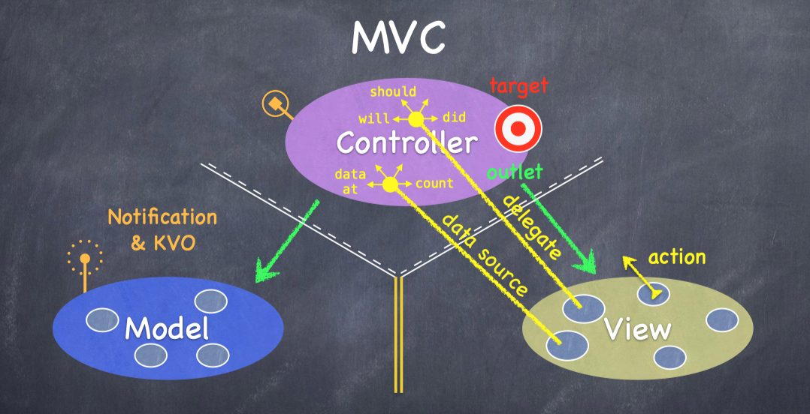
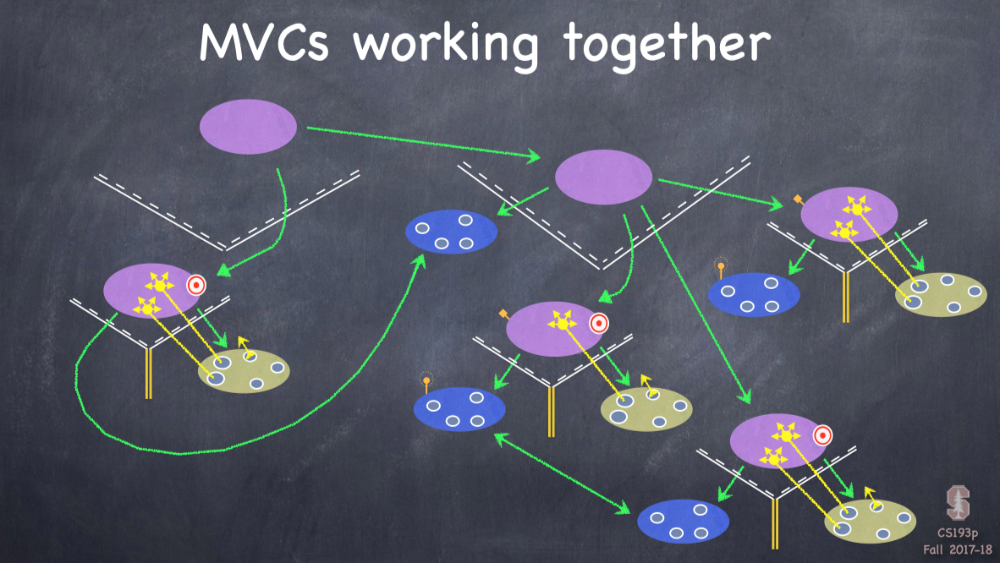

# iOS Programming with Swift : CS193P Notes

[TOC]

## iOS

### Layer

- Core OS
- Core Services
- Media
- Cocoa Touch

###  Platform Components

- Tools
- Language
- Frameworks: foundation, UIKit, 
- Design Strategy: MVC

## MVC

- model : What your application is (but not how it is displayed) UI independent  **What**
- view: Your Controller’s minions
- controller: How your Model is presented to the user (UI logic) **How**

It’s all about managing communication between them

- Controllers can always talk directly to their Model.
- Controllers can also talk directly to their View.
- The Model and View should never speak to each other.
- The Controller can drop a target on itself.
  - Then hand out an action to the View.
- The View sends the action when things happen in the UI.
- Sometimes the View needs to synchronize with the Controller.
  - The Controller sets itself as the View’s delegate.
  - The delegate is set via a protocol (i.e. it’s “blind” to class).
- Views do not own the data they display.
  - So, if needed, they have a protocol to acquire it.
  - Controllers are almost always that data source (not Model!)
- Controllers interpret/format Model information for the View.
- Can the Model talk directly to the Controller?
  - No. The Model is (should be) UI independent.
- So what if the Model has information to update or something?
  - It uses a “radio station”-like broadcast mechanism.
  - Controllers (or other Model) “tune in” to interesting stuff.







## Xcode Usage

### Shortcuts

- ⌘+0
- ⌘+⌥+0
- ⌘+1, 2, 3, 4, 5
- ⌘+⌥+1, 2, 3, 4, 5
- ⌘+ enter / ⌘+⌥+enter
- ⌃+ I

## Swift

### Range

- `1..<5`
- `stride(from:,through:,by:)`

### tuple 


### Access Control

- internal 
- private
- private(set)
- fileprivate

### Extensions

### mutating

### Protocol

- protocols are a way to express an API more concisely

####  Delegation

#### Other Protocols

- CountableRange
- Sequence
- Collection

#### Using extension to provide protocol implementation


### String


#### NSAttributedString 


### Other Classes

#### NSObject

#### NSNumber

#### Date

#### Data


## Views

A view (i.e. UIView subclass) represents a rectangular area

- Defines a coordinate space 
- For drawing 
- And for handling touch events

Hierarchical

- A view has only one superview … var superview: UIView?
- But it can have many (or zero) subviews … var subviews: [UIView]
- The order in the subviews array matters: those later in the array are on top of those earlier 
- A view can clip its subviews to its own bounds or not (the default is not to)

UIWindow

- The UIView at the very, very top of the view hierarchy (even includes status bar)
-  Usually only one UIWindow in an entire iOS application … it’s all about views, not windows

**The hierarchy is most often constructed in Xcode graphically**

But it can be done in code as well

```swift
func addSubview(_ view: UIView)// sent to view’s (soon to be) superview 
func removeFromSuperview() // sent to the view you want to remove (not its superview)
```

**Where does the view hierarchy start?**

The top of the (useable) view hierarchy is the Controller’s var view: UIView.

### Initializing a view

- As always, try to avoid an initializer if possible

- **A UIView’s initializer is different if it comes out of a storyboard**

```swift
init(frame: CGRect) // initializer if the UIView is created in code 
init(coder: NSCoder) // initializer if the UIView comes out of a storyboard
```

- **If you need an initializer, implement them both …**

```swift
func setup() { … }

override init(frame: CGRect) {
super.init(frame: frame) setup() 
} 
// a designated initializer
// might have to be before super.init 

required init?(coder aDecoder: NSCoder) {
// a required, failable initializer
super.init(coder: aDecoder)
setup() }
```

- Another alternative to initializers in UIView

```swift
awakeFromNib()
```


### Coordinate System Data Structures

#### CGFloat

- Always use this instead of Double or Float for anything to do with a UIView’s coordinate system 
- You can convert to/from a Double or Float using initializers, e.g., `let cgf = CGFloat(aDouble)`

#### CGPoint

Simply a struct with two CGFloats in it: x and y.

```swift
var point = CGPoint(x: 37.0, y: 55.2) 
point.y -= 30 
point.x += 20.0
```


#### CGSize

Also a struct with two CGFloats in it: width and height.

```swift
var size = CGSize(width: 100.0, height: 50.0) 
size.width += 42.5 
size.height += 75
```


#### CGRect

**A struct with a CGPoint and a CGSize in it …**

```swift
struct CGRect { 

var origin: CGPoint 

var size: CGSize 

} 

let rect = CGRect(origin: aCGPoint, size: aCGSize)// there are other inits as well
```

Lots of convenient properties and functions on CGRect like …

```swift
var minX: CGFloat // left edge 
var midY: CGFloat // midpoint vertically 
intersects(CGRect) -> Bool // does this CGRect intersect this other one?
intersect(CGRect) // clip the CGRect to the intersection with the other one
contains(CGPoint) -> Bool  // does the CGRect contain the given CGPoint?
```


### View Coordinate System

- Origin is upper left
- Units are points, not pixels
  - Pixels are the minimum-sized unit of drawing your device is capable of 
  - Points are the units in the coordinate system 
  - Most of the time there are 2 pixels per point, but it could be only 1 or even 3 
  - How many pixels per point are there? UIView’s `var contentScaleFactor: CGFloat`

- The boundaries of where drawing happens

  - `var bounds: CGRect` // a view’s internal drawing space’s origin and size This is the rectangle containing the drawing space in its own coordinate system It is up to your view’s implementation to interpret what bounds.origin means (often nothing)

- Where is the UIView?

  ```swift
  var center: CGPoint // the center of a UIView in its superview’s coordinate system 
  var frame: CGRect // the rect containing a UIView in its superview’s coordinate system
  ```

  

#### Bounds vs Frame

- Views can be rotated (and scaled and translated)
- Use frame and/or center to position a UIView


### Creating views

- Most often your views are created via your storyboard
- On rare occasion, you will create a UIView via code
- Example

```swift
let labelRect = CGRect(x: 20, y: 20, width: 100, height: 50) 
let label = UILabel(frame: labelRect) // UILabel is a subclass of UIView 
label.text = “Hello”
```


### Custom Views

- To draw, just create a UIView subclass and override draw(CGRect)

  - `override func draw(_ rect: CGRect)`

- So how do I implement my draw(CGRect)?

  - You can either get a drawing context and tell it what to draw, or … 
  - You can create a path of drawing using UIBezierPath class

- Core Graphics Concepts

  1. You get a context to draw into (other contexts include printing, off-screen buffer, etc.) The function `UIGraphicsGetCurrentContext()` gives a context you can use in `draw(CGRect)`

  2. Create paths (out of lines, arcs, etc.)
  3. Set drawing attributes like colors, fonts, textures, linewidths, linecaps, etc.
  4. Stroke or fill the above-created paths with the given attributes

- `UIBezierPath`

  - Same as above, but captures all the drawing with a `UIBezierPath` instance 
  - `UIBezierPath` automatically draws in the “current” context (preset up for you in `draw(CGRect))` 
  - `UIBezierPath` has methods to draw (lineto, arcs, etc.) and to set attributes (linewidth, etc.) 
  - Use `UIColor` to set stroke and fill colors
  -  `UIBezierPath` has methods to stroke and/or fill

#### Defining a Path

- Create a `UIBezierPath` 

```swift
let path = UIBezierPath() 
```

- Move around, add lines or arcs to the path

```swift
path.move(to: CGPoint(80, 50))
path.addLine(to: CGPoint(140, 150)) 
path.addLine(to: CGPoint(10, 150))
```

- Close the path (if you want)

```swift
path.close()
```

- Now that you have a path, set attributes and stroke/fill

```swift
UIColor.green.setFill() // note setFill is a method in UIColor, not UIBezierPath
UIColor.red.setStroke()  // note setStroke is a method in UIColor, not UIBezierPath
path.linewidth = 3.0 // linewidth is a property in UIBezierPath, not UIColor
path.fill() // fill is a method in UIBezierPath
path.stroke() // stroke method in UIBezierPath
```

- You can also draw common shapes with UIBezierPath

```swift
let roundedRect = UIBezierPath(roundedRect: CGRect, cornerRadius: CGFloat) 
let oval = UIBezierPath(ovalIn: CGRect)
```

- Clipping your drawing to a UIBezierPath’s path

```swift
addClip()
```

For example, you could clip to a rounded rect to enforce the edges of a playing card

- Hit detection

```swift
func contains(_ point: CGPoint) -> Bool // returns whether the point is inside the path. The path must be closed. The winding rule can be set with usesEvenOddFillRule property.
```


#### UI Color

- Colors are set using UIColor
  - There are type (aka static) vars for standard colors, e.g. `let green = UIColor.green` 
  - You can also create them from RGB, HSB or even a pattern (using UIImage)

- Background color of a UIView
- Colors can have alpha (transparency)

```swift
let semitransparentYellow = UIColor.yellow.withAlphaComponent(0.5)
//Alpha is between 0.0 (fully transparent) and 1.0 (fully opaque)
```

- If you want to draw in your view with transparency …

  - You must let the system know by setting the UIView `var opaque = false`

  - You can make your entire UIView transparent `var alpha: CGFloat`


#### Layers

- Underneath UIView is a drawing mechanism called `CALayer`

  - You usually do not care about this.

  - But there is some useful API there.

  - You access a UIView’s “layer” using this `var layer: CALayer`

  -  The CA in CALayer stands for “Core Animation”.

  - Mostly we can do animation in a UIView without accessing this layer directly. But it is where the actual animation functionality of UIView is coming from. 

  - But `CALayer` can do some cool non-animation oriented things as well, for example 

    ```swift
    var cornerRadius: CGFloat // make the background a rounded rect
    var borderWidth: CGFloat // draw a border around the view 
    var borderColor: CGColor? // the color of the border (if any)
    ```

  -  You can get a CGColor from a UIColor using UIColor’s cgColor var.


#### View Transparency

- What happens when views overlap and have transparency?
  - As mentioned before, subviews list order determines who is in front Lower ones (earlier in the array) can “show through” transparent views on top of them
  - Transparency is not cheap, by the way, so use it wisely

- Completely hiding a view without removing it from hierarchy
  - `var isHidden: Bool` 
  - An isHidden view will draw nothing on screen and get no events either
  -  Not as uncommon as you might think to temporarily hide a view


#### Drawing Text

- Usually we use a UILabel to put text on screen
  - But there are certainly occasions where we want to draw text in our draw(CGRect)
- To draw in `draw(CGRect`), use `NSAttributedString`

```swift
let text = NSAttributedString(string: “hello”) // probably would set some attributes too 
text.draw(at: aCGPoint) // or draw(in: CGRect) 
let textSize: CGSize = text.size // how much space the string will take up
```

- Accessing a range of characters in an NSAttributedString

  ```swift
  //NSRange has an init which can handle the String vs. NSString weirdness … let pizzaJoint = “café pesto”
  var attrString = NSMutableAttributedString(string: pizzaJoint) 
  let firstWordRange = pizzaJoint.startIndex..<pizzaJoint.indexOf(“ “)!
  let nsrange = NSRange(firstWordRange, in: pizzaJoint) // convert Range<String.Index> 
  attrString.addAttribute(.strokeColor, value: UIColor.orange, range: nsrange)
  ```

  

#### Fonts

- Usually you set fonts in UI elements like UIButton, UILabel,

- Simple way to get a font in code

  - Get preferred font for a given text style (e.g. body, etc.) using this UIFont type method …

    `static func preferredFont(forTextStyle: UIFontTextStyle) -> UIFont`

  - Some of the styles (see `UIFontDescriptor` documentation for more) … 

    ```swift
    UIFontTextStyle.headline
    								.body 
    								.footnote
    ```

  - Importantly, the size of the font you get is determined by user settings (esp. for Accessibility).

- More advanced way …

  - Choose a specific font by name …

  ```swift
  let font = UIFont(name: “Helvetica”, size: 36.0) 
  //You can also use the UIFontDescriptor class to get the font you want.
  
  //Now get metrics for the text style you want and scale font to the user’s desired size … 
  let metrics = UIFontMetrics(forTextStyle: .body) // or UIFontMetrics.default
  let fontToUse = metrics.scaledFont(for: font)
  ```

- There are also “system fonts”

  - These appear usually on things like buttons.

  ```swift
  static func systemFont(ofSize: CGFloat) -> UIFont 
  static func boldSystemFont(ofSize: CGFloat) -> UIFont
  ```


#### Drawing Images

**`UIImageView`**

- Creating a `UIImage` object

  - ```swift
    let image: UIImage? = UIImage(named: “foo”) // note that its an Optional 
    ```

    - You add foo.jpg to your project in the Assets.xcassets file (we’ve ignored this so far)
    - Images will have different resolutions for different devices (all managed in Assets.xcassets)

- You can also create one from files in the file system

  - ```swift
    let image: UIImage? = UIImage(contentsOfFile: pathString) 
    let image: UIImage? = UIImage(data: aData) // raw jpg, png, tiff, etc. image data
    ```

- You can even create one by drawing with Core Graphics （See documentation for `UIGraphicsBeginImageContext(CGSize)`）

- Once you have a UIImage, you can blast its bits on screen

  ```swift
  let image: UIImage = …
  image.draw(at point: aCGPoint) // the upper left corner put at aCGPoint
  image.draw(in rect: aCGRect)  // scales the image to fit aCGRect 
  image.drawAsPattern(in rect: aCGRect)// tiles the image into aCGRect
  ```

  

#### Bound Change

- Redraw on bounds change?
  - By default, when a UIView’s bounds changes, there is no redraw
  - Instead, the “bits” of the existing image are scaled to the new bounds size
  - Luckily, there is a UIView property to control this! It can be set in Xcode too. `var contentMode: UIViewContentMode`

- **`UIViewContentMode`**
  - Don’t scale the view, just place the bits (intact) somewhere …
    - .left/.right/.top/.bottom/.topRight/.topLeft/.bottomRight/.bottomLeft/.center
  - Scale the “bits” of the view …
    - .scaleToFill/.scaleAspectFill/.scaleAspectFit 
    - .scaleToFill is the default
  - Redraw by calling draw(CGRect) again (costly, but for certain content, better results)
    - .redraw

- Layout on bounds change?

  - What about your subviews on a bounds change?

  - If your bounds change, you may want to reposition some of your subviews 

    - Usually you would set this up using Autolayout constraints 
    - Or you can manually reposition your views when your bounds change by overriding …

    ```Swift
    override func layoutSubviews() {
    super.layoutSubviews() // reposition my subviews’s frames based on my new bounds 
    }
    ```


## Gestures

- Gestures are recognized by instances of UIGestureRecognizer
- There are two sides to using a gesture recognizer
  - Adding a gesture recognizer to a UIView (asking the UIView to “recognize” that gesture)
  - Providing a method to “handle” that gesture (not necessarily handled by the UIView)
- Usually the first is done by a Controller
- The second is provided either by the UIView or a Controller


### Adding a gesture recognizer to a UIView

Imagine we wanted a UIView in our Controller’s View to recognize a “pan” gesture. We can configure it to do so in the property observer for the outlet to that UIView …

```swift
@IBOutlet weak var pannableView: UIView {
	didSet { 
		let panGestureRecognizer = UIPanGestureRecognizer( 
      target: self, action:#selector(ViewController.pan(recognizer:))
		) 
    pannableView.addGestureRecognizer(panGestureRecognizer) 
  }
}
```


- The property observer’s didSet code gets called when iOS hooks up this outlet at runtime 
- Here we are creating an instance of a concrete subclass of UIGestureRecognizer (for pans)
- The **target** gets notified when the gesture is recognized (here it’s the Controller itself)
- The **action** is the method invoked on recognition (that method’s argument? the recognizer)

### Handler for Gestures

- A handler for a gesture needs gesture-specific information
- For example, UIPanGestureRecognizer provides 3 methods

```swift
func translation(in: UIView?) -> CGPoint // cumulative since start of recognition 
func velocity(in: UIView?) -> CGPoint // how fast the finger is moving (points/s)
func setTranslation(CGPoint, in: UIView?)//This last one is interesting because it allows you to reset the translation so far By resetting the translation to zero all the time, you end up getting “incremental” translation
```

- The abstract superclass also provides state information

```swift
var state: UIGestureRecognizerState { get } 
```

- - This sits around in `.possible` until recognition starts
  - For a continuous gesture (e.g. pan), it moves from `.began` thru `repeated` `.changed` to `.ended` 
  - For a discrete (e.g. a swipe) gesture, it goes straight to `.ended` or `.recognized`.
  - It can go to `.failed` or `.cancelled` too, so watch out for those!

#### Example of Handler

```swift
func pan(recognizer: UIPanGestureRecognizer) {

switch recognizer.state { 
  	case .changed: fallthrough 
  	case .ended:
  		let translation = recognizer.translation(in: pannableView) // update anything that depends on the pan gesture using translation.x and .y 
  		recognizer.setTranslation(CGPoint.zero, in: pannableView) 					default: break
}
  
// We are only going to do anything when the finger moves or lifts up off the device’s surface
```

- Here we get the location of the pan in the pannableView’s coordinate system
- By resetting the translation, the next one we get will be incremental movement


### Other Gestures

#### UIPinchGestureRecognizer

```swift
var scale: CGFloat // not read-only (can reset) 
var velocity: CGFloat { get } // scale factor per second
```


#### UIRotationGestureRecognizer

```swift
var rotation: CGFloat // not read-only (can reset); in radians 
var velocity: CGFloat { get } // radians per second
```


#### UISwipeGestureRecognizer

Set up the direction and number of fingers you want

```swift
var direction: UISwipeGestureRecoginzerDirection // which swipe directions you want 
var numberOfTouchesRequired: Int // finger count
```


#### UITapGestureRecognizer

```swift
//This is discrete, but you should check for .ended to actually do something. Set up the number of taps and fingers you want …

var numberOfTapsRequired: Int // single tap, double tap, etc.
var numberOfTouchesRequired: Int // finger count
```


#### UILongPressRecognizer

```swift
This is a continuous (not discrete) gesture (i.e. you’ll get .changed if the finger moves) You still configure it up-front …

var minimumPressDuration: TimeInterval // how long to hold before its recognized 
var numberOfTouchesRequired: Int // finger count 
var allowableMovement: CGFloat // how far finger can move and still recognize Very important to pay attention to .cancelled because of drag and drop
```


## Multiple MVCs

### MVC working together

iOS provides some Controllers whose View is “other MVCs”

#### UITabBarController

- It lets the user choose between different MVCs

- The icon, title and even a “badge value” on these is determined by the MVCs themselves via their property:

  `var tabBarItem: UITabBarItem!`

  But usually you just set them in your storyboard.

- If there are too many tabs to fit here, the `UITabBarController` will automatically present a UI for the user to manage the overflow!

#### UISplitViewController

- Puts two MVCs side-by-side
  - Master
  - Detail

#### UINavigationController

- Pushes and pops MVCs off of a stack (like a stack of cards)


### Accessing the sub-MVCs

You can get the sub-MVCs via the viewControllers property

```swift
var viewControllers: [UIViewController]? { get set } // can be optional (e.g. for tab bar)

// for a tab bar, they are in order, left to right, in the array 
// for a split view, [0] is the master and [1] is the detail 
// for a navigation controller, [0] is the root and the rest are in order on the stack
// even though this is settable, usually setting happens via storyboard, segues, or other 
// for example, navigation controller’s push and pop methods
```

But how do you get ahold of the SVC, TBC or NC itself?

```swift
//Every UIViewController knows the Split View, Tab Bar or Navigation Controller it is currently in These are UIViewController properties …

var tabBarController: UITabBarController? { get } 
var splitViewController: UISplitViewController? { get } 
var navigationController: UINavigationController? { get }

//So, for example, to get the detail (right side) of the split view controller you are in …

if let detail: UIViewController? = splitViewController?.viewControllers[1] { … }
```

Adding (or removing) MVCs from a UINavigationController

```swift
func pushViewController(_ vc: UIViewController, animated: Bool) func popViewController(animated: Bool) 

```


But we usually don’t do this. Instead we use Segues. More on this in a moment.


### Wiring up MVCs

- Just drag out a `splitViewController` (and delete all the extra VCs it brings with it)
- But split view can only do its thing properly on iPad/iPhone+
  - So we need to put some Navigation Controllers in there so it will work on iPhone 
  - The Navigation Controllers will be good for iPad too because the MVCs will get titles 
  - The simplest way to wrap a Navigation Controller around an MVC is with `Editor->Embed In`


### Segues

- We’ve built up our Controllers of Controllers,
  - Now we need to make it so that one MVC can cause another to appear We call that a “segue”
- Kinds of segues
  - Show Segue: will push in a Navigation Controller, else Modal
  - Show Detail Segue: will show in Detail of a Split View or will push in a Navigation Controller
  - Modal Segue: take over the entire screen while the MVC is up
  - Popover Segue: make the MVC appear in a little popover window
- **Segues always create a new instance of an MVC**
  - Going “back” in a Navigation Controller is NOT a segue though (so no new instance there)
- How do we make these segues happen?
  - Ctrl-drag in a storyboard from an instigator (like a button) to the MVC to segue to 
  - Can be done in code as well


#### Create a Segue

- Ctrl-drag from the button  that causes the graph to appear to the MVC of the graph.
- Select the kind of segue you want. Usually Show or Show Detail.
- Now click on the segue and open the Attributes Inspector
- Give the segue a unique identifier here.  It should describe what the segue does.

#### Prepraring for a Segue

```swift
func prepare(for segue: UIStoryboardSegue, sender: Any?) {
	if let identifier = segue.identifier { 
		switch identifier { 
			case “Show Graph”:
				if let vc = segue.destination as? GraphController { 					
						vc.property1 = …
						vc.callMethodToSetItUp(…)
        }
      default: break
    }
  }
}
```

The segue passed in contains important information about this segue:


1. the identifier from the storyboard


2. the Controller of the MVC you are segueing to (which was just created for you)

The sender is either the instigating object from a storyboard (e.g. a UIButton)
 or the sender you provided (see last slide) if you invoked the segue manually in code


#### Preventing Segues

You can prevent a segue from happening too

Just return false from this method your UIViewController …

```swift
func shouldPerformSegue(withIdentifier identifier: String?, sender: Any?) -> Bool 
```

The identifier is the one in the storyboard.

The sender is the instigating object (e.g. the button that is causing the segue).


## Animation

### Timer


- Used to execute code periodically

- Fire one off with this method …

  ```swift
  class func scheduledTimer( 
  	withTimeInterval: TimeInterval, 
    repeats: Bool, 
    block: (Timer) -> Void 
  ) -> Timer
  ```

  

#### Start

```swift
private weak var timer: Timer?
timer = Timer.scheduledTimer(withTimeInterval: 2.0, repeats: true) { timer in
	// your code here 
} 
```

Every 2 seconds (approximately), the closure will be executed.

Note that the var we stored the timer in is weak.

That’s okay because the run loop will keep a strong pointer to this as long as it’s scheduled.


#### Stop

`timer.invalidate()`


#### Tolerance

It might help system performance to set a tolerance for “late firing”.

For example, if you have timer that goes off once a minute, a tolerance of 10s might be fine. 

```swift
myOneMinuteTimer.tolerance = 10 // in seconds 
```

The firing time is relative to the start of the timer (not the last time it fired), i.e. no “drift”.


### Kinds of Animation

- Animating UIView properties

  - Changing things like the frame or transparency.

- Animating Controller transitions (as in a UINavigationController)

  - Beyond the scope of this course, but fundamental principles are the same.

- Core Animation

  - Underlying powerful animation framework (also beyond the scope of this course).

- OpenGL and Metal

  - 3D

- SpriteKit

  - “2.5D” animation (overlapping images moving around over each other, etc.)

- Dynamic Animation

  - “Physics”-based animation.

  